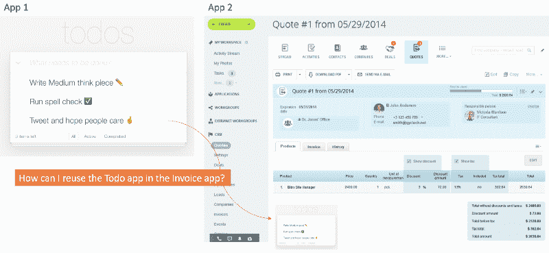
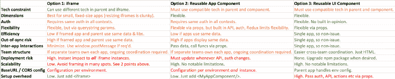

# 可重用的 Web 应用策略:在多个地点运行同一个应用的三种模式

> 原文：<https://www.freecodecamp.org/news/reusable-web-application-strategies-d51517ea68c8/>

想象一下，你的团队刚刚部署了一个惊人的待办事项应用程序。一个月后，贵公司的另一个团队希望在他们的发票应用程序中运行您的 todo 应用程序。

所以现在你需要在两个地方运行你的 todo 应用程序:

1.  单独地
2.  嵌入发票应用程序

最好的处理方式是什么？？

要在多个地点运行应用程序，您有三种选择:

1.  **iframe** —通过< iframe >将 todo 应用嵌入发票应用。
2.  **可复用 app 组件** —共享整个待办事宜 App。
3.  **可重用 UI 组件** —仅共享 todo 应用的标记。

选项 2 和 3 通常通过客户端应用程序的 npm 共享。

赶时间？这是总结。

Green is good. Red is bad. Orange is warning.

让我们探讨一下每种方法的优点。

# 选项 1: iFrame

使用 iframe，您可以通过将“子”应用程序放在 iframe 中，将两个应用程序组合在一起。因此，在我们的示例中，发票应用程序将通过 iframe 嵌入 todo 应用程序。简单。但没那么快…

## iframe 什么时候最合适？

1.  ****不兼容的技术**** —如果你正在编写的应用使用不兼容的技术，这是你唯一的选择。例如，如果一个应用程序是用 Ruby 开发的，而另一个是用 ASP.NET 开发的，那么 iframe 允许这两个应用程序并排显示，即使它们实际上是不兼容的，并且是分开托管的。
2.  ****小，静态尺寸-**** 你正在取景的应用有一个静态的高度和宽度。动态调整 iframes 的大小是可行的，但是增加了复杂性。
3.  ****常见认证故事-****iframed app 不应该要求单独认证。单独的身份验证可能会导致笨拙的交互，因为框架应用程序可能会提示单独的凭据或在不同于托管应用程序的时间超时。
4.  ****在任何地方都以同样的方式运行****——有了 iframe，框架化的应用程序将在它被框架化的每个地方都以同样的方式运行。如果您需要在不同的环境中有明显不同的行为，请参见下面的其他方法。
5.  **—使用 iframe，组成的应用程序应该避免显示相同的数据。构建应用程序可能会导致重复、浪费的 API 调用，以及构建的应用程序与其父应用程序之间的不同步问题。iframe 中的数据更改必须小心地传达给父级，反之亦然，否则用户将看到不同步的数据。**
6.  ******很少的应用程序间交互**** —托管应用程序和 iframed 应用程序之间应该很少交互。当然，你可以使用 [window.postMessage](https://developer.mozilla.org/en-US/docs/Web/API/Window/postMessage) 在 iframe 和托管应用程序之间传递消息，但是这种方法应该谨慎使用，因为它很脆弱。**
7.  ******一个团队同时支持两个应用**** —使用 iframes，同一个团队应该同时拥有和维护父应用和框架应用。否则，您必须接受支持应用程序的团队之间的持续协调关系，以确保它们保持兼容。单独的团队会产生持续的风险和维护负担，以维持成功和稳定的集成。**
8.  ******只需要这样做一次****——由于上面的观点，你应该只 iframe 一个应用一次，以避免产生重大的维护负担。一个应用被框住的次数越多，当你做出改变时，你冒破坏的地方就越多。**
9.  ****—使用 iframe，您必须接受框架应用程序的生产部署可能随时影响父应用程序的风险。这是让同一个团队同时支持父应用程序和框架应用程序非常有用的另一个原因。****

# ****选项 2:共享应用程序组件****

****Node 的包管理器 npm 已经成为事实上共享 JavaScript 的方式。使用这种方法，您可以创建一个 npm 包并将完整的应用程序放入其中。它不必是公共的，您也可以在 npm 上创建私有的 npm 包。****

****创建可重用组件库的过程超出了本文的范围。我在“[构建可重用的 React 组件](https://app.pluralsight.com/library/courses/react-creating-reusable-components)”中探索了如何构建自己的可重用组件库。****

****由于您正在共享整个应用程序，它可能包括 API 调用、认证问题和数据流问题，如 Flux/Redux 等。这是一段非常固执己见的代码。****

## ****什么时候可重用的应用程序组件方法是合适的？****

1.  ********兼容技术—**** 既然你在共享一个可重用的组件，父应用就需要兼容。例如，如果您共享一个 React 组件，父应用程序最好也用 React 编写。****
2.  ******动态大小**** —如果你的应用程序的宽度/高度是动态的，所以它不适合静态大小的框架，这种方法很有用。**
3.  ******通用认证故事**** —理想情况下，两个应用程序应该使用相同的认证。单独的身份验证可能会导致笨拙的交互，因为每个应用程序可能会在不同的时间提示单独的凭据或超时。**
4.  ******你希望应用程序在任何地方都以相同的方式运行**** —由于内置了 API、认证和状态管理，应用程序在任何地方都将以相同的方式运行。**
5.  ****—两个应用程序大多使用独立的数据。并排显示应用程序会导致重复、浪费的 API 调用，因为每个应用程序都请求相同的数据。这也可能导致两个应用程序之间的不同步问题。一个应用程序中的数据更改必须小心地传达给另一个，否则用户会看到两个应用程序之间的数据不同步。****
6.  ********很少的应用间交互**** —两个应用之间应该很少交互。当然，你可以使用 [window.postMessage](https://developer.mozilla.org/en-US/docs/Web/API/Window/postMessage) 在它们之间传递消息，但是这种方法应该谨慎使用，因为它很脆弱。****
7.  ******一个团队同时支持两个应用**** —使用这种方法，理想情况下，同一个团队拥有并维护两个应用。如果没有，您必须愿意接受支持这两个应用程序的团队之间正在进行的协调关系，以确保它们保持兼容。单独的团队会产生持续的风险和维护负担，以维持成功和稳定的集成。**

# **选项 3:共享 UI 组件**

**该选项类似于上面的选项#2，除了您 ****仅共享标记**** 。使用这种方法，您省略了认证、API 调用和状态管理，因此 ****组件基本上只是可重用的 HTML**** 。**

**像这样简单组件的流行例子包括 [Material-UI](http://www.material-ui.com/#/) 和 [React Bootstrap](https://react-bootstrap.github.io/) 。当然，一个可重用的应用程序组件有更多可移动的部分，但它的工作原理是一样的。**

**在我们讨论这种方法的优点之前，让我解决一个常见的问题:“我的可重用组件应该嵌入 API 调用和 auth 吗？”**

**我的看法？ ****避免在可重用组件中嵌入 API、auth 和状态管理关注点。******

**原因如下:**

1.  **它通过将前端绑定到特定的 API、auth、状态管理故事来限制重用。**
2.  **通常，独立的开发人员/团队管理 UI 和 API。在可重用组件中嵌入 API 调用将 UI 团队和 API 团队耦合在一起。如果一方发生变化，就会影响到另一方，这会产生持续的协调开销和维护负担。**

**但是，这确实意味着每当有人使用你的可重用组件时，他们必须连接 API 调用并通过 props 传递它们。**

## **什么时候可重用 UI 组件方法比较合适？**

1.  ******兼容技术—**** 既然你在共享一个可重用的组件，父应用就需要兼容。例如，如果您共享一个 React 组件，父应用程序也应该用 React 编写。**
2.  ******动态大小**** —如果你的应用程序的宽度/高度是动态的，所以它不适合静态大小的框架，这种方法很有用。**
3.  ******不同的认证故事**** —由于这种方法基本上只是可重用的 HTML，所以您想要编写的应用程序可以有不同的认证故事，或者认证故事可以在组件使用的每个地方有所不同。**
4.  ******每个用例中不同的行为**** —使用这种方法，你可以重用一个前端，但是在每个用例中调用不同的 API。前端的每个副本可以完全不同地操作。您可以在每个用例中设置不同的道具并使用不同的 API 来根据需要定制行为。**
5.  ****—使用这种方法，您正在编写的 UI 可以利用并显示父应用程序的数据。这是一个单一的，有凝聚力的应用程序。这避免了重复的 API 调用和不同步问题，节省了带宽，提高了性能。****
6.  ********许多跨应用程序的交互**** —如果应用程序之间有重要的交互和共享数据，这种方法可以确保两个应用程序感觉像是单一的内聚体验…因为 ******这种方法创建了单一的内聚应用程序****** 。****
7.  ******可发现性是可取的**** —你想宣传一个丰富的、可重用的前端作为一个组件的存在。您可以将这个组件放在您的可重用组件库中，并记录它接受的属性，以便其他人可以在不同的上下文中轻松地找到并重用它。**
8.  ******多个用例**** —你计划在很多地方部署这个前端。这种方法比其他方法更灵活，因为您只是共享一个高度可配置的前端。**
9.  ******独立的 UI 和 API 团队**** —如果你有一个独立的 UI 团队，由于前面提到的协调开销，通过其他方法将 UI 绑定到 API 是没有吸引力的。使用这种方法，您可以控制何时更新 npm 软件包。您可以在需要时基于每个应用程序部署可重用前端的新版本。**

# **摘要**

**和往常一样，语境是王道。在大多数情况下，我推荐方法#3，但是每个都有有效的用例。有别的办法解决吗？请在评论中加入进来。**

**[Cory House](https://twitter.com/housecor) 是关于 JavaScript、React、clean code、[多门课程的作者。NET，以及 Pluralsight](http://pluralsight.com/author/cory-house) 上的更多内容。他是 reactjsconsulting.com[公司的首席顾问，微软 MVP 公司 VinSolutions 的软件架构师，在国际上培训软件开发人员，如前端开发和干净编码。Cory 在 Twitter 上以](http://www.reactjsconsulting.com/) [@housecor](http://www.twitter.com/housecor) 的身份发关于 JavaScript 和前端开发的推文。**