# 对 iPhone X 主页指示器颜色进行反向工程

> 原文：<https://www.freecodecamp.org/news/reverse-engineering-the-iphone-x-home-indicator-color-a4c112f84d34/>

作者内森·吉特

# 对 iPhone X 主页指示器颜色进行反向工程

在使用我最近的应用程序时，我注意到 iPhone X home 指示器的异常行为。主页指示器附近的应用程序背景是紫色的。当应用程序启动时，主页指示器是非常浅的灰色。

但当我按下应用程序的“分享”按钮时，奇怪的事情发生了，这打开了一个默认的 iOS 活动视图(又名“分享表”)。当我点击“取消”按钮关闭活动视图时，主页指示器显示为深灰色。

Home indicator starts light, then a share sheet passing makes it dark.

尽管背景颜色完全相同，但是浅色的活动视图从下面经过会导致 home 指示器改变颜色。让主页指示器恢复原始颜色的唯一方法是离开应用程序，然后再回来。

我以前从未见过这种情况，这激起了我的好奇心。

是什么决定了主页指示器的颜色，为什么它会这样？答案出奇的复杂。让我们深入研究一下，看看我们能学到什么！

### 主页指示器基础

2017 年 9 月，苹果推出了其最新迭代的手机:iPhone X。新的设计用屏幕手势取代了标志性的 home 键。要回家，用户只需从屏幕底部向上滑动。

[https://www.apple.com/iphone-x/](https://www.apple.com/iphone-x/)

### 主页指示器的用途

为了创造能够从屏幕底部向上滑动的启示，苹果增加了一个小的水平栏，称为主页指示器。除了主屏幕和任何要求它暂时隐藏的应用程序(全屏视频、游戏等),主屏幕指示器总是存在。).

主页指示器还有另一个用途:保护屏幕的底部边缘免受用户界面元素和手势冲突的影响。因为用户需要能够在任何时候从屏幕底部向上滑动，所以现在的最佳实践要求开发人员应该避免在显示器的底部边缘放置冲突的手势或按钮。

通过在底部放置一个条，同一位置的用户界面元素*看起来是错误的*——在条和其他元素之间存在视觉冲突。从这个意义上说，主页指示器“保护”了屏幕的这个区域，使其不被不了解 iPhone X 功能的设计师或工程师看到。

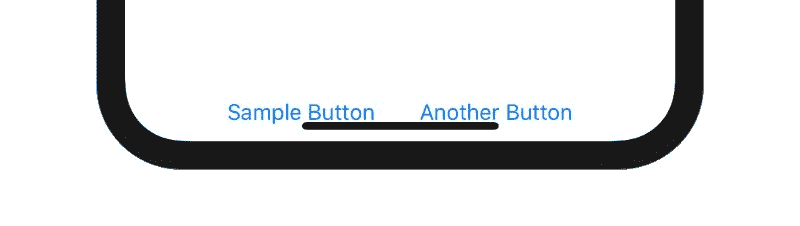

It doesn’t take a UI designer to see something is wrong here.

现在我们都在同一页上，让我们回到我们最初的问题:“家庭指示器是什么颜色？”

### 第 1 部分—开始

2017 . 9 . 13 回答了一个[栈溢出问题](https://stackoverflow.com/a/46199029/6658553)问如何改变 home 指示器的颜色。

当时，iPhone X 尚未公开发布，但最新版本的 Xcode 包括一个 iPhone X 模拟器。在模拟器中运行一个简单的测试应用程序显示，主页指示器的颜色是基于其下方内容的颜色。

iPhone X 的新 API 是与 Xcode 的同一个版本一起发布的，并且没有公共 API 可以用来修改 home 指示器的颜色(在撰写本文时仍然是这种情况，并且可能永远都是这种情况)。

这使得我的栈溢出回答简单明了:修改颜色是不可能的，你不应该担心，因为它不在你的控制之内，而且保证是可见的。

因为我预料到这是一个常见的问题，所以我在各种背景颜色上添加了一些主页指示器的截图。

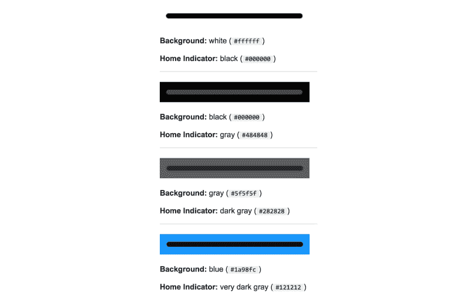

Some home indicator color examples from my Stack Overflow answer.

这对我来说已经足够好了。主指示器通过对其下方视图的颜色进行采样，并选择提供足够对比度的灰色来保持其可见性。

### 第二部分——情节变得复杂了

事实证明，住宅指示器的颜色并不那么简单。一些进一步的观察发现了我的“纯色函数”理论的漏洞。

#### 观察#1:多种颜色

第一个观察是主页指示器可以有多种颜色，类似于渐变。在下面的例子中，屏幕的左边是黑色的，右边是白色的。主页指示器通过在深色背景上采用较浅的颜色，在浅色背景上采用较深的颜色来对此进行调整。

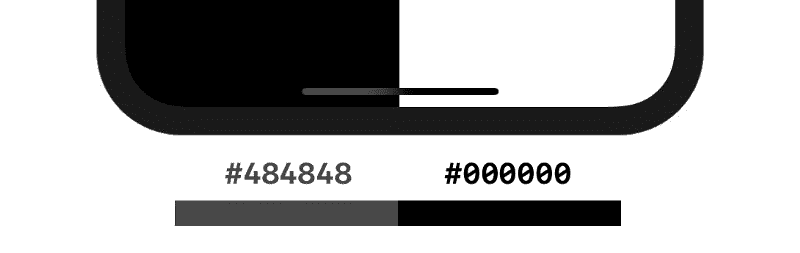

If you look close enough, you can see the transition from gray to black. (iOS simulator)

主页指示器可以同时是多种颜色，并在它们之间平滑过渡。如果主页指示器后面的任何视图发生变化，则该平滑过渡会实时更新。

Watch the home indicator’s color change as the white view passes underneath. (iOS simulator)

在上面的例子中，一个白色的小视图在 home 指示器后面来回移动。覆盖白色视图的主页指示器部分变成纯黑色，并平滑过渡到灰色。

此行为类似于在现有内容上应用模糊的`UIVisualEffectView`。首页指标很可能是采取了附近的颜色样本，以获得上图中看到的混合效果。

(除了好看之外，这个功能可能有助于防止有机发光二极管显示器上的老化。)

#### 观察#2:相同的背景，不同的主页指示器颜色

正如我在这篇文章的开头提到的，当一张股票从首页指标下面经过时，我注意到了一个不寻常的行为。

Home indicator starts light, share sheet passing makes it dark. (real iPhone X)

这是最令人惊讶的观察结果——背景颜色和主页指示器颜色之间不存在简单的一对一映射。在这一点上，我决心通过实验学习更多。

### 第 3 部分—调查开始

我的第一个任务是确定 iOS 模拟器上主页指示器颜色的公式。根据我之前的观察，iOS 模拟器的行为比真实设备更容易预测。

我创建了一个新的 iOS 应用程序，作为我未来实验的实验室。这个应用程序很简单——我需要的只是一种简单的方法来改变主页指示器后面的背景颜色。滑块和步进器控制背景颜色的灰度值，该值在屏幕中央显示为一个大数字。

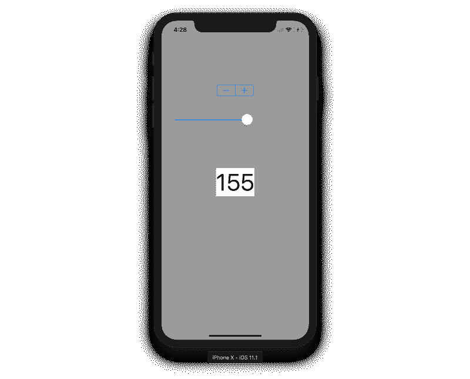

The app created for testing the home indicator.

我的目标是确定每种可能的灰色背景颜色的主页指示器颜色。我可以用图表表示这些数据，看看是否有公式适用于它。由于只有 256 种可能性，我采用了手动方法，使用 macOS 内置的“数字色度计”应用程序来获取每个值的主页指示器颜色。

我用图表表示了结果。它不是一个线性函数，指数函数，或者任何一种你在数学课上可能会看到的“好”函数。

图表…很奇怪。

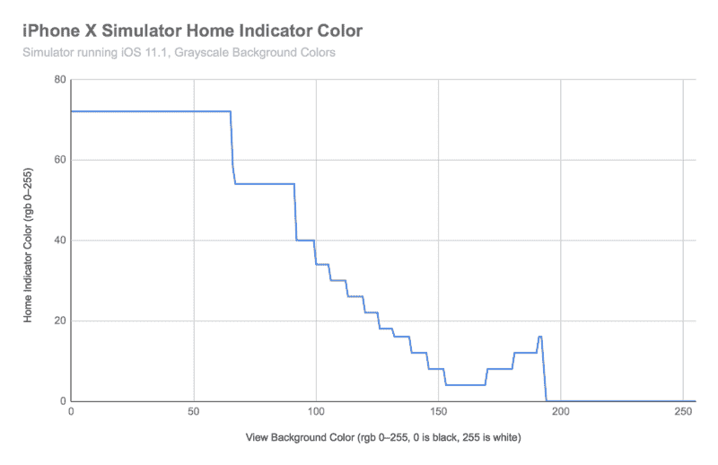

这不是我所期待的。

这是一个阶跃函数，但阶跃不均匀。它有几个不同的部分:一段(相对)浅灰色，两个大台阶，一系列小台阶，反方向的台阶，以及一段纯黑色。

最不寻常的部分是，首页指标的颜色并不总是减少。有一段时间(RGB 170–190 左右)，随着背景变亮，它变得越来越亮。

为什么图表看起来像这样？同样的实验在真实设备上会有什么相似的结果？我需要知道。

### 第 4 部分——调查仍在继续

我的下一个任务是在真实设备上进行同样的实验。很明显，结果将会大不相同。

为了在真实设备上收集数据，我使用了之前的相同应用程序。我通过 QuickTime 将 iPhone 屏幕的实时预览传到了我的电脑上。这消除了 True Tone 显示中的任何变色，并允许我使用数字测色仪应用程序轻松检查颜色。

另一个因素增加了真实设备的复杂性——红色、绿色和蓝色值并不总是相同。在模拟器上，RGB 值是相同的，产生类似 RGB(54，54，54)的颜色。在真实设备上，它们几乎从不相同，但非常接近，从而产生类似 RGB(211，209，212)的颜色。记录结果时，我取了单个 RGB 值的平均值。

这里是结果，与以前的模拟器数据比较。

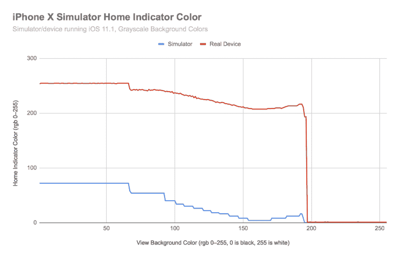

真实设备上的颜色(红线)与模拟器上的颜色(蓝线)趋势相似，只是有很大的偏差。模拟器原位指示器总是很暗，而设备原位指示器要么很亮，要么很暗。

真实设备的图形有噪声。总的来说，它遵循一个平稳的趋势，但上下跳动，看起来很粗糙。这不仅仅是我求平均值的副作用，噪音是一致的。如果重复实验，噪音遵循完全相同的模式。

然而，上面的图表并没有说明全部情况。

上面给出的值是通过将背景完全变黑并一次增加一个 RGB 值(从 0 到 255)来收集的。**当值向相反方向聚集时，结果是不同的。**

在某一点上，主页指示器颜色在从亮到暗或从暗到亮的过渡中“掉下悬崖”，并在一段短暂的时间内显示动画，如前面带有紫色背景色的 gif 所示。根据背景是亮还是暗，悬崖出现在不同的地方。

让我们来看一张新的图表，比较“上升”(黑到白)和“下降”(白到黑)的结果。

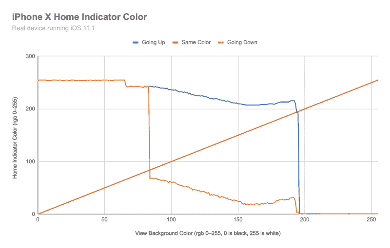

上面的蓝线与之前图表的红线相同。它的数据点是从左到右收集的(0 到 255，“向上”)。橙色线是相同的数据，但收集方向相反(255 比 0，“向下”)。红线代表主指示器和视图背景颜色相同的点。

“上升”和“下降”线遵循相似的路径，但是具有不同的噪声模式。有趣的是，在最暗的范围(0–80)内，它们具有完全相同的噪声模式。

从该图中我们可以看出，当主页指示器的颜色过于接近背景颜色时，就会出现“悬崖”。它甚至看起来好像“上升”和“下降”线被红线推开，积极地试图阻止变成与背景完全相同的颜色。在某一点上，主页指示器翻转为非常暗或非常亮。

这解释了紫色背景的应用程序中颜色的变化。紫色一定在两座悬崖之间的某个区域。根据主页指示器以前的颜色，它可能是亮的，也可能是暗的。当白色活动视图在主屏幕指示器后面移动时，主屏幕指示器会从亮状态转换到暗状态，并重新停留在紫色背景颜色的暗等效亮度值。

### 第五部分——调查变得丰富多彩

到目前为止，所有的测试都使用灰度背景。如果我们使用彩色背景，结果会有什么不同？

我重复了同样的实验，但是我没有修改灰色，而是修改了 HSB 色阶上的色调。我将饱和度(S)和亮度(B)保持在最大值，以获得最鲜明、最清晰的颜色。我只测试了这些“向上”的颜色，在这种情况下，这意味着从色调 0(红色)到色调 255(红色)，按照彩虹顺序。

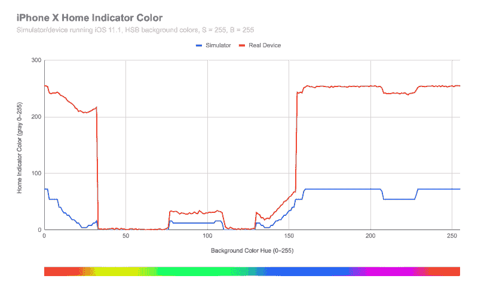

第一个观察结果是有两个悬崖——一个是当颜色变成黄色时，另一个是当颜色变成深蓝色时。这是由于颜色的相对“亮度”造成的。

接下来要观察的是模拟器和真实设备之间的区别。颜色遵循相同的总体趋势，但真实设备的主页指示器颜色更嘈杂，可以达到更亮的值。

到目前为止，这些都是令人着迷的发现。除了测试每一种可能的背景颜色，光靠观察我们发现不了什么。现在我很好奇 home 指标到底是如何实现的——它是一个`UIView`吗？`CALayer`？`UIVisualEffectView`？还有别的吗？是什么让它有这样的表现？

让我们找出答案。

### 第 6 部分—我们需要更深入！

此时，我求助于我的朋友兼 iOS 专家伊恩·麦克道尔。他能够给我指出正确的方向——使用 iPhone X 模拟器和 Xcode 的调试工具来找到 home 指示器。

iOS 的“主屏幕”其实是一个叫跳板的 app。我们可以在 iPhone X 模拟器中运行的跳板应用程序上附加一个调试器，并使用“调试视图层次结构”选项来检查构成主屏幕的视图，包括主屏幕指示器。

如果你想在家跟着做，下面是过程:

1.  启动一个 iPhone X 模拟器。
2.  在 Xcode 中，选择调试>附加到进程…>跳板。
3.  当 SpringBoard 运行时，选择 Debug View Heirarchy 按钮。

在视图层次的深处，我们发现了一个`MTLumaDodgePillView`，它是一个`SBHomeGrabberView`的子视图。听起来我们找到了回家指示器！

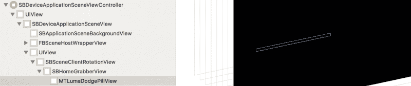

We found the home indicator!

`MTLumaDodgePillView`这个名字很有意义。它证实了我们观察到的主页指示器的行为，即它的颜色根据其当前亮度与背景形成对比。

我们能再深入一点吗？

跳板还有一个很酷的功能:隐藏的调试菜单。原来有一整节是用来修改主页指示器的属性的。在此调试菜单中，主页指示器被称为“抓取器”。

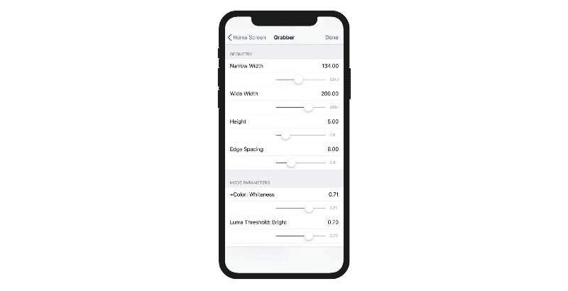

So many fun sliders to play with. ?

这个调试菜单主要包含视觉和动画设置。它最有可能用于苹果内部设计和工程之间的协作。工程部门构建主页指示器，提供所有内部参数的挂钩，让设计师摆弄它们，直到他们满意为止，然后工程师使用最终产品的设置。

幸运的是，我们可以访问这个菜单，并在模拟器中看到结果。

我首先尝试了 home 指示器的视觉外观。各种状态下都有宽度和高度的滑块。

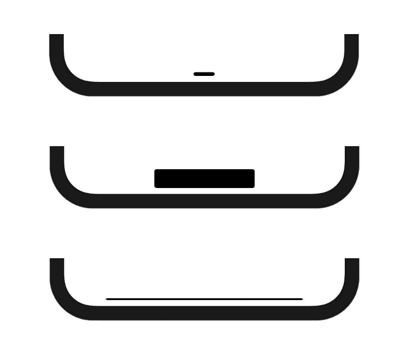

Some alternate home indicator sizes.

其他设置更难测试，因为它们似乎不适用于模拟器。有亮暗的“亮度阈值”设置，以及状态间动画的参数。这证实了“悬崖”,其中颜色会在明暗之间戏剧性地变化——有基于背景亮度的预定义阈值。

我无法确定为什么模拟器的行为与真实设备如此不同。我猜模拟器使用了不同的设置组合，或者某些设置只在真实的硬件上生效。

想在 iOS 上了解更多关于逆向工程的知识？Sash Zats 发布了一篇关于家庭指示器的令人惊讶的深度文章。如果您想深入了解更多代码，请查看它！

这标志着家庭指标探索之旅的结束。我希望这对你和我一样有教育意义！

### 高级外卖

1.  主页指示器的颜色由系统决定，不能直接修改。
2.  主页指示器的颜色由下面的内容决定，并且不总是纯色。
3.  模拟器上的起始指示器是**而不是**真实设备上起始指示器的准确表示。
4.  当下方的内容发生变化时，主页指示器会以新的颜色显示动画。
5.  主页指示器处于“亮”或“暗”状态。

### 但是……为什么呢？

如果家庭指示器的外观不在我们的控制之内，为什么还要费心去调查它呢？

这些知识有一个实际的应用:如果你的应用程序中的一个屏幕有一个中间范围的背景颜色，主屏幕指示器可以是亮的或暗的，你可能更喜欢一种风格。例如，如果状态栏是白色的，如果主页指示器也是白色的，它可能看起来更平衡。意识到主页指示器的细微行为有助于确保它不会在可能分散用户注意力的时候意外地在明暗之间活动。

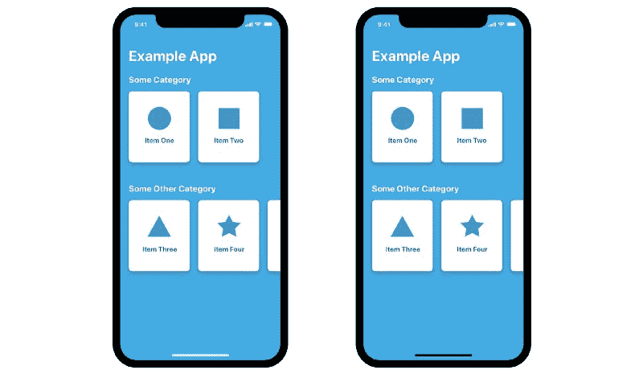

Prefer one over the other?

在前面的示例中，主页指示器后面的白色共享表动画足以改变主页指示器的样式。

如果我想防止这种情况，我可以在安全区域和显示器底部边缘之间的主页指示器后面固定一个视图。当共享表被关闭时，我可以给它一个更暗的背景色(也许是 40% alpha 的黑色)并添加一个淡入淡出的动画，这样它就不那么明显了。

同样的策略可以用来设置主页指示器的颜色——迫使它越过一个“悬崖”。在绝大多数情况下，主页指示器应该自行其是。大多数 iPhone X 用户可能已经忘记了它的存在。

### 真正的教训

希望这个对住宅指示器颜色的简短调查能帮助我们理解简单设计的复杂性。“就是个黑/白条！”远非事实。家居指南对细节的关注和重视是值得赞赏的。

拿一些简单的东西，调查它的内部复杂性，思考它的设计有助于我们了解创造的过程。通过结合设计和工程，我们可以制造出更好的产品，简单易用，令人愉悦。

喜欢这个故事吗？留点掌声？在 Medium 上分享给你的 iOS 设计/开发朋友。想要了解最新的移动应用程序设计/开发吗？在 Twitter 上关注我:h[ttps://Twitter . com/nathan gitter](https://twitter.com/nathangitter)

感谢伊恩·麦克道尔和 T2·大卫·奥肯帮助修改了这篇文章之前的草稿。