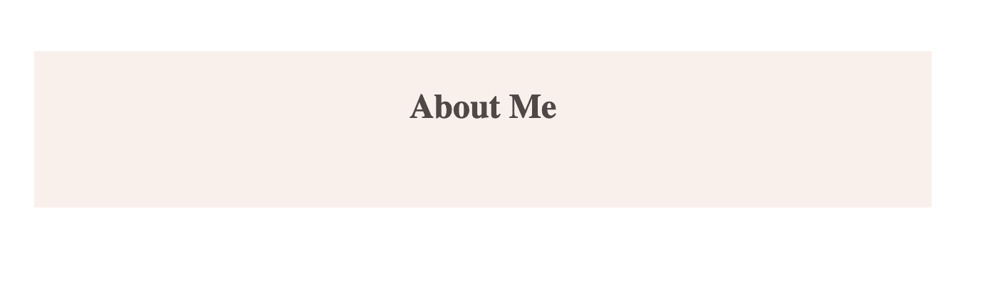

# RGB 颜色–HTML 和 CSS 指南

> 原文：<https://www.freecodecamp.org/news/rgb-color-html-and-css-guide/>

为你的网页设计项目选择正确的颜色是一项严肃的工作。一个配色方案通常可以成就或破坏一个网站的整体外观。

不同的颜色给你的设计带来不同的感觉。正确选择颜色可以让你的设计和作品看起来干净、美观、现代。但是错误的颜色会使项目看起来过于花哨，不美观，并且很难与用户互动。

边框的颜色(`border`)、背景的颜色(`background-color`)或者前景的颜色(`color`)——页面上的文字和文字装饰——有很大的影响，所以你应该努力把它们弄对。


Image from [Unsplash](https://unsplash.com/)

CSS 允许你使用各种不同的颜色和颜色系统。它们的范围从命名颜色到十六进制颜色、rgb()颜色、hsl 颜色等等。

## 如何在 HTML 中使用颜色

将颜色应用到 HTML 元素的最简单的方法是将 HTML 写在一个`.html`文件中。然后在该文件中，您只需将您的`.css`样式表与您指定的所有颜色和样式链接起来。

这使得你的代码更容易阅读，并且*关注*，这被认为是最佳实践。

我们可以有一个文件`about.html`，包含一些 HTML 代码，如下所示:

```
<!DOCTYPE html>
<html lang="en">
<head>
    <meta charset="UTF-8">
    <meta http-equiv="X-UA-Compatible" content="IE=edge">
    <meta name="viewport" content="width=device-width, initial-scale=1.0">
    <!-- link to our css styles -->
    <link rel="stylesheet" href="style.css">
    <title>About Me</title>
</head>
<body>
     <section class="intro">
     <h2>About Me</h2>
     </section>
</body>
</html> 
```

然后在我们的`style.css`中，我们可以添加以下内容:

```
 .intro {
 /* changes color of  background */
  background-color: rgb(232, 206, 191);
  max-width: 620px;
  height: 100px;
  padding: 5px;
  margin: 70px auto;
}

h2 {
/* changes color of text   */
  color: rgb(79, 72, 70);
  text-align:center;
} 
```

当我们在浏览器中加载这些样式时，它们看起来像这样:


在这个例子中，我们使用`rgb`颜色值来改变页面上的颜色。

本文主要介绍了`rgb()`颜色模型。它与`named colors`和`hex colors`做了一些比较，权衡了各自的利弊，并讨论了这些不同色系之间的一些差异和相似之处。

## CSS 中的命名颜色有哪些？

命名颜色是英文单词，称为*关键词颜色*。它们使用起来非常简单。

在您的 CSS 文件中，您声明了想要定位和更改的属性。然后使用一个设置和指定的颜色名称。

```
 h2 {
    color: cyan;
    } 
```

上面的代码将使 HTML 中的每个`h2`元素都有一个文本颜色值`cyan`。

现代浏览器支持大约 140 种命名颜色。所以你的选择相对有限，没有太多的选择。

对于命名的颜色，我们无法利用 CSS 的真正力量。所以让我们看看其他的选择。

## 数字命名的颜色系统

在这种情况下，颜色是用数字系统来描述的。这使你可以充分利用所有可用的颜色。

大多数电脑屏幕使用红、绿、蓝三种颜色混合在一起。

`hex colors`和`rgb()`两种颜色都使用红色、绿色和蓝色的组合来创造不同的色调。它们以相同的方式工作，唯一的区别是它们使用的数字系统和语法。

让我们更深入地看一下每个系统。

## CSS 中的十六进制颜色是什么？

与我们人类使用十进制计数系统相比，计算机使用十六进制计数系统计数。

该系统由字母数字值组成，包括这些字符:`0,1,2,3,4,5,6,7,8,9,a,b,c,d,e,f`。

一个十六进制颜色以一个`#`开始，表示它确实是一个十六进制颜色，然后是上面提到的字符的`6`。

这些数字和字母代表颜色中`red, green, and blue`的量。

将关键字 color`cyan`从之前的值转换为其等效的十六进制颜色值将会是:

```
 h2 {
    #00ffff;
    } 
```

第一对(`00`)代表红色的量。下一对(`ff`)代表绿色的量。最后一个(`ff`)代表蓝色的数量。

十六进制颜色可以使用的最小值是完全关闭的`00`，最大值是完全打开的`ff`。

十六进制中的白色是`#FFFFFF`或`FFF`的简写符号，黑色是`#000000`或`#000`。

## 什么是 RGB 颜色模型？

一般来说，`hex`颜色和`rgb`颜色是相同的——它们只是使用了不同的数字系统和语法(但是颜色是完全一样的)。

你选择使用哪一个，实际上只是个人喜好的问题。

`RGB`是代表`Red Green Blue`的首字母缩写。

不同于我们对十六进制颜色值使用的六个十六进制字符，RGB 的每个参数对定义了每种颜色(红色、绿色和蓝色)的强度和亮度，整数范围从`0-255`到百分比范围从(0% - 100%)。

它用组成颜色的红、绿、蓝的数量来表示颜色，并使用人类的计数系统，与计算机语言中的十六进制颜色形成对比。

数字是代表颜色深浅的代码。

`0`的最小值表示没有显示任何颜色，所以它是最暗的。另一方面，`255`的最大值表示显示了全量的颜色和全强度。

### RGB 颜色语法

一个`rgb`声明的一般外观是`rgb(red,green,blue);`

RGB 具有以下语法:

*   关键字`rgb`后跟一组括号`()`
*   括号内用逗号分隔的三个十进制数值(代表三种颜色)，
*   最后以分号结束。

确保你不要在任何东西之间留下任何空间。

再次以`cyan`为例，等效的`rgb`代码为:

```
 h2 {
    color:  rgb(0,255,255);
    } 
```

红色没有显示出来，而绿色和蓝色是最亮和最大的。

*   白色是`rgb(255,255,255)`
*   黑色是`rgb(0,0,0)`
*   红色是`rgb(255,0,0)`
*   绿色是`rgb(0,255,0)`
*   蓝色是`rgb(0,0,255)`

### RGB 有许多选项

对于 RGB，每个值都与其他值混合在一起，它们一起创建了各种各样的色调。你甚至可以创造新的颜色组合，让它成为设计师的梦想。

在`rgb`颜色系统中，有三个值可以使用，每个值可以是 256 个可能值中的一个。

总共有 256 * 256 * 256 = 16，777，216 种颜色可供选择！

### RGB 不透明度

默认情况下，所有`rgb`颜色都是完全不透明的。

我们可以通过使用`rgba()`选择器改变不透明度来使颜色更加透明。

`rgb`部分保持不变，但是第四个值`a`代表`alpha`。

我们可以给`a`一个数字，或者是`0`或者是`1`来描述我们想要的颜色有多不透明。`0`是完全透明的，`1`是完全不透明的。

我们将再次使用`cyan`的例子，但这一次我们将使它有一半的不透明度。

```
 h2 {
    color:  rgba(0,255,255,0.5);
    } 
```

在 CSS 中还有一个`opacity`选择器。

我们将使用之前的 HTML，并使用 CSS 中的类`.intro`将`opacity`选择器添加到`section`元素中:

```
.intro {
    background-color: rgb(232, 206, 191);
    max-width: 620px;
    height: 100px;
    padding: 5px;
    margin: 70px auto;
    opacity: 0.3;
    } 
```

请注意，这使得整个标签透明，包括背景、标题、标题的背景——一切。


例如，`rgba()`的强大之处在于它允许我们只让背景透明，或者我们可以只让标题透明。它不会影响整个标签和其中的所有内容。

现在，如果我们从上面移除这条线，并将`background-color`选择器更新为 `background-color: rgb(232, 206, 191,0.3);`，我们会发现它不会影响航向:



## 结论

我希望这已经让您对 RGB 颜色模型、它的语法以及它是如何工作的有了一个很好的了解。我们还简单地将它与 CSS 中的其他颜色模型进行了比较。

我希望你发现这是有价值的，感谢你的阅读。

编码快乐！