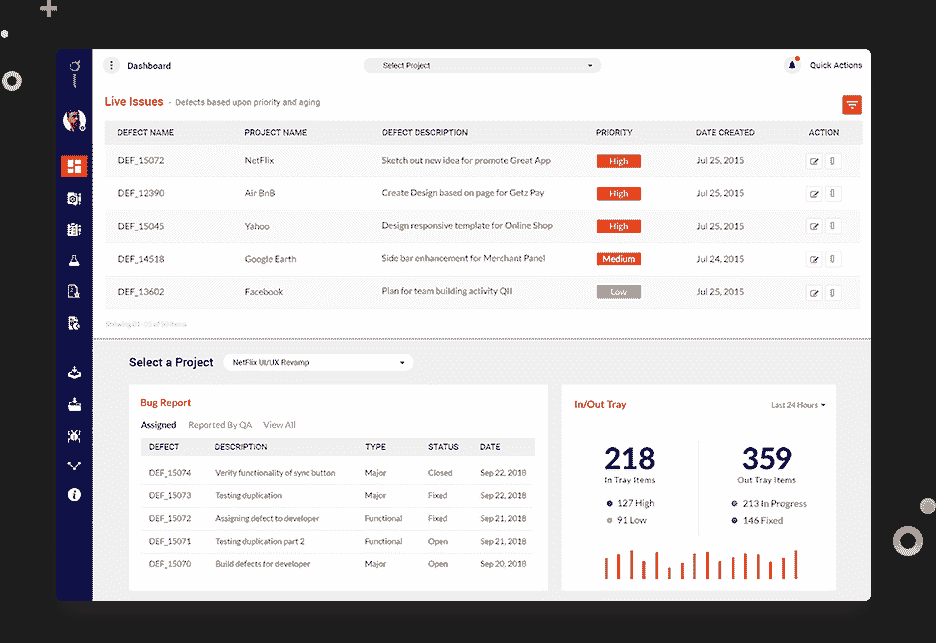
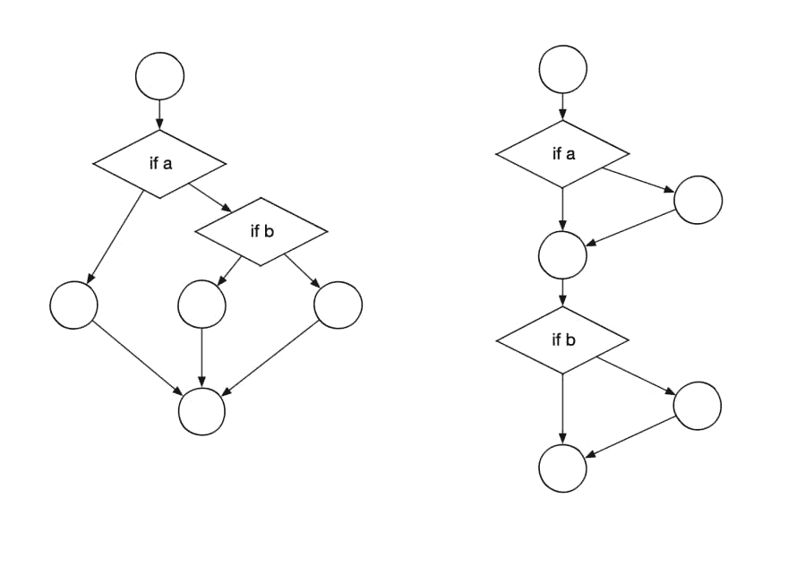

# 基于风险的测试:一种平衡有效的测试方法

> 原文：<https://www.freecodecamp.org/news/risk-based-testing-a-balanced-effective-approach-to-testing/>

利益相关者总是推动寻找更快的解决方案。项目经理正在将产品赶向交货台。这样做并不一定有什么错。

但是对于 QA 测试团队来说，这可能是一个挑战，他们必须接受这个超级快的时间表，然后说服开发团队加入进来。

软件团队知道测试管理团队在应对不断的转变和变化时，多么渴望达到最后期限。

在这种情况下，所有的责任都落在了测试团队身上，当产品 bug 发布时，他们可能很快成为一个方便的目标。在上游软件开发生命周期(SDLC)阶段，任何关于规范和实现的延迟都会使事情变得更糟。

除此之外，那些希望产品尽快可用的涉众的需求更是火上浇油。所有这些都给测试团队带来了巨大的压力。

一个 QA 团队必须对这个挑战有一个理性的和经验性的回应。这个问题的答案在于[基于风险的测试(RBT)](https://www.kualitee.com/test-management/best-test-management-tools-must-used-2019/) ，它可以帮助测试团队在期限内交付。

您的测试团队可以使用 RBT 策略节省大量的精力，并且在按时交付项目的同时产生巨大的节约。

## 什么是基于风险的测试？RBT 基础知识

在基于风险的测试管理中，您可以在开发周期的早期发现最大的市场威胁(这将对消费者定义的企业产生不利影响)，然后您可以通过采取预防措施来应对它们。

这些市场威胁可能包括成本增加、消费者失望、糟糕的用户界面和客户流失。RBT 可以帮助您减轻这些风险，方法是以这样一种方式进行测试，即使客户出错，他们也可以继续使用应用程序(并且组织不会受到很大影响)。

RBT 包括基于产品风险进行的测试。它有助于帮助您发现某个特定特性或功能在最终输出/生产中失败的可能性有多大。它还能帮助你提前确定这次失败在成本和其他损失方面对公司的影响。它通过对测试用例使用优先级策略来做到这一点。

因此，基于风险的评估通过优先测试产品或软件的功能、组件和特性来工作。这种优先级的确定是基于特性或功能开发失败的风险及其对客户的影响。

## 如何评估 RBT 的风险

RBT 包括风险管理和测试优先级，这取决于每次测试的风险因素。风险因素是未来风险的可能性和可能影响的结果。

但是我们怎样才能提出这些价值观呢？要将风险因素分配给特定风险，需要考虑以下三个要求。

### 代码复杂性

Cyclomatic Complexity

代码越模糊，就越有可能发现缺陷。简单地说，更复杂的代码更有可能包含小故障。反之亦然:代码越简洁，包含错误的可能性就越小。

接下来的问题是你应该如何计算代码复杂度。一个度量是[圈复杂度](https://www.tutorialspoint.com/software_testing_dictionary/cyclomatic_complexity.htm)，它指的是潜在路径的数量。彻底测试一个特性所需的最小测试用例数量由这个数量决定。事实上，具有高圈复杂度的代码可能会增加错误的数量，因此更难阅读。

### 代码的变动或修改次数

这里的 Churn 意味着特定文件或模块经历的修改次数。开发人员更频繁更改的应用程序区域比他们很少接触的区域更有可能出现错误。

一个很好的例子是已经开发了多年的电子商务应用程序。软件团队可能会频繁调整报价，引入新功能，并尝试实验以增加购买量。代码中受影响的部分会有规律地移动，因此更有可能产生错误。

当[流失](https://dzone.com/articles/code-churn-a-magical-metric-for-software-quality)很严重时，应该为基于风险的计划提出广泛的测试:更多的 UI 测试、更多的单元测试、更多的集成测试，等等。

### 危险程度

关键程度包括计算一个[软件缺陷对你的应用程序的](https://techbeacon.com/app-dev-testing/how-slash-high-cost-defects)影响。关键程度在代码库中分布不均匀。许多系统都有一个重要的代码核心，应用程序的其余部分依赖于它。

如果代码不能正常执行，软件的几个部分可能会受到损害，并且可能会产生缺陷。如果它适用于安全相关的软件，一个关键缺陷可能会导致数据丢失、敏感数据泄露，甚至可能危及生命。

在衡量风险因素的影响部分时，危险程度可能很有用。

如果一个 bug 出现在应用程序最重要的环境中，其影响可能比出现在只包含实用程序代码的某个区域中更为严重。

我们依靠测试管理框架中的算法来对站点组件进行分类。如果算法和相关的核心代码不能检测到 web 组件，UI 会检查我们的客户是否会犯错误或失败，从而导致沮丧、返工、服务呼叫以及对我们的解决方案缺乏信心。

更糟糕的是，如果我们的应用程序生成了误报，它将中断 CI/CD 过程，并阻碍合法应用程序的实现。

## 智能测试是解决方案

软件开发公司需要一个更好的软件测试策略，而不是“什么都测试”不是所有的代码都是相同的，不是所有的威胁都是可信的，也不是所有的 bug 都会引发相同的危害。

为了就如何分配资本和更有效地测试资本做出明智的决定，科技公司必须考虑这些 RBT 因素。

如果你想在基于风险的软件测试中保持领先，你可以去看看 Kualitee，我们是一家软件测试和信息安全公司。