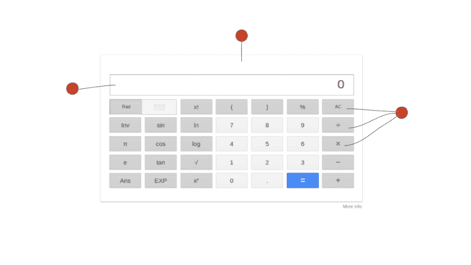
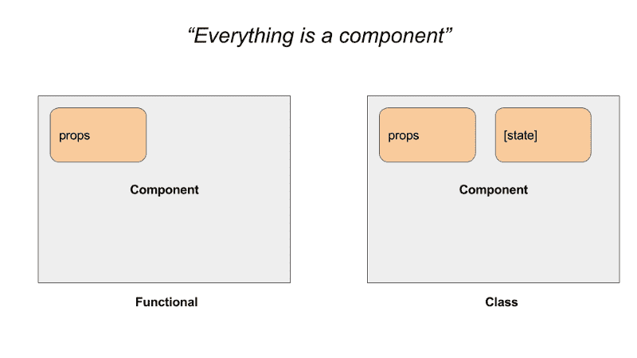
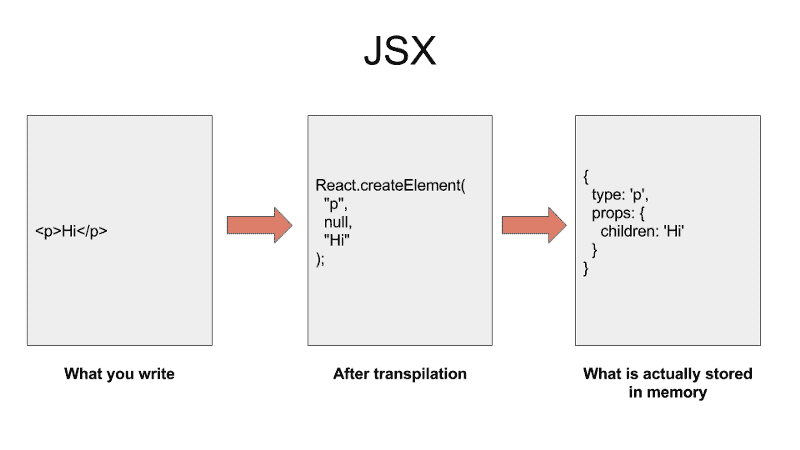
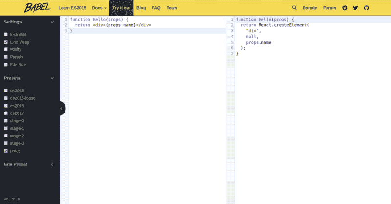

# 坚如磐石的 React.js 基础:初学者指南

> 原文：<https://www.freecodecamp.org/news/rock-solid-react-js-foundations-a-beginners-guide-c45c93f5a923/>

作者 Rajat Saxena

# 坚如磐石的 React.js 基础:初学者指南

React.js crash course

在过去的几个月里，我一直在使用 React 和 React-Native。我已经发布了两款量产的 app， [Kiven Aa](https://kivenaa.com) (React)和[花粉聊天](https://play.google.com/store/apps/details?id=com.pollenchat.android) (React Native)。当我开始学习 React 时，我在寻找一些东西(一个博客、一个视频、一门课程，无论什么)，这些东西不仅教会我如何在 React 中编写应用程序。我也想让它为我的面试做准备。

我找到的大部分材料都集中在这个或那个上。所以，这篇文章的目标读者是那些寻求理论和实践完美结合的人。我会给你一点理论，这样你就能理解到底发生了什么，然后我会告诉你如何写一些 React.js 代码。

如果你喜欢视频，我在 YouTube 上也有整个课程。请检查一下。

让我们开始吧…

#### React.js 是一个用于构建用户界面的 JavaScript 库

您可以构建各种单页面应用程序。例如，您希望在用户界面上实时显示变化的聊天工具和电子商务门户。

### 一切都是组件

一个 React 应用程序是由组件组成的，很多组件嵌套在一起。“但是什么是组件呢？”，你可能会问。

组件是一段可重用的代码，它定义了某些特性在用户界面上的外观和行为。例如，按钮就是一个组件。

让我们看看下面的计算器，当你试图计算 2+2 = 4–1 = 3 这样的东西时，你会在谷歌上看到它(快速数学！)

Red markers denote components

正如你在上面的图像中看到的，计算器有许多区域——像*结果显示窗口*和*数字小键盘*。所有这些可以是独立的组件，也可以是一个巨大的组件。这取决于一个人在反应中分解和抽象事物的舒适程度

您需要为所有这些组件分别编写代码。然后将它们组合在一个容器中，这个容器本身就是一个 React 组件。通过这种方式，你可以创建可重用的组件，最终的应用程序将是一个独立组件的集合。

下面是在 React 中编写计算器的一种方法，如上所示:

是啊！它看起来像 HTML 代码，但它不是。我们将在后面的章节中对此进行更多的探讨。

### 搭建我们的操场

本教程重点介绍 React 的基础知识。它主要不是面向 React for Web 或 [React Native](https://facebook.github.io/react-native/) (用于构建移动应用程序)。因此，我们将使用在线编辑器，以便在了解 React 能做什么之前避免 web 或本机特定的配置。

我已经在 [codepen.io](https://codepen.io/raynesax/pen/MrNmBM) 上为你设置了一个环境。只需点击链接，阅读 HTML 和 JavaScript (JS)标签中的所有评论。

### 控制组件

我们已经知道，React 应用程序是各种组件的集合，构建为嵌套树。因此，我们需要某种机制将数据从一个组件传递到另一个组件。

#### 输入“道具”

我们可以使用一个`props`对象将任意数据传递给组件。React 中的每个组件都获得这个`props`对象。

在学习如何使用这个`props`对象之前，我们先来了解一下功能组件。

#### a)功能组件

React 中的功能组件使用您使用`props`对象传递给它的任意数据。它返回一个描述 UI React 应该呈现什么的对象。功能组件也被称为**无状态组件。**

让我们编写第一个功能组件:

就这么简单。我们只是将`props`作为参数传递给一个普通的 JavaScript 函数，然后返回，*嗯，那是什么？那个`
{props.name}` < /d* 我 **v >的东西！这是 JSX (JavaScript** 扩展)。我们将在后面的章节中了解更多。

上述函数将在浏览器中呈现以下 HTML:

阅读下面关于 JSX 的部分，在那里我解释了我们从我们的 JSX 代码中得到这个 HTML。

如何在 React 应用中使用这个功能组件？很高兴你问了！就像下面这样简单:

上面代码中的属性`name`在我们的`Hello` 组件中变成了`props.name`。属性`age`变成`props.age`等等。

**记住！**您可以将一个 React 组件嵌套在其他 React 组件中。

让我们在 codepen 游乐场中使用这个`Hello`组件。如下所示，用我们的`Hello`组件替换`ReactDOM.render()`内的`div`，并在底部窗口中查看变化。

但是如果你的组件有一些内部状态呢？例如，像下面的计数器组件，它有一个内部计数变量，该变量在按+和-键时发生变化。

#### b)基于类的组件

基于类的组件有一个额外的属性`state`，可以用来保存组件的私有数据。我们可以使用类符号重写我们的`Hello`组件，如下所示。因为这些组件有一个状态，所以它们也被称为**有状态组件**。

我们扩展了 React 库的`React.Component`类，使 React 中的组件基于类。点击了解更多关于 JavaScript 类的信息。

方法**必须**出现在你的类中，因为 React 寻找这个方法，以便知道它应该在屏幕上呈现什么 UI。

要使用这种内部状态，我们首先必须在组件类的构造函数中初始化`state`对象，如下所示。

类似地，可以使用`this.props`对象在基于类的组件内部访问`props`。

要设置状态，您可以使用`React.Component`的`setState()`。在本教程的最后一部分，我们将看到一个这样的例子。

**提示:**永远不要在`*render()*`函数中调用`*setState()*`，因为`*setState()*`会导致组件重新渲染，这将导致无限循环。

A class-based component has an optional property “state”.

除了`state`，一个基于类的组件有一些生命周期方法，比如`componentWillMount().`，你可以用它们来做一些事情，比如初始化`state` 等等，但这些都不在本文的讨论范围之内。

### JSX

JSX 是 JavaScript 扩展 T2 的简称，它是编写组件的一种方式。使用 JSX，您可以像使用标签一样在 XML 中获得 JavaScript 的全部功能。

你把 JavaScript 表达式放在`{}`里面。以下是一些有效的 JSX 例子。

它的工作方式是你写 JSX 来描述你的用户界面应该是什么样子。像`Babel`这样的[编译器](https://en.wikipedia.org/wiki/Source-to-source_compiler)将代码转换成一串`React.createElement()`调用。然后，React 库使用这些`React.createElement()`调用来构建 DOM 元素(对于 React for Web)或本地视图(对于 React Native)的树状结构，并将其保存在内存中。

React 然后计算它如何在显示给用户的 UI 的内存中有效地模仿这个树。这个过程被称为[对账](https://reactjs.org/docs/reconciliation.html)。计算完成后，React 对屏幕上的实际 UI 进行更改。

How React converts your JSX into a tree which describes your app’s UI

你可以使用 [Babel 的在线 REPL](https://babeljs.io/repl) 来看看当你写一些 JSX 时 React 实际输出了什么。

Use Babel REPL to transform JSX into plain JavaScript

#### 因为 JSX 只是普通调用的语法糖，所以 React 可以不用 JSX

现在我们已经有了所有的概念，所以我们已经准备好编写一个`counter`组件，我们之前看到它是一个 GIF。

代码如下，我希望你已经知道如何在我们的操场上渲染。

以下是关于上述代码的一些要点。

1.  JSX 使用`camelCasing`，因此`button`的属性是`onClick`，而不是我们在 HTML 中使用的`onclick`。
2.  绑定对于`this`处理回调是必要的。请参见上面代码中的第 8 行和第 9 行。

最终的交互代码位于[这里](https://codepen.io/raynesax/pen/QaROqK)。

至此，我们已经结束了 React 速成班。我希望我已经阐明了 React 是如何工作的，以及如何使用 React 来构建更大的应用程序，使用更小的可重用组件。

如果您有任何疑问，请在 Twitter [@rajat1saxena](https://twitter.com/rajat1saxena) 上给我打电话，或者在 rajat@raynstudios.com[给我写信](mailto:rajat@raynstudios.com)。

如果你喜欢这篇文章，请推荐它并与你的网络分享。关注我，获取更多与技术相关的帖子，并考虑订阅我在 YouTube 上的频道 [Rayn Studios](https://www.youtube.com/channel/UCUmQhjjF9bsIaVDJUHSIIKw) 。非常感谢。