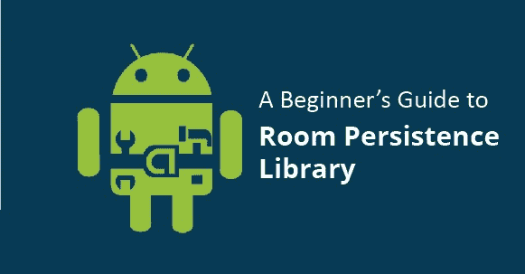
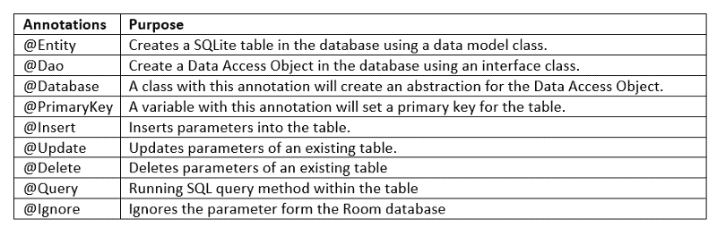

# 房间持久性库初学者指南

> 原文：<https://www.freecodecamp.org/news/room-sqlite-beginner-tutorial-2e725e47bfab/>

作者阿津·奥古斯汀

# 房间持久性库初学者指南



对于一个 Android 开发者来说，将原始数据转换成结构化数据库进行内部存储并不是一件困难的事情。这是使用最可靠的语言——SQL 来完成的。内置的 SQLite 核心库在 Android 操作系统中。它将处理数据库所需的 CRUD(创建、读取、更新和删除)操作。android.database 提供了 SQLite 的 Java 类和接口，SQLite 维护了一个有效的数据库管理系统。但是这种传统方法有其自身的缺点。

*   你必须写长而重复的代码，这既费时又容易出错。
*   管理复杂关系数据库的 SQL 查询非常困难。

为了克服这一点，Google 引入了 Room 持久性库。这充当了现有 SQLite APIs 的抽象层。通过使用简单的注释，所有必需的包、参数、方法和变量都被导入到 Android 项目中。



Annotations in Room Persistence Library

让我们用一个例子来看看如何实现这一点。

1.在 build.gradle 文件中添加 gradle 依赖项。

```
implementation “android.arch.persistence.room:runtime:1.0.0”annotationProcessor “android.arch.persistence.room:compiler:1.0.0”
```

2.为数据库表创建一个数据模型类，并标注它的表名和主键。

```
@Entity public class Movies { @NonNull @PrimaryKey private String movieId; private String movieName;  public Movies() { }  public String getMovieId() { return movieId; } public void setMovieId(String movieId) { this.movieId = movieId; } public String getMovieName() { return movieName; } public void setMovieName (String movieName) { this.movieName = movieName; } }
```

3.为数据库访问创建接口类。为 CRUD 操作创建抽象方法。添加自定义 SQL 查询作为方法。

```
@Dao public interface DaoAccess {  @Insert void insertOnlySingleMovie (Movies movies); @Insert void insertMultipleMovies (List<Movies> moviesList); @Query (“SELECT * FROM Movies WHERE movieId = :movieId“) Movies fetchOneMoviesbyMovieId (int movieId); @Update void updateMovie (Movies movies); @Delete void deleteMovie (Movies movies); }
```

4.为数据库实现创建一个数据库类。

```
@Database (entities = {Movies.class}, version = 1, exportSchema = false) public abstract class MovieDatabase extends RoomDatabase { public abstract DaoAccess daoAccess() ; }
```

5.在活动或片段类中为数据库类声明并初始化一个对象。

```
private static final String DATABASE_NAME = “movies_db”; private MovieDatabase movieDatabase; movieDatabase = Room.databaseBuilder(getApplicationContext(), MovieDatabase.class, DATABASE_NAME) .fallbackToDesctructiveMigration() .build();
```

初始步骤已经完成。通过使用 database 对象，您可以执行数据库管理的所有功能。

样本插入代码:

```
new Thread(new Runnable() { @Override public void run() { Movies movie =new Movies(); movie.setMovieId( “2”); movie.setMovieName(“The Prestige”); movieDatabase.daoAccess () . insertOnlySingleMovie (movie); } }) .start();
```

始终使用线程、AsyncTask 或任何工作线程来执行数据库操作。

欲了解更多信息，请查看:

[https://developer . Android . com/training/data-storage/room/index . html](https://developer.android.com/training/data-storage/room/index.html)

体验无缝编码，因为还有改进的空间！

*最初发表于[thinkpalm.com](http://thinkpalm.com/blogs/beginners-guide-room-persistence-library/)。*