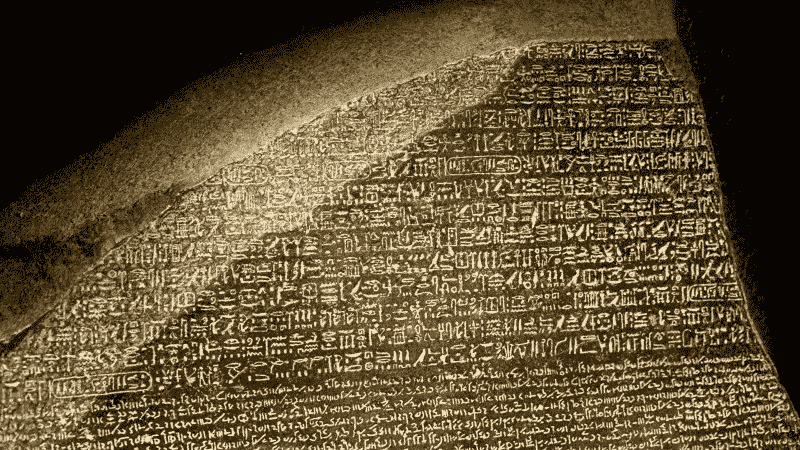
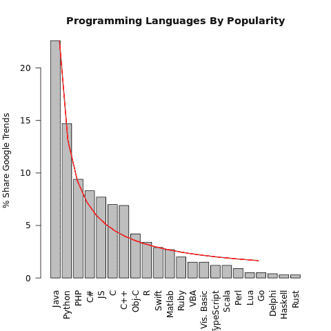
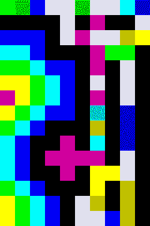

# 罗塞塔代码——揭开驱动我们世界的编程语言的神秘面纱

> 原文：<https://www.freecodecamp.org/news/rosetta-code-unlocking-the-mysteries-of-the-programming-languages-that-power-our-world-300b787d8401/>



The original Rosetta Stone, via [History.com](http://www.history.com/s3static/video-thumbnails/AETN-History_VMS/21/206/tdih-jul19-HD.jpg)

众所周知，技术世界被相对较少的编程语言所主宰。虽然很难获得准确的数字(并且毫无疑问会随着时间的推移而变化)，但您可能会说出在给定时间段内占所有编程输出绝大部分的少数几种语言。

在研究本文时，我访问了两个有趣的站点，它们可以让您根据流行程度来可视化编程语言。 [IEEE Spectrum](http://spectrum.ieee.org/static/interactive-the-top-programming-languages-2016) 让你交互式地调整各种指标的权重，而 [PYPL](http://pypl.github.io/PYPL.html) 提供了一个整洁的表格，给出了基于过去 12 个月谷歌趋势数据的实际份额百分比。

现在，我拒绝卷入任何关于编程语言流行度的最佳衡量标准到底是什么的争论(无论如何，这是否是一个重要的统计数据)。接下来的只是一个仓促的分析来说明一个观点(任何借口真的要用 [R-Fiddle](http://www.r-fiddle.org/) ！)

使用 PYPL 的数据，我们可以看到几个明显的趋势:



Graph produced at [R-Fiddle.org;](http://www.r-fiddle.org/) data from [PYPL](http://pypl.github.io/PYPL.html)

#### 1) —前 10 种语言几乎占据了谷歌趋势数据的 90%

依次是:Java、Python、PHP、C#、JavaScript、C、C++、Objective-C、R 和 Swift。这两家公司在谷歌趋势中的份额合计为 87.1%。

#### 2)——语言流行遵循幂律分布

使用我最喜欢的 R 包， [igraph](http://igraph.org/r/) ，因为它有可靠的 power.law.fit()函数，我发现编程语言的流行遵循幂律分布:

```
> pL = power.law.fit(shares)> pL$KS.p$KS.p[1] 0.9873141
```

0.987 的值是与 Kolmogorov-Smirnov 测试统计相关的 p 值，这告诉我们，我们可以非常确定流行度的分布(如 PYPL 所定义的)确实遵循幂律分布。

像[许多其他现象](https://en.wikipedia.org/wiki/Pareto_distribution#Applications)一样，编程语言的相对受欢迎程度分布不均。这通常可以用正反馈(或“滚雪球效应”)机制来解释——一个简单的版本可能是，一种语言越受欢迎，就有越多的工作机会，所以更多的人被激励去学习它，从而增加它的受欢迎程度。

#### 有什么新鲜事吗？

有些编程语言比其他语言更受欢迎并不奇怪。大家已经知道，Java、C、C++、C#、Python *等*是目前为止使用最多的语言。

在我看来，更有趣的是，对于每一种庞大的编程语言来说，在荒野中肯定有几十种更小、更适合的语言。

撇开纯粹的好奇不谈，有充分的理由对此感兴趣。任何涉猎过很多编程语言的人都知道不同的语言适合不同的目的。JavaScript 用于 web 开发，PHP 用于服务器端编程，R 用于统计学，Matlab 用于数学。对于编程语言来说，多样性是一件好事。在那里，可能有一种语言非常适合解决你甚至不知道存在的问题。

但是去哪里找他们呢？一个值得一看的地方是罗塞塔代码。

### 编程之旅

我不记得具体是怎么碰到罗塞塔代码的，但一旦找到，我就迷上了。它把自己描述成一个编程 chrestomathy 网站，并且在它的文档中有令人印象深刻的 647 种编程语言。去[看看。](http://rosettacode.org/wiki/Rosetta_Code)

真正令人敬畏的是，Rosetta 代码不仅仅给出一个通用的“Hello World！”每种语言的示例。不，相反，它有 800 多种不同的编程任务，从一些简单的“奇数或偶数”，到更高级的问题，如迷宫解决和网络搜索。每个任务页面描述要解决的问题，然后用一系列编程语言给出解决方案。

在这里，名声并不重要。以及 C、C++、Java 等。，你会用你从未听说过的语言找到解决方案。有的复古，有的现代；有些看起来很熟悉，而另一些则难以置信地深奥。浏览所有的例子可能会花费你不愿意承认的时间，但是为了帮助你开始，我整理了一些不太为人知和/或更有趣的语言，它们引起了我的注意。激活书呆子模式，开始吧！

### 来自过去的爆炸

有些语言会永远存在，或者看起来如此。除了 C 之外，从 Lisp 和 Fortran 派生出来的语言已经存在了几十年，而 BASIC 和 Pascal 等其他语言可能已经过时，但仍然存在于大众的记忆中。

然而，时间对其他人就不那么仁慈了。这里列出了一些在 Rosetta 上有代码样本的语言，从一个角度来说，它们不太可能让你很快被录用。

#### **EDSAC 订单代码**

EDSAC 是一台著名的早期计算机，由剑桥大学的莫里斯·威尔克斯团队在 20 世纪 40 年代末设计和建造。EDSAC 的建造见证了大卫·惠勒在 1951 年获得第一个计算机科学博士学位。同时，他还发明了“惠勒跳跃”，或*封闭子程序*——我们今天通常称之为“函数”。

尽管 EDSAC 在历史上有着不可动摇的地位，但它自 1958 年以来就不再发挥作用了，所以不要急于学习它的定制编程语言。这里有一个来自 Rosetta 代码的[例子](https://rosettacode.org/wiki/Empty_program#EDSAC_order_code)。这是“空程序”，或最短的合法程序。它一点作用也没有。

```
T64K  [ set load point ]GK    [ set base address ]ZF    [ stop ]EZPF  [ begin at load point ]
```

#### 乔治

这种语言发明于 1957 年，是一种可以通过穿孔带输入到房间大小的机器中的语言。然而，它充满了特性，包括循环、条件语句、子程序和矩阵数据结构。它甚至读起来有点像一种更现代的语言。

然而六十年过去了，乔治已经不在我们身边了。下面是如何使用它来计算一系列的[和:](https://rosettacode.org/wiki/Sum_of_a_series#GEORGE)

```
0 (s)1, 1000 rep (i)   s 1 i dup × / + (s) ;]P
```

#### BCPL 是什么

“基本组合编程语言”，或 BCPL，无愧于它在计算史上的地位。显然也产生了“你好，世界！”的传统，BCPL 对 B 语言的设计产生了深远的影响，B 语言本身就是 c 语言的前身。BCPL 是第一个引入大括号“{”作为定义代码块的方式的语言，这一约定至今仍在许多当今最著名的语言中使用。体面，作为遗产。

这里有一个在 BCPL 写的“你好，世界”节目:

```
GET "libhdr" LET start() = VALOF{ writef("Hello world!")  RESULTIS 0}
```

#### PL/I

由 IBM 在 20 世纪 60 年代早期开发的 PL/I(编程语言一)在其全盛时期被广泛使用，但从未完全取代其竞争对手 Fortran 和 COBOL。PL/I 主要是一种大型机语言，随着 PC 的出现以及 C++和 Java 等语言的日益流行，PL/I 逐渐失宠。

Rosetta 代码上有[很多 PL/I 的例子](https://rosettacode.org/wiki/Category:PL/I)；这里它生成一个斐波那契数列:

```
/* Form the n-th Fibonacci number, n > 1\. */get list(n);f1 = 0; f2 = 1;do i = 2 to n;   f3 = f1 + f2;   put skip edit('fibo(',i,')=',f3)(a,f(5),a,f(5));   f1 = f2;   f2 = f3;end;
```

#### 氧化锡

SNOBOL 是在 20 世纪 60 年代早期开发的，并在随后的十年中成为一种流行的教学语言。然而，在整个 20 世纪 80 年代和 90 年代，它失去了动力，但在此之前，它能够影响 Lua 的设计，这使得我们之前看到的 PYPL 排名前 20。

下面是一个输出字符串长度的 SNOBOL4 程序:

```
 output = "Byte length: " size(trim(input))end
```

#### 焦点的

FOCAL(‘用代数语言公式化在线计算’，既然你问了)于 1968 年推出，是一种高效的语言，可以在内存非常有限的系统上运行。这种语言的一个特别之处是它对字符串的明显恐惧。输入字符串“HELLO”会被解释为要求计算机计算`8 ^ "LLO”`，FOCAL 在吐出大量数字答案之前很难计算出来。

尽管有其古怪之处，在 70 年代和 80 年代，FOCAL 被广泛使用。可口可乐甚至使用了他们自己的版本，他们富有想象力地称之为可口可乐。

来自 Rosetta 代码的示例显示了一个在不同单位之间转换温度的焦点程序:

```
01.10 ASK "TEMPERATURE IN KELVIN", K01.20 TYPE "K ", %6.02, K, !01.30 TYPE "C ", %6.02, K - 273.15, !01.40 TYPE "F ", %6.02, K * 1.8 - 459.67, !01.50 TYPE "R ", %6.02, K * 1.8, !
```

#### SETL

SETL 发明于 20 世纪 60 年代末，主要基于集合论，这是一门研究对象集合的数学分支。最近的稳定版本是在 2005 年，但是尽管它的使用减少了，SETL 还是有一些名气。

Ada 的第一个编译器是在 SETL 编写的，它是由美国国防部开发的。此外，据说它还影响了 ABC——这种语言后来启发了 Python 的设计。

下面是 SETL 如何计算两个整数的最大公约数。看到和 Python 有什么相似之处吗？

```
proc gcd (u, v);  return if v = 0 then abs u else gcd (v, u mod v) end;end;
```

#### 腮腺炎

这种不幸命名的语言自 1966 年以来一直存在，也被称为 m。一个关键的特性是内置的数据库系统，它允许对存储的数据进行超高效的访问。

虽然不再普遍使用，腮腺炎仍以 GT 的形式存在。m 和 inter systems _ Cache——它们在医院和金融数据库系统中占有一席之地。欧洲航天局也将 InterSystems_Cache 用于其最近的盖亚任务。

这就是腮腺炎如何被用来[逆转一串](https://rosettacode.org/wiki/Reverse_a_string#MUMPS):

```
REVERSE ;Take in a string and reverse it using the built in function $REVERSE NEW S READ:30 "Enter a string: ",S WRITE !,$REVERSE(S) QUIT
```

### 故意混淆视听

成功的编程语言的标志是什么？速度？多功能性？可读性？不，忘了这些吧——让我们来看看编程语言的一个分支，它们使用起来故意困难和/或不直观。

深奥的语言，或“esolangs”，是编程语言，有时用于实验，有时用于挑战，有时只是作为最终的书呆子笑话。如果你不太明白，没关系——事实上，这通常是重点。

更广为人知的例子包括 [Brainf***](https://rosettacode.org/wiki/Category:Brainf***) 、 [Befunge](https://rosettacode.org/wiki/Category:Befunge) 以及特别容易引发偏头痛的 [Malbolge](https://rosettacode.org/wiki/Hello_world/Text#Malbolge) 。这里列出了一些其他的例子，从有趣的到有趣的，到彻头彻尾的迟钝。在你的简历中加入这些内容，风险自负。

#### 插入

原始的深奥的编程语言发明于 1972 年，使其与 c 一样古老。它是作为对当时流行的编程实践的模仿而引入的，但它持续生存到今天表明它仍然和以前一样相关。

在一个迟钝的语法之上，INTERCAL 要求用户经常使用关键字`PLEASE`，否则程序将拒绝运行，这让用户更加困惑。然而，过于礼貌会适得其反——说“请”太频繁也会导致错误。当然，这种怪癖并没有被官方记录下来，因为那太有用了。

这里有一个[无限循环](https://rosettacode.org/wiki/Loops/Infinite#Intercal)，用 INTERCAL 写的:

```
NOTE THIS IS INTERCAL       PLEASE ,1 <- #5       DO ,1 SUB #1 <- #54       DO ,1 SUB #2 <- #192       DO ,1 SUB #3 <- #136       PLEASE ,1 SUB #4 <;- #208       DO ,1 SUB #5 &lt;- #98       DO COME FROM (1)       DO READ OUT ,1(2)    DO ,1 SUB #1 <;- #134(1)    PLEASE ABSTAIN FROM (2)
```

#### 蜂蜡

这是一种概念上很有趣的语言，它以蜜蜂围绕蜂巢的运动作为指针跨指令移动的灵感。

蜂蜡能够算术，读/写文件，甚至修改自己的源代码。下面是一个计算 [n 阶乘](https://rosettacode.org/wiki/Factorial#beeswax) (n！)用户输入的整数。

```
 p      <_1FT"pF>M"p~.~d     >Pd  >~{;
```

#### 厨师

这可能是我在 Rosetta Code 上找到的最喜欢的语言。我以前在其他地方读到过，但是没有看到过像这里提供的例子。

与大多数编程语言不同，Chef 阅读起来几乎完全是自然的，因为每个程序的格式都很像一个菜谱(因此得名！).为了完整起见，它还指具有烹饪相关名称的变量、指令和数据结构，如“搅拌碗”、“冰箱”、“混合”、“剁碎”等。为什么不呢？

下面是一个计算一组数字的总和和乘积的示例程序。

```
Sum and Product of Numbers as a Piece of Cake. This recipe sums N given numbers. Ingredients.1 N0 sum1 product1 number Method.Put sum into 1st mixing bowl.Put product into 2nd mixing bowl.Take N from refrigerator.Chop N.Take number from refrigerator.Add number into 1st mixing bowl.Combine number into 2nd mixing bowl.Chop N until choped.Pour contents of 2nd mixing bowl into the baking dish.Pour contents of 1st mixing bowl into the baking dish. Serves 1.
```

#### 高尔夫脚本

Golfscript 是一种被设计成用很少的代码做很多事情的语言，这是一个非常古怪的爱好，参与者试图用尽可能少的代码解决编程难题。

它当然实现了这个目标，并允许它的用户非常简洁地解决复杂的难题。它的[网站](http://www.golfscript.com/golfscript/index.html)告诉我们，这种简洁是通过“使用单一符号来表示高级操作”来实现的。

您会在生产环境中使用它吗？也许，如果你是一个经验丰富的代码高尔夫球手*和*没有考虑到你的项目的任何继任者的健全性。否则……大概不会。

Rosetta 代码中有几个 Golfscript 的好例子，因为它非常简洁，所以我在这里包含了其中的三个:

```
[2 4 3 1 2]$   #Sort an integer array
```

```
[296,{3/)}%-1%["No more"]+[" bottles":b]294*[b-1<]2*+[b]+[" of beer on the wall\n".8<"\nTake one down, pass it around\n"+1$n+]99*]zip    #99 Green Bottles Lyrics
```

```
[{"close"}100*]:d;10,{)2?(.d<\["open"]\)d>++:d;}/[100,{)"door "\+" is"+}%d]zip{" "*puts}/    #100 Doors Challenge
```

#### 胡恩

Hoon 的迷人之处在于，尽管有些人会把它归类为 esolang，但它确实有实际用途。它可以用来在 Urbit 上编写 web 服务，Urbit 将自己描述为“个人服务器的安全对等网络”。

看看下面的[“最大元素”示例](https://rosettacode.org/wiki/Greatest_element_of_a_list#Hoon)。

Hoon 被描述为 Lisp-y，注意每行开头的双字符符号。这些“符文”被用来代替保留的关键字，这是一个很好的概念，但对于那些不熟悉其逻辑的人来说，确实会影响可读性，并且可能会使 Hoon 显得有些深奥。

```
:-  %say|=  [^ [a=(list ,@) ~] ~]:-  %noun  (snag 0 (sort a gte))
```

```
> +max [1 2 3 ~]3
```

#### 饶舌的人

迄今为止，我遇到的最独特的语言是皮埃特语，以 20 世纪荷兰艺术家皮埃特·蒙德里安的名字命名。

它遵循一个非常不寻常的设计原则:程序代码应该是抽象艺术的形式。这是如何实现的？这个解决方案简直是天才之作。

整数由连续颜色块中“代码”的数量来表示。指针从左上角开始，在图像周围移动。每当它遇到颜色变化时，就会执行一条指令。确切的指令由色调和亮度的变化来指定。

思维=爆炸。



“Hello World” via [Rosetta Code](http://rosettacode.org/wiki/Factorial#Piet)

### 玩数组

引起我注意的一件事是基于数组的语言有很多。随着 APL 的发明，基于数组的编程在 20 世纪 60 年代早期就已经出现，尽管它们并不完全是主流，但今天仍有许多分支在不同程度上被使用。这些语言都有很多共同点，所以我就不赘述了，但是它们的有趣之处就在于它们的简洁程度。

#### J

j 是肯尼斯·艾弗森发明的，他也是 APL 的发明者。j 是一种非常简洁的语言，让你用很少的几行代码就能完成很多事情。

下面是一个 [K-means 聚类算法](http://rosettacode.org/wiki/K-means%2B%2B_clustering)。作为比较，C 语言中的相同示例有 184 行。

```
NB.  Selection of initial centroids, per K-means++   initialCentroids     =:  (] , randomCentroid)^:(<:@:]`(,:@:seedCentroid@:[))~     seedCentroid       =:  {~ ?@#     randomCentroid     =:  [ {~ [: wghtProb [: <./ distance/~       distance         =:  +/&.:*:@:-"1  NB.  Extra credit #3 (N-dimensional is the same as 2-dimensional in J)       wghtProb         =:  1&$: : ((%{:)@:(+/\)@:] I. [ ?@$ 0:)"0 1 NB.  Due to Roger Hui http://j.mp/lj5Pnt    NB.  Having selected the initial centroids, the standard K-means algo follows   centroids            =:  ([ mean/.~ closestCentroid)^:(]`_:`initialCentroids)     closestCentroid    =:  [: (i.<./)"1 distance/     mean               =:  +/ % #
```

#### k，q

这两种语言都是由 Kx 系统公司开发的。两者都是类似 APL 的基于数组的语言，在金融和大数据领域都有应用。q 围绕 K，并提供增强的可读性。

我在下面列举了两个例子。这些都是超级简洁的语言，毫无疑问对一轮代码高尔夫很有帮助，如果你喜欢的话。

```
/ 1-D Cellular automata in Kf:{2=+/(0,x,0)@(!#x)+/:!3}
```

```
/ Anagrams in K{x@&a=|/a:#:'x}{x g@&1<#:'g:={x@<x}'x}0::`unixdict.txt
```

```
/ Pascal's Triangle in qpascal:{(x-1){0+':x,0}\1}
```

```
/ 100 Doors Challenge in q`closed`open (1+til 100) in `int$xexp[;2] 1+til 10
```

#### 运河

Klong 类似于 K 和 q，但它的[网站](http://t3x.org/klong/index.html)声称它不那么模糊。自己判断——下面是一个用 Klong 写的[【中间三位数】](http://rosettacode.org/wiki/Middle_three_digits)解。

```
items::[123 12345 1234567 987654321 10001 -10001 -123 -100 100 -12345 1 2 -1 -10 2002 -2002 0] mid3::{[d k];:[3>k::#$#x;"small":|0=k!2;"even";(-d)_(d::_(k%2)-1)_$#x]}.p(mid3'items)
```

#### 国际日期变更线

又一种基于数组的语言。大约从 1977 年开始，IDL(交互式数据语言)已经被包括 NASA 和 ESA 在内的组织使用。事实上，IDL 在太空研究中找到了自己的位置，它曾经被用来帮助技术人员修理哈勃太空望远镜。

一个更实际的应用是这个函数，它生成一个 [Sierpinski 三角形](http://rosettacode.org/wiki/Sierpinski_triangle)。

```
pro sierp,n  s = (t = bytarr(3+2^(n+1))+32b)  t[2^n+1] = 42b    for lines = 1,2^n do begin        print,string( (s = t) )        for i=1,n_elements(t)-2 do if s[i-1] eq s[i+1] then t[i]=32b else t[i]=42b  endend
```

### 后起之秀？

当然，一些语言看不到太多的用途，仅仅是因为它们存在的时间不长。它们是否流行取决于多种因素，而现实是绝大多数不会被广泛采用。但你总得从某个地方开始，对吧？

以下是从罗塞塔的档案中挑选出来的一些语言，这些语言都是相对较新的语言。

#### 透明的

这个项目仍在 alpha 测试中，所以暂时不要切换到它——但是要保持警惕。受 Ruby 的编写效率和 C 的运行效率的影响，Crystal 的作者似乎致力于开发一种全面的两全其美的语言。时间会证明他们是否能成功做到这一点。

下面是一个用 Crystal 写的'[快速排序](http://rosettacode.org/wiki/Sorting_algorithms/Quicksort#Crystal)算法——为什么不让 go [自己运行它](https://play.crystal-lang.org/#/cr)？

```
def quick_sort(a : Array(Int32)) : Array(Int32)  return a if a.size <;= 1  p = a[0]  lt, rt = a[1 .. -1].partition { |x| x &lt; p }  return quick_sort(lt) + [p] + quick_sort(rt)end a = [7, 6, 5, 9, 8, 4, 3, 1, 2, 0]puts quick_sort(a)
```

#### 弗雷格

函数式编程是新的大事情，Frege 是一种纯函数式语言，于 2011 年首次推出。它被描述为“Java 虚拟机的 Haskell”。这种语言以数学逻辑学家 Gottlob Frege 的名字命名，可以编译成 Java，也可以在线试用。

下面是[“99 瓶”挑战](http://rosettacode.org/wiki/99_Bottles_of_Beer#Frege)的解决方案。它实际上与 Haskell 中的相同解决方案相同，这是意料之中的。

```
module Beer where main = mapM_ (putStrLn . beer) [99, 98 .. 0]beer 1 = "1 bottle of beer on the wall\n1 bottle of beer\nTake one down, pass it around"beer 0 = "better go to the store and buy some more."beer v = show v ++ " bottles of beer on the wall\n"                ++ show v                ++ " bottles of beer\nTake one down, pass it around\n"                ++ head (lines $ beer $ v-1) ++ "\n"
```

#### 北欧古字母

尽管缺乏全面的文档，但 Futhark 项目看起来似乎是一个很有前途的研究方向。目标是编译成高性能图形处理单元(GPU)代码，但不是为了产生图形输出。

相反，Futhark 的目标是利用 GPU 的能力来执行计算密集型程序，使用更传统的语言通常需要更长的时间。下面是一个用于计算[几何平均值](http://rosettacode.org/wiki/Arithmetic-geometric_mean#Futhark)的函数示例。

```
include futlib.numeric
```

```
fun agm(a: f64, g: f64): f64 =  let eps = 1.0E-16  loop ((a,g)) = while abs(a-g) > eps do    ((a+g) / 2.0,     F64.sqrt (a*g))  in a
```

#### 一侧，一边

自 2013 年 3 月作为一个项目开始以来，Sidef 正接近其积极开发的第四个年头。它看起来很先进，并且有很好的文档记录，有超过 600 个关于 Rosetta 代码的编码解决方案的例子。

Sidef 主要用于研究目的，希望探索 OOP 和函数式编程。就我个人而言，我真的很喜欢它的外观。下面的例子显示了它在寻找两条直线的[交点的过程。](http://rosettacode.org/wiki/Find_the_intersection_of_two_lines#Sidef)

```
func det(a, b, c, d) { a*d - b*c } func intersection(ax, ay, bx, by,                  cx, cy, dx, dy) {     var detAB = det(ax,ay, bx,by)    var detCD = det(cx,cy, dx,dy)     var ΔxAB = (ax - bx)    var ΔyAB = (ay - by)    var ΔxCD = (cx - dx)    var ΔyCD = (cy - dy)     var x_numerator = det(detAB, ΔxAB, detCD, ΔxCD)    var y_numerator = det(detAB, ΔyAB, detCD, ΔyCD)    var denominator = det( ΔxAB, ΔyAB,  ΔxCD, ΔyCD)     denominator == 0 && return 'lines are parallel'    [x_numerator / denominator, y_numerator / denominator]}
```

```
say ('Intersection point: ', intersection(4,0, 6,10, 0,3, 10,7))
```

```
&gt; Intersection point: [5, 5]
```

#### 闪烁的

和 Sidef 一样，这种语言也是从 2013 年开始的。它的设计灵感来自于 C、Python 和 Lua 的特性，以及对 JavaScript 几个特性的蔑视。

它的目标是成为一种轻量级、可扩展的脚本语言，几乎可以在任何地方运行。下面是一个[数字猜谜游戏](http://rosettacode.org/wiki/Guess_the_number/With_feedback#Sparkling)，你可以在你的浏览器[这里](https://h2co3.github.io/)试试看。

```
printf("Lower bound: ");let lowerBound = toint(getline()); printf("Upper bound: ");let upperBound = toint(getline()); assert(upperBound > lowerBound, "upper bound must be greater than lower bound"); seed(time());let n = floor(random() * (upperBound - lowerBound) + lowerBound);var guess; print(); while true {    printf("Your guess: ");    guess = toint(getline());     if guess < n {        print("too low");    } else if guess > n {        print("too high");    } else {        print("You guessed it!");        break;    }}
```

### 诺亚方舟

再给你一个类别——有很多潜在的语言，我不可能一一列举，选出每一个有趣的例子。如果你发现我可能遗漏了什么，请在下面留下回复！

我注意到的一件事是很多语言都是以动物命名的。对此有什么解释吗？！

我不会详细介绍，但这里有一个快速浏览来结束:

#### 猫，小猫

Cat 被描述为一种函数式语言，但似乎已经不存在了。不过 Kitten 似乎目前[正在开发](http://kittenlang.org/)，并称自己是 Cat 的继承者。深受 Haskell 的影响，但目标是更容易理解。

```
"Hello world!" writeln    //Cat
```

```
"Hello world!" say     //Kitten
```

#### 眼镜蛇

OOP 语言，受 Python，C#，Eiffel，Objective-C 的影响。

```
class Hello    def main        print 'Hello world!'
```

#### ><>(《鱼》)

另一个多维度的埃索朗，如果你对那种东西感兴趣的话。

```
!v"Hello world!"r! >l?!;o
```

#### 鹭

受 C++、Python 和 Pascal 的启发，但自 2012 年以来没有提交，因此似乎不再处于积极开发中。它在 Rosetta 上的唯一例子是一个冗长的 N 皇后问题解决方案。为了简单起见，我推断了一个简单的“Hello world！”程序显示在这里。

```
Main() {   WriteLine("Hello world!");}
```

#### 龙虾

一种游戏编程语言，旨在易于跨平台移植。似乎正在[积极开发](http://strlen.com/lobster)。

```
print "Hello world!"
```

#### 熊猫

网站称熊猫的目标是简单到熊猫可以编程。不过，我不知道熊猫的编码能力有多好，所以我对它还是一无所知…

```
say("Hello world!")
```

#### 矮种马

从 C++到 Erlang，Pony 看起来是一个有趣的项目，有完整的教程。

```
actor Main  new create(env: Env) =>    env.out.print("Hello world!")
```

#### 鲑

Salmon 的目标是混合编写低级和高级代码。

```
"Hello world!"!
```

```
print("Hello world!\n");
```

```
standard_output.print("Hello world!\n");
```

#### 松鼠

[Squirrel](http://squirrel-lang.org/) 是一种轻量级的脚本语言，已经被嵌入到像*左 4 死 2* 、*传送门 2* 和 *CS:GO* 这样的游戏中。

```
print("Hello world!");
```

### 唷！

那是一次短暂停留的旅行！如果你已经走了这么远，并且喜欢这个旅程(或者发现了一个明显的错误)，请在下面留下回复——我会尽快回复你的！感谢阅读！

#### 如果你想潜得更深:

*   [罗塞塔代码](http://rosettacode.org/wiki/Rosetta_Code)
*   [PYPL](http://pypl.github.io/PYPL.html)
*   [小提琴](http://www.r-fiddle.org/)

感谢您的阅读！