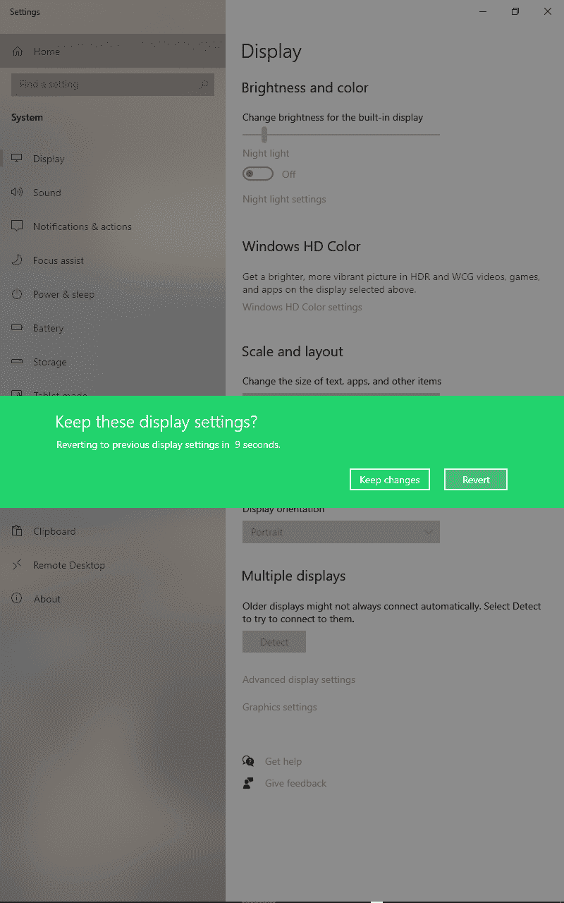
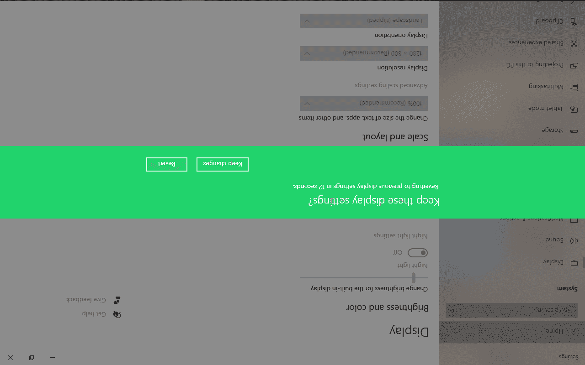
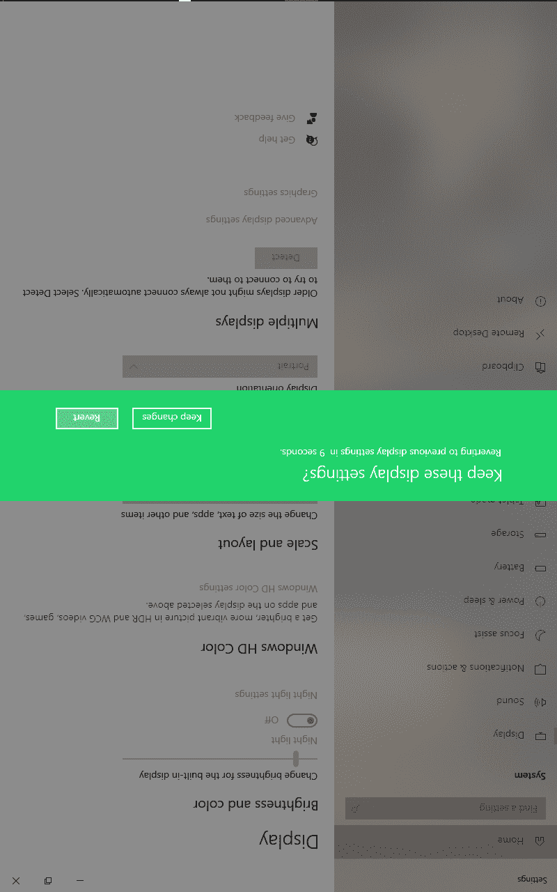

# 在 Windows 10 中旋转屏幕–如何将显示器方向翻转 90 度

> 原文：<https://www.freecodecamp.org/news/rotate-screen-in-windows-10-how-to-flip-your-monitor-orientation-90-degrees/>

Windows 10 有一个内置功能，可以让你像在智能手机上一样翻转或旋转显示器屏幕。

在本文中，我将向您展示如何翻转或旋转 Windows 10 机器的显示器，如横向、纵向和纵向。

## 你为什么想要翻转你的显示器屏幕？

嗯，你可能误按了键盘上的某个按键组合，现在你的电脑屏幕出现了翻转。

或者，如果您处理大量的信息图表，或者您是一名设计师，那么有时您可能希望以纵向和横向模式查看设计或其他项目。为此，你需要翻转你的电脑屏幕。

## 如何在 Windows 10 中翻转显示器方向

**第一步**:在 Windows 桌面空白处点击右键，选择显示设置:
T3

**第二步**:点击显示方向下拉菜单:

**第三步**:选择你想要的方向。可用的有横向(默认)、横向反转、纵向反转
T3

**第 4 步**:要保留您所做的更改，请点击“保留更改”按钮。要恢复到以前的方向，请单击“恢复”。

如果您没有单击这两个选项中的任何一个，方向将在 15 秒内恢复到之前的方向。

横向翻转后的屏幕如下:

人像长这样:

而反肖像看起来是这样的:

### 在 Windows 中翻转屏幕的快捷键

您也可以使用一些键盘快捷键来旋转显示器屏幕:

*   `CTRL` + `ALT` + `Up Arrow`为风景
*   `CTRL` + `ALT` + `Right Arrow`为人像
*   `CTRL` + `ALT` + `Down Arrow`为反风景
*   `CTRL` + `ALT` + `Left Arrow`用于反转人像

请记住，这些键盘快捷键在最新版本的 Windows 10 中已经被禁用。但它们应该仍然适用于以前的 Windows 版本。

## 结论

在本文中，您学习了如何翻转 Windows 10 显示器。如果你不小心误翻了屏幕方向，这将对你有所帮助，并让你随时改变方向。

感谢您的阅读，祝您玩得愉快。