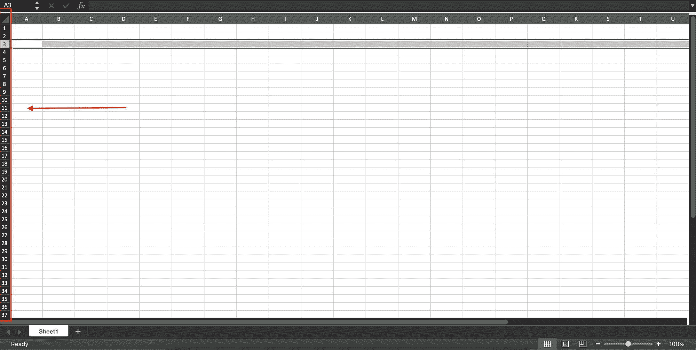
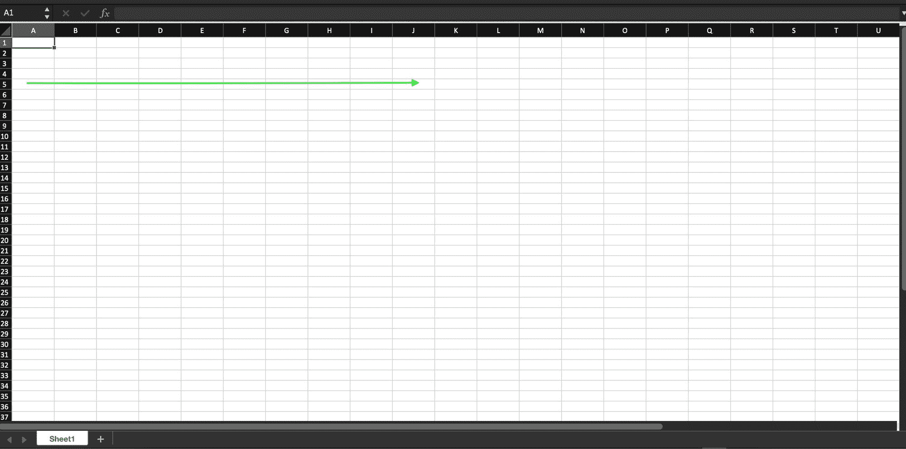
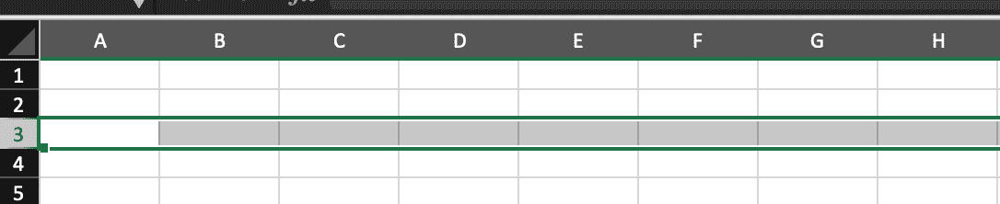
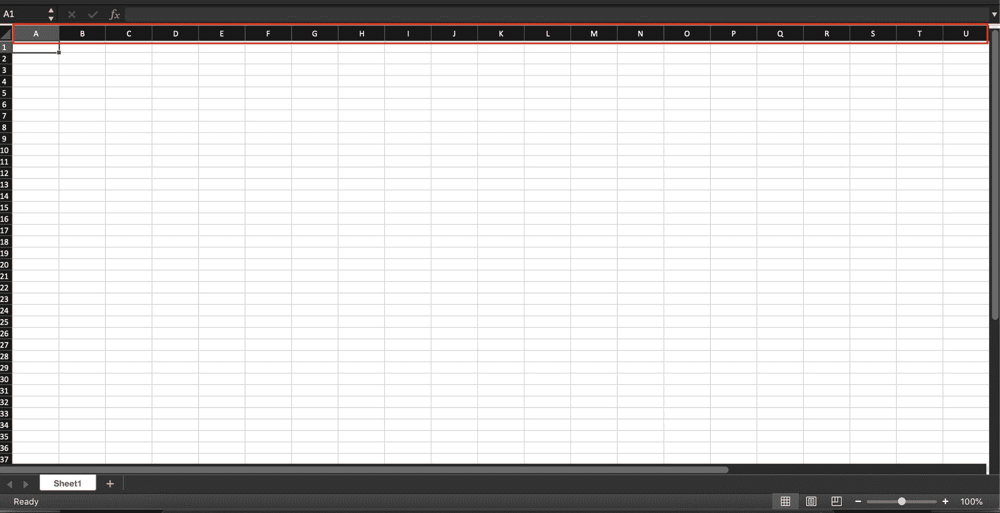
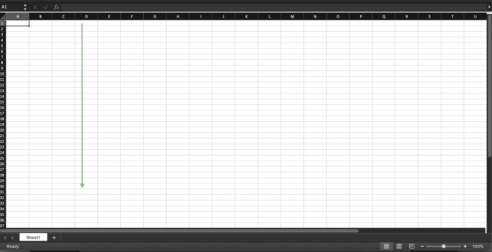
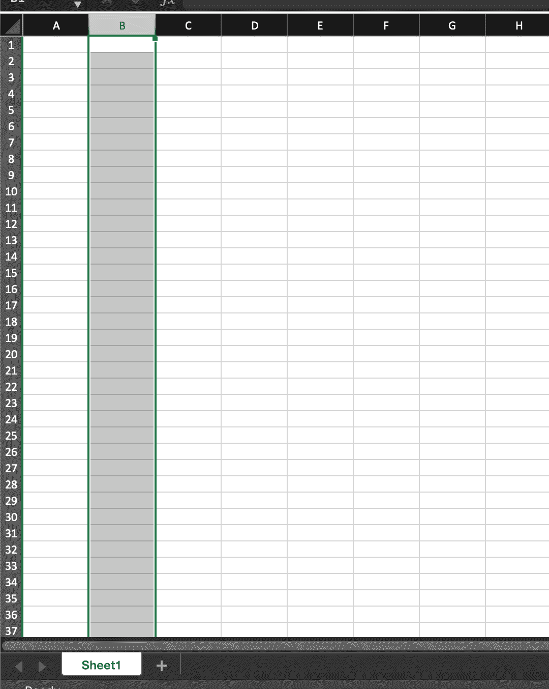
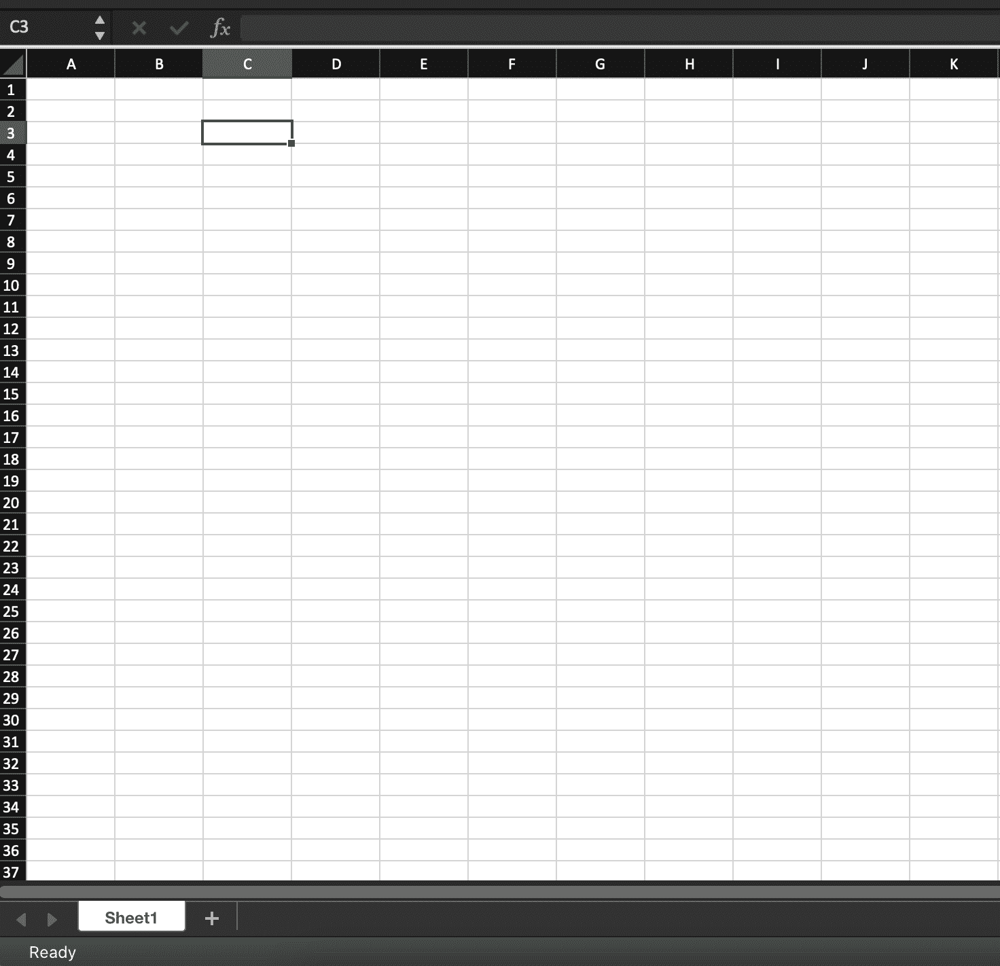

# Excel 中行和列的区别是什么？

> 原文：<https://www.freecodecamp.org/news/row-vs-column-in-excel-what-is-the-difference/>

微软 Excel 以*表格格式*显示数据。这意味着信息被安排在由行和列组成的表格中。

行和列是不同的属性，它们共同构成了一个表。

这是 Excel 允许用户存储和操作数据的两个最重要的功能。

下面我们将讨论行和列的定义，以及这两个特性之间的区别。

## Excel 中的行是什么？

每一行都由一个唯一的数值表示和标识，您将在左侧看到这个数值。

行号在工作表上垂直排列，范围从 1 到 1，048，576(在 Excel 中总共可以有 1，048，576 行)。

行本身在工作表上水平运行。

数据水平放置在表中，从左到右排列。

第 1 行是 Excel 中的第一行。

正如您在下面的示例中看到的，您可以通过单击数字 3 来选择整个行。

要浏览数字并到达最后一行，您可以使用:

*   对于 Windows 用户:`Control down navigation arrow`。您首先按下 Control 键，然后在按住它的同时，按下向下导航箭头。
*   对于 Mac 用户:`Command down navigation arrow`。您首先按下 Command 键，然后在按住它的同时按下向下导航箭头。

要再次返回第一行(顶部)，Windows 按`Control up navigation arrow`键，Mac 按`Command up navigation arrow`键。

## Excel 中的列是什么？

列由位于工作表顶部的唯一的字母标题字母表示和标识。

列标题的范围从 A-XFD，因为 Excel 电子表格总共可以有 16，384 列。

工作表中的列是垂直排列的，数据从上到下排列。

A 列是 Excel 中的第一列。

在下面的示例中，您可以看到通过按下/单击顶部的字母选择了标题为 B 的整列。

要移动到最后一列:

*   对于 Windows 用户:`Control right navigation arrow`。首先按下控制键，然后按住它，按下右导航箭头。
*   对于 Mac 用户:`Command right navigation arrow`。首先按下 Command 键，然后在按住它的同时按下右导航箭头。

要再次返回第一列，Windows 按`Control left navigation arrow`键，Mac 按`Command left navigation arrow`键。

## Excel 中的单元格是什么？

单元格是行和列的交集。相邻的行和列组成一个单元格。

您可以通过行号和列标题的组合来定义单元格。

例如，所选单元格下面是 C3。它有一个列标题 C 和一个行号 3。

我们也可以从一个单元格中选择一整行或一整列。

要在任何单元格中选择整行，请按`Shift Space`。

要在任何单元格中选择整列，请按`Ctrl Space`。

## 结论

现在你知道了 Excel 中行和列的定义。您已经了解了它们的主要区别和工作原理。

总之，行中的信息是水平显示的，而列中的信息是垂直显示的。

感谢阅读！