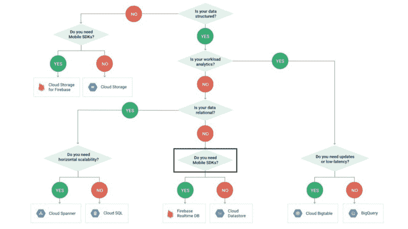
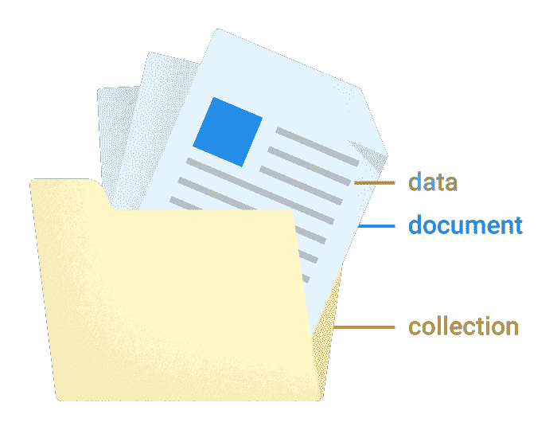
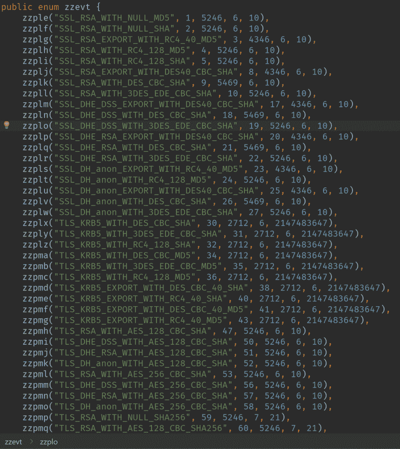

# 生存指南:如何从 Firebase 实时数据库迁移到云 Firestore

> 原文：<https://www.freecodecamp.org/news/rtdb-to-firestore-fd8da8149877/>

亚历克斯·萨沃

# 生存指南:如何从 Firebase 实时数据库迁移到云 Firestore

The long-awaited database revamp is here!

自从两年前谷歌新的移动 SDK 在 I/O 大会上宣布以来，Firebase 帝国一直在扩张。它现在支持越来越多的功能，如云功能、电话认证和性能监控。然而，一个没有太大变化的 SDK 是 Firebase 实时数据库(RTDB)。

RTDB 没有收到任何重大更新——并不是因为它是一个完美的 API。远非如此。如果你读过皮耶·博弗的经历，或者自己使用过 Firebase RTDB，这些问题可能听起来很熟悉:

> 无法正确查询您的数据[……]和愚蠢的数据建模。

那么下一步是什么？谷歌将如何解决这些限制？谷歌没有发布对每个人来说都是混乱和痛苦的 4.0 版本，而是利用它从 Firebase Realtime 数据库的故障中吸取的教训。他们完全从头开始重新设计和改写它成为一个新的数据库:云 Firestore。

RTDB 不会消失——那会导致一场巨大的危机。但展望未来，Cloud Firestore 将获得大部分关注和喜爱。

这篇文章将深入探讨谷歌期待已久的数据库改造，主要是从一个 Android RTDB 开发者的角度。此外，本文旨在取代花费大量时间编写文档来构建新 SDK 的心理模型。

### 背景

除非你最近才加入 Firebase 党，否则你可能听说过谷歌云平台(GCP)。除了 RTDB，所有其他 Firebase 服务器产品，如云功能和 Firebase 存储，通常都是现有 GCP 解决方案的重新命名，并添加了额外的功能和品牌。

然而，RTDB 是从谷歌之前的 Firebase 移植过来的。原来数据库其实以前是一个聊天服务。在公司转移重心后，他们才决定去掉 UI，把它变成 SDK。有了永无止境的聊天应用样本，你会觉得它们还是有点怀旧。

另一方面，Cloud Firestore 建立在 GCP 的 Google Cloud Datastore 之上，这是一个 NoSQL 数据库，具有近乎无限的可扩展性和强大的查询能力。Firebase 品牌的云数据存储增加了预期的实时功能，当然，还集成了其他 Firebase 服务，如身份验证和云功能。

Pre-Firestore flow chart. You now get the best of both Firebase and Datastore!

对于数据库爱好者来说，云数据存储是一个使用 ACID 事务的多区域、同步复制的数据库。这意味着，一旦谷歌说你的写被提交，一颗恐龙时代的流星可能会带走一个地区，而你的数据仍然会安然无恙，随时可以被查询。

现在我不是说我们人类会过得很好…但至少你的数据仍然坚如磐石！哦，它使用原子钟——如果这还不酷，我不知道什么才酷！

现在你已经基本了解了为什么 Google 决定创建一个全新的 Firebase 品牌数据库，以及它的来源，让我们开始吧！

在本文的其余部分，我将使用我构建的应用程序的例子(所以没有聊天应用程序的例子！？).具体来说，我将使用来自 R [obot Scouter、](https://github.com/SUPERCILEX/Robot-Scouter)的例子，这是一款帮助 F [IRST 机器人竞赛](https://www.firstinspires.org/robotics/frc)团队在比赛期间做出数据驱动决策的应用。

该应用程序的基本目的是允许用户以被称为**球探**的单位收集其他球队的数据。这些球探可以基于可定制的**模板** *。*侦察和模板由**指标**组成，这些指标是用户可以收集的不同类型的数据。模板是独立的对象，但是侦察兵是由团队隐式拥有的。

单个团队和模板可以与其他用户共享，但球探将跟随团队到任何地方，因为团队拥有它们。

### 数据结构

让我们先来看看 RTDB 的机器人侦察员数据结构是什么样子的。深呼吸，有很多东西需要浏览:

我们真正想要的是一个`teams`、`templates`和`users`系列。相反，我们必须对数据进行反规范化，以适应 RTDB 的深度默认查询。记住，如果我们用 RTDB 查询一个节点，我们还会得到所有的子节点。

现在让我们来看看等效的云 Firestore 数据结构:

云 Firestore 数据结构更容易理解，并且比 RTDB 结构短得多。这要归功于嵌套的引用，而不是被迫去规范化 RTDB 中的所有内容。

#### 数据结构差异

您将注意到的第一个主要区别是缺少反规格化。在 [Cloud Firestore 数据结构](https://firebase.google.com/docs/firestore/data-model)中，我们声明了我们的`teams` ref，并将每个团队直接放入该 ref 中，而不是将其展平。类似地，我们将`template-indices`直接合并到`templates` ref 中。

你可能也注意到了，我们的`scouts`现在被直接放在一个团队中，而不是在一个单独的索引 ref 中。你的第一反应可能是“等等，你会浪费所有用户的数据！不要这样！”这就是云 Firestore 的妙处:**查询默认是“浅层的”**。

我用引号将单词 **shallow** 括起来，因为从技术上讲，你可以在你的文档中嵌套大量的数据。但是我们稍后会讨论为什么不应该这样做。等等，什么是文件？云火商店有两个基本组成部分:**收藏**和**文档**。

Cloud Firestore’s fundamental building blocks

Firestore 中的集合相当于 RTDB 中的 ref，有一个巨大的子节点列表，每个子节点都包含对象。如果您向上滚动到 Firestore 数据结构，您会注意到`teams`、`templates`和`users`都是集合。它们每个都包含一大堆对象——在 Firestore 中，这些对象被称为文档。

文档将是 RTDB 中的常规对象节点。然而，在 Firestore 中，它们有一点特殊:文档明确归集合所有。在 RTDB，你可以把任何东西放在任何地方。Cloud Firestore 带来了一点理智，并使用了集合和文档的交替模式，看起来有点像这样:`collection1/document1/collection2/document2/...`。

虽然这种模式起初可能会感到受限制，但我发现它有助于迫使我设计一个组织整齐的数据结构。您会注意到我的`scouts`集合现在正确地驻留在一个团队文档中。我只需要在 RTDB 把它分开，这样我的用户在看一支球队的时候就不用下载他们所有的球探了。在 Cloud Firestore 中，团队拥有一组侦察兵的明确所有权，无需在加载团队时下载。

#### 关于文档的更多信息

在 RTDB 中，您有一个自由流动的模型，它有 3 种核心数据类型:布尔值、字符串和数字。列表和地图之类的东西要么是后来才想到的，要么只是在 RTDB 查询数据的一部分。

另一方面，有了 Firestore，你就有了一个非常清晰的结构:集合包含文档，文档包含字段和**链接**到一个或多个**子集合**。

子集合只是文档所拥有的另一个对象列表的一个花哨术语——只不过在查询文档时不会得到那个列表。这是因为文档在技术上不包含子集合。他们只是链接到他们。因此，我们可以将我们的`scouts`集合放在团队文档中——或者链接到它，如果你愿意的话。

除了包含子集合，Firestore 中的文档还支持[大量的数据类型](https://firebase.google.com/docs/firestore/manage-data/data-types),未来还会有更多。目前，以下是支持的类型:

*   布尔代数学体系的
*   线
*   数字
*   原始字节(如果那是你的风格？)
*   日期和时间
*   地理点
*   参考文献
*   阵列和地图
*   Null！

是的，`null`现在是云 Firestore 中明确定义的数据类型。如果您将一个文档设置为一个 getter 返回 null 的 Java 对象，那么该字段仍然会以`null`数据类型显示在 Firebase 控制台中。

好吧，那又怎样？添加`null`数据类型使得字段删除变得显式。在 RTDB 中，将某个东西设置为`null`等同于将其删除。但是在 Firestore 中，要删除一个字段，你必须将其值设置为`FieldValue.delete()`。同理，`ServerValue.TIMESTAMP`也变成了`FieldValue.serverTimestamp()`。

此外，`null`数据类型在某种程度上支持迁移。使用`DocumentSnapshot#contains(…)`方法，您可以检查一个字段是否存在，如果不存在就做一些事情。更好的策略是使用云函数，但这超出了本文的范围。

您会注意到文档仍然支持数组和映射，但是如果文档只能包含字段，那又如何呢？还记得我说过你可以在技术上嵌套你的数据吗？这是一个特例:Firestore 允许您在文档中存储显式定义的数组和映射，而不是创建一个子集合。

注意:Firestore 中的文档有几个[限制](https://firebase.google.com/docs/firestore/quotas)。具体来说，**有 1MB 的大小限制，每个文档最多 20，000 个属性，以及 500 层深度对象嵌套限制**。

属性不同于字段，因为它们考虑所有嵌套字段，而不仅仅是传统的根级别字段。此外，在撰写本文时，更新大型数组或映射会重写整个数组/映射，对大型数据结构的性能会非常糟糕。请改用子集合！

因为谷歌喜欢给事物重新命名，来自 RTDB 的文档“密钥”现在被称为**id**。一个集合或文档的最后一个路径段被称为 id，意味着`teams/teamId1`是 id 为`teams`的集合下的 id 为`teamId1`的文档。没有什么太突破性的东西，但是在术语上保持一致总是好的。

最后，由于文档是 Firestore 的基本构件之一，所以您只能获得完整的文档。这与 RTDB 不同，在那里您可以根据需要查询特定的字段。

### 存储和检索数据

现在你已经对 Firestore 的两个基本组成部分——收藏和文档——有了基本的了解，是时候看看我们如何存储和获取我们的数据了。

云 Firestore API surface 是对 RTDB 的巨大改进。所以你不太可能找到任何简单移植的方法(尽管有些看起来很熟悉)。

#### 存储数据

您将从 RTDB 中注意到的第一个区别是创建和更新数据的方式有点混乱和分散。别担心，一会儿就会明白了。

与我们的宠物不同，这里没有零散的文件——它们必须都生活在一个收藏中。这意味着我们有两个地方可以添加数据:一个添加文档的集合，一个添加、更新或删除字段的文档。

让我们先来看看添加数据的最简单的方法，通过集合:

我们说在`teams`集合中，我们想要添加一个包含来自`Team` POJO 的所有字段的文档。

现在让我们来看一个更有趣的例子，我们改变文档数据:

首先要注意的是我们的`scoutRef`:它在我们的 scouts 集合中创建了一个 scout，该集合又存在于一个 team 文档中。作为一个 URL，它应该是这样的:`teams/teamId/scouts/newScoutId`。

`document()`方法返回一个带有随机 id 的新的`DocumentReference`。从不再基于时间戳的意义上来说，这是一个真正的**随机 id。**

熟悉 RTDB 的人都知道，`push()`方法使用时间戳为本地时间排序创建一个伪随机键。由于 Cloud Firestore 的目标是远离面向聊天的数据库，因此使用时态排序作为默认机制对他们来说没有意义。

因此，这意味着您必须在相关时手动添加一个`timestamp`字段。理论上，您可以使用时间戳作为排序的文档 id，但是这降低了灵活性。

`DocumentReference`包含了大量不同的设置和更新数据的方法，从使用地图和 POJOs 到提供 varargs。每个人都有一片馅饼！我将把重点放在 POJO 和特定的字段更新方法上，因为我发现这些方法是最有用的。

您会注意到的第一个方法可能是最常用的方法是`set(Object)`。这一个相当简单:它的行为与 Java 的`Map#set(key, value)` 方法完全一样。如果没有文档存在，它将创建一个新的。否则，如果文档存在，它将被覆盖。

不过 Google 也为`[SetOptions](https://firebase.google.com/docs/firestore/reference/android/SetOptions)`提供了各种合并组合，只覆盖部分字段。例如，我发现这在更新用户资料时很有用。我将设置/更新他们的`name`、`email`和`photoUrl`，但不会设置/更新`lastLogin`字段，因为它不是我的`User` POJO 的一部分。

如果您想在执行更新之前确保文档存在，那么`update(String, Object, Object…)`方法将是合适的工具。在这种情况下，我们用一个新值更新一个特定的字段。如果在调用 update 方法之前文档不存在，更新将失败。如果您愿意，还可以通过在 varargs 中交替使用键/值对来一次更新多个字段。(我个人更喜欢在一个`WriteBatch`中使用多个更新，我将在后面讨论。)

如果您想更新对象中的嵌套字段，该怎么办？对于这个用例，Google 提供了`FieldPath#of(String…)`方法。varargs 数组中的每一项都可以让您更深入地了解嵌套字段的路径——从技术上讲是一个对象。例如，`FieldPath.of("rootField", "child")`更新以下字段:`myDocument/rootField/child`。

类似地，Firestore 还支持点符号语法，它允许您像这样引用同一个字段:`rootField.child`。

Cloud Firestore 还包含了一个用`WriteBatch`类进行批量写入的可怕的新方法。它与你在 Android 上找到的`SharedPreferences.Editor`非常相似。您可以在`WriteBatch`实例中添加或更新文档，但是在您调用`WriteBatch#commit()`之前，它们对您的应用程序不可见。我已经创建了标准的 Kotlin 改进，为您管理批次生命周期——请随意复制 pasta。

管理数据时要注意的最后一个重要的 API 变化是如何删除数据。Cloud Firestore 有一种删除文档的方法，但没有删除整个集合的简单方法。谷歌提供了一个[代码样本，其中有关于如何删除集合中所有文档的文档](https://firebase.google.com/docs/firestore/manage-data/delete-data#collections)，但是他们还没有把它放进 SDK 中。这是因为当试图删除隐藏在各种子集合中的数千甚至数百万个文档时，这种方法在极端条件下很容易失败。但是谷歌说他们正在努力。

此外，他们的示例也不删除子集合——只删除集合下的文档。谷歌在 Android 上也没有解决这个问题的明确方案。尽管如此，他们还是提供了一个 CLI/NodeJS API 作为`firebase-tools`的一部分，你可以用它来手动或从云函数中删除所有子集合。

在我的例子中，我不让用户创建随机的集合名称，这样我就可以通过获取他们的父文档 id 来删除我的所有子集合。

我在 Kotlin 中用更多的功能和更简洁的 API 重写了他们的示例:

咻，我们已经涵盖了您需要了解的关于存储数据的几乎所有内容！

#### 检索数据

首先要注意的是，我使用单词**来检索**而不是阅读。这是因为 Firestore 提供了两种非常明确的检索数据的方式:要么通过单次读取(又名 **get** ，要么通过一系列读取(又名**快照监听器**)。

#### 获取数据

让我们从探索一次读取数据的方法开始。在 RTDB，你有`addListenerForSingleValueEvent()`方法，但它充满了错误和边缘情况。我认为谷歌员工弗兰克·范·普夫伦对此做了最好的总结:

> 解决这个问题的最好方法是不要使用单值侦听器。

是啊。当你告诉你自己的用户不要使用你正在销售的产品时，肯定会有问题。

Cloud Firestore 通过更好、更直观的 API 彻底改进了整个数据检索体验。

首先，关于离线功能的说明。RTDB 没有被设计成离线的第一个数据库——离线功能更多的是事后的想法，因为数据库是从 Google Firebase 之前移植过来的。另一方面，Cloud Firestore 并不完全是离线的第一数据库，因为它也被设计成实时的。但我认为它的离线功能和实时功能一样是一流的。

鉴于这些改进，离线支持在默认情况下是启用的(除了 web)，并且数据使用 Android 的原生 API 存储在 SQLite 数据库中。我不知道你怎么想，但我觉得有点讽刺的是，NoSQL 数据库需要 SQL 数据库才能工作。

出于好奇，Firestore 的 SQL 数据库被命名为`firestore.$firebaseAppName.$projectId.(default)`。此外，他们使用`PRAGMA locking_mode = EXCLUSIVE`来锁定它，以提高性能并防止多进程访问。如果你真的很好奇，下面是我到目前为止找到的表和查询:

我做了更多的调查，发现了一些其他的东西。例如，GRCP devs [非常喜欢 enum](https://github.com/grpc/grpc-java/blob/16c07ba434787f68e256fc50cece1425f421b03e/okhttp/third_party/okhttp/java/io/grpc/okhttp/internal/CipherSuite.java#L36-L357)。你知道他们说什么，“如果某事对你有害，那就多做些！”

There are 95 enums in here — that must be some kind of record!

先不说这个，让我们来探索我们的第一个方法:`DocumentReference#get()`。这是检索数据的最简单和最基本的方法:它用几个显著的改进取代了 RTBD 的`addListenerForSingleValueEvent()`方法。

首先，它返回一个`Task<DocumentSnapsh` ot >。这比使用与来自 RTDB 的快照侦听器相同的事件模型 API 更有意义。现在，您可以使用 Play Services 的所有 l `ovel` y 任务 API 来添加您的成功和失败监听器。如果需要，您甚至可以将它们附加到活动生命周期中。

第二，离线支持在使用`get()`的时候其实是有意义的。如果设备在线，您将直接从服务器获取最新的数据副本。如果设备离线并有缓存数据，你会立即得到缓存。最后，如果没有缓存的数据，您将立即得到一个错误代码为`FirebaseFirestoreException.Code#UNAVAILABLE`的失败事件。TLDR:你将获得设备当前网络状态下可以检索到的最新数据。

我将很快深入到查询中，但是现在，我将只提到返回一个`Task<QuerySnapsh`或>的`Query#get()`方法也具有与上述相同的行为。

在其他值得注意的新闻中，`Query#getRef()`方法被移除，以支持查询不依赖于`CollectionReference`的可能未来。就像在 RTDB 中一样，`CollectionReference`扩展了`Query`来支持轻松启动查询。但是在 RTDB，你可以在查询和引用之间来回跳转。Firestore 不再是这种情况。我发现这有点不方便，但没什么大不了的。

#### 监听数据

当然，这是 fire base——所以我们也想要我们的实时能力。用于查询的 API 界面也进行了彻底的修改，变得更加干净和清晰。

让我们从如何获取集合中的所有文档开始。

你还记得 RTDB 的`addValueEventListener()`和`addChildEventListener()`的区别吗？你有没有希望你能同时拥有两个世界？我也是。谢天谢地，这正是 Google 在 Cloud Firestore 上所做的:你将在一个单一的回调中获得整个文档列表**和**一个变更列表**和**可能的例外。

我不确定我是否喜欢组合的数据/异常模型，但是它在一个有函数接口的 Java 8 世界中是有意义的。例如，这里有一个漂亮的 lambdazed 回调:

让我们从错误案例开始，因为这是所有优秀的开发人员应该首先考虑的，对吗？？

`FirebaseFirestoreException`与 RTDB 相比相对简单。第一，其实是个例外！怎么了？一个实际上扩展了`Exception`的错误——谁能想到！？这使得崩溃报告非常简单:只需报告异常，包括[错误代码](https://firebase.google.com/docs/firestore/reference/android/FirebaseFirestoreException.Code)和一切。它看起来会像这样漂亮:

exception com . Google . firebase . firestore . firebase firestore exception:PERMISSION _ DENIED:缺少权限或权限不足。

先不说这个，让我们来看看令人兴奋的东西。它包含了[文档变更](https://firebase.google.com/docs/firestore/reference/android/DocumentChange)、[文档的完整列表](https://firebase.google.com/docs/firestore/reference/android/DocumentSnapshot)，以及其他一些数据，稍后我会详细介绍。

我已经提供了所有相关类的链接，因为我将跳过那些支持使用 FirebaseUI 的类。当我们把所有东西放在一起的时候，我会深入探讨这个问题。

作为一个快速总结，您可以区分不同的更新类型，在 pretty Java 5 for 循环中迭代`QuerySnapshot`以获得每个`DocumentSnapshot`，将整个列表转换为一堆 POJO(出于性能原因不推荐，稍后将讨论)，并将单个文档转换为 POJO 或访问特定的字段信息。因此，基本上你对一个好的 API 所期望的一切。

然而，我确实想探索一下听众注册和`QueryListenOptions`——一种获取你离线状态信息的新方法。

通过代码示例，这两个概念会更容易理解，所以这里不再赘述:

这种方法的基本思想是等待，直到直接从服务器接收到数据。

首先要注意的是听众注册——这有点痛苦。我花了一些时间思考这个问题，我得出的结论是，谷歌做出了正确的选择。把你推向正确的方向是很痛苦的。

好吧，我们倒回去一点。在 RTDB 中，您习惯于直接从查询类中删除侦听器回调实例。这是一个很好的 API，但是它会让你做一些可怕的事情，比如意外泄露你的`Context` s。新的 API 返回一个`ListenerRegistration`，它的唯一方法是`remove()`——非常简单明了。

这种新的侦听器注册方法迫使您重新考虑检索数据的方法。下面是选择使用哪种 API 的简单指南:

1.  如果您的数据没有显示给用户，您可能应该使用一个`get()`方法，该方法在内部使用相同的监听器注册机制，如上所示。(谷歌对你的煎熬？)
2.  如果您的数据绑定到 UI，您应该使用`addSnapshotListener(Activity, ...)`变体，它通过在`Activity#onStop()`中取消注册来自动管理您的生命周期。
3.  如果您的数据依赖于一个类似于`RecyclerView`的列表，请耐心等待——稍后我将详细介绍经过大幅改进的 FirebaseUI 库，它将自动为您处理几乎所有事情。
4.  如果你不属于上述类别，那么你应该考虑使用 FirebaseUI(再次！)我稍后会详细说明(再次！).否则，就移开你的视线。？

好吧，所以监听器注册 API 是痛苦的，但故意这样来轻推你选择正确的工具。

现在我们来看看`QueryListenOptions`。还记得我说过 Cloud Firestore 认为离线支持是一等公民吗？这是他们解决开发人员在使用 RTDB 时遇到的最后一个棘手问题的地方。他们仍然没有提供自定义数据缓存方式的方法，但我个人认为这种自定义没有任何价值:API 应该足够智能，可以为我管理这些东西 Firestore 就是这样。

您将在 listen 选项中找到的第一个方法称为`includeQueryMetadataChanges()`，第二个方法称为`includeDocumentMetadataChanges()`。这两个分别与`SnapshotMetadata`的`isFromCache()`和`hasPendingWrites()`绑定。

对于给定的`QuerySnapshot`，`isFromCache()`对于每个`DocumentSnapshot`的元数据和查询本身的元数据将具有相同的值。这意味着您可以从`QuerySnapshot`或`DocumentSnapshot`的服务器上了解您的数据是否是最新的，这并不重要。整个查询要么被认为是最新的，要么不是——不存在 API 让您相信的中间状态。理论上，如果另一个活跃的侦听器将您的一个文档包含在其结果中，那么该文档实际上可能是最新的，但是 Google 选择了简单性，没有在 API 中显示该信息。

另一方面，`hasPendingWrites()`对于每个`DocumentSnapshot`可以具有不同的值。这是您所期望的，没有任何特殊的边缘情况或技巧。

总结一下:

*   如果您想知道服务器上的查询及其所有文档是否是最新的，请使用`includeQueryMetadataChanges()`。
*   如果您想了解待写状态下每个文档的变化，请使用`includeDocumentMetadataChanges()`。

在我继续之前，最后一个花絮:所有的`addSnapshotListener`方法在`DocumentReference`中也是重复的，所以如果需要的话，您可以只获得单个文档的更新。

#### 查询数据

啊啊啊啊……三千多字之后，我们终于进入了云火店的肉。

我没有任何统计数据来支持这种说法，但我认为，到目前为止，对 RTDB 最大的抱怨是缺乏适当的查询能力。这是皮尔·博弗文章中的另一段引文:

> 真的吗？谷歌提供的数据服务没有搜索或过滤功能？是啊。真的。

由于 Cloud Firestore 由 GCP 的云数据存储支持，因此查询是头等大事。

让我们回到我们新的和改进的数据结构。但是为了让你不要急于向上滚动一分钟，这里转贴一下:

既然我们有一个无限的团队列表，那么我们如何获得特定用户的团队呢？在 RTDB 中，我们将按照类似于下面的模式存储数据:`teams/uid1/teamKey1`。使用 Cloud Firestore，我们翻转用户 id 和团队 id，使模式看起来更像这样:`teams/teamKey1/owners/uid1`。

现在我们可以像这样查询用户的团队:

我们告诉 Firestore 在`teams`集合下的所有文档中查找 id `uid`等于`true`的文档的`owners`字段。

不幸的是，这个方法不支持排序。因此，我们将编写以下查询:

这个查询的优点是支持排序，但是它也带来了与 RTDB 类似的问题:更新那些排序值将是一件痛苦的事情。

在我的例子中，排序值总是静态的:它们要么是团队编号，要么是文档创建时间戳。因为我永远不会更新那些排序值，所以这个查询非常适合我。

另一方面，您可能有不同的约束——记住，我需要我的数据以一种支持跨用户轻松共享团队和模板的方式进行组织。如果这不是你的情况，你应该看看谷歌的[建议结构](https://firebase.google.com/docs/firestore/manage-data/structure-data)和他们对常见问题的[解决方案](https://firebase.google.com/docs/firestore/solutions/)。

因为您编写的查询将取决于您的应用程序的特定约束，所以我不打算过多地探究它们。但是我会指出云 Firestore 支持[复合查询](https://firebase.google.com/docs/firestore/query-data/queries)。

在我继续之前，RTDB 的最后一个值得注意的变化是:优先权不再是一件事了。由于 Firestore 正确地支持订购和查询，他们选择从 Firestore 文档中删除您可以在 RTDB 中找到的`.priority`字段。

然而，如果出于某种原因，您仍然希望通过 id 来排序您的文档，Firestore 提供了`FieldPath#documentId()`方法来实现这一目的。

### 安全规则

在我看来，Firestore 的安全规则已经变得有点糟糕了。然而，对于那些熟悉 Firebase 存储的人来说，您会有宾至如归的感觉。谷歌已经将其数据库规则技术与 GCP 其他地方合并。

另一方面，对于那些来自 RTDB 的 JSON 世界的人来说，Firestore 的新规则语法有点令人费解。如果您在 CI 构建中部署规则，您必须在 Firebase 控制台中编辑它们，然后将规则复制到本地编辑器，或者在 txt 文件中编辑它们。恶心。

下面是一组最简单的规则:

谷歌实际上有非常好的关于安全规则的文档——我个人已经能够通过阅读这些文档来解决我几乎所有的问题。我仍然会从 RTDB 开发者的角度看一些问题(假设你至少浏览了文档)。

首先，`read`关键字是`get`和`list`的数组，`write`关键字是`create`、`update`和`delete`的数组。除了`list`，每个关键字都是不言自明的——它适用于查询，意味着**而不是**一个单独的“get”这些关键字中的每一个都可以单独使用，但是`read`和`write`是为了方便起见而提供的。

与此相关的一点是，你通常会把你的`write`关键词分开来删除。例如，如果用户试图删除有问题的数据，使用`request`对象检查写有效性就会失败。此外，如果您正在检查某人是否是所有者，您已经引入了一个安全缺陷。任何人都可以添加自己，因为检查的是新数据而不是旧数据。

下面是一些将这些词编入代码的规则示例:

从 RTDB 开发者的角度来看，还有另一个主要区别:默认情况下，规则评估是肤浅的。这与(子)收集模型配合得很好，但是需要心态上的小小转变。

例如，`request`变量不包含关于其父文档的信息。首先，我想检查子集合中的文档，看父文档是否有字段。但是这当然是行不通的，因为子集合只是父文档内部的一个链接。

因为规则很浅，所以在使用双星操作符(`variable=**`)时必须小心，因为它的资源不会包含父文档信息。此外，这个变量还有些古怪:

### FirebaseUI

现在，您已经完全了解了 Cloud Firestore 的功能以及它与 RTDB 的区别和改进，让我们看看如何将所有这些放在一起构建一些 UI。

[FirebaseUI](https://github.com/firebase/FirebaseUI-Android) 由几个组件组成，包括 [auth](https://github.com/firebase/FirebaseUI-Android/blob/master/auth/README.md) 和 [storage](https://github.com/firebase/FirebaseUI-Android/blob/master/storage/README.md) ，但是我们将把重点放在 [firestore](https://github.com/firebase/FirebaseUI-Android/blob/master/firestore/README.md) 模块上。

在查询部分，我多次提到 FirebaseUI 可以帮助我们。我们将从如何改进`QuerySnapshot`的`toObjects()`方法开始。

使用`toObjects()`方法有两个主要问题:

1.  性能会很差，尤其是大列表。每当你的`EventListener`收到更新时，Firestore 将使用反射一次重新创建每个对象——无论是否改变。哎哟。
2.  没有可用的定制。例如，我喜欢我的模型对象有一个`ref`字段，这样我以后可以很容易地更新它们。然而，我并不想将 ref 存储在数据库中，因为那只是无意义的重复。

虽然您可能会想，“好吧，我只需创建一个列表，并在新对象进来时更新它，”FirebaseUI 确实为您做到了这一点，因此您不必编写样板代码。

`FirestoreArray`——顾名思义——是一组从 Firestore 转换成 POJO 模型对象的快照。它的构造者接受一个 Firestore `Query`，一个`SnapshotParser<`；T >，以及可选的查询选项。每当您添加一个或 `more ChangeEventLi`监听器时，它就开始监听数据，并在移除最后一个监听器时自动停止监听。

当每个对象改变时，当整个更新被处理时，以及当任何错误发生时，`ChangeEventListener`将通知您。`SnapshotParser<`；T >有一个单独的 met`hod — parseSn`APS shot——它负责将 `each DocumentSn`APS shot 转换成你的t 型的模型 POJO

由于`FirestoreArray`实现了`List<`；T >，这个设置可以让你轻松地监听模型对象的更新。

在性能方面，`FirestoreArray`使用 Android 的原生`LruCache`按需惰性解析对象。目前，我们已经将最大缓存大小设置为`100`，但是如果你觉得你需要更大(或更小)的缓存大小，我们很想知道你在 [GitHub 问题](https://github.com/firebase/FirebaseUI-Android/issues/new)中的使用案例。

由于这是 Firebase **UI** ，我们让你轻松地将`FirestoreArray`映射到带有`FirestoreRecyclerAdapter`及其`FirestoreRecyclerOptions`的`RecyclerView`。

有几个有趣的回收器选项，特别是传入 Android 架构组件`LifecyleOwner`的能力，通过它我们将自动为您管理`FirestoreArray`的生命周期。

好吧，说了很多话。下面是将所有架构组件放在一起并考虑授权状态时的样子:

### 其他花絮

对于网络开发者来说，Firestore 提供了完整的离线支持，不像 RTDB 什么都没有？没错。作为所有移动平台的一等公民，为离线支持干杯！

此外，如果你想了解从 RTDB 迁移到云 Firestore 的额外信息，比如如何在过渡期间保持数据同步，你可以在这里找到文档。

### 包裹

我希望你喜欢这次对 Firebase 新数据库的深入研究，并准备好开始迁移你的应用程序。随时问我任何问题或澄清！如果你觉得这篇文章有帮助，不要犹豫，给我一些掌声？。

如果你喜欢抨击 RTDB 的言论，这里是最后一条让你享受观赏乐趣的言论:

> 人们已经让[RTDB]为 prod 应用程序工作，但他们是在把方钉塞进圆孔。埃里克·克里斯基

哎哟，好烫！虽然 RTDB 可能是一场无法控制的野火，但云 Firestore 是一种非常强大的火焰，你可以有目的地挥舞它来构建更好的应用程序！

[**云 Firestore | Firebase**](https://firebase.google.com/docs/firestore/)
[*使用我们灵活、可扩展的 NoSQL 云数据库来存储和同步客户端和服务器端开发的数据。*firebase.google.com](https://firebase.google.com/docs/firestore/)