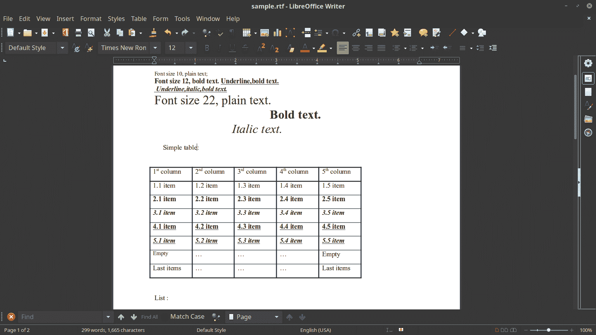
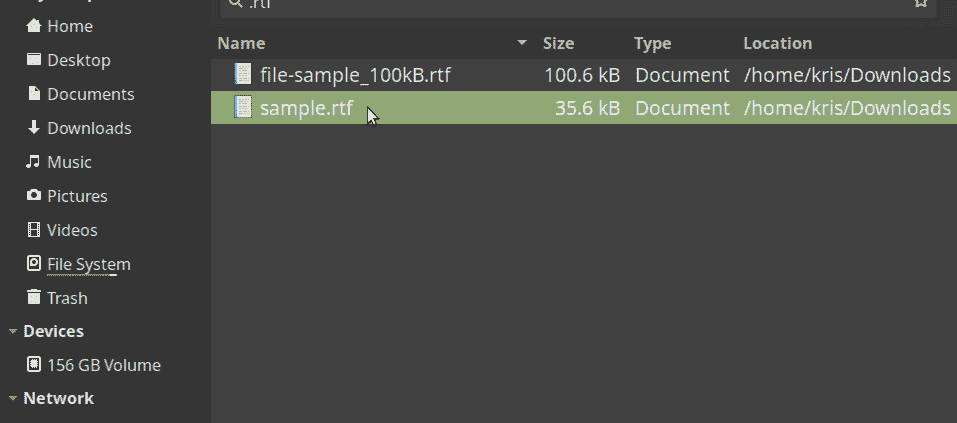
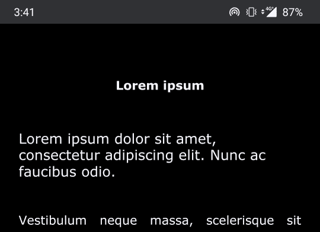
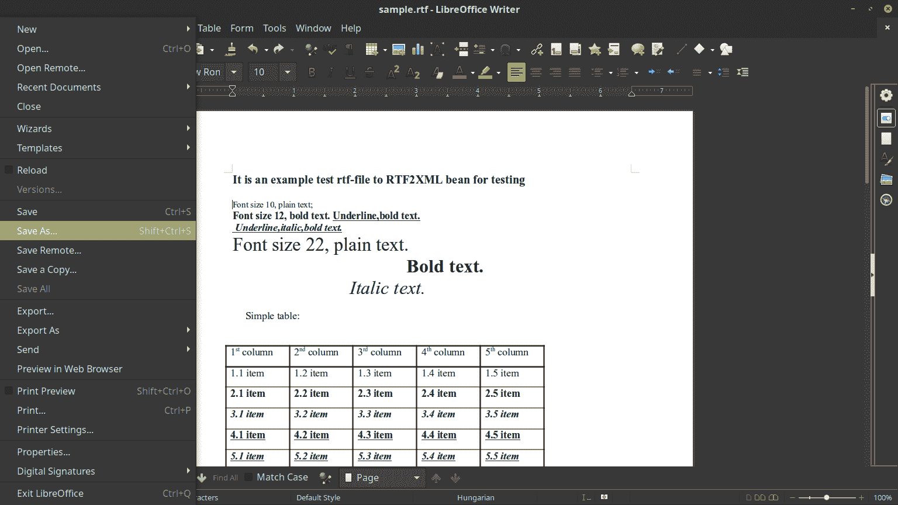
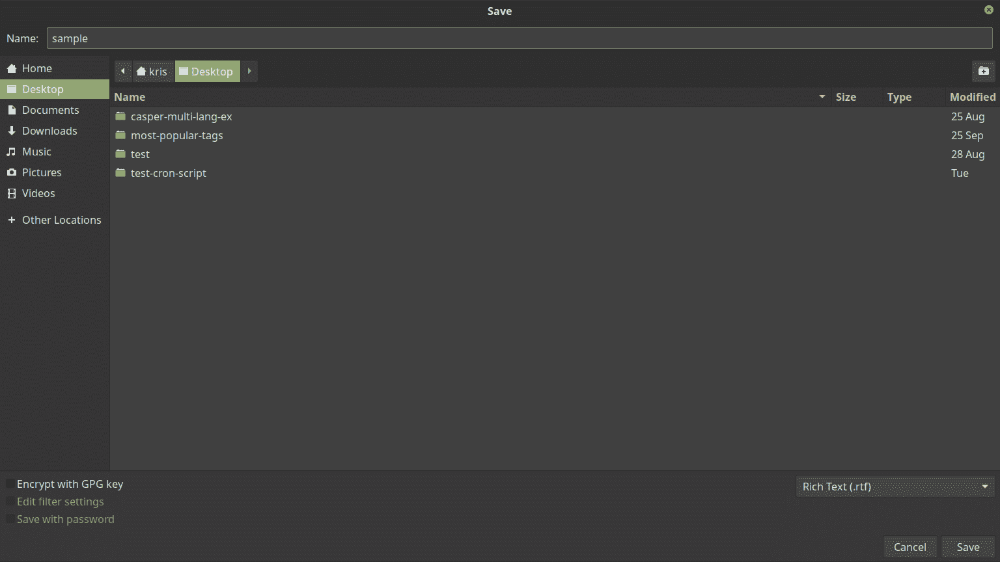
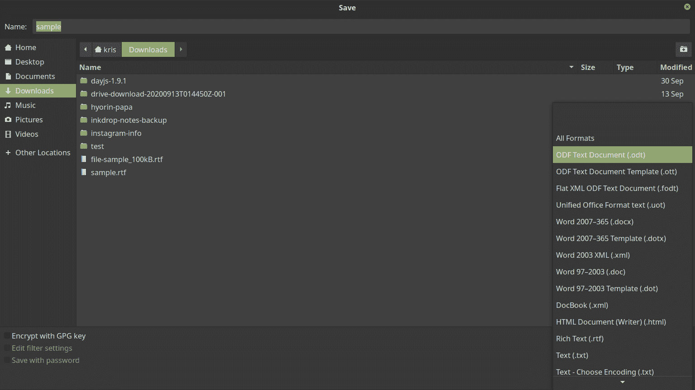

# RTF 文件:什么是富文本格式？

> 原文：<https://www.freecodecamp.org/news/rtf-file-what-is-the-rich-text-format/>

您可能会遇到一两个扩展名为`.rtf`的文件。如果你曾经想知道那是什么样的文件，甚至想知道你是如何打开它的，你并不孤单。

在本文中，我们将介绍什么是 RTF 文件，以及如何打开、编辑和转换成您可能更熟悉的不同格式。

## RTF 格式是什么？

RTF 代表富文本格式，由微软于 1987 年首次开发。

开发 RTF 格式的初衷是为了无论您使用什么文字处理器或操作系统，都可以更轻松地处理文本文档。

虽然微软早在 2008 年就停止维护这种格式，但它被广泛采用。如今，大多数现代操作系统都有某种打开 RTF 文件的方式。

## 如何打开和编辑 RTF 文件

要打开一个富文本格式文件，如果你在桌面上，首先尝试双击它，如果在移动设备上，则尝试轻按它。

### 桌面和在线文字处理器

大多数桌面操作系统都带有能够打开 RTF 文件的软件，比如 Windows 上的写字板或 macOS 上的文本编辑。

许多 Linux 发行版都包括一个像 LibreOffice 这样的办公套件，可以打开 RTF 文件。如果你的没有，你可以通过命令行安装或者直接去[https://www.libreoffice.org/](https://www.libreoffice.org/)下载软件包。

此外，大多数在线文字处理器可以打开 RTF 文件。Google Docs、Dropbox Paper 和 Office Online 是最流行的在线文字处理软件，它们都能打开扩展名为`.rtf`的文件。

使用上述方法之一打开 RTF 文件后，您可以像编辑任何其他文本文件一样编辑该文件:

Sample RTF file open in LibreOffice Writer on Linux

### 如何用不同的程序打开 RTF 文件

如果你想打开一个不同的程序，只需右击该文件，悬停在“打开方式”上。然后，只需选择您想要用来打开文件的程序:

Opening an RTF file with a different program in Linux Mint

注:根据您的操作系统，此过程可能略有不同。

### 移动文字处理器

移动设备开箱打开 RTF 文件可能会有一点麻烦。尽管如此，Android 和 iOS 都有许多选项，如谷歌文档或 WPS Office。

一旦你找到一个你熟悉的移动文字处理器，它很有可能可以打开和编辑 RTF 文件。

Sample RTF file open in Google Docs on Android

## 如何将 RTF 文件转换成不同的格式

转换 RTF 文件的具体方法取决于您用来打开它的软件。不过，不管你用什么文字处理软件，这个过程通常是相似的。

以下是如何在 LibreOffice Writer 中将 RTF 文件转换成不同的格式。

### 第一步:选择“另存为”

如上所述在 LibreOffice Writer 中打开文件，单击“文件”，然后选择“另存为...”从下拉列表中:

"Save As..." in LibreOffice Writer

### 第二步:选择一个地点

在“保存”弹出菜单中，选择保存新文件的位置。

如果您愿意，也可以借此机会将文件重命名为新名称:

The "Save" popup menu in LibreOffice Writer

我选择把文件保存到我的桌面上，但是你可以随意把它保存到你喜欢的任何地方。

注:根据您的操作系统，此菜单可能会有所不同。

### 步骤 3:选择新的文件格式

现在有趣的部分——选择保存文件的不同格式。

打开右下角的下拉菜单，选择另一种格式:

The file format dropdown menu in LibreOffice Writer

之后，点击保存“保存”即可。不同格式的新文件将位于您指定的位置。更好的是，您的原始 RTF 文件将仍然在您打开它的地方，完全不变。

现在你需要做的就是打开你的新文件并继续编辑它。

但是请记住，并不是每个文件格式都像 RTF 一样通用。如果您与他人共享您的新文件，但他们无法打开它，您可能需要将其转换为其他文件。

尽管如此，既然您已经知道了这个过程，那么将您的文件转换成您和其他任何人都可以使用的格式应该很容易。