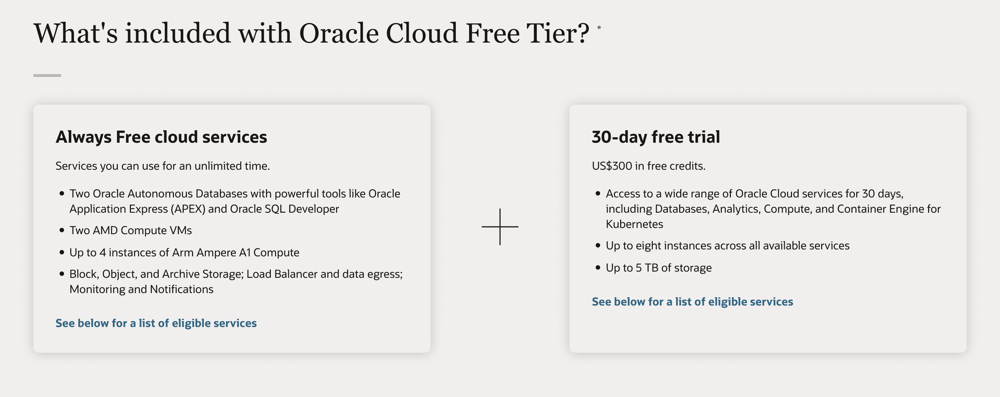
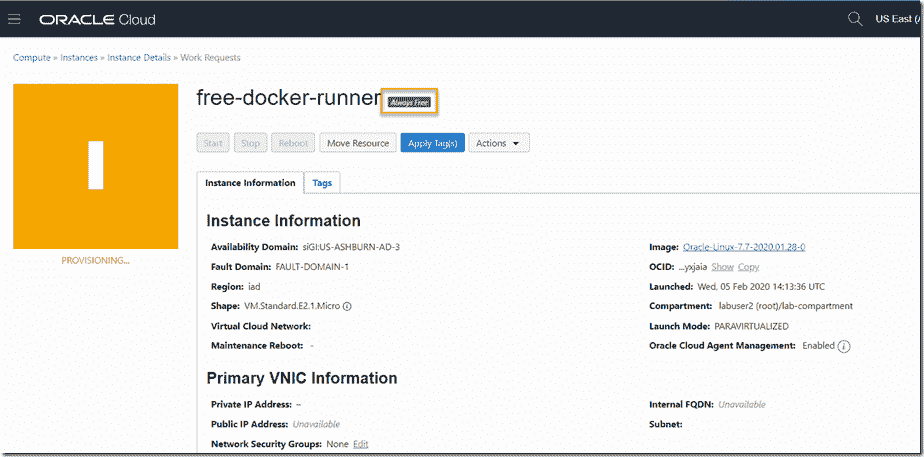
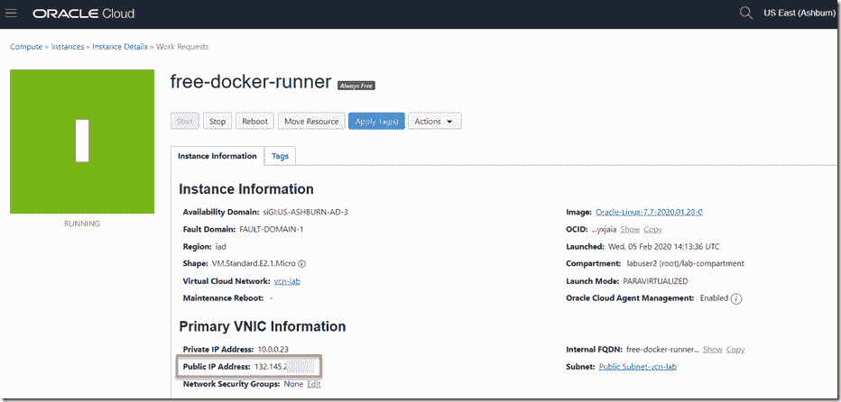
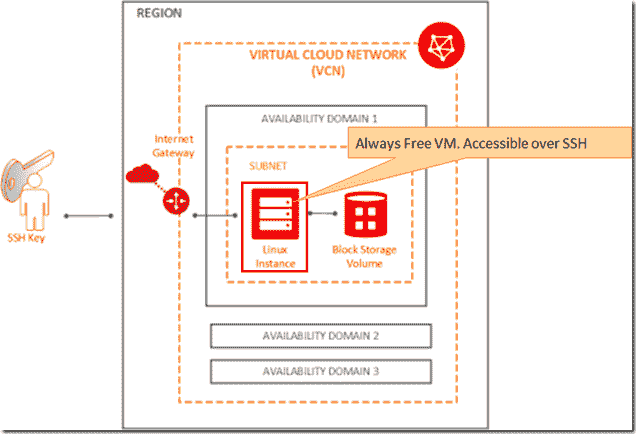
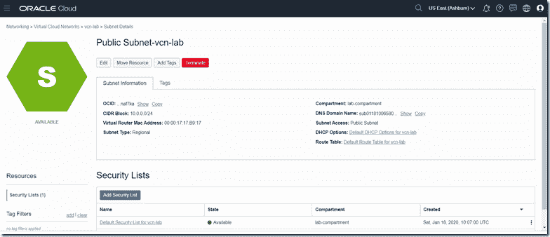
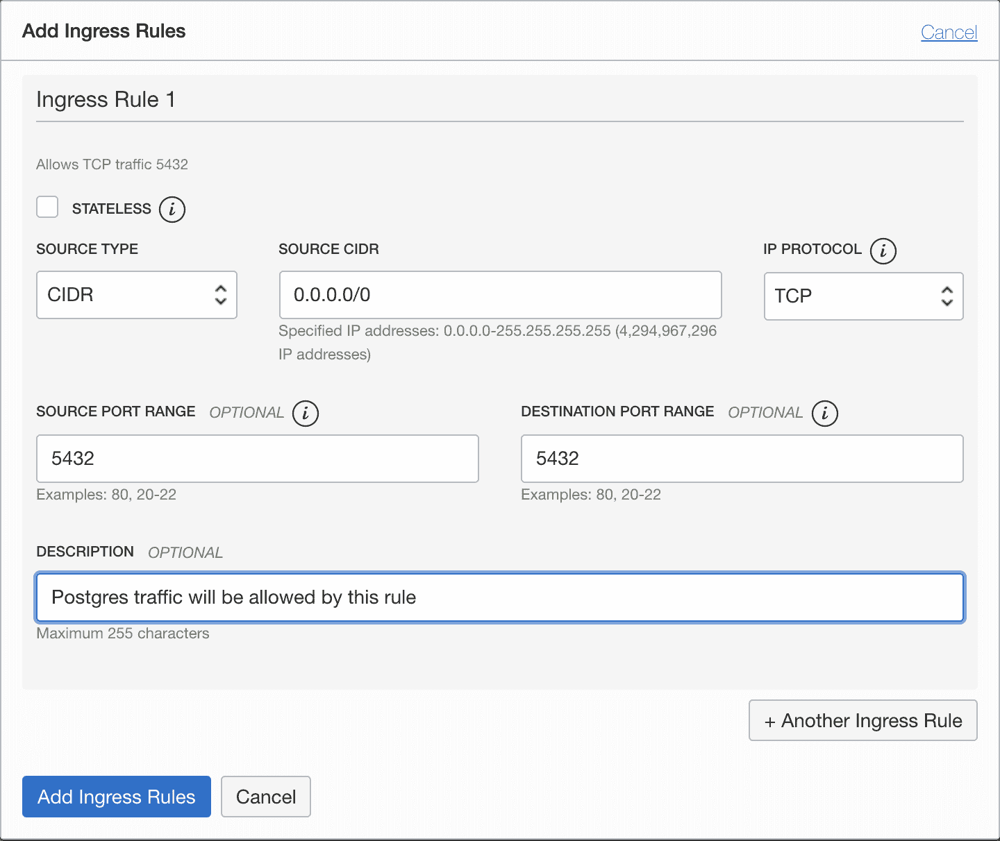
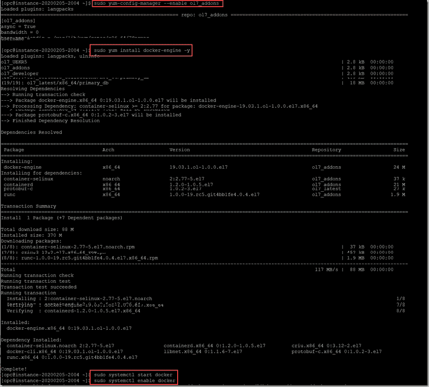

# 如何在 Oracle 云基础设施上运行 Postgres Docker 容器

> 原文：<https://www.freecodecamp.org/news/run-a-postgres-docker-container-on-oracle-cloud-infrastructure/>

在本文中，我将向您展示我如何在 Oracle Cloud Infrastructure 上免费快速设置和运行 Docker 容器。

简而言之，我在 OCI 的永远免费层使用了一个虚拟机，并且为了一个附带项目，我建立了一个 dockerised Postgres 数据库。

现在让我们更深入地了解一下细节。

## 为什么选择 Oracle 云基础设施

Oracle 提供始终免费的云服务选项。您可以在下面看到详细信息:



注意，容器的工作负载必须符合这个总是空闲的 VM: VM 的形状。标准. E2.1.Micro，1/8 OCPU，1 GB RAM 和高达 480 Mbps 的网络带宽(参见[文档](https://docs.cloud.oracle.com/en-us/iaas/Content/FreeTier/resourceref.htm))。启动卷提供 45GB 多一点的磁盘存储空间。

为了能够访问容器，还必须在安全列表的入口规则中配置虚拟机上映射到容器的端口。我们需要自己在虚拟机中安装 Docker 它只配置了一个 Oracle Linux 映像。

让我们开始吧。

## 步骤 1–获得一份租约并创建一台虚拟机

我们需要做的第一件事是创建一个虚拟机。如果您已经有了云租赁，那么您可能已经知道如何创建一个实例。如果您是 Oracle 云的新手，请观看下面的视频，并在[https://cloud.oracle.com/free](https://cloud.oracle.com/free)注册创建一个“永远免费”的虚拟机:

[https://www.youtube.com/embed/Fiu9BiNocJ4?feature=oembed](https://www.youtube.com/embed/Fiu9BiNocJ4?feature=oembed)

注意:Oracle 已经预先填写了大部分详细信息，如可用性区域、映像详细信息和网络选项。但是如果你想要特定的东西，你可以调整它们。我继续使用标准设置。

现在将按照此处所示调配虚拟机:



过一会儿，虚拟机将启动并运行，并分配有一个公共 IP 地址:



此时的情况可以形象化，如下图所示:



## 步骤 2–在虚拟机的安全列表中设置进入规则

这允许您打开任何想要运行的容器所需的端口。

虚拟机与虚拟云网络中的公共子网相关联。此子网的安全列表应配置有入口规则，使所需的流量能够到达将映射到容器映像的端口。

打开公共子网的详细信息页面。单击安全列表(或创建一个新列表):



我们将运行 Postgres 容器映像。我们在 VM 中映射到 Postgres 容器的端口是我们可以自己选择的。让我们选择 Postgres 的默认端口 5432。

我们需要配置如下的入口规则:



源 CIDR 设置为 0.0.0.0/0，源端口范围留空(即全部)，这意味着此规则适用于任何客户端。

## 步骤 3–SSH 进入虚拟机并安装 Docker

此时，我们有一个正在运行的 VM 实例，只有一个 Linux 操作系统，但没有 Docker。让我们使用以下命令 SSH 到虚拟机:

```
ssh opc@public-id-address -i private-key-file 
```

将 public-id-address 替换为分配给虚拟机的公共 IP。将 private-key-file 替换为对包含 SSH 私有密钥的文件的引用。

现在要安装 Docker，请执行以下命令:

```
sudo yum-config-manager --enable ol7_addons 
sudo yum install docker-engine -y 
sudo systemctl start docker 
sudo systemctl enable docker 
```



要以非根用户身份运行 Docker，请阅读[这些说明](https://docs.docker.com/engine/security/rootless/)。

## 如何运行 Docker 容器映像

安装 Docker 后，我们现在可以运行 Postgres 容器映像了。

使用以下命令运行容器映像。不要忘记为`POSTGRES_PASSWORD`添加不同的密码:

```
sudo docker run -d -p 5432:5432 --name postgres -e POSTGRES_PASSWORD=mysecretpassword postgres 
```

使用`sudo docker ps`验证容器是否正在运行。上面的命令将启动一个 PostgreSQL 数据库，并使用以下模式映射端口:`-p <host_port>:<container_port>`。

我们的容器的端口 5432 将被映射到我们的主机或服务器的端口 5432。

访问主机或服务器上的容器。我们将在 Postgres 容器中创建一个数据库。

```
sudo docker exec -it postgres bash 
```

现在你在你的容器里面。我们可以访问 Postgres 并创建数据库。

```
root@12d48fde2627:/# psql -U postgres
psql (13.3 (Debian 13.3-1.pgdg100+1))
Type "help" for help.

postgres=# CREATE DATABASE testdb;
CREATE DATABASE
postgres=# \q 
```

就这样，我们完成了！您可以退出您的容器(`\q`)并转到您的本地机器。

这里需要安装一个 PostgreSQL 客户端工具，如 [DBeaver](https://dbeaver.io/) 或 [pgAdmin](https://www.pgadmin.org/) 。使用公共 IP 作为主机，`5432`作为端口，`postgres`作为用户名，`POSTGRES_PASSWORD`作为密码，连接到`testdb`，连接到 DB 服务器。保存连接，现在您应该能够访问您的数据库了。

## 恭喜，您现在已经在 Oracle 云基础设施上运行了 Postgres Docker 容器！

感谢阅读！我真的希望这篇文章对你有用。我总是有兴趣知道你的想法，并乐意回答你脑海中的任何问题。如果你认为这篇文章是有用的，请分享它来帮助推广这篇文章给其他人。

感谢阅读！:)

附注:请随时在 LinkedIn 或 T2 Twitter 上与我联系。

## 资源

这篇文章主要依靠以下材料:

*   [在 Oracle 云基础设施上运行始终免费的 Docker 容器](https://medium.com/oracledevs/run-always-free-docker-container-on-oracle-cloud-infrastructure-c88e36b65610) - Lucas Jellema
*   从本地机器连接到 Docker 中的 PostgreSQL 数据库