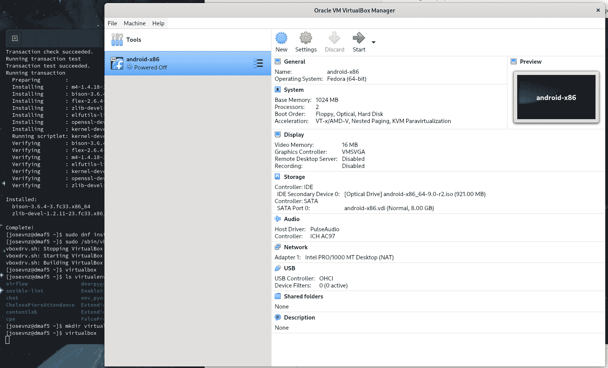
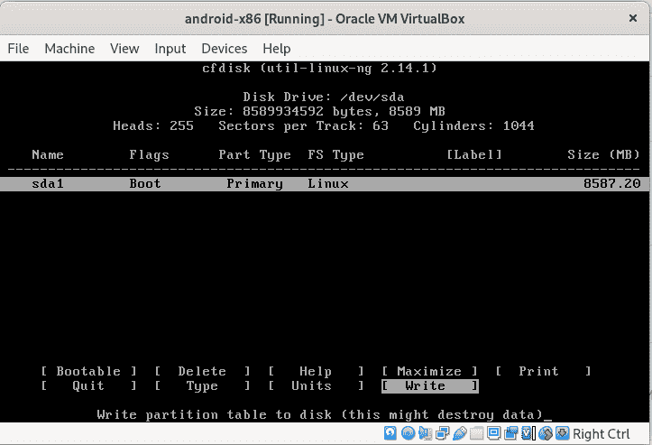
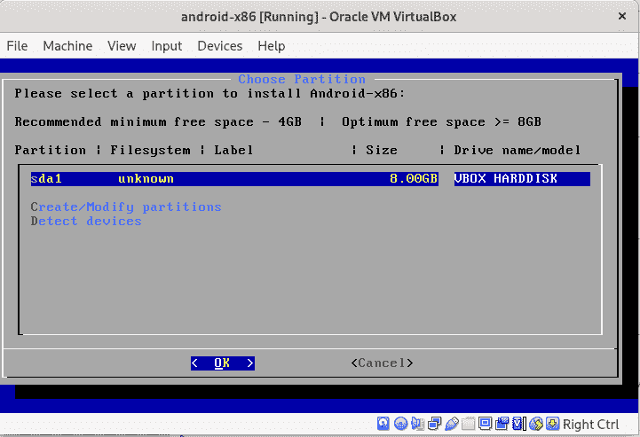
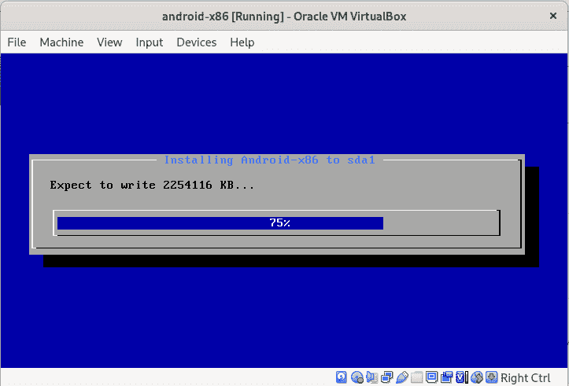
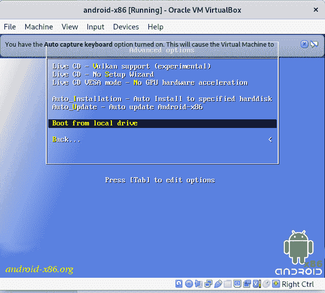
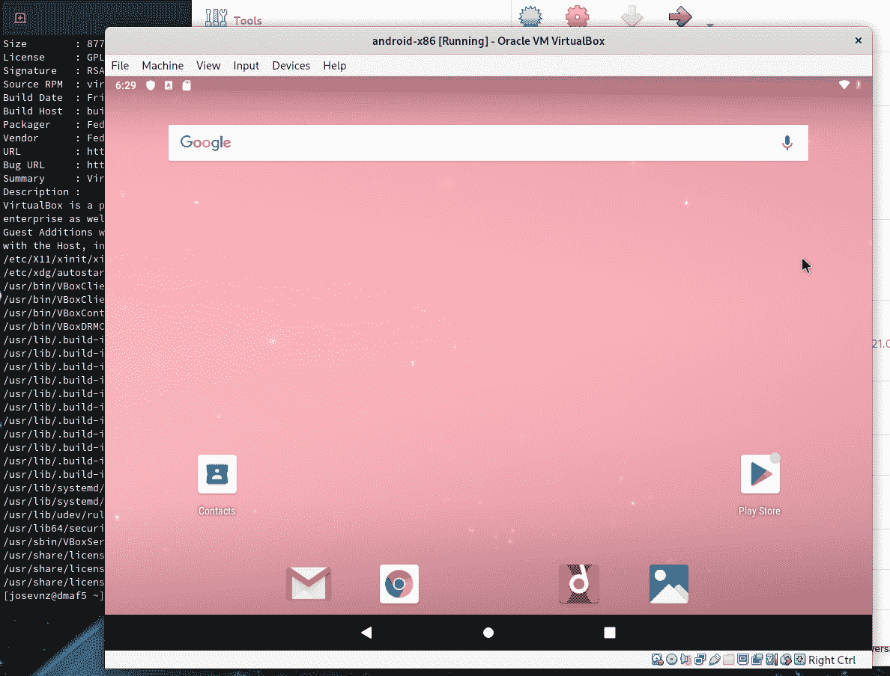
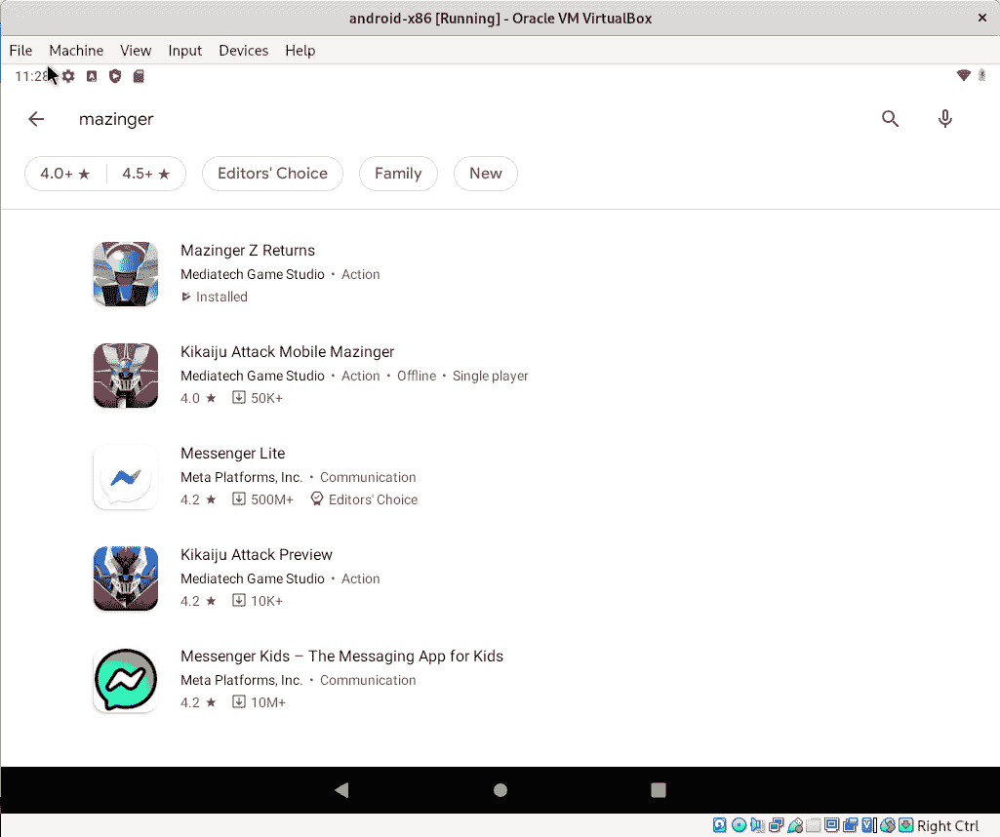
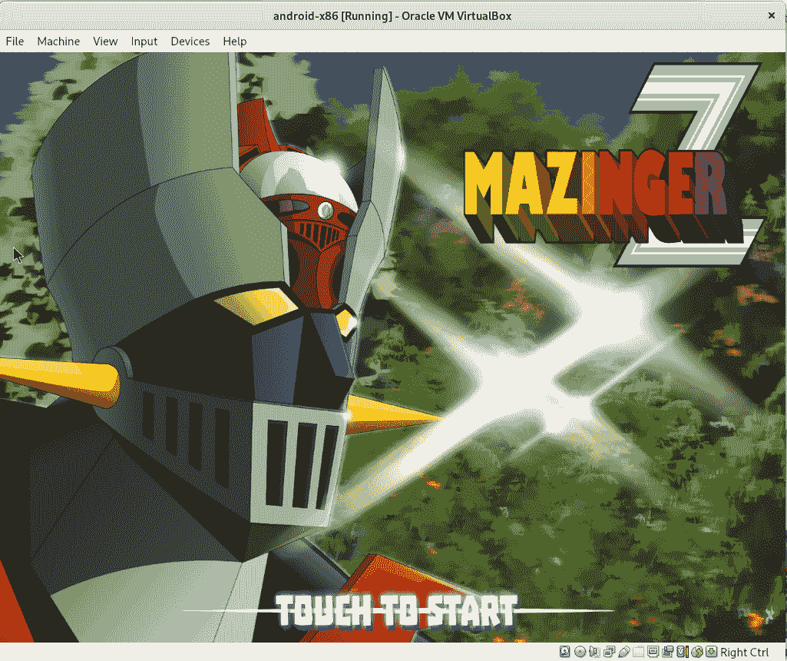

# 如何用 Android-x86 在 Linux 上运行 Android 游戏

> 原文：<https://www.freecodecamp.org/news/run-android-games-on-linux/>

在本文中，您将了解如何在 Linux 上使用虚拟机，同时享受老式游戏的乐趣。

如果你有一部安卓手机，你的罪恶乐趣之一可能是玩一些非常有趣的游戏。或者有一个应用程序只在你的手机上运行。

然后你会想——如果你能在台式电脑上运行同样的游戏会怎么样？

为了简化场景，让我们假设应用程序运行在 Android 上。

解决这个问题的一个方法是在你的电脑上运行一个 Android 模拟器。但是其中一些，比如 Android-x86，需要重启你的机器，这样他们才能控制硬件。

如果你不介意一点点性能损失，你可以在运行本机操作系统的同时运行一个虚拟机。特别是在 Linux 上，有几种选择，比如 [QEMU](https://www.qemu.org/) 和 [VirtualBox](https://www.virtualbox.org/) 等等。

在本文结束时，您将能够做到以下几点:

*   在 Fedora Linux 上安装 VirtualBox
*   运行 android-x86 并完成基本设置
*   从谷歌 Play 商店安装应用程序，就像在手机上一样。

## **基本要求**

在您开始之前，我假设您具备以下条件:

*   能够以超级用户的身份运行命令(比如 [SUDO](https://www.sudo.ws/)
*   Google.com 上的一个帐户，因此您可以在虚拟机内使用 Play store。

# **如何安装 VirtualBox**

第一步是安装 VirtualBox。出于实用目的，我们的安装将是基本的，仅够运行我们的游戏:

```
sudo dnf install -y kernel-devel kernel-devel-5.14.18-100.fc33.x86_64
curl --remote-name --location https://www.virtualbox.org/download/oracle_vbox.asc
sudo rpm --import ./oracle_vbox.asc
sudo dnf install -y https://download.virtualbox.org/virtualbox/6.1.36/VirtualBox-6.1-6.1.36_152435_fedora33-1.x86_64.rpm
sudo dnf install -y virtualbox-guest-additions.x86_64
sudo /sbin/vboxconfig 
```

## **如何安装 Android-x86 ISO**

第一步是从 [Android-x86](https://sourceforge.net/projects/android-x86/) 下载 ISO 镜像。该 ISO 包含将安装在我们的虚拟硬盘上的 Android 操作系统。

之后，我们可以像这样设置我们的虚拟机:



How a finished virtual machine looks like on VirtualBox


需要注意一些事情:

*   第一次开机后发现安卓镜像 1GB 不够用。在我将内存提升到 3GB 后，性能提高了很多。
*   另一个变化是“图形控制器”。最初它是 VMSVGA，但后来 Android 拒绝在图形模式下启动，所以我改用 VboxVGA，它工作了。
*   2 个 CPU 和 8GB 的磁盘空间对我的游戏来说足够了。
*   最后，我指定 IDE 控制器是 android-x86 ISO。

要启动虚拟机，您需要单击 GUI 上的“start”按钮，然后您需要做出一些决定，例如可启动分区:



Partitioning your virtual disk. We assign 8 GB and make sure the partition can boot

完成后，您可以选择您的新分区来执行安装:



After the new partition is created, you can choose it and you can install the Android OS there

然后安装将继续进行:



The installer copies the files from the Android ISO image into the virtual hard drive

安装完成后，您可以关闭虚拟机。

## **第一次开机**

现在，您需要转到高级选项并选择虚拟磁盘(而不是 ISO 映像)来启动:



You can either boot from disk on this menu or change the boot order on the virtual machine

之后，Android 会询问你一些基本的设置信息，就像在你的手机上一样。最终结果可能是这样的:



The virtual machine looks exactly like your Android phone.

## **如何从谷歌 Play 商店安装游戏**

在我的情况下，我决定安装一个游戏，在那里我可以像 1970 年那样与邪恶势力战斗。为此，请在 play store 上搜索并安装游戏:



After Android is running and your credentials are set you can download and install any Android program you want.

现在，成功了！我们让游戏开始运行。



Sorry, but now it is time to play as Mazinger Z!

# 我们在这里学到了什么？

*   我们设法安装了一个虚拟机引擎，并成功运行了 Android 操作系统以及我们的常规 Fedora 操作系统
*   您看到了如何尝试放弃整个操作系统的设置，而不用经历在 Linux 上用 Grub 设置双引导系统的麻烦

在虚拟机中运行游戏的另一个很好的特点是，你可以完全冻结游戏，然后回来，在你离开的同一点恢复游戏。

最后，除了运行游戏，您还可以使用虚拟机做更多事情，例如:

*   您可以[安全地分析恶意软件](https://www.varonis.com/blog/malware-analysis-tools)，运行不可信的应用程序，并遏制它们可能造成的任何损害。
*   在决定提交一个正确的安装之前，尝试一个新的操作系统版本(这不是一个大问题，因为他们大多数都提供了一个 lice CD，你可以启动来尝试)，但这仍然非常方便。
*   能够同时运行多个操作系统，无需重启机器。你很可能会开始尝试你选择的虚拟机的更高级的选项，比如 [VirtualBox](https://www.virtualbox.org/manual/ch09.html) 。

在你的电脑上玩游戏是以后学习更复杂东西的一个途径。有趣的因素也是不可否认的。尽情享受吧！