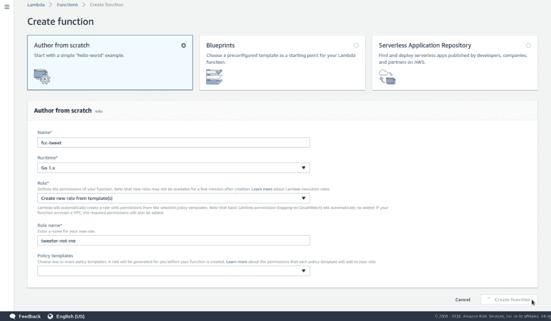
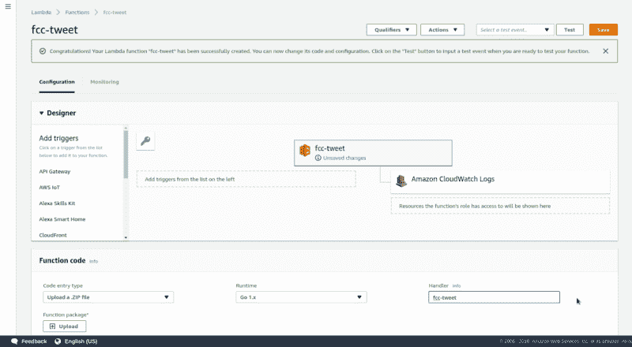
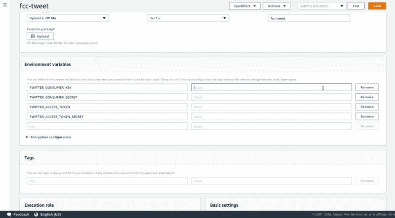
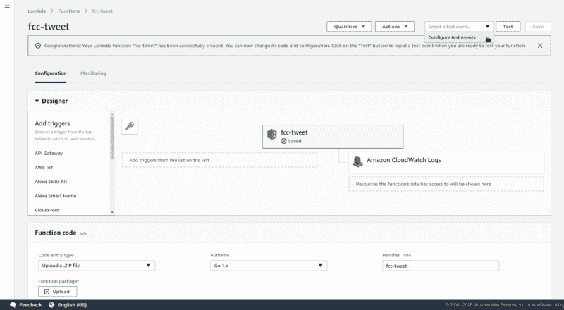
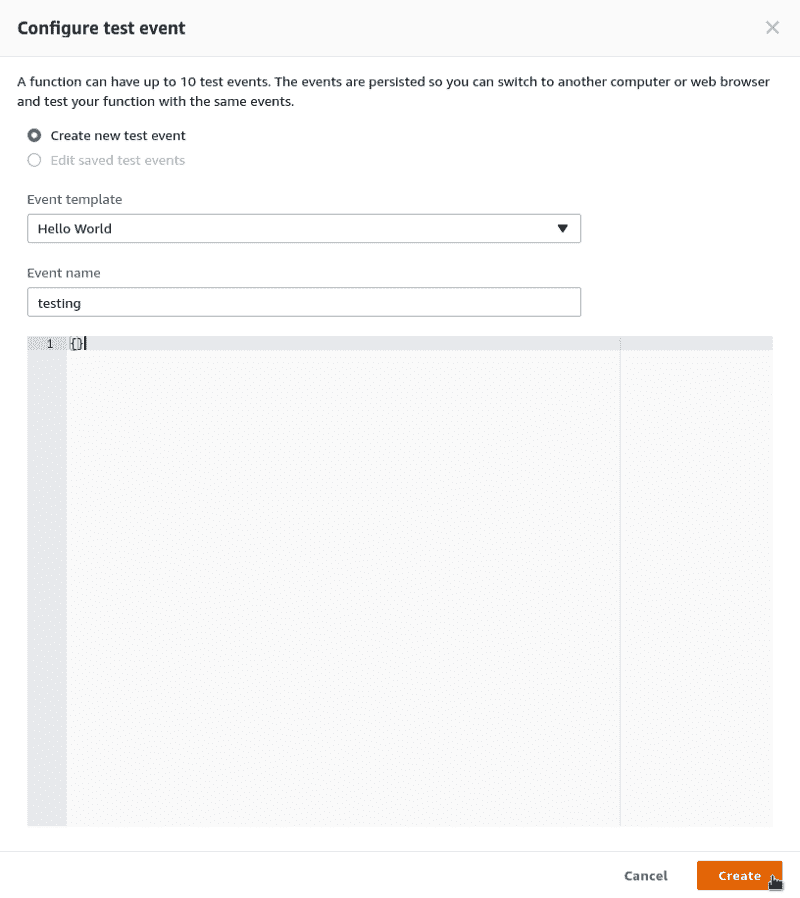
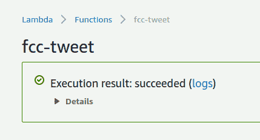
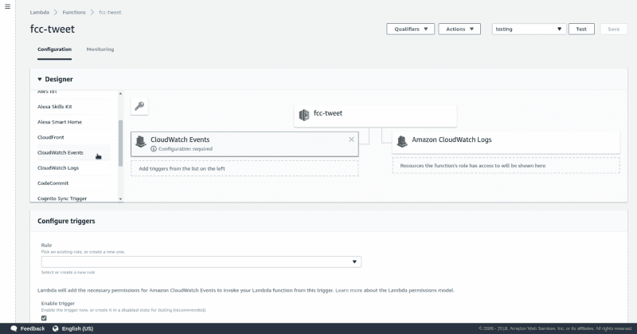
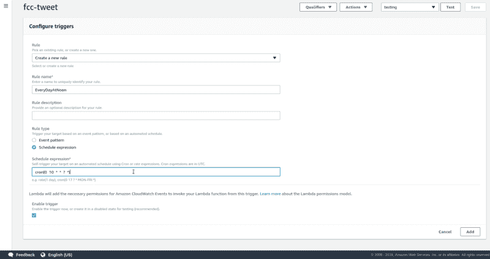

# 我想让多伦多自由代码营的 Twitter 发布报价，所以我做了一个免费的机器人来做这件事。

> 原文：<https://www.freecodecamp.org/news/running-a-free-twitter-bot-on-aws-lambda-66160eb4de4/>

如果你读了关于时间的文章，你会知道我是一个坚定的信徒，我相信现在花时间去做一些可以为将来节省时间的事情。为此，我在 Go 中构建了一个简单的 Twitter 机器人，它会偶尔发布我的文章的链接，即使在我太忙而无法使用它的时候，也能保持我的帐户有趣。推文有助于增加我网站的流量，而我不用动一根手指。

我在 Amazon EC2 实例上运行了大约一个月。我使用 AWS 的费用一直很低(比北美大部分地区一杯咖啡的价格还低)，所以当我使用的这个小实例的账单比上个月增加了 90%时，我感到很惊讶。我不认为 AWS 很贵，明确地说，但仍然…我很便宜。我想要我的推特机器人，而且要更便宜的。

我一直想探索 AWS Lamda，并认为这是一个好机会。与持续运行的 EC2 实例(并为此向您收费)不同，Lambda 按请求并根据函数运行的持续时间向您收费。还有一个免费层，前 100 万个请求以及一定量的计算时间都是免费的。

粗略地翻译成运行一个为你发布消息的 Twitter 机器人，比如说，一天两次，你使用 Lambda 的月总成本将是…携带一个…什么也没有。我已经运行我的 Lambda 函数几个星期了，完全免费。

最近，当我接管 Twitter 的时候，我决定采用类似的策略。亲爱的读者，我也利用这个机会为你记录了这个过程。

因此，如果您目前正在使用一个全职运行的实例来执行一项可以由 cron 作业提供服务的任务，那么这篇文章正适合您。我将介绍如何为 Lambda 编写函数，以及如何让它自动运行。另外，作为一个小小的奖励，我将包含一个方便的 bash 脚本，当您需要进行更改时，它可以从命令行更新您的函数。我们开始吧！

### Lambda 适合你吗？

当我在 Go 中为我的 Twitter 机器人编写代码时，我打算让它在 AWS 实例上运行，我大量借鉴了 Francesc 的 awesome Just for Func 剧集。过了一段时间，我修改了它，从我的 RSS 提要中随机选择一篇文章，并在推特上发布链接，一天两次。我想为@freeCodeCampTO 机器人做一些类似的事情，让它每天早上在推特上发布一条关于编程的鼓舞人心的引用。

这是 Lambda 的一个很好的用例，因为:

*   程序应该执行一次
*   它以时间为触发器，按照固定的时间表运行
*   它不需要不停地运行

要记住的重要一点是，Lambda 运行一次函数来响应您定义的事件。应用最广泛的触发器是一个简单的 cron 表达式，但是还有许多其他的触发器事件可以使用。你可以在这里得到一个概述[。](https://aws.amazon.com/lambda/)

### 写一个 Lambda 函数

我发现这在围棋中非常简单。首先，抓取 [aws-lambda-go](https://github.com/aws/aws-lambda-go) 库:

```
go get github.com/aws/aws-lambda-go/lambda
```

然后将此作为您的`func main()`:

```
func main() { 
       lambda.Start(tweetFeed) 
}
```

其中`tweetFeed`是使一切发生的函数的名称。虽然我不会在这里写整个 Twitter 机器人，但你可以在 GitHub 上查看我的[代码。](https://gist.github.com/victoriadrake/7859dab68df87e28f40d6715d08383c7)

### 设置 AWS Lambda

我假设你已经有一个 AWS 帐户。如果没有，这里先说第一件事:[https://aws.amazon.com/free](https://aws.amazon.com/free)

### 1.创建您的功能

在服务列表中找到 AWS Lambda，然后寻找这个闪亮的按钮:


我们将从头开始编写一个函数。命名你的函数，然后在**运行时**下选择“Go 1.x”。

在**角色名称**下，写下您喜欢的任何名称。这是一个必填字段，但与此用例无关。

点击**创建功能。**



### 2.配置您的功能

您将看到一个配置新功能的屏幕。在**处理程序**下输入您的 Go 程序的名称。



如果你向下滚动，你会看到一个输入环境变量的地方。这是一个输入 Twitter API 令牌和秘密的好地方，使用程序期望的变量名。AWS Lambda 函数将使用您在此提供的变量为您创建环境。



这个用例不需要进一步的设置。点击页面顶部的**保存**。

### 3.上传您的代码

您可以在配置屏幕上将您的功能代码作为 zip 文件上传。因为我们使用的是 Go，所以您首先需要`go build`，然后在上传到 Lambda 之前压缩生成的可执行文件。

…当然，我不会每次想调整功能时都手动这么做。这就是`awscli`和这个 bash 脚本的用途！

`update.sh`

```
go build && \ 
zip fcc-tweet.zip fcc-tweet && \ 
rm fcc-tweet && \ 
aws lambda update-function-code --function-name fcc-tweet --zip-file fileb://fcc-tweet.zip && \ 
rm fcc-tweet.zip
```

现在每当我做一个调整，我就运行`bash update.sh`。

如果你还没有使用 [AWS 命令行界面](https://aws.amazon.com/cli/)，请使用`pip install awscli`并稍后感谢我。在**快速配置**下的[这里](https://docs.aws.amazon.com/cli/latest/userguide/cli-chap-getting-started.html)找到几分钟内设置和配置的说明。

### 4.测试您的功能

想看它走吗？你当然知道！点击顶部下拉菜单中的“配置测试事件”。



因为您将为这个函数使用一个基于时间的触发器，所以您不需要在弹出窗口中输入任何代码来定义测试事件。只需在**事件名称**下写下任何名称，并清空下面字段中的 JSON。然后点击**创建**。



点击页面顶部的**测试**，如果一切正常，您应该会看到…



### 5.设置 CloudWatch 事件

为了像运行 cron 作业一样运行我们的功能——作为定期安排的基于时间的事件——我们将使用 CloudWatch。点击**设计器**工具条中的**云观察事件**。



在**配置触发器**下，您将创建一个新规则。为您的规则选择一个不带空格或标点的描述性名称，并确保选择了**计划表达式**。然后输入你希望你的程序运行的时间作为一个*速率表达式*，或者 cron 表达式。

cron 表达式如下所示:`cron(0 12 * * ? *)`

括号中的项目依次代表:分钟、小时、月、日和年。用英语说:每天中午(UTC)跑步。

关于如何编写 cron 表达式的更多信息，请阅读。

要了解 UTC 的当前时间，请单击此处的[。](https://codepen.io/victoriadrake/full/OQabar)

如果您希望您的程序一天运行两次，比如上午 10 点运行一次，下午 3 点运行一次，那么您需要设置两个单独的 CloudWatch 事件触发器和 cron 表达式规则。

点击**添加**。



### 看着它走

这就是让您的 Lambda 函数启动并运行所需的全部内容！现在你可以坐下来，放松，做比在 Twitter 上分享你的 RSS 链接更重要的事情。