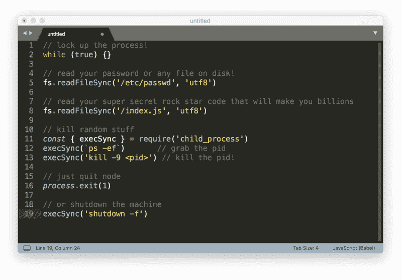
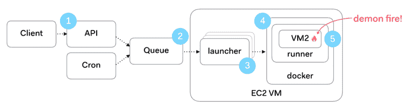
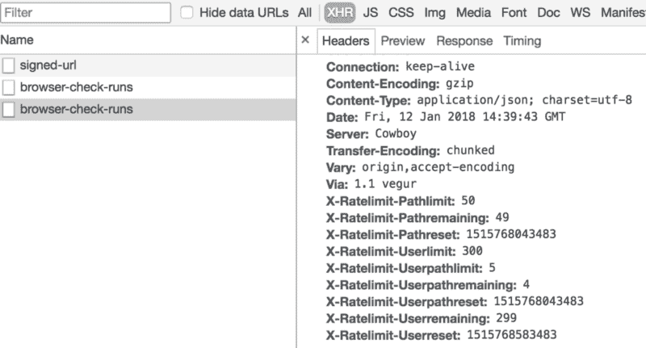
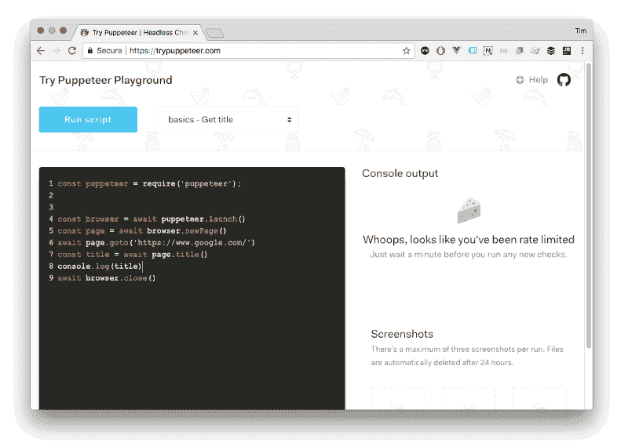
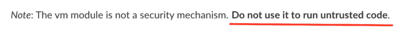

# 将不受信任的 Javascript 作为 SaaS 运行是很困难的。这就是我驯服恶魔的方法。

> 原文：<https://www.freecodecamp.org/news/running-untrusted-javascript-as-a-saas-is-hard-this-is-how-i-tamed-the-demons-973870f76e1c/>

作者蒂姆·诺莱特？？‍?

# 将不受信任的 JavaScript 作为 SaaS 运行是很困难的。我是这样驯服恶魔的。


The Tiger Riding Ukulele Man, Henri Rousseau

想象以下情况:

*   您有一个允许用户运行服务器端 Node.js 代码的 Saas 服务。
*   代码在您的服务器上执行。
*   代码可以从网上下载任何东西。
*   代码生成的任何输出都可供用户使用。

这是一场演出******噩梦**。这也是我在为我的新独奏 SaaS [奋进号](https://checklyhq.com)制作一个新的[工具](https://trypuppeteer.com)时发现自己的处境。********

### ****使用案例****

****我的新工具的一个关键特性是让匿名用户在沙盒环境中运行木偶脚本。木偶师是谷歌 Chrome 团队(22k Github 明星✨)的一个项目，它允许用户无头运行 Chrome，就像没有屏幕一样，并自动与网页交互。****

****这对于测试、网页抓取、监控和一大堆其他用例非常有用。新工具的目的是让用户可以快速试用这些脚本，而无需在自己的机器上安装和运行木偶师。非常类似于 JSFiddle、CodePen 和其他代码平台。****

****这里的关键是，用户可以完全访问 JavaScript 和 Node.js，可以从互联网上下载他们想要的任何东西，我(嗯…我的服务器)将为他们运行这些代码！？呀！****

### ****会出什么问题呢？****

****下面是人们(我的用户)用他们的代码搞砸事情的一些方法:****

****

Yikes! Again!**** 

****而且，当我们运行一个多租户 Saas 时，可能会有劫持其他会话并进入其他人的进程和代码的方法。是的，它是相当令人讨厌的。****

****这是出于恶意还是仅仅因为写了错误的代码并不重要。最终的结果要么是缓慢的/死的服务器，你的(和可能的其他用户)凭证在街上，只是一个普遍的坏时间。****

### ****层，层…层！****

****我想出的解决这个问题的方法如下。****

****

Note to Russian hackers: save this image to disk**** 

****运行一些不可信代码的请求首先在(1)处受到速率限制，然后在(2)处被放入 AWS SQS 消息队列。我称之为执行工作的启动器进程(3)拾取消息。这是典型的扇出/主工人模式。启动器准备并启动 Docker 容器(4)，Docker 容器又执行 Node.js VM2“软容器”(5)中的用户代码。让我们详细看一下这些步骤。****

### ****1.限速****

****为了避免 DDOS 场景，即用户用 HTTP 请求攻击您的 API，我们需要首先添加速率限制，也称为请求节流。这在我的特定场景中更加重要。每个轻量级 HTTP 请求都可能触发一个更繁重的后台作业。(木偶师旋转出一个完整的 Chrome 浏览器。)****

****这意味着 API 服务器可能变得没有响应，而且作业服务器也可能开始不堪重负。由于我计划在作业服务器中添加自动缩放功能，更多的作业请求意味着更多的资源使用。这将导致服务器成本膨胀。对你可怜的单干创业者来说可不是好事。****

****有许多速率限制框架和插件。由于我使用的是 Hapi.js 框架，所以我选择了 hapi-rate-limit 插件。其他的就不多说了。安装它，将它添加到您想要保护的 API 路由中*瞧，*它就可以工作了。这个插件给了你一些很棒的选项，涵盖了很多速率限制的场景:****

*   ****IP 和用户白名单。****
*   ****限制每个用户、每个路径或两者。****
*   ****x-Forward-用于感知，方便在负载均衡器后面运行。****

****此外，该插件为每个请求添加了几个 HTTP 响应头，显示速率限制算法的状态。****

****

Rate limit headers added by the hapi-rate-limit plugin**** 

****在上图中，你可以看到我提出了一个请求。这个请求从我每个 UserPathLimit 可以发出的最大请求数中减去。这被定义为*每个周期*内每个用户在给定路径上可以发出的请求总数。这个周期在一段时间后重置。****

****如果有人达到速率限制会发生什么？我们把它们放在淘气的角落里一会儿，然后给它们吃奶酪。格言是顾客永远是对的，但是他/她不应该被允许破坏你的系统。****

********

### ****2.异步后台作业****

****将不受信任的代码的实际运行委托给后台作业是一种非常常见的模式。您不希望将 HTTP 服务器的请求周期与长时间运行的作业捆绑在一起。这里额外的好处是，如果在运行不受信任的代码时发生任何不好的事情，它将不会关闭或以其他方式损害您面向客户的 API 服务器。****

****在我的解决方案中，包含要运行的代码的 HTTP POST 请求被解包并转储到 SQS 消息队列中。该消息一直在那里，直到一个启动器节点拾取该消息并试图处理它。这是 API 服务器角色的终点。座右铭是永远不要用长时间运行和潜在危险的请求来打扰用户面对 API 服务器。****

### ****3.进程隔离:分离启动程序和运行程序****

****在构建这个架构的后期，我意识到我需要将启动器和运行器代码分开，并将运行器放入 Docker 容器中。当我们看到启动器/运行器组合需要做什么时，原因就很明显了。****

****这些是分配给启动程序进程的任务:****

*   ****听 SQS，解开信息，并从中提取不可信的代码。****
*   ****将代码写入专用的工作目录。****
*   ****使用优秀的 [Dockerode](https://github.com/apocas/dockerode) 启动一个安装了工作目录的 Docker 容器(runner)。****
*   ****读取跑步者的输出，并通过 AWS IOT 将消息传递给等待的用户。****
*   ****监视正在运行的容器的状态。****
*   ****上传截图给 S3。****
*   ****运行完成后，向数据库传递最终消息。****
*   ****清理文件，临时工作目录和其他碎片。****

****为了执行所有这些工作，启动程序有相当多的特权，并且需要访问许多凭证，如 AWS 服务、数据库访问、文件系统访问。所有这些都是很容易被任何做`console.log(.../configuration/config.json)`、`console.log(process.env)`或类似事情的人利用的攻击媒介。****

****再次…呀！？****

****这就是为什么不受信任的代码不应该在与启动器相同的上下文中运行。****

****通过分离发射器和转轮也增加了稳定性。如果发射器挂起或死机，整个系统实际上就失去了能力。像 PM2 进程监视器这样的东西当然会重启进程，但是由于这些崩溃，肯定会有噪音和摩擦。****

****因此，在当前的设计中，启动器不会直接暴露给任何不可信的代码。格言是永远保护服务器代码，即使以用户代码为代价。****

****跑者有点怪，我们来看看。****

### ****4.使用 Docker 的操作系统沙箱****

****这个等式中的 runner 部分是由包含 runner 进程的 Docker 容器的启动程序启动的。然后，运行程序执行用户不信任的代码。使用 Docker 容器有几个好处:****

1.  ****节点进程无权访问父主机。所有环境变量、文件等。不可访问，因此无法窥探敏感文件。实际上，读取文件是不可能的，但稍后会详细说明。****
2.  ****作业隔离:来自多个用户的作业在一台机器上运行，我们希望始终避免任何“交叉授粉”的可能性。****
3.  ****容易清理:每个容器在结束运行时都会被销毁，连同所有可怕的下载、代码以及它所带来的任何恶意代码。****

****Docker 通常通过使用在[运行时特权和 Linux 功能文档](https://docs.docker.com/engine/reference/run/#runtime-privilege-and-linux-capabilities)中描述的`--cap-add`标志来提供相当深入的安全调整。我很高兴不必陷入 selinux 的可怕混乱中…****

****除了这些安全优势之外，Docker 容器还使运输和测试变得更加容易。让 Puppeteer 在 Docker 环境中运行是一个挑战，需要很多额外的包，但是有一些优秀的指南可以帮助大多数基于 Debian / Ubuntu 的发行版。****

### ****5.使用 VM2 的节点沙箱****

****“跑进码头”的解决方案实际上是一座监狱。但是我们仍然允许囚犯使用 Node.js 标准库提供给他们的所有工具。把工具箱严重削薄不是更好吗？是的，第一站是节点虚拟机。****

****Node VM 是标准节点分发的一部分，并在 V8 引擎中提供沙箱功能:它只是对术语“沙箱”有非常有限的解释，因为您可以非常容易地突破它，并且您可以添加软件包并进行任何您想要的破坏。不可否认，Node 的人在文档中用很大的字体写道:****

****

I will not! NEVER!! (emphasis mine)**** 

****幸运的是，有一个半分支 [VM2](https://github.com/patriksimek/vm2) ,它被构建来压制不受信任的代码和它可以运行的东西。它的主要技巧是你可以列出注入 VM 的代码可以访问的模块。****

****例如，您可以只列出`fs.write()`而不列出`fs.read()`。或者你可以阻止`process`的使用，以避免可怕的`process.exit()`或`process.env`。这是相当惊人的，完全归功于 [@patricksimek](https://twitter.com/patriksimek)****

****外部包也可以被列入白名单，让您可以选择允许使用流行的包，如 lodash 或其他实用程序库，而不允许用户访问`npm install`。****

****我们现在终于到了执行不可信代码的地方。使用 VM2，这就像用不可信代码的字符串化版本调用 run()方法一样简单。****

```
**`vm.run(untrustedCode)  .then(output => {    console.log(output)})`**
```

****然而，我们还有一个问题。我们如何将输出返回给用户？我们不允许 Docker 容器中的 VM2 进程中的运行者访问消息总线或其上下文之外的任何东西。该进程也与启动器进程分离，所以我们不能使用简单的回调。****

****此时，我通过允许运行程序只将日志写入 stdout，并将图像写入屏蔽的临时目录来解决这个问题，该目录在运行后会被删除。****

****这意味着启动程序读取运行程序的标准输出，主要是解析一个长字符串，并根据预先考虑和附加的控制代码截取有用的数据。通过这种方式，数据被净化并传递到上游通道。考虑到文件大小和可能的文件损坏，图像文件从磁盘读取并直接推送到 S3。****

### ****结论****

****运行不受信任的代码有点像建造中世纪的城堡。它不是关于一扇牢不可破的魔法门，一条深深的护城河或一座高塔来照顾你所有的不幸。它是关于一层层的解决方案，这些解决方案令人讨厌，足以吓退入侵者，并抓住它上面或下面一层的错误。****

****附:如果你喜欢这篇文章，请用**鼓掌**来表达你的欣赏？下面和 f [**在推特上关注我！**](https://twitter.com/tim_nolet) **B** ut 等等，还有更多！****

****我正在为开发者和初创公司建立一个积极的监控解决方案[https://checklyhq.com](https://checklyhq.com?utm_campaign=untrustedjavascript&utm_source=freecodecamp)****

********

****克雷克雷。？****