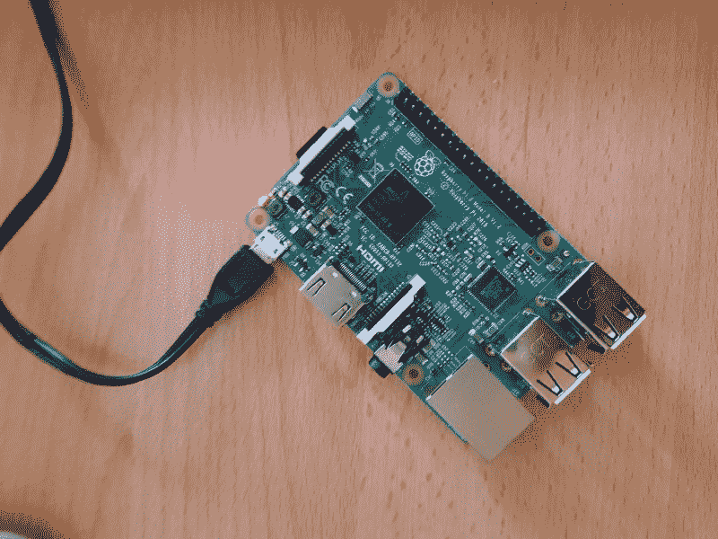
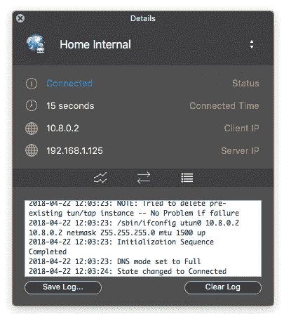
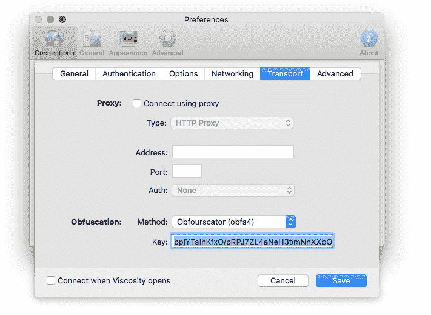
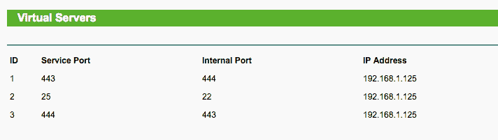

# 如何在 Raspberry PI 上运行自己的 OpenVPN 服务器

> 原文：<https://www.freecodecamp.org/news/running-your-own-openvpn-server-on-a-raspberry-pi-8b78043ccdea/>

by Denis Nuțiu

# 如何在 Raspberry PI 上运行自己的 OpenVPN 服务器



My Raspberry, serving as an OpenVPN server

大家好！

在这篇短文中，我将解释如何用 OpenVPN 在 Raspberry PI 上设置自己的 VPN(虚拟专用网络)服务器。在我们设置好服务器之后，我们将设置一个混淆服务器，以便伪装我们的流量，表明我们正在使用 VPN。这将有助于我们避开某种形式的审查。

### 为什么要用 VPN？

首先，让我们来谈谈为什么您可能想要使用 VPN 服务器:

1.  避免中间人攻击。如果您的本地网络上有一个恶意用户，甚至是您的室友，这个人就能够监控您的未加密流量并篡改它。
2.  对你的 ISP(网络服务提供商)或大学隐瞒你的网络活动，就我而言。
3.  取消阻止服务。我所在的大学屏蔽所有 UDP(用户数据报协议)数据包。这意味着我不能使用任何通过 UDP 通信的应用程序。我不能使用我的电子邮件客户端，玩游戏，甚至不能使用 Git！

我决定用 Raspberry Pi 在我的家庭网络上建立一个 VPN。这样当我在大学的时候，我可以连接到我的家庭网络。如果你在另一个国家需要 VPN 服务器，你可以从 [DigitalOcean](https://m.do.co/c/22f012126c25) 购买 5 美元/月的虚拟专用服务器。你可以使用我的推荐链接来获得 10 美元的折扣——那是两个月的免费 VPN。但如果你不想用，也可以不用。

### 安装 OpenVPN

这一步非常简单，因为我们将使用一个 shell 脚本来完成。所以你只要“按”下一步，完成就行了。

安装将需要很长时间，这取决于您选择的密钥大小。在我的树莓 Pi 3 Model B 上，大概用了 3 个小时。

请访问该存储库，然后按照说明进行操作

[**Angristan/OpenVPN-安装**](https://github.com/Angristan/OpenVPN-install)
[*OpenVPN-安装-在 Debian、Ubuntu、Fedora CentOS、Arch Linux 上设置自己的 OpenVPN 服务器*github.com](https://github.com/Angristan/OpenVPN-install)

如果你不知道你的服务器的 IP 地址，只需输入`0.0.0.0`。我选择了端口`443`和协议 **TCP** (传输控制协议)。

**注意**:这很重要，因为我的大学只允许 **TCP/80** 和 **TCP/443** 端口，其余的都被屏蔽了。此外，Obfsproxy 仅适用于 TCP，所以请确保您选择了 **TCP** ！

脚本完成后，您将获得一个**。ovpn** 文件。它可以导入你最喜欢的 VPN 客户端，一切都应该开箱即用。

#### 测试连接

导入。ovpn 文件，并将 ip `0.0.0.0`更改为您的 Raspberry PI 的本地 ip。根据您的网络配置，它可能是`192.168.*.*`的形式。

*注意:只有当您连接到与 Pi 相同的 WiFi 时，此功能才有效。*



Viscosity successfully connected to my VPN server.

我已经配置了我的路由器，所以 PI 总是得到一个保留的 IP 地址。如果你想做类似的事情，你可能需要检查你的路由器设置。

如果连接成功，恭喜你，你现在有一个 VPN 服务器了！但是，你还不能从外面接近它。

如果你只想要一个没有混淆代理的 OpenVPN 服务器，那么你可以跳到**端口转发**。

### 混淆**代理安装**

Obfs4 是一个加扰代理。它将你的网络流量伪装成噪音。窥探你流量的人实际上并不知道你在做什么，它会保护你免受中国防火长城使用的主动探测攻击。

*注意:如果您的对手只允许白名单流量，这种方法将不起作用:(*

#### 现在让我们安装代理服务器。

0.安装所需的软件包:

```
apt-get update && apt-get install obfs4proxy
```

1.  创建一个保存配置的目录。

```
sudo mkdir -p /var/lib/tor/pt_state/obfs4
```

2.创建配置文件。

```
sudo nano /var/lib/tor/pt_state/obfs4/obfs4.config
```

在配置文件中，您将粘贴以下内容:

```
TOR_PT_MANAGED_TRANSPORT_VER=1TOR_PT_STATE_LOCATION=/var/lib/tor/pt_state/obfs4TOR_PT_SERVER_TRANSPORTS=obfs4TOR_PT_SERVER_BINDADDR=obfs4-0.0.0.0:444TOR_PT_ORPORT=127.0.0.1:443
```

**TOR_PT_SERVER_BINDADDR** 是代理监听新连接的地址。在我的例子中，它是`0.0.0.0:444`——为什么是 444 而不是 443？嗯，因为我不想改变目前监听 443 的 OpenVPN 服务器配置。此外，我稍后将使用端口转发将此地址映射到 443。

**TOR_PT_ORPORT** 应该指向 OpenVPN 服务器。在我的例子中，我的服务器运行在`127.0.0.1:443`

3.创建 SystemD 服务文件。

```
sudo nano /etc/systemd/system/obfs4proxy.service
```

然后将以下内容粘贴到其中:

```
[Unit]Description=Obfsproxy Server[Service]EnvironmentFile=/var/lib/tor/pt_state/obfs4/obfs4.configExecStart=/usr/bin/obfs4proxy -enableLogging true -logLevelStr INFO[Install]WantedBy=multi-user.target
```

4.启动模糊代理。

现在，确保 OpenVPN 正在运行，并运行以下命令来启动代理，使其能够在引导时启动。

```
sudo systemctl start obfs4proxysudo systemctl enable obfs4proxy
```

5.保存证书密钥

服务启动后，运行以下命令并保存证书密钥。

```
cat /var/lib/tor/pt_state/obfs4/obfs4_bridgeline.txt
```

密钥的形式为`Bridge obfs4 <IP ADDRESS>:<PORT> <FIN**GER**PRINT> c` ert=KEY iat-mode=0。当您连接到 VPN 时，您将需要它。

6.测试连接。

打开您的 VPN 客户端，将 ip 从 443 更改为 444，以便连接到代理而不是 OpenVPN 服务器。

之后，在你的 OpenVPN 客户端中找到可插拔传输选项，看看它是否支持 **obfs4** 。



Viscosity supports different Obfuscation methods such as: obfs2, obfs3, obfs4 and ScrambleSuit

如果一切正常，那么您就万事俱备了！恭喜你！在从外部世界使用这个 VPN 之前，只有一些事情需要调整。

### **端口转发**

为了从外部世界访问 OpenVPN 服务器，我们需要打开端口，因为它们很可能被阻塞了。如您所知，我已经在路由器上保留了我的 PI 的 IP 地址，使其始终为`192.168.1.125`，这样，即使 PI 断开连接或路由器重启，它也不会改变。

这样，我在端口转发表中定义了以下规则:



TL-WR841N’s Port Forwarding settings page.

外部端口 **443** 将指向混淆的服务器端口 **444。**如果你没有混淆服务器，那就离开 **443- > 4** 43。

端口 25 将指向 PI 的 SSH 端口 22。这只是为了我自己的方便。

如果我想直接访问 OpenVPN 服务器而不使用混淆代理，我已经创建了一个规则**444->443**

服务端口是将与您的**公共** IP 地址一起使用的端口之外的**。要查找您的公共 IP，请使用 whatsmyip.com 等服务。**

内部端口是端口内的**。只有当您连接到网络时，才能使用它。**

*注意:第一条规则是将所有连接从 **PUBLIC_IP:443** 重定向到**192 . 168 . 1 . 125:444***

#### 测试

1.  找到您的公共 IP 并用。ovpn 文件或 vpn 客户端中。
2.  连接到 VPN。

就是这样。

### **动态域名系统**

大多数情况下，你的 IP 会改变，因为它是一个动态的 IP。克服这个问题的一个方法是在 PI 上创建一个小程序，它可以保存你的 IP 地址，并且每天给你发一封邮件。您也可以将 IP 存储在一个在线数据库中，如 Firebase。

我的路由器有动态 DNS 设置。这样，我可以使用 NoIP 这样的服务提供商，并获得一个像`example.no-ip.com`这样的域名，它将始终指向我的公共 IP 地址。


TL-WR841N DDNS settings page

#### 其他资源:

*   [可插拔传输的儿童花园](https://trac.torproject.org/projects/tor/wiki/doc/AChildsGardenOfPluggableTransports)
*   V [粘度——偏差/](https://www.sparklabs.com/support/kb/article/setting-up-an-obfuscation-server-with-obfsproxy-and-viscosity/)
*   [https://www.pluggabletransports.info/transports/](https://www.pluggabletransports.info/transports/)

如果你有任何问题，请在推特上给我打电话。