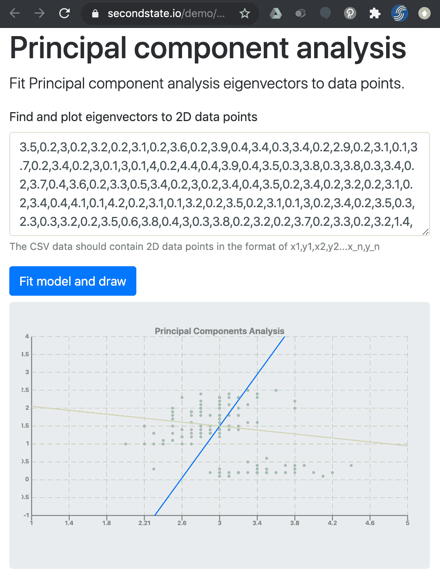

# 如何使用 Rust + WebAssembly 在云中进行无服务器的机器学习和数据可视化

> 原文：<https://www.freecodecamp.org/news/rust-webassembly-serverless-tencent-cloud/>

腾讯无服务器云函数定制运行时允许开发者用任何编程语言编写无服务器函数。

在本文中，我们以 Rust 和 WebAssembly 中的无服务器功能为例，展示了它们在机器学习和可视化中的应用。

您将学习如何为机器学习创建一个简单的函数，并围绕它部署一个无服务器的网站，而且是免费的(除非有一百万人使用它！).

## 一、腾讯是什么？

腾讯是美国以外最大的互联网公司，日活跃用户超过 10 亿。其云计算部门[腾讯云](https://cloud.tencent.com/?lang=en)，按市场份额排名，位列全球前五大云提供商。

如果你想用你的云服务打入全球市场，腾讯云应该是你的首选。

腾讯云也是无服务器计算领域的领先创新者，提供从功能即服务(FaaS)运行时、触发器、连接器和开发工具等强大产品。

[腾讯无服务器云功能(SCF)](https://intl.cloud.tencent.com/document/product/583) 已经支持 10+种编程语言和运行时框架。但是最近发布的 SCF 定制运行时又向前迈进了一步。SCF 现在可以支持用任何编程语言编写的函数。

在本文中，我将介绍如何在 SCF 中运行用 Rust 编写的 WebAssembly 函数。

### 我们将在本文中讨论的内容

我们将首先复习基本概念。然后，我们将查看一个完整但简单的 hello world 示例，以部署您的第一个 WebAssembly 无服务器功能。

最后，我们将使用机器收入即服务(MLaaS)示例做一些有用的事情，该示例获取数据并以 SVG 格式返回拟合的模型和可视化。

这是本教程结束时您将创建的最后一个应用程序。它是完全“无服务器”的，当人们使用它时会产生费用。

HTML 和 JavaScript UI 可以托管在任何电脑上，包括你的笔记本电脑，执行机器学习和 SVG 绘制的[后端功能](https://github.com/second-state/wasm-learning/tree/master/tencentcloud/ssvm/pca)在腾讯云无服务器上。

## 为什么 WebAssembly 会生锈

传统的无服务器功能基于重量级框架。开发者必须在特定的应用框架中编写函数，比如 Node.js 中的 JavaScript 或者 Python Boto 等等。

腾讯云 SCF 定制运行时打破了这种模式，允许开发者用任何语言编写无服务器功能。

为了证明这一点，它提供了一个基于脚本的函数、一个基于 Deno 的函数和一个基于 Rust 的函数的例子。这允许我们在腾讯云上创建和部署基于 WebAssembly 的无服务器功能。

我们为什么要这么做？下面是[一些原因](https://www.secondstate.io/articles/why-webassembly-server/)。

*   WebAssembly 是为性能而设计的。WebAssembly 函数可能比用 JavaScript 或 Python 编写的类似程序快 10 倍。
*   WebAssembly 函数是可移植的。虽然可以在 SCF 自定义运行时上运行本机二进制文件，但是这些二进制文件必须编译到自定义运行时的确切操作系统环境中。它目前是 X86 CPUs 上的 CentOS 7.6，以后可能会更改。正如我们将看到的，WebAssembly 函数是可移植的，非常容易部署和管理。
*   WebAssembly 函数是安全的。众所周知，即使有了 Docker，本地二进制应用程序也可能破坏容器。因为您的应用程序可能依赖于许多第三方库，所以您的依赖项中存在流氓代码的风险是真实的。WebAssembly 通过其[基于能力的安全模型](https://www.secondstate.io/articles/wasi-access-system-resources/)，为您的代码提供了更好的运行时保护。
*   虽然 WebAssembly 与编程语言无关，但 Rust、assembly script(type script 的子集)、C/C++和 Go 是编写 WebAssembly 函数的最佳语言。特别是，Rust 是一种流行的、迅速崛起的编程语言，拥有热情的社区。它允许我们编写高效且内存安全的函数。

最后，在腾讯云上编程和部署 WebAssembly 功能其实相当容易。你可以在一小时内完成。让我们开始吧。

## 先决条件

首先，注册一个[腾讯云账号](https://cloud.tencent.com/?lang=en)。对于大多数开发和个人项目，你可能会呆在它的[免费服务层](https://intl.cloud.tencent.com/document/product/583/12282)内。

然后，在本地开发计算机或 Docker 容器上，确保安装了 Rust 和 [ssvmup](https://www.secondstate.io/articles/ssvmup/) 工具链。ssvmup 工具链将 Rust 程序编译并优化成 WebAssembly 字节码。

只需使用以下简单的命令来安装这两者。或者可以参考[本指南](https://www.secondstate.io/articles/ssvmup/)。

```
$ curl --proto '=https' --tlsv1.2 -sSf https://sh.rustup.rs | sh
$ source $HOME/.cargo/env
... ...
$ curl https://raw.githubusercontent.com/second-state/ssvmup/master/installer/init.sh -sSf | sh
```

WebAssembly 功能在[第二状态虚拟机](https://www.secondstate.io/ssvm/)中执行，这是一个针对服务器端用例及应用优化的[高性能 WebAssembly 虚拟机](https://www.secondstate.io/articles/ssvm-performance/)。

## 你好，世界

为了在腾讯云上开始使用您的第一个 Rust 和 WebAssembly 功能，我们鼓励您在 Github 上克隆或[派生这个模板库](https://github.com/second-state/ssvm-tencent-starter)，并将其用作您自己的应用程序的基础。

[main.rs](https://github.com/second-state/ssvm-tencent-starter/blob/master/src/main.rs) 中的 Rust 函数是我们将部署到 SCF 的无服务器函数。从它的源代码中可以看到，它从`STDIN`读取函数的输入，然后使用`println!`宏将结果发送给`STDOUT`。

```
use std::io::{self, Read};
use serde::Deserialize;

fn main() {    
    let mut buffer = String::new();    
    io::stdin().read_to_string(&mut buffer).expect("Error reading from STDIN");    
    let obj: FaasInput = serde_json::from_str(&buffer).unwrap();    
    let key1 = &(obj.key1);    
    let key2 = &(obj.key2);    
    println!("Hello! {}, {}", key1, key2);
}

#[derive(Deserialize, Debug)]
struct FaasInput {    
    key1: String,    
    key2: String
}
```

Rust `main()`函数使用`serde`库解析来自`STDIN`的 JSON 字符串。

JSON 看起来如下。我们这样编写函数的原因是因为这是 SCF 用来测试已部署函数的内置 hello world JSON 模板。

```
{  
    "key1": "test value 1",  
    "key2": "test value 2"
}
```

该函数提取`key1`和`key2`值，并向`STDOUT`输出以下 hello 消息。

```
Hello! test value 1, test value 2
```

但是，对这个函数的 web 请求如何被翻译成`STDIN`？如何将`STDOUT`中的函数响应转换成 HTTP 响应？

这是由 SCF 定制运行时基础设施和模板中的[引导程序](https://github.com/second-state/ssvm-tencent-starter/blob/master/cloud/bootstrap)完成的。

正如您所看到的， [bootstrap](https://github.com/second-state/ssvm-tencent-starter/blob/master/cloud/bootstrap) 程序只是一个 bash shell 程序，它不断地轮询 SCF 来接收请求。它将传入的请求翻译成`STDIN`，并通过 SSVM 调用 WebAssembly 函数。然后，它获取`STDOUT`输出，并将其作为函数的响应发送回 SCF。

如果你使用我们的模板，你不需要修改引导程序。

现在，可以用 ssvmup 将 Rust 函数构建到 WebAssembly 字节码中，然后打包一个 zip 文件部署在腾讯云 SCF 自定义运行时上。

```
$ ssvmup build
```

[按照说明和截图](https://github.com/second-state/ssvm-tencent-starter/blob/master/README.md)从上面部署和测试`hello.zip`文件。现在您已经成功部署了一个 WebAssembly 无服务器功能！

接下来，让我们从 Rust 函数创建一个有用的 web 服务。

## 机器学习即服务

对于这个例子，我们选择了一个计算密集型的机器学习任务来演示 Rust WebAssembly 函数的性能。

无服务器函数采用逗号分隔的数字输入字符串，这些数字表示二维平面上的一组点。输入数据格式为`x1,y1,x2,y2,...`。

该函数分析数据并计算两个表示数据中最大方差方向的特征向量。

特征向量为数据科学家提供了驱动数据差异的潜在因素的线索。这被称为主成分分析(PCA)。

我们的函数创建了一个 SVG 图，上面绘制了输入数据点和特征向量。它以 XML 文本的形式输出 SVG 图。

从这个例子开始，您应该[克隆或派生这个库](https://github.com/second-state/wasm-learning)。该项目位于[腾讯云/ssvm/pca](https://github.com/second-state/wasm-learning/tree/master/tencentcloud/ssvm/pca) 文件夹中。也可以将 [Cargo.toml](https://github.com/second-state/wasm-learning/blob/master/tencentcloud/ssvm/pca/Cargo.toml) 和 [src/](https://github.com/second-state/wasm-learning/tree/master/tencentcloud/ssvm/pca/src) [*](http://main.rs) 的内容复制到你的 hello world 模板中。

如果你做了后者，确保你修改了 [Cargo.toml](https://github.com/second-state/wasm-learning/blob/master/tencentcloud/ssvm/pca/Cargo.toml) 来指向我们的 Rust 机器学习库的正确的源代码文件夹。

在本教程中，我不会详细介绍用于 PCA 或 SVG 生成的 Rust 源代码，因为它们涉及大量的计算代码。如果您感兴趣，可以查看本文末尾的更多资源。

您可以[遵循与 hello world 示例中的](https://github.com/second-state/ssvm-tencent-starter/blob/master/README.md)相同的过程。使用 ssvmup 构建一个`pca.zip`包，部署在腾讯云 SCF 定制运行时上。

接下来，我们希望将部署的功能与 web API 网关相关联，以便可以从 web HTTP 或 HTTPS 请求中调用它。在 SCF 的 web 控制台中，从“触发器管理”选项卡执行此操作。[看这里的说明和截图](https://github.com/second-state/wasm-learning/tree/master/tencentcloud/ssvm/pca#create-a-web-service)。

API 控制台将 HTTP 请求转换成无服务器功能的 JSON 输入。例如，下面是一个对 API 网关 URL 的 HTTP POST 请求。我们将来自`iris.csv`文件的逗号分隔的数据点放在 POST 主体中。

```
$ curl -d @iris.csv -X POST https://service-m9pxktbc-1302315972.hk.apigw.tencentcs.com/release/PCASVG
```

API 网关将下面的 JSON 传递给 Rust 函数的 STDIN。POST 主体现在是 JSON 中的 body 属性。

```
{
  "body": "3.5,0.2,3,0.2,...",
  "headerParameters": {},
  "headers": {
    "accept": "/",
    "content-length": "11",
    "content-type": "application/x-www-form-urlencoded",
    "host": "service-aj0plx8u-1302315972.hk.apigw.tencentcs.com",
    "user-agent": "curl/7.54.0",
    "x-anonymous-consumer": "true",
    "x-api-requestid": "e3123014742e7dd79f0652968bf1f62e",
    "x-b3-traceid": "e3123014742e7dd79f0652968bf1f62e",
    "x-qualifier": "$DEFAULT"
  },
  "httpMethod": "POST",
  "path": "/my_hk",
  "pathParameters": {},
  "queryString": {},
  "queryStringParameters": {},
  "requestContext": {
    "httpMethod": "ANY",
    "identity": {},
    "path": "/my_hk",
    "serviceId": "service-aj0plx8u",
    "sourceIp": "136.49.211.114",
    "stage": "release"
  }
}
```

Rust 函数解析正文中的数据，执行 PCA，并生成 SVG 图。它将 SVG 内容打印到 STDOUT，由 API 网关获取并作为 HTTP 响应发送回来。

> 要在 AJAX 请求中使用这个 API 网关 URL，您还必须配置腾讯云网关来接受 CORS web 请求。查看本指南如何做到这一点。

下面的 HTML JavaScript 示例展示了如何在网页中使用这个无服务器功能。

它从 ID 为`csv_data`的`textarea`字段获取 CSV 数据，向无服务器函数发出 AJAX HTTP POST 请求，然后将返回值(SVG 图)放入 ID 为`svg_img`的 HTML 元素中。[点击这里查看现场演示](https://www.secondstate.io/demo/2020-tencentcloud.html)。

```
$.ajax({
  method: "POST",
  url: "https://service-m9pxktbc-1302315972.hk.apigw.tencentcs.com/release/PCASVG",
  data: $('#csv_data').val(),
  dataType: "text"
}).done(function(data) {
  $('#svg_img').html(data);
})
```



The serverless web application in action.

## 后续步骤

腾讯 SCF 定制运行时是一个非常强大的无服务器环境。它为您想要编写的任何应用程序函数提供了一个通用的 Linux 环境，以及与函数输入和输出交互的标准 web 界面。绝对值得一试。

正如文章中所讨论的，我们相信 Rust 和 WebAssembly 为无服务器功能提供了一个[高性能、安全、可移植、面向未来的堆栈](https://www.secondstate.io/articles/why-webassembly-server/)。Rust 和 WebAssembly 与 SCF 定制运行时是未来！

## 资源

*   了解更多关于[为什么在服务器端使用 web assembly](https://www.secondstate.io/articles/why-webassembly-server/)
*   了解更多关于[腾讯无服务器云功能](https://intl.cloud.tencent.com/document/product/583)
*   [了解更多关于机器学习算法的信息](https://www.freecodecamp.org/news/a-no-code-intro-to-the-9-most-important-machine-learning-algorithms-today/)
*   [开始使用 Rust](https://www.rust-lang.org/learn/get-started)
*   [Rust 和 WebAssembly 中的机器学习算法](https://github.com/second-state/wasm-learning/tree/master/nodejs/algos)
*   [node . js 中 Rust 函数入门](https://www.secondstate.io/articles/getting-started-with-rust-function/)
*   了解更多关于[第二状态 WebAssembly VM](https://www.secondstate.io/ssvm/)

订阅我们的简讯并保持联系。编码快乐！