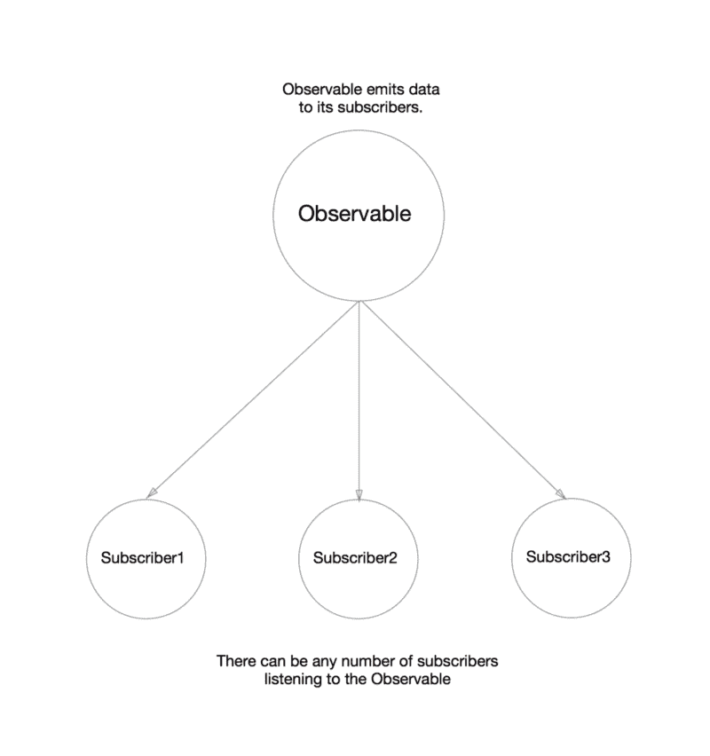
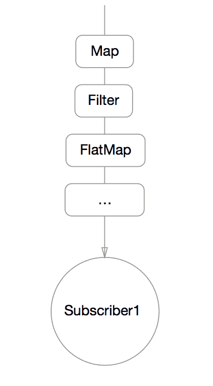
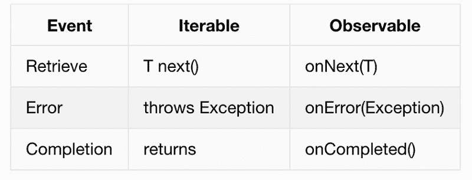
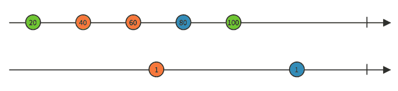
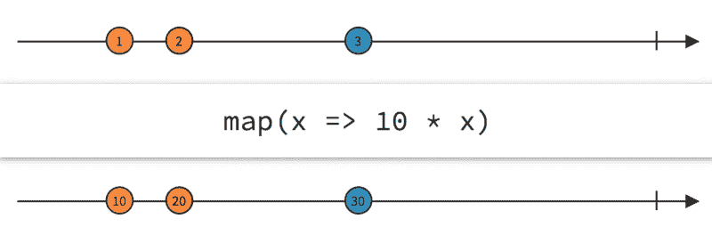
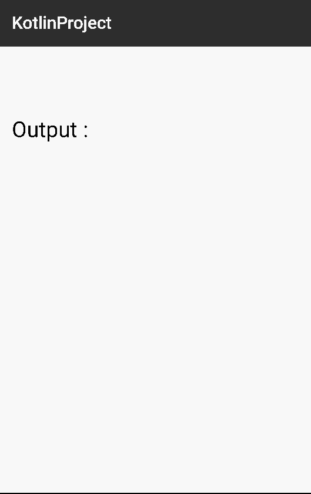

# RxAndroid 和 Kotlin(第 1 部分)

> 原文：<https://www.freecodecamp.org/news/rxandroid-and-kotlin-part-1-f0382dc26ed8/>

艾哈迈德·里兹万


# RxAndroid 和 Kotlin(第 1 部分)

刚开始用 [RxAndroid](https://github.com/ReactiveX/RxAndroid) 的时候，并没有真的上手。我是说，我掌握了抽象概念。但是我不知道我应该在哪里使用它。

但是后来我翻了几个例子，看了几篇真的很好的文章(推荐阅读列表在本文最下面。)我刚拿到！我的反应是:


Such Rx. Much Reactive. Wow!

简而言之，你几乎可以在任何地方使用 Rx。但是**你不应该**。你应该明智地决定它应该去哪里。因为在某些情况下，使用 Rx 比普通的命令式编程要高效 100 倍。在其他情况下，这是不必要的。

我将在 **Kotlin** 和**Java**中演示几个例子，这样您就可以了解什么是 Rx，以及这两种语言的比较。

如果你还不熟悉 Kotlin，它是 Java 的一个很棒的替代品，在 Android 上运行得非常好。哦，它是由 JetBrains 开发的！

附注:科特林语里没有分号。*_*

如果你想了解更多，请查看:

[kot Lin 官方网站](http://kotlinlang.org)

[Android 入门](http://kotlinlang.org/docs/tutorials/kotlin-android.html)

杰克·沃顿关于科特林的论文

[我的博客](https://medium.com/@ahmedrizwan/android-programming-with-kotlin-6ce3f9b0cbe6)；)

现在让我们回到 Rx。

如果你已经对 Rx 有了很好的概念，那么你可以跳过这个话题。否则，请继续阅读。

好吧，那么什么是 Rx？这是“反应式编程”简而言之，反应式编程是一种与**观察者** **模式**密切相关的编程模式，在这种模式下，用户对这些可观察到的事件做出“反应”。

这里有一个图表:



Rx 也是**功能编程**的子集。因此经常被称为功能反应式编程。当订户接收数据时，他们可以对数据应用一系列的**转换**，类似于我们在 Java 8 中对流所做的。

这是另一个有用的图表:



Transformations as the subscriber receives data from observable.

我们甚至可以将不同的水流融合在一起。就是那么灵活！所以现在，请记住，我们可以用从 observables(订阅者)那里收到的数据做很多不同的事情。

现在这个概念已经有点清楚了，让我们回到 RxJava。

在 Rx 中，**用户**实现三种方法与**可观察对象**交互:

1.  onNext(Data):从可观察对象接收数据
2.  onError(Exception):如果抛出异常，则调用该函数
3.  onCompleted():当数据流结束时被调用

这可以与 Java 中的 **Iterables** 相比较。不同的是，iterables 是基于**拉的**，Rx observables 是基于**推的**。可观察对象将数据推送给它的订户。

下面是对比表:



另一件要注意的事情是，Rx 本质上是同步的，这意味着你必须指定你是否希望它是异步的。你可以通过调用**观察**和**订阅**方法来实现。

因此，观察者向他们的订户推送数据流，订户可以在上面列出的方法的帮助下消费这些数据流。借助[大理石图](http://rxmarbles.com)，我们可以更好地理解“溪流”:



A marble diagram representing two different streams.

这些流上的圆圈代表数据对象。箭头表示数据以有序的方式向一个方向流动。

看看这个大理石图:



A mapping of a stream.

像我之前提到的，我们可以使用[](https://github.com/ReactiveX/RxJava/wiki/Alphabetical-List-of-Observable-Operators)**操作符(如 map、filter 和 zip)来**转换**数据(以及流)。上面的图像代表了一个简单的映射。因此，在转换之后，该流的订阅者将获得该流的转换版本。很酷，对吧？**

**现在您应该对 Rx 的工作原理有了一个很好的概念，所以让我们开始实际的实现。**

****

### **实现可观测量**

**我们要做的第一件事是冥想。**

****

**在那之后，创造一个可观察的事物并不那么困难。**

**我们有很多方法可以[创造可观测量](https://github.com/ReactiveX/RxJava/wiki/Creating-Observables)。我在这里列举三个:**

1.  ****Observable.from()** 从 Iterable、Future 或数组中创建一个可观察值。**

```
`//KotlinObservable.from(listOf(1, 2, 3, 4, 5))//JavaObservable.from(Arrays.asList(1, 2, 3, 4, 5));`
```

```
`//It will emit these numbers in order : 1 - 2 - 3 - 4 - 5 //Which should be pretty obvious I guess.`
```

**2. **Observable.just()** 从一个或多个对象创建可观察对象:**

```
`Observable.just("Hello World!") //this will emit "Hello World!" to all its subscribers`
```

**3. **Observable.create()** 通过函数从零开始创建一个可观察对象。我们只需实现 OnSubscribe 接口，然后告诉观察对象应该向其订户发送什么:**

```
`//KotlinObservable.create(object : Observable.OnSubscribe<Int> {    override fun call(subscriber: Subscriber<in Int>) {        for(i in 1 .. 5)            subscriber.onNext(i)        subscriber.onCompleted()    }})`
```

**这是相同代码的 Java 版本:**

```
`//JavaObservable.create(new Observable.OnSubscribe<Integer>() {    @Override    public void call(final Subscriber<? super Integer> subscriber) {        for (int i = 1; i <= 5; i++)            subscriber.onNext(i);        subscriber.onCompleted();    }});`
```

```
`//Using the implementation above, we're telling the observer what //it should do when a subscriber subscribes to it. Hence the name //"onSubscribe".`
```

**我上面写的代码相当于我为 **Observable.from()** 写的例子，但是正如你所看到的，我们可以完全控制应该发出什么以及流应该何时结束。我还可以使用 **subscriber.onError(e)** 发送捕获的异常。**

**现在我们只需要一些订户。**

### **实现订阅者**

**对于 Android，要订阅一个可观察对象，我们首先告诉可观察对象关于我们计划订阅和观察的线程。RxAndroid 给了我们 [**调度器**](https://github.com/ReactiveX/RxJava/wiki/The-RxJava-Android-Module) ，通过它我们可以指定线程。**

**所以让我们以一个简单的“Hello World”可观测为例。这里我们将在**工作线程**上进行订阅，并在**主线程**上进行观察:**

```
`//KotlinObservable.just("Hello World")          .subscribeOn(Schedulers.newThread())           //each subscription is going to be on a new thread.          .observeOn(AndroidSchedulers.mainThread()))           //observation on the main thread          //Now our subscriber!          .subscribe(object:Subscriber<String>(){            override fun onCompleted() {             //Completed            }            override fun onError(e: Throwable?) {             //TODO : Handle error here            }            override fun onNext(t: String?) {             Log.e("Output",t);            }           })`
```

```
`//Java Observable.just("Hello World")        .subscribeOn(Schedulers.newThread())        .observeOn(AndroidSchedulers.mainThread())        .subscribe(new Subscriber<String>() {            @Override            public void onCompleted() {                //Completion            }            @Override            public void onError(final Throwable e) {                //TODO : Handle error here            }            @Override            public void onNext(final String s) {                Log.e("Output",s);            }        });`
```

```
`//You can get more info about schedulers and threading here.`
```

**那么…这是做什么的？**

**当您运行此代码时，它会显示一条日志消息:**

```
`Output: Hello World!`
```

**就是这样！“订阅”就是这么简单。你可以在这里得到更多关于订阅的细节。**

### **一个实际的例子:去抖**

**现在你知道如何创造一些简单的可观测量了，对吗？让我们实现我最喜欢的 rx 示例之一。我想实现这个:**

****

**在这个例子中，我将文本输入到一个**编辑文本**中。这自动触发了一个响应，我打印出文本。**

**现在，响应可能是对 API 的调用。所以每当我输入一个字符时就进行这个 API 调用是很浪费的，因为我只需要最后一个字符的响应。所以我应该只在我停止打字的时候触发一个呼叫——比方说在我完成打字后的一秒钟。**

**那么，在非反应式编程中，我们如何做到这一点呢？嗯，这可不好看！**

#### ****无反应去抖****

**我使用了一个计时器，并安排它在**的 afterTextChanged()** 方法中延迟 1000 毫秒之后调用 **run()** 方法。哦，别忘了在那里加上 **runOnUiThread()** 。**

**从概念上讲，这并不困难，但是代码变得混乱。在 Java 中更是如此！**

**Java 版本:**

**科特林版本:**

#### ****反应溶液****

**一个反应性的解决方案更没有样板文件。只有三个步骤。**

1.  **创造一个可观察的**
2.  **将去抖操作符设置为 1000 毫秒(1 秒)延迟**
3.  **订阅它**

**首先是 Java 代码:**

**现在是科特林·❤**

#### **为了减少样板文件，可以使用 RxBindings。**

**现在几乎没有样板文件，我们可以使用[**rx bindings**](https://github.com/JakeWharton/RxBinding)**，它为 UI 小部件提供了许多超级棒的绑定。它在 Java 和 Kotlin 上都有效！使用绑定，代码变成:****

****如您所见，样板文件很少，代码更加切题。如果我在几个月后回到这段代码，我几乎不用花一分钟就能弄清楚发生了什么。这是无价的！****

****以下是我推荐的一些非常棒的 Rx 资源。一定要看看这些！****

****[官方接收页面](http://reactivex.io)****

****[丹·卢创作的 RxJava 系列](http://blog.danlew.net/2014/09/15/grokking-rxjava-part-1/)****

****[Android Rx 和 Kotlin:案例研究](http://beust.com/weblog/2015/03/23/android-rx-and-kotlin-a-case-study/)****

****[用 Rx 替换 AsyncTasks】](http://stablekernel.com/blog/replace-asynctask-asynctaskloader-rx-observable-rxjava-android-patterns/)****

****[Rx 上的 PhilosophicalHacker 博客](http://www.philosophicalhacker.com/2015/06/12/an-introduction-to-rxjava-for-android/)****

****[在 Rx 中实现 event bus](http://nerds.weddingpartyapp.com/tech/2014/12/24/implementing-an-event-bus-with-rxjava-rxbus/)****

****[RxKotlin](https://github.com/ReactiveX/RxKotlin)****