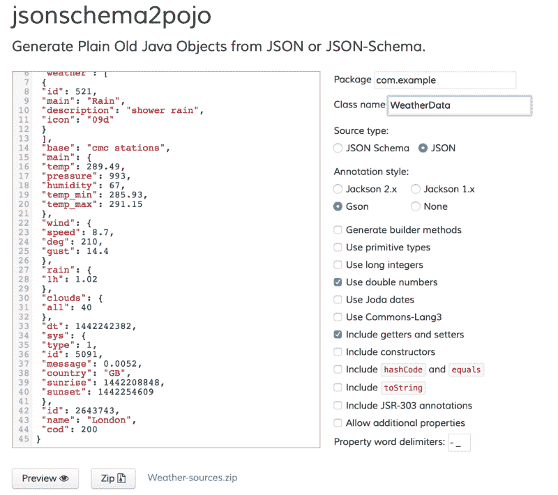
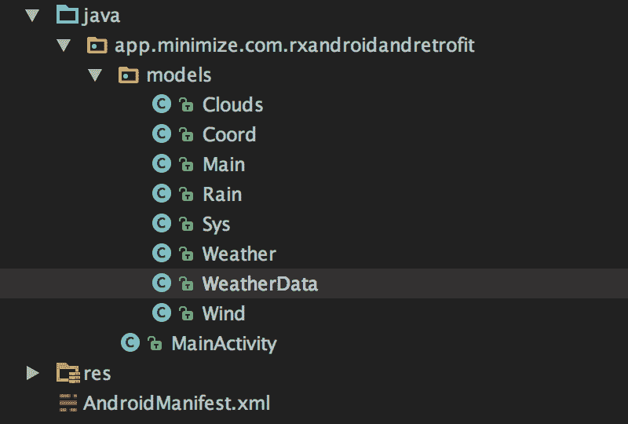
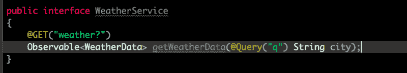
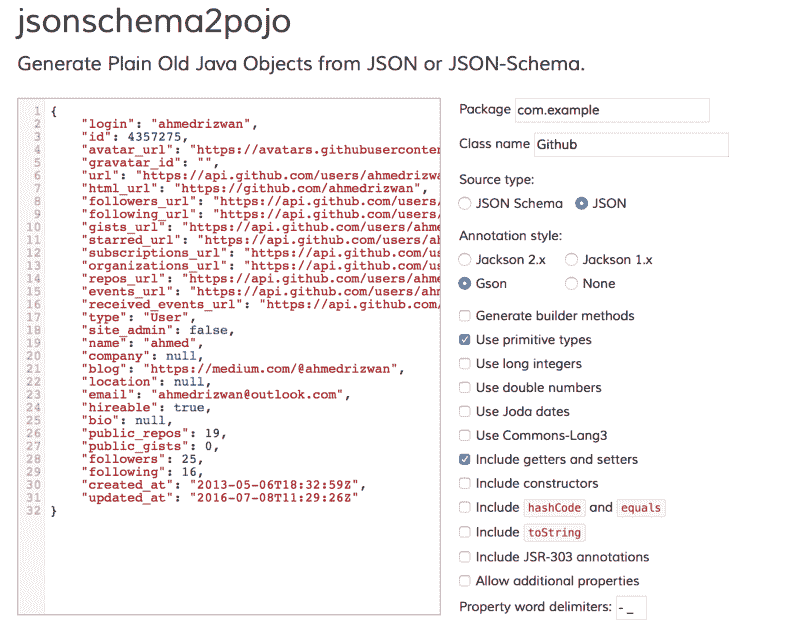
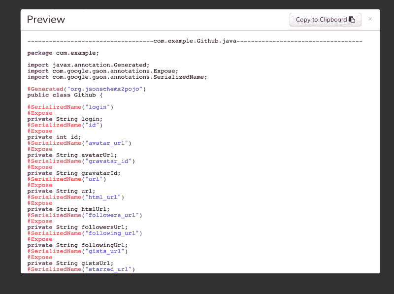
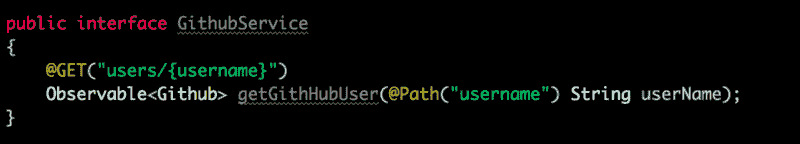
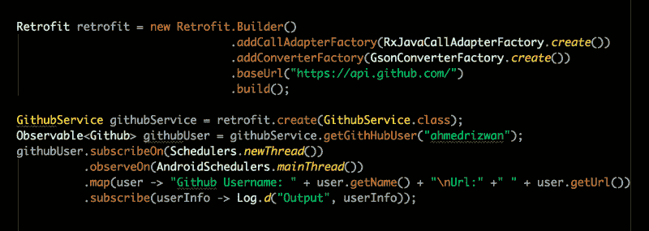

# RxAndroid 和翻新 2.0

> 原文：<https://www.freecodecamp.org/news/rxandroid-and-retrofit-2-0-66dc52725fff/>

艾哈迈德·里兹万

# RxAndroid 和翻新 2.0


好吧，所以这不是新的或任何东西，但我想让我们只是用新的改造 2.0 做一个简单的教程。这应该给我们一个起点。

这不是 RxAndroid 的教程。如果你对 RxAndroid 不太了解，那就先去查一下[这个](https://medium.com/@ahmedrizwan/rxandroid-and-kotlin-part-1-f0382dc26ed8)吧。

那我们就开始吧。在我们开始之前，您需要准备以下物品:

1.  [RxAndroid](https://github.com/ReactiveX/RxAndroid) 和[改装](https://github.com/square/retrofit)
2.  Gson (我将使用 Gson，您也可以使用其他解析器)
3.  互联网连接！

所以在你添加了依赖项之后，你的 gradle 文件应该看起来像这样(忽略 [Retrolambda](https://github.com/evant/gradle-retrolambda) 插件，我添加它只是为了代码简洁，因为… Lambdas！*_*):

现在你可能想知道，改造到底是什么？改造是一个 HTTP 客户端，但是它是类型安全的。这意味着您可以将 HTTP API 转换成 Java 接口。这使得与 API 的交互非常方便。

### 开始的例子

在这个例子中，我将使用 [OpenWeather API](http://openweathermap.org) ，我将尽可能保持它的简单。我会分三步得到今天的[天气预报。](http://openweathermap.org/current)

#### 步骤 1:从 JSON 生成 Java 模型(Pojo)类

下面是 API 的 URL:

```
http://api.openweathermap.org/data/2.5/weather?q=London
```

当您调用它时，返回的响应是:

```
{ “coord”: { “lon”: -0.13, “lat”: 51.51 }, “weather”: [ { “id”: 521, “main”: “Rain”, “description”: “shower rain”, “icon”: “09d” } ], “base”: “cmc stations”, “main”: { “temp”: 289.49, “pressure”: 993, “humidity”: 67, “temp_min”: 285.93, “temp_max”: 291.15 }, “wind”: { “speed”: 8.7, “deg”: 210, “gust”: 14.4 }, “rain”: { “1h”: 1.02 }, “clouds”: { “all”: 40 }, “dt”: 1442242382, “sys”: { “type”: 1, “id”: 5091, “message”: 0.0052, “country”: “GB”, “sunrise”: 1442208848, “sunset”: 1442254609 }, “id”: 2643743, “name”: “London”, “cod”: 200}
```

看起来很乱，对吧？嗯，不用担心，只要去这个牛逼的[网站](http://www.jsonschema2pojo.org)贴上 JSON 就行了。它看起来会像这样:



如果 JSON 需要生成许多模型类，那么更简单的方法是生成一个 **Jar** 并下载、解压，然后添加文件。否则，只需点击预览，并复制粘贴您需要的类。请务必从每个模型类中移除**@ Generated(" org . jsonschema 2 POJO ")**，，因为默认情况下 Android 不会识别此注释。

我下载了 Jar，因为有很多类。也因为我懒。:)

在提取和添加类之后，现在项目树看起来像这样:



到目前为止，一切顺利！


Just an evil raccoon being evil.

#### 步骤 2:为 API 调用创建改进接口

为了改进，您必须为 API 的端点创建一个接口。

在创建界面的时候，你要问自己:人生的意义到底是什么？其次:我需要 API 提供什么信息？

对我来说，这两个问题的答案都是 WeatherData(最顶层的对象)。现在让我们检查一下 URL:

```
http://api.openweathermap.org/data/2.5/weather?q=London
```

在最后有一个**查询**，所以我将这样做:



```
Note: in Retrofit 2.0, the endpoint path string should NOT start with “/” 
```

```
@GET("/weather?") --> incorrect@GET("weather?")  --> correct
```

现在作为参数，我将使用@Query 注释发送查询值。

你会注意到，我正在返回 WeatherData 的**可观察值**。那就是 Rx！

#### 步骤 3:创建改造适配器和 WeatherService 实例

现在，在我们的活动中，我们必须使用基本 URL 和一些其他信息创建一个改造适配器。一旦构建完成，我们就可以初始化一个 **WeatherService** 接口的对象，然后调用这个方法。

看看这段有趣的代码:

所以这里的问题是那些 *addCallAdapter* 和 *addConverterFactory* 方法到底在做什么？

为了让我们的调用返回类型 **Observable** ，我们必须将调用适配器设置为 **RxJavaCallAdapter** 。

addConverFactory 告诉 Retrofit 我希望它使用哪种转换器来序列化 JSON。我更喜欢 GSON 转换器。也有其他转换器可用。

因此，对于这两个，您需要将它们的依赖关系添加到您的 gradle:

```
compile 'com.squareup.retrofit2:adapter-rxjava:2.0.2'compile 'com.squareup.retrofit2:converter-gson:2.0.0'
```

现在运行代码，瞧！它会记录天气情况。

### 一个不同的例子

所以是的…另一个例子！因为为什么不呢？这一次，我将试用 GitHub API。同样只需 3 步。

首先，API 调用 URL:

```
https://api.github.com/users/ahmedrizwan
```

回应是:

```
{    "login": "ahmedrizwan",    "id": 4357275,    "avatar_url": "https://avatars.githubusercontent.com/u/4357275?v=3",    "gravatar_id": "",    "url": "https://api.github.com/users/ahmedrizwan",    "html_url": "https://github.com/ahmedrizwan",    "followers_url": "https://api.github.com/users/ahmedrizwan/followers",    "following_url": "https://api.github.com/users/ahmedrizwan/following{/other_user}",    "gists_url": "https://api.github.com/users/ahmedrizwan/gists{/gist_id}",    "starred_url": "https://api.github.com/users/ahmedrizwan/starred{/owner}{/repo}",    "subscriptions_url": "https://api.github.com/users/ahmedrizwan/subscriptions",    "organizations_url": "https://api.github.com/users/ahmedrizwan/orgs",    "repos_url": "https://api.github.com/users/ahmedrizwan/repos",    "events_url": "https://api.github.com/users/ahmedrizwan/events{/privacy}",    "received_events_url": "https://api.github.com/users/ahmedrizwan/received_events",    "type": "User",    "site_admin": false,    "name": "ahmed",    "company": null,    "blog": "https://medium.com/@ahmedrizwan",    "location": null,    "email": "ahmedrizwan@outlook.com",    "hireable": true,    "bio": null,    "public_repos": 19,    "public_gists": 0,    "followers": 25,    "following": 16,    "created_at": "2013-05-06T18:32:59Z",    "updated_at": "2016-07-08T11:29:26Z"}
```

同样，JSON 看起来相当混乱。

#### **步骤 1:生成 Pojos(普通旧 Java 对象)**

我复制了回复并粘贴到[这里](http://www.jsonschema2pojo.org)(再一次):



点击了预览。

然后我将 Github 类复制到我的项目中。*音乐加强*

#### **步骤 2:为端点创建接口**

现在检查 API URL。我是说，认真检查一下。您将看到端点从用户开始，以用户名结束。

```
https://api.github.com/users/ahmedrizwan
```

所以我创建的界面是这样的:



我创建了一个调用方法，用 **@Path** 注释动态替换端点字符串中*{用户名}* 的值。

#### **步骤 3:创建 GithubService 的适配器和实例**

下面是实现这一点的美丽代码:



你会注意到我将用户对象映射到字符串(你可以用 Rx 来完成。所以它的输出变成了:


这就是了。虽然这篇文章并没有涵盖翻新和 RxAndroid 可以做的一切(当然)，我希望它能让你有一个好的开始。

编码快乐！