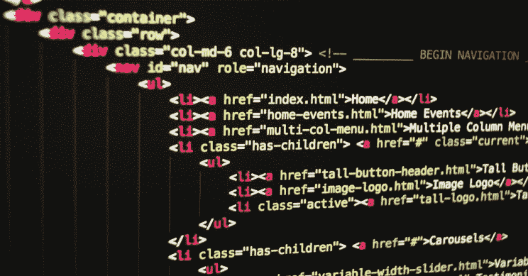
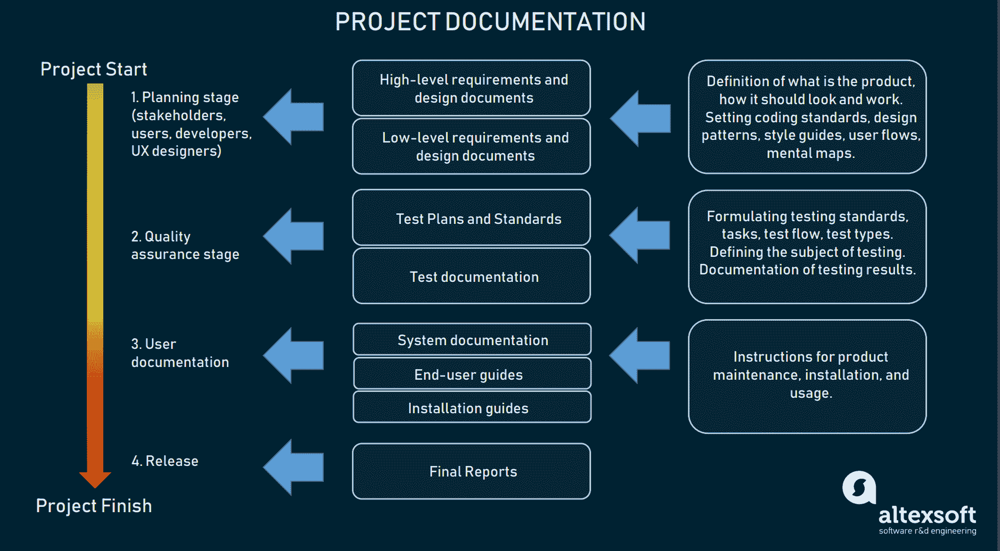

# 牺牲性架构——如何做出放弃和重建系统的艰难决定

> 原文：<https://www.freecodecamp.org/news/sacrificial-architecture-make-tough-decisions-to-abandon-and-rebuild-systems/>

当您使用一个应用程序时，有时尝试继续和改进已经存在的东西不再有意义。相反，你需要重新思考、重组和重建。

对于许多开发人员来说，决定放弃您和其他人投入到现有系统中的所有工作是一个困难的选择。尽管如此，面对中断时对现有代码的执着对开发者和用户都是有害的。

对系统的任何大规模改变的影响远远超出了开发领域。批发系统更换很少是看不见的，这也使得销售人员和营销人员的日子不好过。他们必须向客户解释为什么会发生如此剧烈的变化。

但这并没有降低变革的必要性。

正如生活中的许多其他事情一样，仅仅因为一个选择是艰难和痛苦的，并不意味着它是错误的。进化可能是一个暴力的过程。但是不适应会导致灭绝。

几百万年前，当鱼从海里爬出来时，它们没有继续改进鳍和鳃。运动和呼吸需要全新的系统。这并不意味着鳍和鳃没有价值或者它们的设计有缺陷。事实上，他们的设计完全符合他们的预期目的。但是目的变得无关紧要，所以他们不再适合他们当前的环境。

到时候(它会的)，你必须退后一步，客观地看待形势。对鱼鳍另一个调整会起作用吗？还是仅仅强调它对当前需求的适应性有多差？

## 智能设计选择还是必然反应？

关于牺牲性建筑的大部分讨论都围绕着它是否应该是一个主动的开发过程，而不是一个最后的反动决策。

开发人员应该有意构建生命周期有限的系统吗？还是应该从长远考虑，只有在绝对必要的情况下才进行大规模的变革？

马丁·福勒七年前[介绍了祭祀建筑](https://www.infoq.com/news/2014/11/sacrificial-architecture/)，他认为，将祭祀建筑融入设计过程是一个好主意:

> *“那么刻意选择祭祀建筑是什么意思呢？本质上，这意味着现在接受，在几年的时间里，你将(希望)需要扔掉你目前正在建造的东西。*
> 
> *这可能意味着接受你所整合的跨职能需求的限制。这可能意味着现在就考虑当时机成熟时可以更容易替换的东西——软件设计师很少考虑如何设计他们的作品来支持它的优雅替换。这也意味着认识到在相对较短的时间内被抛弃的软件仍然可以提供大量的价值。”*

当考虑新特性或应用程序作为限制整体开发工作的一种方式时，有意的牺牲也是有用的。

为概念验证系统使用牺牲性架构可以更快地将开发过程推向可启动的实现。正如[中提到的，开放集团敏捷架构框架](https://pubs.opengroup.org/architecture/o-aaf/snapshot/Agile_Architecture_Framework.html):

> “当目标是通过 MVP 试验获得快速的市场反馈时，牺牲架构是一个可以考虑的选择，因为不值得花费太多时间来设计一个如果产品所有者决定改变就必须改变的架构。”

这并不是说主动使用牺牲性架构将消除对反应性牺牲的需要。总会有你和你的团队无法预料的变化和干扰。而破坏往往会导致牺牲和进化。

想一想 COVID 疫情危机是如何扰乱了日常生活的方方面面，从员工如何工作到学校如何教育我们的孩子。

还有许多不那么极端的例子。COVID 危机的一个副作用是电子商务业务和在线交易的快速增长。

但该行业不得不适应消费者对数据隐私日益增长的担忧。所有在线业务都依赖于具有在线发票和支付等关键功能的软件。但是，应用提供商和支付处理商必须快速调整现有系统，以确保符合新标准，如支付卡数据安全标准(PCI-DSS)和欧盟通用数据保护法规(GDPR)。

[Image Source](https://interestingengineering.com/best-youtube-channels-for-coding-and-programming)

同样，代码可能会过时或无法实现其预期目的。有时候，编码实践或编程语言能力的中断意味着您需要进行大规模的更改。

就拿易贝来说吧，自 1995 年成立以来，它已经两次改变了底层编程语言。为什么？因为随着业务的增长，被放弃的语言的能力不能满足易贝的需要和要求。

## 如何预期牺牲

开发人员不可能构建来完全避免替换的需要，他们也不应该专注于这样做。然而，你可以采取一些步骤来计划废弃。

### 构建时考虑替换

正如 Fowler 所说的，你可以用几年后需要替换的想法来构建代码。过时的代码最终会容易受到恶意病毒的攻击，导致浏览器劫持或系统变慢。

这意味着您需要提前考虑代码的局限性，包括性能和可伸缩性，以及其他特性。

### 通过模块化最小化牺牲

一般来说，替换较小的代码比替换整个结构更容易。

就像你不需要花费时间和金钱来更换整个屋顶一样，如果修改一个模块就可以了，那么也没有必要完全重写系统的代码。

因此，构建模块化代码会产生一种架构[,开发人员](https://stackoverflow.blog/2021/03/08/infrastructure-as-code-create-and-configure-infrastructure-elements-in-seconds/)可以根据需要更容易地对其进行修改。

但是模块化并不总是一个有效的解决方案，你应该意识到你的代码的局限性。有时，更换太多零件会削弱结构或使其不稳定。

同样，在现有代码中替换的模块越多，代码整体操作出现问题的可能性就越大。这是持续的逐件更新和大规模更换之间的分界线。

### 保持质量标准

即使当您有意决定构建代码，并且知道您将在不久的将来牺牲它，您也应该始终坚持努力达到或超过公司的质量标准。毕竟，这种牺牲性的建筑可能还会继续生产。

需求也可能发生变化，这就消除了您最初计划淘汰代码的理由。当修改代码时，设计或实现不佳的代码也会使开发人员的生活更加困难。

糟糕的文档和代码结构还会妨碍您理解代码片段之间的联系，使替换和更新变得更具挑战性。

设计糟糕的代码也可能是一个重大的安全风险，也许会让黑客访问公司投入巨资保护的私人数据。

[Image Source](https://www.altexsoft.com/blog/business/technical-documentation-in-software-development-types-best-practices-and-tools/)

质量是一个必须时刻牢记在心的咒语，即使对于一次性代码也是如此。

## 为了更大的利益而牺牲

虽然引用这句谚语可能听起来很老套，但从长远来看，牺牲代码可能确实是为了您的系统和公司的更大利益。

明智、主动地使用牺牲性架构有助于缩短新功能的上市时间。此外，当不可避免地发生计划外的大规模更换时，它可以最大限度地减少工作量。