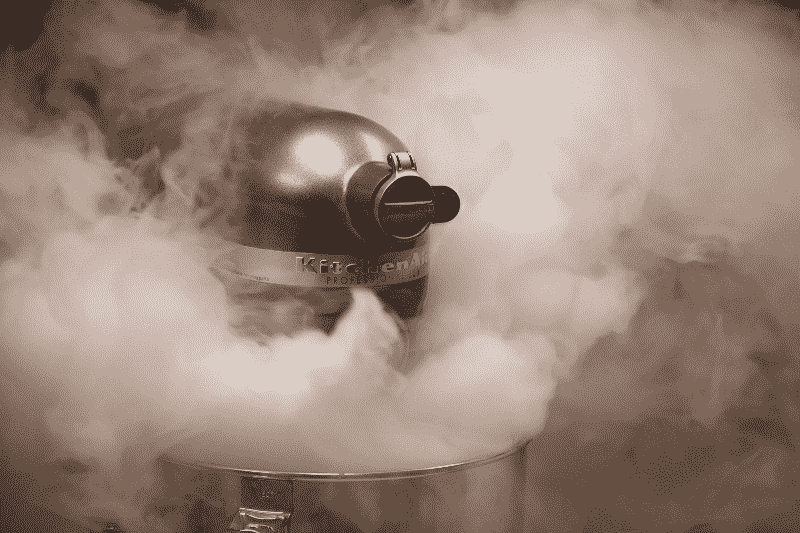
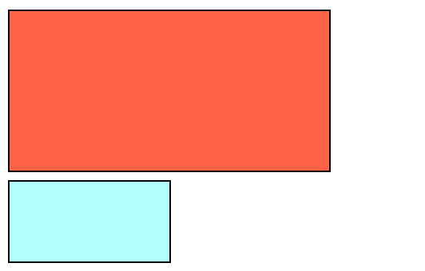
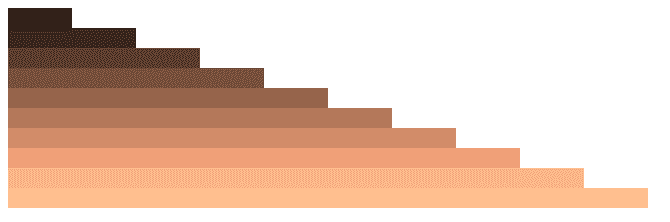

# 如何使用 Sass 混合和循环

> 原文：<https://www.freecodecamp.org/news/sass-mixins-and-loops-171122499a2/>

杰森·阿诺德

# 如何使用 Sass 混合和循环



[Image credit](https://stocksnap.io/photo/XY0VJR2HOQ)

我现在和萨斯的爱情还在继续，我们已经发展到了下一个阶段。一开始是一种更快、更简单的方式来写我的 CSS，现在已经发展成一种更加忠诚的关系。

我们准备做一点实验。我最近尝试了 Sass 最有用的两个功能， **Mixins** 和 **Loops** 。

#### 混音和循环

通过混合和循环，CSS 和另一种编码语言如 JavaScript 之间的界限变得有点模糊。当你从在一个地方定义而在另一个地方调用的函数的角度来考虑你的代码，或者在一段代码上迭代一定次数的循环，你可能不会想到 CSS。我知道我从来没有。

CSS 是用来造型的。为什么我需要循环一个样式或者调用一个在其他地方定义的样式呢？就 CSS 而言，这根本没有意义。完全是外国的。另外，不是有关于'[关注点分离【T1 '(SoC)的东西吗？](https://en.wikipedia.org/wiki/Separation_of_concerns)

但是多想想 SoC，也许这种方式确实更有意义。

CSS 应该处理站点的样式，对吗？那么，为什么我一直使用 JavaScript 的`.style()`方法或 jQuery 的`.css()`方法来处理这个问题呢？为什么我不能在 CSS 内部动态改变样式？

好吧，萨斯让你更接近那个目标。无论你站在哪一边，Sass 中的 Mixins 和 Loops 都可以在设计你的站点时节省大量的时间和精力。

#### 混合蛋白

我先说混合蛋白。用最简单的话来说，你可以把 Mixin 想象成 CSS 的 JavaScript 函数。您在 Sass 代码中的某个地方定义了一个 Mixin，并向它传递您在 Mixin 内部引用的参数。然后，在 Sass 代码的其他地方，调用 Mixin 并传入与参数对应的参数，整个过程就开始运行了。迷惑？是的，有一点，我们来看一个例子。

首先在 Sass 中定义一个 Mixin。这是用`=`完成的。Mixin 定义的语法如下所示(记住在 Sass 中使用`$`来定义变量):

```
=mixinName($param1, $param2, $etc)
  Sass code goes here...
```

然后可以在代码中任何需要的地方调用这个 Mixin。您传递 Mixin 需要的参数，Sass 将所有参数转换成 CSS。

这是我写的一个定义基本盒子的 Mixin 的例子。

```
=box($height, $width, $backgroundColor)
  height: $height
  width: $width
  background-color: $backgroundColor
  margin-bottom: 5px
  border: 1px solid black
```

我已经在 Mixin 的名字后面定义了我的三个参数，在本例中是`box`。然后我有 Sass 代码，其中一些调用参数。现在，只要我想定义一个具有这些特征的盒子，我就可以在我的 Sass 代码中的其他地方使用这个 Mixin。我可以任意多次调用 Mixin，每次传递不同的参数。你用`+`字符调用一个 Mixin。

```
.box-1
  +box(100px, 200px, tomato)

.box-2
  +box(50px, 100px, rbga(100, 255, 255, 0.5)
```

页面现在将这些 CSS 属性呈现到带有`.box-1`和`.box-2`类的页面部分。这是结果。



Exciting!

只有两个盒子可能有点乏味。但是如果你有一个需要定义几个相似项目的站点，Mixins 可以节省你大量的时间。如果您需要更改或添加所有这些属性，您只有一个地方可去。

如果我想通过添加一个`border-radius` 属性将这些盒子变成椭圆形，我只需在 Mixin 中做一次，而不是在 CSS 中为每个盒子做一次。

#### 环

这里介绍的第二个 Sass 特性是循环，它们正是您所认为的那样。这个概念与大多数其他编程语言是一样的。你有一段需要迭代一定次数的代码。

Sass 也有这些选项，它们被称为**控制指令**。它们以符号`@`开始，语法非常容易理解。这些包括一个`@if`、`@for`、`@each`和`@while`。今天我将在这里讲述`@for`，但是你可以在这里阅读更多关于所有这些[的内容。](http://thesassway.com/intermediate/if-for-each-while)

`@for`控制指令有两种不同的选项，即`to`和`through`选项。这是指`lo`操作中的`<e`和>。to 是独占的`e and t`尽管是包含的。

`@for`循环的`through`版本的语法如下:

```
@for <$variable> from <start> through <end>
  Sass code goes here...
```

`to`版本是一样的。把`through`换成`to`就行了。

`$variable`可以是你想要的任何名字。`<sta` rt > `; and` < end >值应为整数。

下面是我写的一个例子，它在页面上创建了 10 个 div，每个 div 都比上一个 div 更宽，颜色也略有不同。我还将它们包含在一个 Mixin 中，这样我就可以传入参数并在任何需要的地方调用它。

```
=graph($height, $baseColor)
  @for $i from 1 through 10
    .line-#{$i}
      height: $height
      width: 2em * $i
      background-color: rgba($i * ($baseColor + 20), $i *  ($baseColor + 10), $i * ($baseColor + 5), 1)
```

这就创建了 10 个不同的 CSS 选择器`.line-1`、`.line-2`等等。每个选择器都有由`$height`指定的**高度**、`2em *`的**宽度**、`i`的**值**以及基于传入的`$baseColor` **号**的背景颜色。

然后我把这个叫做 Mixin，就像其他的一样

```
+graph(10px, 10)
```

这是结果:



So beige!

您还可以在这些循环中添加 CSS 伪类之类的东西。这里是另一个关于`:hover`伪类的例子。

```
=stack
  @for $i from 1 through 30
    .stack-#{$i}
    position: absolute
    height: 100px
    width: 100px
    top $i + 10px
    left $i + 10px
    background-color: rgba($i * 1, $i * 2, $i * 3, 1)

    &:hover
      background-color: rgba($i * 2, $i * 4, $i * 8, 1)
```

像这样调用这个 Mixin(不需要参数):

```
+stack
```

当页面呈现时，循环将运行一次，当鼠标悬停在每个单独的`.stack`元素上时，循环将再次运行。这将改变背景颜色。

用一个`@for`循环来编写这个 Mixin 比写出 299 行 CSS 要容易和快速得多。同样，如果我想为他们所有人改变一些东西，我只做一次，而不是 299 次。

结果并不令人印象深刻，因为你不能停留在截图上。这里有一个 [CodePen](https://codepen.io/thejasonfile/full/wdmpjZ/) 上面所有的例子。

这只是 Sass 提供的两个很好的工具。它们可以帮助你在很短的时间内创建一些外观漂亮、功能强大的 CSS。

我希望你喜欢这篇文章。如果你有任何问题，请让我知道。谢谢！