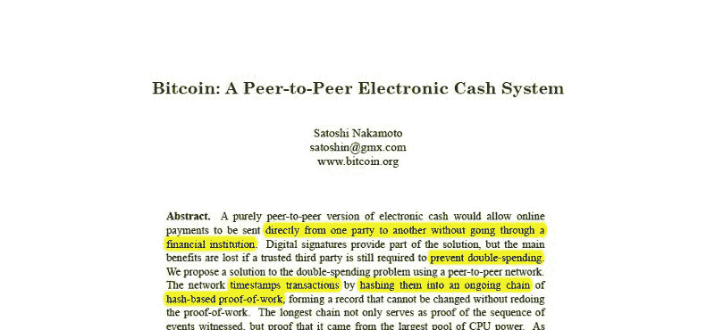
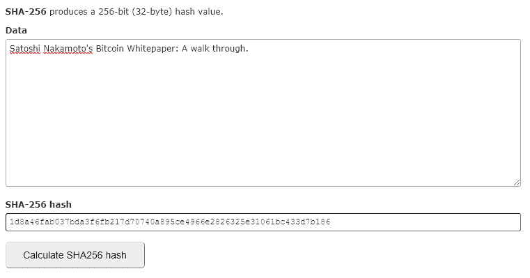
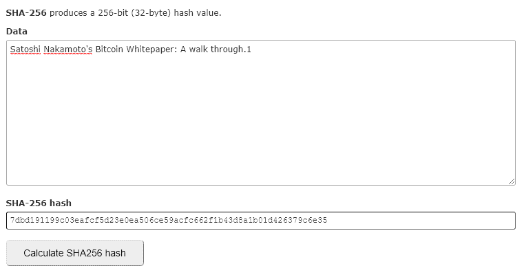

# 中本聪的比特币白皮书:全面而直接的演练

> 原文：<https://www.freecodecamp.org/news/satoshi-nakamotos-bitcoin-whitepaper-a-walk-through-3e9e1dee71ce/>

「依情人节/木」

# 中本聪的比特币白皮书:全面而直接的演练

当我第一次阅读中本聪(2008 年)发布的比特币白皮书时，它澄清了我对加密货币和区块链的许多基本问题。正如许多博览群书的区块链和密码专业人士将证实的那样，这篇论文对于任何希望了解更多该技术的人来说都是一个极好的起点。

这篇文章的目的是带你浏览白皮书，同时让这个领域的新手尽可能容易理解。我将致力于简化一些部分，同时保持内容的准确性。

我们不要再拖延了，直接开始吧。🙌

PDF: [比特币:一种点对点的电子现金系统。](https://bitcoin.org/bitcoin.pdf)

### 在我们开始之前…

区块链是一个分类账或数据库。它分布在大量的节点(计算机)上并由它们维护，而不是由一个机构或团体持有。比特币等加密货币背后的技术目标是，就数据库中数据的有效性和要添加到数据库中的数据的有效性达成一致(共识)🤝。在这种情况下，数据主要是指确定加密货币或代币等数字资产所有权的在线交易数据。

整个分布式分类帐保持最新并被验证，并且网络中的所有参与者都同意其有效性。无需立即深入技术工作，区块链协议(如比特币的基础协议)允许在不需要第三方中介(如银行)的情况下实现这种协议和验证🏦。

在过去，这样的聚会是必要的，以验证金钱的所有权(即，这个人可以花这笔钱)。该党还确保网上支付只花一次。(即，该特定货币不在另一交易中使用)。后一个问题就是所谓的**重复花费问题**。

这一直是交易数字资产的一个主要问题。可以复制组成资产的代码，并在多个事务中使用它。

“区块链”这个名字来源于数据的存储方式。数据按块收集📦其被添加到先前确认的块的链⛓️中。以此为引子，让我们直奔主题，深入研究这份著名的白皮书。

by Mike Alonzo via Unsplash

### 摘要

白皮书的摘要深入到打赌的右侧，并作为该文件的一个小总结。不要担心，如果这超出了你最初的理解🙆‍‍.我们已经介绍了您需要了解的大部分内容，并将在下一节中进行补充。

这里唯一值得一提的是，这篇论文提出了一个点对点的电子现金系统。该系统允许我们彼此直接进行在线支付。银行没有必要解决所有权和重复支出的问题。💁 → 💵 → 🙋‍和❌🏦？

> “电子现金的纯点对点版本将允许在线支付直接从一方发送到另一方，而无需通过金融机构。”

### 介绍

> “互联网上的商务已经变得几乎完全依赖金融机构作为可信的第三方来处理电子支付。”

在写比特币白皮书的时候，金融机构有必要验证所有权并消除重复花费问题。这一点，再加上交易需要可逆(金融机构必须处理调解纠纷)，增加了与交易相关的成本。这意味着，这些金融机构必须有一个最低交易规模才能执行。他们的费用至少需要覆盖交易成本，否则就没有任何意义。如果之前还不清楚的话:银行真的喜欢赚钱💸。

> “……限制最小实际交易规模，切断小额临时交易的可能性。”

这消除了理论上存在但实际上不可行的大量交易机会的选择。由于这种最小交易规模而不可能实现的一个惊人应用是在线内容的微消费，无论这些内容是网络文章、视频、音乐等等。微交易将允许用户在内容被消费时进行难以置信的小额自动支付，而不是必须支付每月订阅费，这可能值得也可能不值得，取决于消费者的使用情况。

这将从根本上改变我们使用互联网的方式。支付每字中等文章、每秒 YouTube 视频、每分钟 Spotify 音乐，甚至每兆字节消耗互联网带宽。

另一个可能的应用是在物联网设备之间直接实现微支付。这里有一个简单的例子，一辆停放的汽车按分钟付费。微消费/交易应用数不胜数，很多只会在未来更加明显。如果我们需要第三方中介，这是根本不可能的。

> “随着逆转的可能性，对信任的需求扩大了。商家必须警惕他们的顾客，向他们索要比他们原本需要的更多的信息。”

by Rawpixel via Unsplash

当进行在线交易时，信任需求不理想的另一个原因是，为了获得所述信任，必须收集个人信息，无论是由银行还是由进行支付的商家收集。这些信息由这些组织存储(通常在一台服务器上)，使他们能够控制个人数据，并使数据易于泄露或被黑客攻击👾。

在过去的十年里，发生了令人难以置信的数据窃取事件——想想雅虎和 Equifax——而且它们正变得日益突出。比特币的目标是在某种程度上复制在线环境中面对面交易的简单性。

如果安迪递给布伦达一张 10 美元的钞票💵，Brenda 不必知道 Andy 的任何信息(如个人信息、信用评分、资产净值等。).她唯一需要知道的是，10 美元从安迪的手中变成了她的手中，并且 10 美元不会奇迹般地复制自己(💵 → 🧙‍ → 💵💵)而安迪有另一个(确切的)复制品可以花。

by Sharon McCutcheon via Unsplash

> 在本文中，我们提出了一种解决重复花费问题的方法，使用对等分布式时间戳服务器来生成事务的时间顺序的计算证明

为了使这成为可能，名为中本聪的人(或人或物)提出了一种使用加密证明的电子支付系统👨‍🏫这使得其成员无需第三方中介就能达成协议(共识)。

### 2.处理

> “每个所有者通过对前一次交易的散列和公钥进行数字签名，将硬币转移给下一个所有者。”

在比特币的世界里，那些拥有比特币的人拥有所谓的“钱包”。这个功能有点类似于经典的钱包，因为它“容纳”你的比特币。与钱包相关联的是一个**公钥**。这是一个可以用来发送比特币的地址，就像某人有一个电子邮件地址或银行账号一样。

此外，还有另一个(非常重要的)与钱包相关的密钥，称为**私钥**🔐类似于它的密码。用这个私钥签名是某人可以证明他们拥有钱包的唯一方式，也是他们能够发送钱包中的比特币的唯一方式。你失去了这个密钥(取决于钱包的类型，你的种子词)，你失去了你的 BTC🙈。

请注意，顺序实际如下:

*   当设置了一个钱包时，该钱包会生成一个随机的私钥。
*   从该私钥(使用椭圆曲线数字签名算法)生成公钥(注意，不可能将其转换回其私钥；是单向算法)。
*   从这个公钥(我们将在隐私部分讨论)生成一个钱包地址。

拥有比特币并不意味着你的钱包里真的有硬币。比特币不是你拥有的或者存储在某个地方的一段代码。与钱包(姑且称之为 ABC123)相关联的 BTC 的值是基于区块链上有多少交易说“地址示例 890…向地址 ABC123 发送 x 量的 BTC”以及有多少交易说“地址 ABC123…向地址示例 453 发送 x 量的 BTC”。

换句话说，比特币区块链存储了数量惊人的数据，这些数据说明了谁向哪个地址发送了多少钱📒。这些数据(谁发送、多少、谁接收)存储在单个事务中。比特币的所有权是通过观察所有进出一个地址的交易来计算的。

现在，如果地址 ABC123 想要使用从另一个地址收到的 BTC，它必须通过用其私钥签署交易**来证明它被允许这样做🔑(条件数据(只有用正确的私钥签名才能使用)可以在调用的上一个事务中找到)。生成一个新的事务，发送 BTC，然后我们重新开始。请记住，这是一个简化的版本；后面会补充一些细节。**

核心提示:比特币不是真正的硬币，它们只是证明你有 BTC 可花的交易组合。私钥用于签署交易和验证所有权。

> "当然，问题是收款人不能证实其中一个所有者没有重复花费硬币。"

> "确认没有交易的唯一方法是了解所有的交易."

通过向整个网络广播每个交易来确认没有交易📡并创建所有先前事务的共享历史(按时间顺序)。

### 3.时间戳服务器

> “时间戳服务器的工作方式是获取一组要打上时间戳的项目的散列，并广泛发布该散列…”

这里的想法是将已经公开广播的事务收集到块中，给它们加上时间戳(添加一个时间值🕔)，添加一些更相关的数据(我们稍后会讲到)，然后通过 SHA256 散列算法运行它⏩。

这基本上是将数据块及其数据转换成一个字符串，该字符串可用于唯一标识该数据块(只有该数据组合才能获得哈希值)。每个新块(在被添加并通过 SHA256 运行之前)现在可以引用链中前一个块的散列，从而按时间顺序创建一个块链。这样，每个人都可以看到过去发生了哪些块(及其事务)以及发生的顺序。

这种通过散列值链接的块链构成了实际的区块链(“区块链”通常用于指代整个协议和系统，但实际上它是块链本身；实际数据库)。

### 4.工作证明& 5。网络

好吧。似乎很棒！但是，我们如何确保添加到链中的数据实际上是正确的呢？任何人都可以用不存在的事务添加块吗？🤔

> “要在对等的基础上实现分布式时间戳服务器，我们需要使用一个工作证明系统…”

我们需要一个系统，要求在能够向区块链添加或建议新区块之前做一些工作。就像网络上臭名昭著的验证码一样，目标是建立一个障碍，使系统变得更难(也不可行)垃圾邮件(或者在比特币的情况下，建议虚假数据)。比特币是这样做的。

我在上面提到过，事务被广播到整个网络。此时，它们尚未添加到链中。挖掘者(那些将要执行将块添加到链中的“工作”的人)将要执行前面提到的散列。他们收集这些事务，并把它们放在一个块中(作为 Merkle Root，我们将在后面讨论)，连同前面提到的时间戳、以前的块散列和一些其他相关数据，如块高度(链中的块号)等等。

将所有这些数据收集到一个块中后，他们使用 SHA256 哈希算法对其进行运算。同样，它的基本功能是将所有数据转换成一个字符串，唯一标识该数据块及其数据。改变块数据中的一个微小的东西，整个散列都会改变(没有已知的模式，但它不是随机的；将其改回来，您将获得完全相同的散列)。

看看当我把数字“1”加到字符串上时，散列值是如何变化的。

Hashing the original title. [Xorbin SHA256 Hash Calculator](https://www.xorbin.com/tools/sha256-hash-calculator)

Adding “1” to the title. [Xorbin SHA256 Hash Calculator](https://www.xorbin.com/tools/sha256-hash-calculator)

比特币区块链不仅仅要求散列值；它想要一个以 17 个 0 开始的散列(在编写时)😲。

> 例如:00000000000000000006 FB 217d 70740 a 895 ce 4966 e 2826325 e 31061 BC 433 D7 b 186

矿工们是如何得到这些数据的？他们需要在数据块的数据中添加一个数字，这个数字被称为“nonce”(他们添加这个数字就像我添加“1”一样)。没有人知道找到正确的散列需要什么数字🤷‍‍.找到它的唯一方法是通过试错法:猜测。

> “…我们通过增加数据块中的随机数来实施工作证明，直到找到一个值，为数据块的哈希提供所需的零位。”

这个猜测正确随机数的过程被称为“挖掘”⛏️.具有最大 CPU 资源(最大计算能力)的挖掘者最有可能第一个找到正确的随机数。

只要超过 51%的 CPU 能力掌握在诚实的节点手中，恶意挖掘者就不可能持续地赢得挖掘过程，并向链中添加虚假数据。最长的链总是被认为是真实的链。

> “……工作难度的证明是通过以每小时平均块数为目标的移动平均值来确定的。如果它们生成得太快，难度就会增加。”

向区块链添加新块的过程大约每 10 分钟发生一次。这通过协议调整挖掘难度(开始 0 的数量)来保持稳定，也称为“难度炸弹”💣相应地，随着计算能力的增长。

### 6.动机

为什么矿工要付出那么多努力和金钱来获得采矿的计算能力呢？

一旦区块达成一致，一个额外的交易将被添加到区块的开头(通常称为“硬币库交易”)，该交易将新创建的 BTC 分配到获胜矿工的钱包地址，奖励他们投入的工作，并提供一种将硬币分发到流通中的方式💰。最重要的是，区块中的每笔交易都有一笔小额交易费，至少这是目标交易费，这笔交易费也归胜出的矿商所有。

> “一旦预定数量的硬币进入流通，奖励就可以完全转变为交易费，并且完全不受通货膨胀的影响。”

我们将跳过第 7 部分(回收磁盘空间)和第 8 部分(简化支付验证)，并在最后简要讨论这两部分。虽然它们是比特币如何运行的重要组成部分，但为了理解论文的核心，它们不那么重要。

### 9.组合和分割值

> 为了允许价值被分割和组合，交易包含多个输入和输出。通常，会有来自先前较大交易的单个输入或组合较小金额的多个输入，以及最多两个输出:一个用于支付，一个将找零(如果有的话)返回给发送者。”

我们之前已经提到了事务是如何组成的，以及地址值是如何计算的。

一个地址中保存的 BTC 值基本上是其所有潜在输入事务的总和(即，朝向该地址尚未花费的所有事务的值**)。当地址持有者想要花掉它的 BTC 时，他们不能只取那个数目然后发送出去。他们必须将他们的输入交易作为一个整体来完成(有点像你需要用一整张钞票来支付，而不能把它切成碎片来支付)。那么这在实际意义上意味着什么呢？**

**安迪回来了👋但现在他有了一个 0.5BTC 的钱包，这个值来自三个未支出的交易输出(UTXO)(或者未来的输入交易；UTXO 作为新交易的输入交易的参考):
a)0.15 BTC
b)0.27 BTC
c)0.08 BTC**

**安迪想送 0.38BTC 给布伦达(幸运的布伦达…🙅).当他生成该交易时，比特币协议将获取所需的输入，这些输入合计等于或高于(≥)支付给 Brenda 的金额，并将使用这些输入作为整体来生成两个输出交易。**

**在我们的例子中，输入交易 **a** 和 **b** 被用于(0.15 + 0.27 = 0.42)生成支付输出交易 0.38BTC 给 Brenda，以及另一个输出交易给 Andy 自己的地址，返回变化(0.42–0.38 = 0.04)。这两种输出交易都可以作为地址持有者未来付款的新输入交易。**

***注意:还有一个矿工/交易费用，这是从等式中去掉的。所以，返回的变化要少一些。***

****核心获取**:输出交易需要全部输入交易，这些交易加起来至少等于或大于输出值。任何超出的部分(投入-(付款+矿工费))都将作为更改返回，并可用作新的投入交易。**

### **10.隐私**

**我们已经在前面讨论了钱包、公钥和私钥的存在和使用。在第三方存储我们的信息的情况下(如银行)，通过处理权限和保护存储信息的服务器来限制对该信息的访问，从而获得隐私。**

**然而，如前所述，这些提供了单点故障和攻击，使其易于丢失和被黑客攻击。那么，如果所有交易都向整个网络公开，比特币如何提供隐私呢？🙃**

**

by Ryan Born via Unsplash** 

> **公开宣布所有交易的必要性排除了这种方法，但仍可通过在另一个地方中断信息流来维护隐私:保持公开密钥匿名**

**这里的想法是保持公钥匿名🕵️.只要人们不能将公钥与特定的人联系起来，就没有办法暴露其身份。**

**目前在协议中使用的一种方式是通过钱包地址的生成，钱包能够保存多个地址。交易数据中不显示公钥，而是使用钱包地址。正如使用单向算法基于私钥创建公钥一样，从公钥生成钱包地址也是如此(使用 SHA256 后跟 RIPEMD160)。我们剩下的(在通过 base58 检查使其更具可读性之后)是在交易数据中使用的钱包地址。**

> **作为额外的防火墙，应该为每个事务使用一个新的密钥对，以防止它们链接到同一个所有者**

**无需深入细节，通过实现计数器并添加递增值以创建子私钥(可用于创建公钥，公钥又可用于生成钱包地址)，可从单个私钥生成多个地址。这样，单个私钥就可以访问有交易进出多个地址的钱包(这被称为确定性钱包)。**

**许多比特币软件和服务在执行交易时会处理这种自动创建钱包地址的功能，因此几乎不可能泄露公开广播交易背后的身份。**

**我们将简要浏览白皮书的剩余部分，然后结束。**

### **7.回收磁盘空间**

> **一旦硬币中的最新交易被埋在足够多的块中，之前用过的交易可以被丢弃以节省磁盘空间**

**当一个事务被埋在足够多的块中时，意味着它已经被系统完全验证，它不一定需要在块中保存所有的事务数据。通过在块的散列中仅包括所有事务的 Merkle 根，而不包括单个事务数据，可以在不破坏散列的情况下实现这一点。有关 Merkle 树的更多信息🌲，查看 W [ikipedia。](https://en.wikipedia.org/wiki/Merkle_tree)**

**简而言之，所有事务都被散列，这些散列在被再次散列之前被配对，以此类推，直到到达所有事务的父散列，称为 Merkle 根。**

### **8.简化支付验证**

**为了验证支付，用户只需要能够通过查询最长的块链并拉出交易所在的 Merkle 分支，将交易链接到链中的某个位置。如果用户可以这样做，他们就可以相信该交易是有效的，因为网络已经包括了该交易，且在该交易上已经建立了进一步的块。**

### **11.计算**

**这就深入到了更为数学化的背景，即当网络的一半以上由诚实节点组成时，为什么网络会是安全的。**

**基本上，只要诚实节点比恶意节点多，随着链的增长，攻击者就越来越难生成另一个链来收回他们已经支付的款项。在特定事务上添加的块越多，攻击者赶上替代链的可能性就越低。**

**这就是为什么我们在谈论(块)确认时经常看到数字 6，它基本上指的是在交易被包括在内之后添加的 6 个块，并作为完整的确认阈值。**

### **完成的**

**我们到了。👏我们已经涵盖了几乎整个原始比特币白皮书。这张纸是我们今天看到的区块链技术的起源。更好地掌握它的内容肯定会帮助你理解当前的行业生态系统。**

**我真的希望这篇文章能帮到你。如果是这样的话，掌声将会很受欢迎，请在下面的评论区告诉我你对这件作品的想法。我很想听听你的想法。任何建议，更正或反馈都非常感谢。**

**祝一切顺利，**

**情人节‘‘t0’@织布机‘‘t1’**

****