# Git Reset 解释——如何使用 Reset 命令拯救世界

> 原文：<https://www.freecodecamp.org/news/save-the-day-with-git-reset/>

这听起来熟悉吗？“救命啊！我犯了错！”“又发生了……我的承诺在哪里？”

我去过那里很多次了。当`git`出问题时，有人叫我的名字寻求帮助。这不仅发生在我教学生的时候，也发生在和有经验的开发人员一起工作的时候。

久而久之，我成了“饭桶”。

我们一直在使用`git`,通常它帮助我们完成工作。但有时，事情会出差错，而且比我们希望的要多得多。

也许我们犯了错误。也许我们丢失了一些我们写的代码。也许我们犯了一些我们不想犯的错误。

Source: xkcd.com

有许多关于`git`的在线资源，其中一些([就像这个](https://ohshitgit.com/))实际上关注的是在这些不想要的场景中会发生什么。

但我总觉得这些资源缺少“为什么”。当提供一组命令时，每个命令有什么作用？您最初是如何获得这些命令的？？

在[之前的一篇文章中，我提供了 Git 内部的可视化介绍](https://medium.com/swimm/a-visualized-intro-to-git-internals-objects-and-branches-68df85864037)。虽然理解`git`的内部是有用的，但是获得理论几乎是不够的。我们如何应用我们对`git`内部的知识，并用它来解决我们自己陷入的问题？

在这篇文章中，我想填补这个空白，详细说明一下`git reset`命令。我们将了解`git reset`在幕后做什么，然后应用这些知识解决各种场景。？

## 共同点—工作目录、索引和存储库

为了理解`git reset`的内部机制，重要的是理解在`git`内记录变化的过程。具体来说，我指的是**工作目录**、**索引、**和**存储库。**

如果您对这些术语有信心，请随意跳到下一部分。如果你想要更深入的解释，请看这个[以前的帖子](https://medium.com/swimm/a-visualized-intro-to-git-internals-objects-and-branches-68df85864037)。

当我们在我们的源代码上工作时，我们从一个**工作目录—** 我们的文件系统上的任何目录开始工作，这个目录有一个**库**与之相关联。它包含我们项目的文件夹和文件，以及一个名为`.git`的目录。

在我们做了一些更改之后，我们希望将它们记录在我们的**存储库**中。一个**库**(简称**回购**)是一个**提交**的集合，每个提交都是项目的**工作树**在过去某个日期的样子的档案，无论是在我们的机器上还是在其他人的机器上。

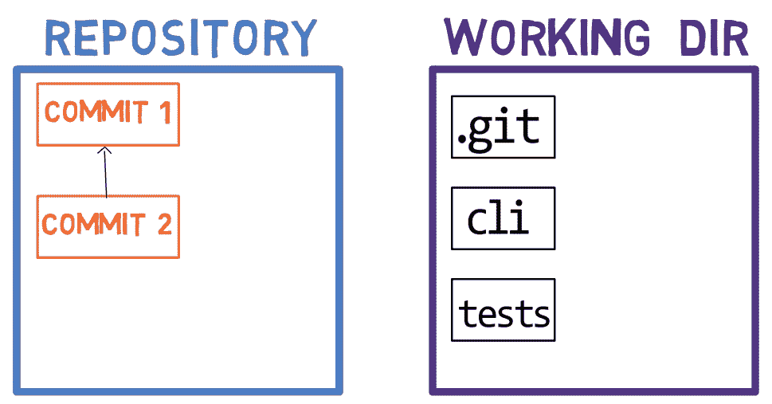

让我们在工作目录中创建一个文件并运行`git status`:

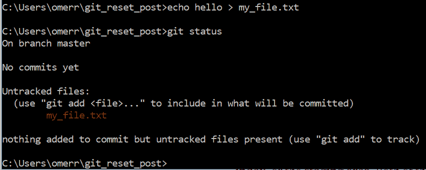

然而，`git`并没有将**工作树**中的变更直接提交到**库**中。

取而代之的是，变更首先被注册在一个叫做**索引**或**中转区**的地方。这两个术语指的是同一个东西，它们经常在`git`的文档中使用。在这篇文章中，我们将交替使用这些术语。

当我们使用`git add`时，我们将文件(或文件内的更改)添加到**暂存区**。让我们对前面创建的文件使用这个命令:

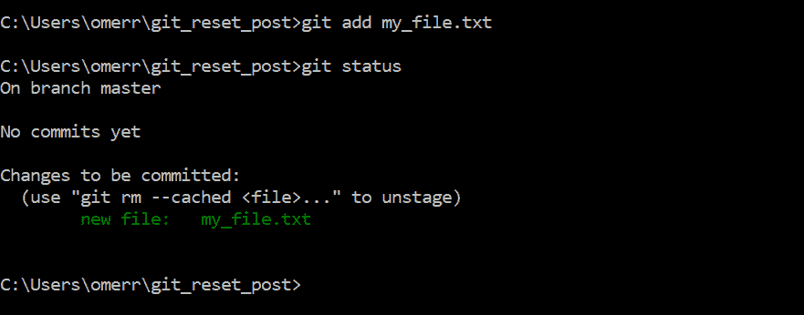

正如`git status`所揭示的，我们的文件已经**准备好**(并准备好“提交”)。然而，它不是任何**提交**的一部分。换句话说，它现在在**工作目录**以及**索引**中，但不在**库**中。

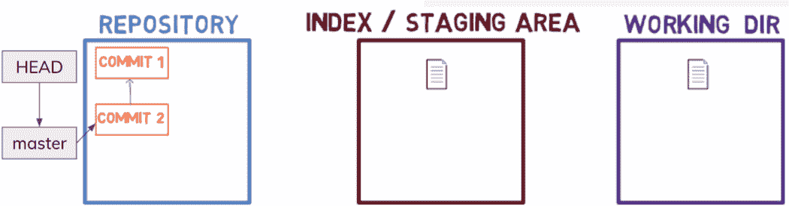

接下来，当我们使用`git commit`时，我们基于**索引**的状态创建一个**提交**。所以新的**提交**(下面例子中的提交 3)将包含预先添加到索引中的文件。

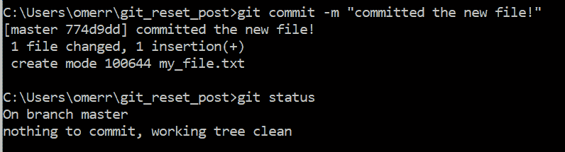

换句话说，**工作目录**与**索引**和**存储库**具有完全相同的状态。

命令`git commit`还使当前分支`master`指向新创建的**提交**对象。

## git 重置的内部工作方式

我喜欢把`git reset`想象成一个与上述过程相反的命令(引入对**工作目录**的更改，将其添加到**索引**，然后**提交**到**库**)。

Git 复位有三种操作模式— `--soft`、`--mixed`或`--hard`。我把它们看作三个阶段:

*   第一阶段
*   第二阶段—更新**指数** — `git reset --mixed`
*   第三阶段—更新**工作方向** — `git reset --hard`

### 阶段 1–更新`HEAD` ( `git reset --soft`)

首先，`git reset`更新`HEAD`指向的任何内容。对于`git reset --hard HEAD~1`，它会将`HEAD`指向的内容(在上面的例子中是`master`)移动到`HEAD~1`。如果使用了`— -soft`标志，`git reset`会停止。

继续我们上面的例子，`HEAD`将指向`commit 2`，因此`new_file.txt`将不是当前提交树的一部分。然而，它将是**索引**和**工作方向**的一部分。

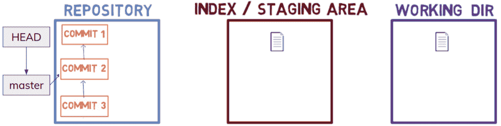

查看`git status`，我们可以看到该文件确实已暂存，但未提交:

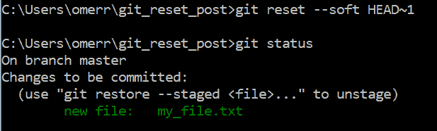

换句话说，我们将流程恢复到使用了`git add`但还没有使用`git commit`的阶段。

### 阶段 2–更新标题索引(`git reset --mixed`)

如果我们使用`git reset --mixed HEAD~1`，那么`git`在更新完`HEAD`指向的任何东西(`master`到`HEAD~1`后都不会停止。它还会将**索引**更新为(已经更新的)`HEAD`。

在我们的例子中，这意味着**索引**将具有与**提交 2** 相同的状态:

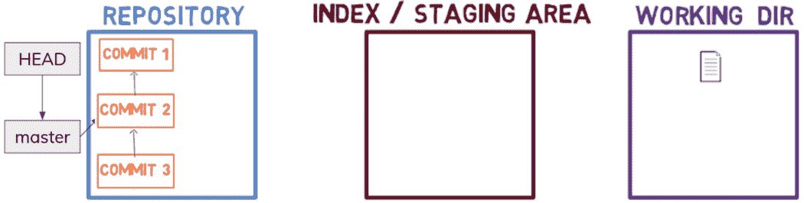

所以我们将流程恢复到使用`git add`之前的阶段——新创建的文件现在是工作目录的一部分，但是**索引**和**存储库**不是。

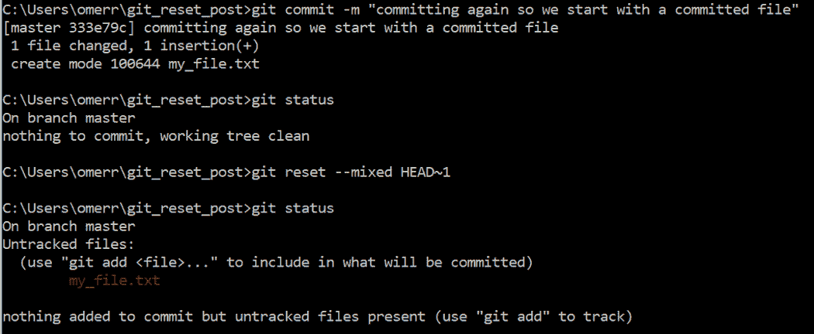

### 阶段 3–将工作目录更新为索引(`git reset --hard`)

通过使用`git reset — hard HEAD~1`，在将`HEAD`所指向的(`master`)更新为`HEAD~1`，以及将**索引**更新为(已经更新的)`HEAD`之后，`git`将继续并更新**工作方向**，看起来像**索引**。

在我们的例子中，这意味着**工作方向**将具有与**索引**相同的状态，该索引已经具有与**提交 2** 相同的状态:

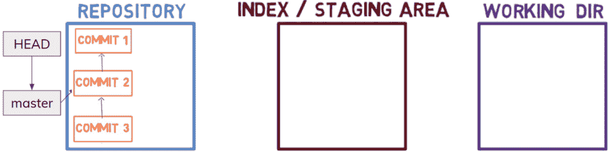

实际上，我们甚至将整个过程还原到了创建`my_file.txt`之前。

## 将我们的知识应用到现实世界中

现在我们已经了解了`git reset`是如何工作的，让我们应用这些知识来拯救我们的一天吧！？

### 1.哎呀！我犯了一个错误。

让我们考虑下面的场景。我们用字符串`This is very importnt`创建了一个文件，暂存并提交它。

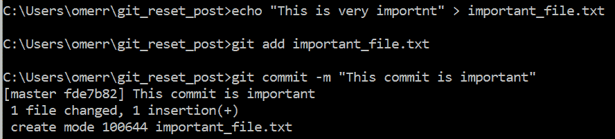

然后……哎呀！我们意识到我们有一个打字错误。？

现在我们知道我们可以很容易地解决这个问题。我们可以恢复上一次提交，并使用`git reset --mixed HEAD~1`将文件恢复到工作目录。现在，我们可以编辑文件的内容，并再次提交。

**提示:**在这种特定情况下，我们也可以使用`git commit --amend`，如这里的所述。

### 2.哎呀！我提交了一些东西到错误的分支——我需要它到一个新的分支

我们都经历过。我们做了一些工作，然后提交它…

哦，不，我们提交到`master`分支，尽管我们应该创建一个新的分支，然后发出一个拉请求。？

在这个阶段，我发现可视化我们所处的状态以及我们想要达到的目标很有帮助:

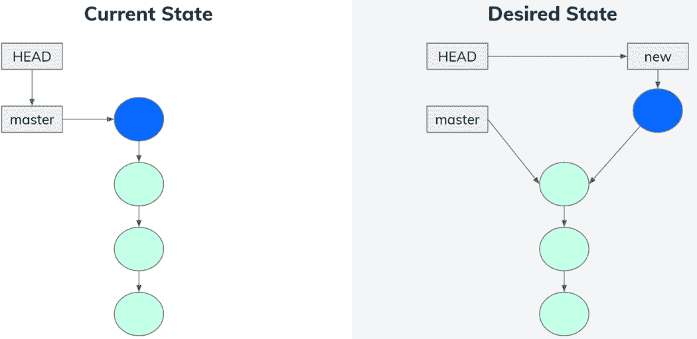

实际上，在当前状态和期望状态之间有三个变化。

首先，`new` branch 指向我们最近添加的提交。第二，`master`指向之前的提交。第三，`HEAD`指向`new`。

我们可以通过三个简单的步骤达到期望的状态:

首先，让`new`分支指向最近添加的提交——这可以通过使用`git branch new`简单地实现。因此，我们达到以下状态:

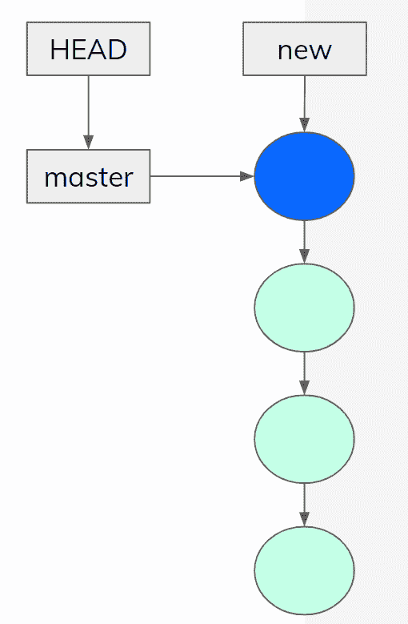

其次，让`master`指向之前的提交(换句话说，指向`HEAD~1`)。我们可以通过使用`git reset --hard HEAD~1`来实现。因此，我们达到了以下状态:

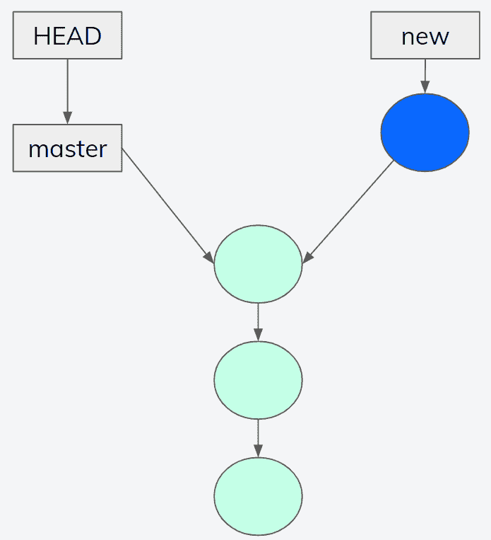

最后，我们希望在分支`new`上，也就是说，让`HEAD`指向`new`。这很容易通过执行`git checkout new`来实现。

总而言之:

*   `git branch new`
*   `git reset --hard HEAD~1`
*   `git checkout new`

### 3.哎呀！我向错误的分支提交了一些东西——我需要它在另一个已经存在的分支上

在这种情况下，我们经历了与上一个场景相同的步骤——我们做了一些工作，然后提交它…

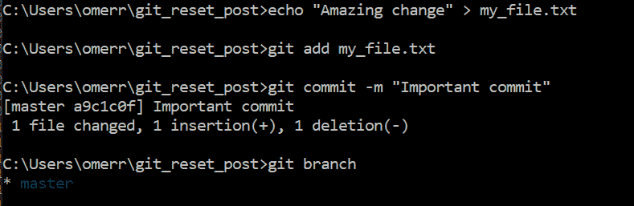

哦，不，我们致力于`master`分支，尽管我们应该致力于另一个已经存在的分支。？

让我们回到我们的绘图板:

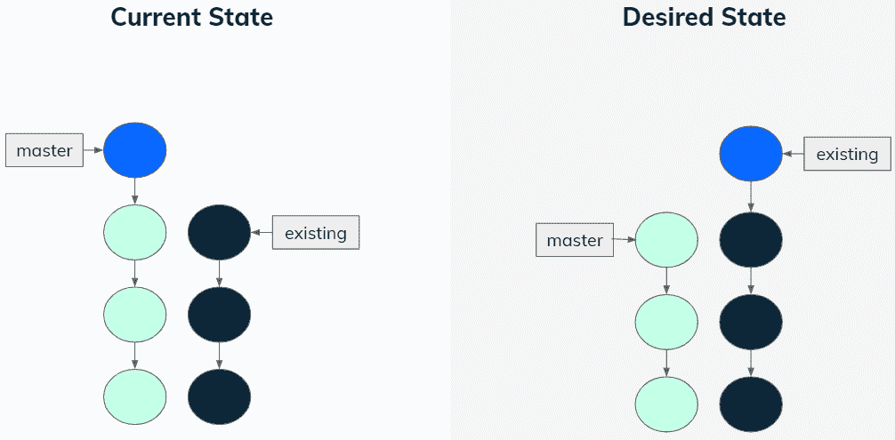

同样，我们可以看到这里有一些不同之处。

首先，我们需要最近的提交在`existing`分支上。由于`master`当前指向它，我们可以简单地要求`git`从`master`分支获取最近的提交，并将其应用到`existing`分支，如下所示:

*   `git checkout existing` —切换到`existing`分支
*   `git cherry-pick master` —将`master`分支上的最后提交应用到当前(`existing`)分支

现在，我们达到了以下状态:

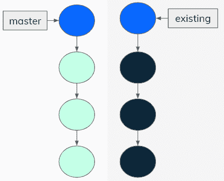

现在我们只需要让`master`指向之前的提交，而不是最近的提交。为此，我们可以:

*   `git checkout master` —再次将活动分支更改为`master`。
*   现在我们回到了最初的分支。

我们已经达到了我们想要的状态:

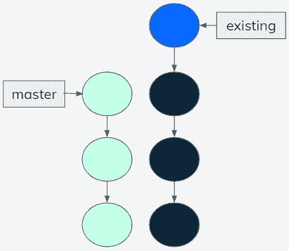

## 摘要

在这篇文章中，我们学习了`git reset`是如何操作的，并阐明了它的三种操作模式——`--soft`、`--mixed`和`--hard`。

然后，我们应用我们关于`git reset`的知识，用`git`解决一些现实生活中的问题。

通过理解`git`的操作方式，我们可以自信地应对各种场景，并且欣赏这个工具的美妙之处？

在以后的文章中，我们将介绍更多的`git`命令，以及它们如何帮助我们解决各种不良情况。

[*欧默·罗森鲍姆*](https://www.linkedin.com/in/omer-rosenbaum-034a08b9/)*[*斯威姆*](https://swimm.io) *的首席技术官。网络培训专家，Checkpoint 安全学院创始人。* [*计算机网络作者(希伯来语)*](https://data.cyber.org.il/networks/networks.pdf) *。访问我的* [*YouTube 频道*](https://www.youtube.com/watch?v=79jlgESHzKQ&list=PL9lx0DXCC4BMS7dB7vsrKI5wzFyVIk2Kg) *。**

### *额外资源*

*   *[在 YouTube 上简要介绍 Git 内部系列](https://www.youtube.com/watch?v=fWMKue-WBok&list=PL9lx0DXCC4BNUby5H58y6s2TQVLadV8v7)*
*   *[Git 内部的可视化介绍——对象和分支](https://medium.com/swimm/a-visualized-intro-to-git-internals-objects-and-branches-68df85864037)*
*   *[成为核心——从零开始创建回购](https://medium.com/swimm/getting-hardcore-creating-a-repo-from-scratch-cc747edbb11c)*
*   *[Git 工具—重置解密(来自 Pro Git Book)](https://git-scm.com/book/en/v2/Git-Tools-Reset-Demystified)*