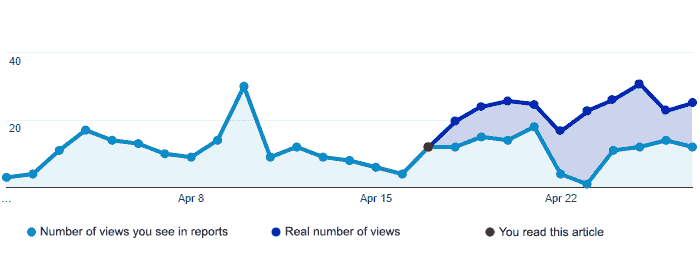
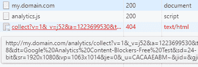
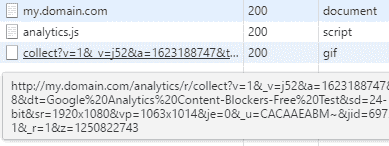
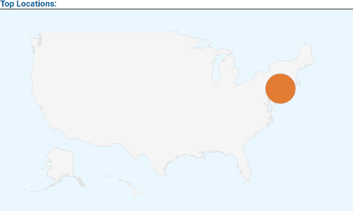

# 如何防止您的分析数据被广告拦截器拦截

> 原文：<https://www.freecodecamp.org/news/save-your-analytics-from-content-blockers-7ee08c6ec7ee/>

> TL；2021 年更新)您现在可以使用[dataunlocker.com](https://dataunlocker.com/)服务，这是一个完全托管的解决方案，用于修复广告拦截器对客户端分析工具(如谷歌分析)的影响。登录 [DataUnlocker Admin](https://admin.dataunlocker.com/) 完成您的 web 应用程序或网站的快速 3 步设置。

> 以下 2017 年的文章解释了在[解决方案](https://github.com/dataunlocker/save-analytics-from-content-blockers)背后使用的一些原则，以及在解决方案的[自述](https://github.com/dataunlocker/save-analytics-from-content-blockers#readme)中描述的一些原则。

当你的产品刚刚起步时，每个用户都很重要。关于他们如何与你的产品互动的数据也是如此。

如果你尝试过使用像[谷歌分析](https://www.google.com/analytics/)这样的分析解决方案，你可能会面临一个问题，你的分析收集被广告拦截器拦截。

根据 [PageFair](https://pagefair.com/) ，[2017 年高达 30%](https://pagefair.com/blog/2017/adblockreport/) 的互联网用户使用广告拦截器，并且这个数字还在不断增长。

本文将解释一些技术方法，你可以采取这些方法来防止广告拦截器也阻止你的分析。在本文中，我们将使用 [Google Analytics](https://www.google.com/analytics/) ，尽管其中的大部分可以应用于其他分析工具。



### 一些绕过广告拦截器的方法

几乎所有的广告拦截器都通过相同的方法工作:它们不允许一些 http(s)浏览器请求与过滤库的特定掩码相匹配的 URL 上的内容。

大多数广告拦截器默认将[www.google-analytics.com](http://www.google-analytics.com)列入黑名单，并阻止[谷歌分析 JavaScript 库](https://developers.google.com/analytics/devguides/collection/analyticsjs/)向其分析服务器发送或从其分析服务器检索数据的任何尝试。

对开发者来说幸运的是，默认情况下，广告拦截器不会拦截对我们自己域名的请求，因为这样做可能会损害网络应用的功能。这种差距揭示了一种避免分析阻塞的方法，直到您的 web 服务变得足够知名，其一些 URL 出现在广告拦截过滤器中。

事实上，即使在一些 URL 出现在内容过滤库中之后，您也可以通过发明可怕的东西来开始玩广告拦截器，例如每小时改变分析 URL(尽管这超出了本文的范围)。这些方法中的一些被像[DataUnlocker.com](https://dataunlocker.com/)和 [Adtoniq](https://adtoniq.io/) 这样的服务所应用，这些服务为用户提供了无广告拦截器的体验，即使广告拦截器已经打开。

### 对我们将要做的事情的高层次解释

在本文中，我们将假设我们在服务器端没有权限限制。我们将为 Node.js 平台编写演示解决方案(几行代码)。一旦您理解了这是如何工作的，您应该能够将这个解决方案移植到任何编程语言或平台上。

我将描述的解决方案非常简单，如果你是一个有经验的 web 开发人员，可能只需要几分钟就可以完成。

我们将使用一种简单的代理方法，而不需要深入到[谷歌分析测量协议](https://developers.google.com/analytics/devguides/collection/protocol/v1/)中。简而言之，解决方案如下所示:

1.  首先，[下载](https://www.google-analytics.com/analytics.js)Google Analytics JavaScript 库本身，并将其托管在您的服务器上。
2.  然后修改下载库中的代码，使用 find-replace 将目标主机从*www.google-analytics.com*改为您自己的域名。
3.  将代码库中默认 Google Analytics 脚本的链接替换为修改后的链接。
4.  创建一个[代理](https://en.wikipedia.org/wiki/Proxy_server)端点到后端的 Google Analytics 服务器。这里的一个重要步骤是额外检测客户端的 IP 地址，并将其明确写入对 Google Analytics 服务器的请求中，以保持正确的位置检测。
5.  测试结果。你完了！

### 完整的技术实现演练

下面所有的代码和描述的步骤都可以在 GitHub 上[获得。下面的描述解释了该方法的基础，当然，建议的方法可以改进为更加“防阻塞”](https://github.com/dataunlocker/save-analytics-from-content-blockers)

在谷歌分析中，首先[为你的财产(网络服务)获取一个唯一的跟踪 ID](https://support.google.com/analytics/answer/1042508?hl=en) 。我们将在本文中使用*UA-98253329–1 跟踪 ID* 进行演示。别忘了把跟踪码换成你的。

Google 建议在您的 web 服务中添加以下简化代码来实现分析:

```
<script>
(function(i,s,o,g,r,a,m){i['GoogleAnalyticsObject']=r;i[r]=i[r]||function(){
  (i[r].q=i[r].q||[]).push(arguments)},i[r].l=1*new Date();a=s.createElement(o),m=s.getElementsByTagName(o)[0];a.async=1;a.src=g;m.parentNode.insertBefore(a,m)
  })(window,document,'script',
'https://www.google-analytics.com/analytics.js','ga');
  ga('create', 'UA-98253329-1', 'auto');
  ga('send', 'pageview');
</script>
```

简而言之，这段代码通过在文档中插入 Script 标签来加载 Google Analytics JavaScript 库(如果之前没有加载的话)。这个库包括了所有的分析逻辑集合，这是我们唯一需要做的事情。

#### **第一步:下载并修补谷歌的分析库**

直接从[*【https://www.google-analytics.com/analytics.js】*](https://www.google-analytics.com/analytics.js','ga')下载脚本，用任何文本编辑器打开并替换所有出现的:

```
www.google-analytics.com
```

使用这个字符串:

```
"+location.host+"/analytics
```

通过以这种方式修补分析库，它将开始向本地主机(*my.domain.com/analytics)*端点而不是*www.google-analytics.com*发出请求。替换后，将这个打了补丁的 *analytics.js* 文件放在你的服务器上。

#### **步骤 2:用修补过的脚本替换分析脚本**

让我们以这种方式修改 Google Analytics 嵌入代码，以便它使用我们的修补库而不是默认库:

```
<script>
(function(i,s,o,r){i['GoogleAnalyticsObject']=r;i[r]=i[r]||function(){
  (i[r].q=i[r].q||[]).push(arguments)},i[r].l=1*new Date()})(window,document,'script','ga');
  ga('create', 'UA-98253329-1', 'auto');
  ga('send', 'pageview');
</script>
<script src="/analytics.js" async></script>
```

请注意，这里的浏览器将在您的服务器的文档根目录中搜索打了补丁的分析脚本，在这种情况下，*my.domain.com/analytics.js.*检查您是否将脚本放在了文档根目录中或更改了上面脚本标签中的路径。您还可以通过在本地服务器上运行测试来检查结果(参见[自述文件](https://github.com/dataunlocker/save-analytics-from-content-blockers#readme)了解如何运行 GitHub 示例)。

您应该在浏览器的开发工具中看到类似这样的内容[:](https://developer.chrome.com/devtools)



最终，我们希望下载修补过的 *analytics.js* 的行为返回一个成功的响应——200(OK)或 304(未修改)状态。但是此时，对 my.domain.com/analytics/collect*的请求应该以 404 状态响应，因为我们还没有实现代理服务器。*

#### **步骤 3:实现最简单的代理服务器**

现在我们要编写一些代码。我们的目标是实现[代理服务器](https://en.wikipedia.org/wiki/Proxy_server)，它将把我们的分析请求从我们的服务器传输到真正的谷歌分析服务器。我们可以用很多方法做到这一点，但是作为一个例子，让我们使用 [Node.js](http://nodejs.org) 和 [Express.js](http://expressjs.com) 和 [express-http-proxy](https://www.npmjs.com/package/express-http-proxy) 包。

将示例中的所有文件收集在一起([参见 GitHub](https://github.com/dataunlocker/save-analytics-from-content-blockers) )，我们最终应该得到以下 JavaScript 服务器代码:

```
var express = require("express"), 
    proxy = require("express-http-proxy"), app = express();

app.use(express.static(__dirname)); // serve static files from cwd

function getIpFromReq (req) { // get the client's IP address
    var bareIP = ":" + ((req.connection.socket && req.connection.socket.remoteAddress)
        || req.headers["x-forwarded-for"] || req.connection.remoteAddress || "");
    return (bareIP.match(/:([^:]+)$/) || [])[1] || "127.0.0.1";
}

// proxying requests from /analytics to www.google-analytics.com.
app.use("/analytics", proxy("www.google-analytics.com", {
    proxyReqPathResolver: function (req) {
        return req.url + (req.url.indexOf("?") === -1 ? "?" : "&")
            + "uip=" + encodeURIComponent(getIpFromReq(req));
    }
}));

app.listen(1280);
console.log("Web application ready on http://localhost:1280");
```

这里最后几行做了代理。我们在这里做的唯一技巧是，我们检测并以一种[测量协议 URL 参数](https://developers.google.com/analytics/devguides/collection/protocol/v1/parameters#uip)的形式显式附加客户端的 IP 地址，而不仅仅是代理。这是收集精确位置数据所必需的，因为所有对 Google Analytic 的请求最初都来自我们服务器的 IP 地址，这个地址保持不变。

在设置了我们的服务器代理之后，我们可以检查对我们的 */collect* 端点的请求现在是否成功地返回了 200 OK HTTP 状态:



例如，我们可以使用匿名连接来验证位置是否被正确提取。



这种“代理服务器”方法是一种快速的分析方法，可以让您的服务避开广告拦截器。但这种方法依赖于浏览器端，如果浏览器脚本出于某种原因没有向我们的服务器发送分析信息，我们将一无所获。

如果您想要实现一个可靠的解决方案，最后一个可能的步骤是通过使用可用于不同语言的服务器端库( [NodeJS](http://github.com/peaksandpies/universal-analytics) 、 [Python](http://github.com/mirumee/google-measurement-protocol) 、 [Ruby](https://github.com/tpitale/staccato) 、 [PHP](https://github.com/theiconic/php-ga-measurement-protocol) )直接从服务器发送分析。这种方法肯定会避免任何内容拦截器，因为对分析服务器的每个请求都直接来自我们的服务器。

同样，演示应用程序在 GitHub 上[可用，请随意测试！如果你使用这种方法有任何反馈或有趣的经历，请告诉我。](https://github.com/dataunlocker/save-analytics-from-content-blockers)

感谢阅读！