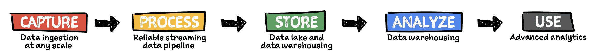
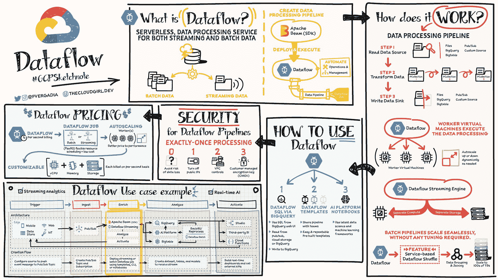
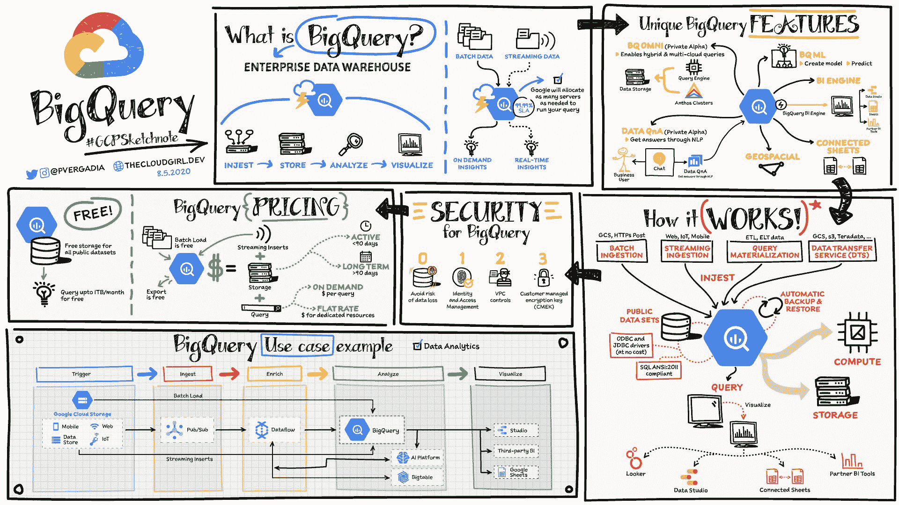

# 如何构建可扩展的数据分析管道

> 原文：<https://www.freecodecamp.org/news/scalable-data-analytics-pipeline/>

每个应用程序都会生成数据，但是这些数据意味着什么呢？这是所有数据科学家受雇来回答的问题。

毫无疑问，这些信息对一个企业来说是最宝贵的商品。但是理解数据、创造见解并将其转化为决策更为重要。

随着数据量的不断增长，数据分析管道必须具有可扩展性，以适应变化的速度。由于这个原因，选择在云中建立管道是非常明智的(因为云提供了按需可伸缩性和灵活性)。

在这篇文章中，我将解释如何在 Google Cloud 中构建一个可伸缩的、适应性强的数据处理管道。别担心，这些概念适用于任何其他云或内部数据管道。

## 创建数据分析管道的 5 个步骤:

5 steps in a data analytics pipeline

*   首先，您从数据源获取数据
*   然后处理和丰富数据，以便您的下游系统能够以它最理解的格式利用它们。
*   然后，您将数据存储到数据湖或数据仓库中，用于长期存档或报告和分析。
*   然后，您可以通过将数据输入分析工具来分析这些数据。
*   应用机器学习进行预测，或创建报告与您的团队共享。

让我们更详细地看一下这些步骤。

## 如何获取数据

根据数据的来源，您可以有多种选择来接收它们。

*   使用数据迁移工具将数据从内部或从一个云迁移到另一个云。谷歌云为此提供了一个[存储转移服务](https://cloud.google.com/storage-transfer-service)。
*   要从第三方 saas 服务获取数据，请使用 API 并将数据发送到数据仓库。在 Google Cloud [BigQuery](https://cloud.google.com/bigquery) 中，无服务器数据仓库提供了一种[数据传输服务](https://cloud.google.com/bigquery-transfer/docs/introduction)，允许你从诸如 YouTube、Google Ads、亚马逊 S3、Teradata、ResShift 等 saas 应用程序中引入数据。
*   您还可以通过发布/订阅服务从您的应用程序中传输实时数据。您可以配置一个数据源，将事件消息推送到发布/订阅中，订阅者从发布/订阅中获取消息并对其采取适当的操作。
*   如果您有物联网设备，他们可以使用支持物联网设备 MQTT 协议的云物联网核心传输实时数据。您还可以将物联网数据发送到发布/订阅。

## 如何处理数据

一旦接收到数据，就需要对其进行处理或丰富，以使其对下游系统有用。

在 Google Cloud 中有三个主要工具可以帮助你做到这一点:

*   [Dataproc](https://cloud.google.com/dataproc) 本质上是托管 Hadoop。如果您使用 Hadoop 生态系统，那么您会知道设置它会很复杂，需要几个小时甚至几天。Dataproc 可以在 90 秒内启动一个集群，因此您可以快速开始分析数据。
*   [Dataprep](https://cloud.google.com/dataprep) 是一款智能图形用户界面工具，帮助数据分析师快速处理数据，无需编写任何代码。
*   Dataflow 是一种无服务器的数据处理服务，用于处理流数据和批处理数据。它基于 Apache Beam 开源 SDK，使您的管道可移植。该服务将存储与计算分离开来，使其能够无缝扩展。更多详情请参考下面的 [GCPSketchnote](https://thecloudgirl.dev/dataflow.html) 。

## 如何存储数据

处理后，您必须将数据存储到数据湖或数据仓库中，以便长期存档或用于报告和分析。

在 Google Cloud 中有两个主要工具可以帮助你做到这一点:

[Google Cloud Storage](https://cloud.google.com/storage) 是一个对象存储库，用于存储图像、视频、文件等，有四种类型:

1.  [标准存储](https://cloud.google.com/storage/docs/storage-classes#standard):适用于频繁访问的“热”数据，包括网站、流媒体视频和移动应用。
2.  [近线存储](https://cloud.google.com/storage/docs/storage-classes#nearline):低成本。适用于可存储至少 30 天的数据，包括数据备份和长尾多媒体内容。
3.  [Coldline 存储:](https://cloud.google.com/storage/docs/storage-classes#coldline)成本非常低。适用于可存储至少 90 天的数据，包括灾难恢复。
4.  [存档存储:](https://cloud.google.com/storage/docs/storage-classes#archive)成本最低。适用于可以存储至少 365 天的数据，包括监管归档。

[BigQuery](https://cloud.google.com/bigquery) 是一个无服务器的数据仓库，可以无缝扩展到数 Pb 的数据，而无需管理或维护任何服务器。

您可以使用 SQL 在 BigQuery 中存储和查询数据。然后，您可以轻松地与团队中的其他人共享数据和查询。

它还包含 100 个免费的公共数据集，您可以在分析中使用。它还提供了到其他服务的内置连接器，因此可以轻松地将数据接收到其中，并从中提取数据以进行可视化或进一步处理/分析。

## 如何分析数据

一旦数据被处理并存储在数据湖或数据仓库中，就可以进行分析了。

如果您使用 BigQuery 来存储数据，那么您可以使用 SQL 在 BigQuery 中直接分析该数据。

如果你使用谷歌云存储，那么你可以很容易地将数据转移到 BigQuery。

BigQuery 还通过 BigQueryML 提供机器学习功能。因此，您可以使用可能更熟悉的 SQL 从 BigQuery UI 创建模型并进行预测。

## 如何使用和可视化数据

### 使用数据

一旦数据进入数据仓库，您就可以使用它们来获得洞察力，并通过机器学习进行预测。

对于进一步的处理和预测，您可以根据需要使用 Tensorflow 框架和 AI 平台。

Tensorflow 是一个端到端的开源机器学习平台，拥有工具、库和社区资源。

**[AI 平台](https://cloud.google.com/ai-platform)** 让开发者、数据科学家、数据工程师轻松简化他们的 ML 工作流程。它包括从准备- >构建- >验证- >部署开始的 ML 生命周期的每个阶段的工具。

### 可视化数据

有许多不同的数据可视化工具，其中大多数都有一个到 BigQuery 的连接器，可以在您选择的工具中轻松创建图表。

Google Cloud 提供了一些工具，你可能会觉得有帮助。

*   Data Studio 是免费的，不仅可以连接到 BigQuery，还可以连接到许多其他服务，方便数据可视化。如果你使用过 Google Drive，分享图表和仪表盘就像这样——非常简单。
*   此外, [Looker](https://cloud.google.com/looker) 是一个商业智能、数据应用和嵌入式分析的企业平台。

## 结论

数据分析管道中有很多东西。无论您选择使用哪种工具，都要确保它们能够随着未来数据的增长而扩展。

更多这样的内容，你可以在 Twitter 上关注我， [@pvergadia](https://twitter.com/pvergadia) 并访问我的网站， [thecloudgirl.dev](https://thecloudgirl.dev/) 。