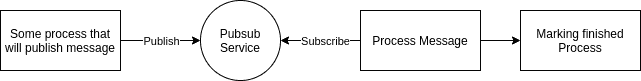
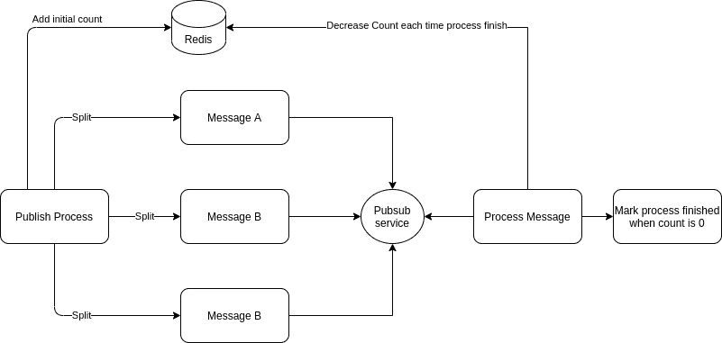

# 如何使用进程分割和 Redis 来扩展系统

> 原文：<https://www.freecodecamp.org/news/scale-system-split-processes/>

您是否曾经在处理一个非常庞大或繁重的流程时遇到过麻烦？如果是这样，我可以帮你想出如何更好地管理它。

在这篇文章中，我将分享我目前是如何管理一条太大而无法在一个进程中处理的消息的。我已经把它分成不同的块，这导致了独立的过程。

我不会涉及太多的技术细节，而是更多的架构过程。我将讨论一些关于缓存使用和 pubsub 的内容，但我不会深入讨论实现的细节。相反，我将关注模式本身。

## 问题是

Photo by [Danielle MacInnes](https://unsplash.com/@dsmacinnes?utm_source=ghost&utm_medium=referral&utm_campaign=api-credit) / [Unsplash](https://unsplash.com/?utm_source=ghost&utm_medium=referral&utm_campaign=api-credit)

也许您想到的第一个问题是，为什么我们需要将单个流程拆分成几个并发流程？

这样做可能有几个原因。然而，对我来说，我这样做是因为这个信息太大了。

为了让你对我的情况有所了解，让我用这个简单的图表向你简单介绍一下:

I'm not a great diagram maker, but this should get the point across

用文字来简化它，想象两个独立的服务，服务 A 和服务 B，中间有一个 pubsub 服务。

如果您不确定什么是 pubsub 服务，就把它想象成一个代理，帮助消息从一个服务到达另一个服务。

然后，服务 A 将发布一条消息，通过 pubsub，服务 B 将处理这条消息。在它完成这个过程之后，它将执行另一个过程来标记消息已经被处理。

够简单吧？

只是在某些情况下，当消息太大时，由于 pubsub 服务的限制，它不会成功发布消息。

好了，这应该给你一个我遇到的问题的概述。那么我是如何解决这个问题的呢？在下一部分，我将向您介绍我的解决方案。

## 我的第一次尝试

Photo by [Dose Media](https://unsplash.com/@dose?utm_source=ghost&utm_medium=referral&utm_campaign=api-credit) / [Unsplash](https://unsplash.com/?utm_source=ghost&utm_medium=referral&utm_campaign=api-credit)

我想到的第一件事是增加 pubsub 服务可以处理的大小，这可以通过一个简单的配置更改来实现。

但是生活不会太有趣，如果是那么简单的话，对吗？如果消息越来越大会发生什么？我们要不断增加公共订阅的大小吗？

事实证明，这样做会导致很多可伸缩性问题。对于长期解决方案来说并不好。

然后我想到了另一个我认为可能解决它的解决方案:我将那个消息拆分成几个消息，并尝试分别处理那些部分。

现在，这个系统看起来像这样:

My updated system/process

从图中可以看出，消息被分成了几个更小的消息。对于每种情况和流，如何拆分以及需要拆分消息的哪一部分可能会有所不同。

不过，在我的例子中，我的消息实际上包含了一个项目列表，所以我可以按每个项目对它进行拆分。

假设我有 10 件物品。以前，它会在一封邮件中发布所有 10 个项目。但是现在，在将消息拆分后，它会将该消息变成 10 条消息。

这导致一个过程变成几个过程。单个发布将变成 10 个发布，这又将把单个过程变成 10 个过程。

从这个角度看，这可能并不理想，但这是我想到的最好的解决方案，而且确实有效。

就这样，只是把它分开吗？

不完全是——还记得标志着流程完成的最后一部分吗？如果是这样，你可能想知道为什么我的新图中缺少了那部分。

别担心，我并没有忘记这件事。我故意把它留到下一部分。

问题是，当您将消息拆分成几个过程时，您的系统可能不知道整个过程实际上是否已经完成。这是我们需要解决的另一个主要问题，谢天谢地，我也找到了解决方案。

## 如何处理精加工过程

Photo by [James Wainscoat](https://unsplash.com/@tumbao1949?utm_source=ghost&utm_medium=referral&utm_campaign=api-credit) / [Unsplash](https://unsplash.com/?utm_source=ghost&utm_medium=referral&utm_campaign=api-credit)

那么，既然这些过程是同时发生的，我如何确切地知道这个过程是否已经完成了呢？

我想到的解决方案是存储需要完成的进程的数量，并在每次进程完成时递减。这样我们就能知道最后一个过程是否已经完成。

这听起来很简单，只要我们有一个可靠的地方来存储这些数据。实际上，这方面有很多选择。其中一个叫做 [Redis](https://redis.io/) ，我在这里用它来处理我的问题。

如果您不熟悉 Redis，它是一种通常用作缓存的服务。

我们将这样管理我们的 Redis 机制:

Adding Redis to mark our process

这个过程看起来和以前完全一样，但是中间增加了 Redis。您需要确保您对此案例有一个有效的初始计数。

在我的例子中，由于我要发布一个列表，我可以很容易地将列表的长度作为我的初始计数器。对于计数器来说，我可以每完成一个进程就减一。然后，我将能够简单地通过参考我的 Redis 计数器来知道我是否已经完成了所有的过程。如果它已经达到 0，这意味着我可以安全地标记我的所有进程都已完成。

## 包扎

总而言之，我将消息分成几个消息，这些消息将在几个流程中一起处理。为了管理消息流程，我使用 Redis 缓存。

每当你在处理一个非常大的消息时遇到问题，我上面描述的解决方案不会是一个银弹。还有其他方式，比如流式传输你的信息，但这将是另一个故事。

感谢您通读我的文章！我真诚地希望你喜欢并发现我的文章很有趣，最重要的是，它很有用。