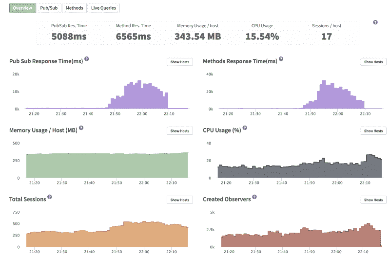
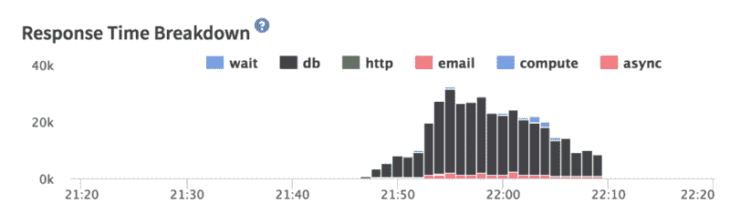
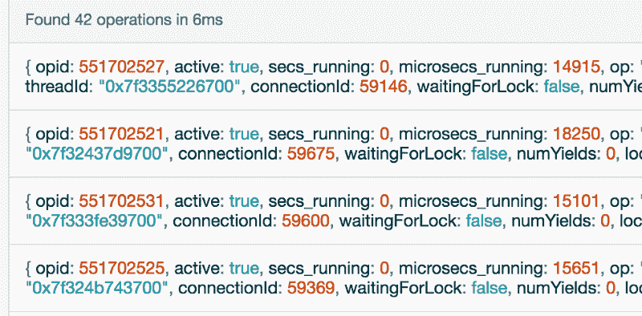
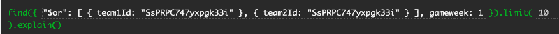

# 我已经大规模运行 Meteor 一年了。以下是我学到的东西。

> 原文：<https://www.freecodecamp.org/news/scaling-meteor-a-year-on-26ee37588e4b/>

埃利·斯坦博克

# 我已经大规模运行 Meteor 一年了。以下是我学到的东西。


一年前，我写了一篇文章，描述了我第一次攀登流星的经历。简而言之，我用[流星](https://www.meteor.com/)创建了一个流行的梦幻足球网站。在某一点上，我的服务开始变慢。我运行游戏的单一服务器不再能够处理负载。我通过添加额外的服务器等方式解决了这些早期的扩展问题。

嗯，当去年夏天的新赛季到来时，我再次遇到了缩放问题。仅仅增加更多的服务器并不能解决这些问题。但我确实克服了它们。

这篇文章将解释我这次学到的东西，分为六条实用的建议。

自从我的上一篇文章以来，有一件事发生了变化，那就是 Meteor 开发小组终于发布了 [Galaxy](https://www.meteor.com/hosting) ，它以每月每个容器 29 美元的价格为您提供 Meteor 托管服务。这不包括数据库托管，但你可以使用类似于 [Compose](https://www.compose.com/) 或 [mLab](https://mlab.com) 的东西来实现。或者，您可以在 [AWS](https://aws.amazon.com/) 或 [DigitalOcean](https://m.do.co/c/2518a67f26c8) 上自托管数据库。这将更便宜，但需要你做更多的工作。

我本人使用 [DigitalOcean](https://m.do.co/c/2518a67f26c8) 进行托管。该网站运行在$ 5/月，512MB 的水滴上，每个水滴运行一个流星实例。我使用 [Meteor Up](https://github.com/kadirahq/meteor-up) (Mup)进行部署，使用 Compose.io 进行数据库托管。

是用 DigitalOcean 还是 Galaxy 由你决定。银河将为你做一堆事情，并会节省你的时间。走数字海洋路线将为您每个集装箱每月节省 24 美元。对许多公司来说，选择 Galaxy 是最有意义的，因为开发人员的工资要高得多。无论如何，我将把商业决策留给你。

继续前进。今年夏天，有几件事真正帮助我们扩展了 Meteor 应用程序。我们有一些糟糕的日子。有时候真的不是一帆风顺的，但是我们熬过来了。

### 总结经验教训

以下是我从这一年的攀登中学到的主要经验:

第一课:MongoDB 索引非常重要！

经验 2:有太多的流星实例是一个问题！

第三课:不要担心 Nginx 的伸缩。

第四课:当用户离开一段时间后，断开他们的连接

第五课:威尔·格里戈斯着火了

第六课:从他们如何升级《口袋妖怪 Go》中得到启示

让我们一个一个地过一遍。

### 第一课:MongoDB 索引非常重要！

所以这是一个业余错误。每一篇关于缩放 Meteor(或 MongoDB)的文章都告诉你要使用索引。我做到了！但是有一个指标不见了，我为此而受到了伤害——真的受到了伤害——在今年对我们来说最重要的夜晚。

通过例子解释索引。如果你有 10，000 个玩家的分数，并且想要找到最高的分数，在常规情况下，Mongo 必须遍历所有这些分数才能找到最高的分数。如果你有一个分数的索引，那么 Mongo 会按照升序或降序保存所有分数的副本，并且会在很短的时间内找到最高分。你可以在 MongoDB [网站](https://docs.mongodb.com/v3.0/core/indexes-introduction/)上阅读更多关于索引的内容。

在 Meteor 项目中，我建议使用一个包含所有出版物的 *publications.js* 文件。在每个出版物下面，应该有为每个出版物创建必要索引的代码。在 Meteor 中创建索引的代码如下所示:

```
Meteor.startup(function () {    Teams._ensureIndex({ userId: 1 });});
```

默认情况下， *_id* 字段有一个索引，所以你不需要担心。

进入细节。我使用 [Compose.io](http://compose.io) 进行 MongoDB 托管。他们很好，支持也很好，但是当他们认为增加内存就可以解决所有问题时，不要听他们的。这不是真的。它有时可能会起作用，但对我来说，这只是毫无意义的建议。

我使用 [Kadira.io](https://kadira.io/) 进行性能监控。每个流星应用程序都应该使用 Kadira，基本包很棒而且是免费的，所以没有理由不使用。(更新:Kadira 目前仍然是 Meteor 应用程序的显而易见的选择，但 Kadira 背后的团队最近离开了 Meteor，所以未来要小心这一点。)

在卡迪拉，我看到了这样的图表:



Super slow response time from 21:48 till 22:08

在某一点上，PubSub 和方法的响应时间变得非常长。任何超过 1000 毫秒的响应都是有问题的。即使 500 毫秒的响应时间也可能很糟糕。但是连续一个小时平均 10-20 秒的响应时间基本上意味着你的用户讨厌你，你的应用对他们几乎不起作用。

一般来说，当事情运行缓慢时，我只是添加更多的服务器。我在这里也是这样做的，除了这一次，添加更多的服务器只会让事情变得更糟。糟糕透了。但我们稍后会谈到这一点。

因此，在这一点上，你所做的就是在谷歌和垃圾邮件 StackOverflow 和[流星论坛](https://forums.meteor.com/t/mongo-scaling-issues/27905/24)中寻找答案。

最终，我在卡迪拉仪表盘上找到了这块宝石:



Database is taking forever to respond

由此我们可以看出，数据库永远不会做出响应。添加更多的流星实例对我们没有帮助。我们需要解决蒙戈。

Kadira 不擅长向我展示为什么数据库响应如此之慢。每个出版物和方法都显示出非常高的数据库响应时间。

答案来自高峰时段访问 Compose.io。在仪表板上，您可以查看在任何给定时刻运行的当前 ops(当前操作)。我看到了这样的东西(但要糟糕得多):



我不知道这些晦涩难懂的东西是什么，但是你会看到每个操作都有一个 *secs_running* 字段。在上面的图片中，它说一切都是 0 秒，这太棒了！但是我在高峰时间看到的是 14 秒、9 秒、10 秒…对于正在进行的不同操作！这一切都来自我的应用程序发出的同一个查询。

我自己运行了这个查询，它确实花了大约 16 秒才得到响应！不好！用 explain 运行它(正如流星论坛上的一些人建议的那样)显示有 180，000 多份文档正在被扫描！下面是一个有问题的查询:



Problematic query

无论如何…瞧，没有为这个查询建立索引。我添加了以下索引:

```
Meteor.startup(function () {    HeadToHeadMatches._ensureIndex({ team1Id: 1, gameweek: 1 });  HeadToHeadMatches._ensureIndex({ team2Id: 1, gameweek: 1 });});
```

此后，整个数据库又开始快速运行。这个有问题的查询减慢了整个数据库的速度！

> **更新#1:** 根据乔希·欧文[的评论](https://medium.com/@joshowens/i-would-not-recommend-using-a-private-method-especially-since-it-calls-a-deprecated-method-inside-9049a3707f11#.3cixlmp2y)，添加索引的一个更好的方法是使用 [Collection.rawCollection](http://docs.meteor.com/api/collections.html#Mongo-Collection-rawCollection) 和 [createIndex](http://mongodb.github.io/node-mongodb-native/2.2/tutorials/create-indexes/) ，但是上面的代码至少在 Meteor 1.4.2 之前都适用。

> **更新#2:** 指数比我第一次想象的要复杂，这周又遇到了麻烦。如果不查看日志，您可能无法找到所有需要索引的查询。

> 您需要找到所有使用 *COLLSCAN* 的查询。这意味着查询没有使用索引，为了找到文档，Mongo 必须遍历整个集合来检查您正在搜索的文档是否存在。

> 如果你正在使用 Compose.io 并且在 MongoDB classic 上，那么你需要发电子邮件给支持人员来查找哪些查询正在使用 *COLLSCAN* 。如果您使用他们的 MongoDB 3.2 计划，那么您应该能够在他们的仪表板中找到这些查询。

> 此外，如果您怀疑某个查询有问题，使用 [*explain()*](https://docs.mongodb.com/manual/reference/method/cursor.explain/) 运行该查询，您将能够看到有多少文档正在被扫描。如果 *nscanned* 等于整个集合中的文档数，那么就有问题了，需要一个索引。一个坏的索引会严重影响整个数据库，因为它会锁定所有查询。

### 经验 2:有太多的流星实例是一个问题！

因此，一旦你学会了如何扩展到多个实例，你希望这是所有扩展痛苦的终结。唉，事实并非如此。添加太多服务器会在某一点上影响性能。

这是因为 Mongo 为每个到数据库的连接使用额外的 RAM。我一定有大约 60–70 个实例连接到我的数据库，Mongo 不喜欢它，我也不需要那么多。Meteor 实例并不是性能的瓶颈。

当然，你可以给 Mongo 更多的内存，但是要注意当你不断添加更多的服务器时会发生什么。您可能会减轻每个 Meteor 实例的负载，但是您会给 Mongo 增加负载，从而产生新的瓶颈。

### 第三课:不要担心 Nginx 的伸缩

今年夏天我担心的一件事是 Nginx 会成为我的瓶颈。很少会出现这种情况。Nginx 应该能够毫无问题地处理成千上万的并发用户。

几个月前，我确实和一家在 Nginx 上遇到麻烦的公司谈过。他们必须处理几千个并发连接。你可以阅读[这篇文章](http://blog.martinfjordvald.com/2011/04/optimizing-nginx-for-high-traffic-loads/)获得更多关于针对高流量负载优化 Nginx 的技巧。

这篇文章中值得立即使用的一些亮点:

关闭访问日志:

> 默认情况下，nginx 会将每个请求写到磁盘上的一个文件中，以便进行日志记录，您可以使用它来进行统计、安全检查等，但是这是以 IO 使用为代价的。如果你不使用访问日志做任何事情，你可以简单地关闭它，避免磁盘写入。

工作进程和连接:

> **工作进程**
> [**工作进程**](http://wiki.nginx.org/CoreModule#worker_processes) 是 nginx 的骨干，一旦主进程绑定到所需的 IP/端口，它将产生工作进程作为指定的用户，然后它们将处理所有的工作。工作线程不是多线程的，因此它们不会将每个连接分散到多个 CPU 核心上。因此，让我们运行多个工作线程是有意义的，通常每个 CPU 内核一个工作线程。对于大多数工作负载来说，任何超过 2-4 个工人都是多余的，因为 nginx 会在 CPU 成为问题之前遇到其他瓶颈，通常你只会有空闲的进程。如果你的 nginx 实例在 4 个工人之后被 CPU 限制，那么希望你不需要我告诉你。

> 当您处理大量阻塞磁盘 IO 的情况时，可以使用更多的工作进程。您将需要测试您的特定设置来检查静态文件的等待时间，如果等待时间很长，那么尝试增加工作进程。

> **工作者连接**
> [**工作者连接**](http://wiki.nginx.org/EventsModule#worker_connections) 有效地限制了每个工作者一次可以维持的连接数量。这个指令很可能是为了防止失控的进程，以防您的操作系统被配置为允许超出您的硬件所能处理的范围。正如 nginx 开发人员 Valentine 在 nginx 邮件列表 [**上指出的那样**](http://mailman.nginx.org/pipermail/nginx/2015-May/047460.html) nginx 可以在达到限制时关闭保持活动连接，因此我们不必担心我们的保持活动值。相反，我们关心的是 nginx 正在处理的当前活动连接的数量。我们可以处理的最大连接数公式变成:

> worker _ processes * worker _ connections *(K/平均$request_time)

> 其中 K 是当前活动连接的数量。此外，对于 K 值，我们还必须考虑反向代理，这将打开一个到后端的额外连接。

> 在默认配置文件中，worker_connections 指令被设置为 1024，如果我们考虑到浏览器通常为管道内衬站点资产打开 2 个连接，那么我们最多可以同时处理 512 个用户。通过代理，这甚至更低，但是，你的后端有希望相当快地响应释放连接。

> 关于工作人员连接的所有考虑事项很明显，如果您的流量增加，您最终会希望增加每个工作人员可以完成的连接数量。2048 对大多数人来说应该够了，但是老实说，如果你有这样的流量，你不应该怀疑你需要这个数字有多高。

### 第 4 课:断开空闲用户

这个很重要！我不知道为什么这在流星社区没什么大不了的！

当用户的标签打开时，断开用户连接。这样做很简单，节省了宝贵的资源。

要自动断开连接，你可以使用这个包: *mixmax:smart-disconnect。*

### 第五课:威尔·格里戈斯着火了

如果你已经读到这里了，你可能会感到非常受鼓舞，想要一首足球圣歌。我向你们介绍威尔·格里戈斯:

实际上这没什么意义。在文章的这一点上，这似乎是合适的。但是如果我们真的想从中吸取教训，那就这样吧:

如果你是一个单独的开发者，现在有成千上万的人依靠你的应用程序工作*，事情会变得很紧张。我给你(和我自己)的建议是:冷静下来。听一些威尔·格里戈斯的作品。希望你会解决它，即使事情搞砸了，也可能没有你想象的那么糟糕。*

*Pokemon Go 一开始相当糟糕。服务器不断超载，但人们不断回来玩。从商业角度来看，Niantic 仍然大赚了一笔。炒作现在已经平息，但这与他们的缩放问题或许多早期的错误无关。这只是时尚的终结。*

*所以，人生的教训是，当你压力过大时，听听威尔·格里戈斯的音乐。*

### *第六课:从他们如何升级《口袋妖怪 Go》中得到启示*

*关于口袋妖怪 Go 的话题，让我们谈谈发生了什么。首先，口袋妖怪 Go 不会发生在你身上。Pokemon Go 有一个由前谷歌员工组成的强大团队，他们知道如何处理大量负载，但即使是他们也受到了该应用程序受欢迎程度的影响。他们已经做好了承受大负荷的准备，但不是 Twitter 那么大的负荷。*

*一些围绕 Pokemon Go 的 app 也弹出来了。Pokemon Go 聊天应用程序和 Pokemon Go Instagrams 开始出现并变得非常受欢迎，很快在几天内就有了一百万用户。其中一些应用程序是由单独开发人员开发的，处理负载对他们来说是一个挑战。*

*这篇文章讲述了某人如何在 5 天内创建了一个拥有 50 万用户的 Pokemon Go Instagram 应用程序，并在每月 100 美元的服务器上运行。令人印象深刻。这篇文章的要点是，如果你知道自己在做什么，你就可以快速构建一个可扩展的 MVP。*

*如果你能做到这一点，那当然很好，但是如果你是一个年轻的没有经验的开发者，那就不太可能了。我建议去构建你梦想中的应用，不要太担心当你需要扩展时会发生什么。*

*如果你能从一开始就以正确的方式构建东西，这绝对是一个优势，并且绝对值得向更有经验的开发者寻求建议，尝试从一开始就把事情做好。但是不要让对扩展的恐惧阻碍你创建你梦想中的应用。残酷的现实是，人们可能不会喜欢你的应用程序，如果你能让 100 个人使用它，那将是令人印象深刻的。*

*但是遵循[精益创业](https://www.youtube.com/watch?v=NTh0aRBmwcg)的原则，最好是建立一些东西，让它进入真正的用户手中，并获得反馈，而不是因为害怕无法处理沉重的负载而永远不推出。*

### *展望未来*

*这些处理缩放的事件是一个负担，理想情况下，我宁愿不处理这些问题。如果事情进展顺利，并且您可以尽可能长时间地推迟扩展问题，那就太好了。正因为如此，我开始寻找其他能更好处理规模的平台。*

*一个这样的平台是基于 Erlang 构建的 Elixir。Whatsapp 使用的是 Erlang，它让一个由 35 名工程师组成的团队发展到了 4.5 亿用户！即使在拥有接近 10 亿用户的今天，Whatsapp 的团队也只有 50 名工程师！这太不可思议了，你可以在这里阅读更多[。他们是如何用这么少的人实现这么大规模的实时应用的？答案是二郎。今天你可以用](https://www.wired.com/2015/09/whatsapp-serves-900-million-users-50-engineers/)[凤凰架构](http://www.phoenixframework.org/)和[仙丹](http://elixir-lang.org/)来利用二郎的力量。我们仍在使用 Meteor，但我正在考虑将应用程序的某些方面转移到 Elixir，这将使我们能够进行大规模的实时更新。*

*我还想看看 Apollo，它可以与 Meteor 或任何 Node.js 服务器一起工作。Apollo 将帮助您扩展 Meteor，因为您不需要每个出版物在使用 Apollo 时都是被动的(这是 Meteor 应用程序对服务器 CPU 的最大消耗。)您可以使用 Meteor 方法来发送数据而不是发布，从而获得类似的结果。*

*最后一点是，尽管许多有影响力的 Meteor 开发人员最近离开了社区，但是在缩放方面已经有了一些发展。查看 [redis-oplog](https://github.com/cult-of-coders/redis-oplog) 包和[讨论](https://forums.meteor.com/t/meteor-scaling-redis-oplog-status-1-1-4-stable/30855)了解更多信息。这是一个非常新的包，从我一周前玩它的经历来看，我仍然认为它处于测试阶段。*

*如果你喜欢这篇文章，给它一个心脏，如果你想跟上鼓舞人心的缩放文章的最新，给我一个关注。*