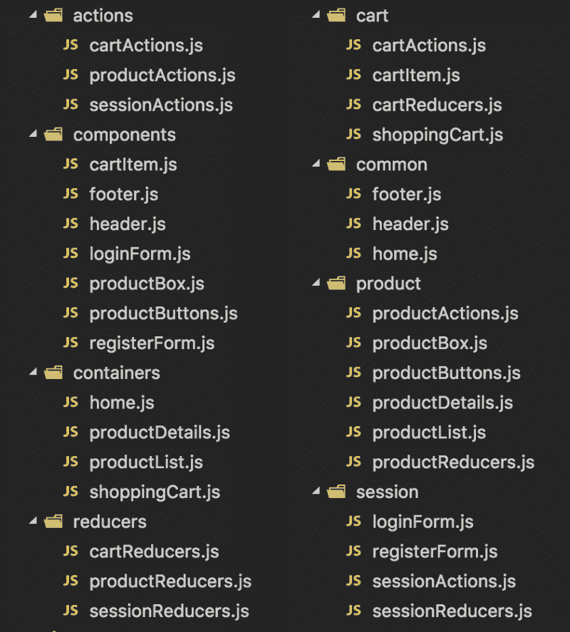

# 用鸭子扩展你的 Redux 应用

> 原文：<https://www.freecodecamp.org/news/scaling-your-redux-app-with-ducks-6115955638be/>

您的前端应用程序如何扩展？你如何确保你正在编写的代码在 6 个月后是可维护的？

[Redux](http://redux.js.org/) 在 2015 年席卷了前端开发的世界，并确立了自己的标准——甚至超出了 React 的范围。

在我工作的公司，我们最近完成了一个相当大的 React 代码库的重构，增加了 redux 而不是 [reflux](https://github.com/reflux/refluxjs) 。

我们这样做是因为如果没有一个结构良好的应用程序和一套好的规则，前进是不可能的。

代码库已经有两年多的历史了，从一开始就有*回流*。我们不得不修改一年多没碰过的代码，这些代码与 React 组件纠缠在一起。

基于我们在这个项目上所做的工作，我整理了这个报告，解释了我们组织 redux 代码的方法。

当您学习 redux 以及 actions 和 reducers 的角色时，您会从非常简单的例子开始。今天大多数可用的教程不会进入下一个级别。但是如果你正在用 Redux 构建比 todo 列表更复杂的东西，你将需要一种更智能的方式来扩展你的代码库。

有人曾经说过*命名事物*是计算机科学中最难的工作之一。我完全同意。但是构建文件夹和组织文件是第二位的。

让我们探索一下过去我们是如何处理代码组织的。

### 功能与特性

有两种构建应用程序的既定方法:*功能优先*和*特征优先*。

在左下方，你可以看到一个功能优先的文件夹结构。在右边，你可以看到一个功能优先的方法。



功能优先意味着你的顶层目录是根据里面文件的用途来命名的。所以你有:*容器*，*组件*，*动作*，*减速器*等。

这根本不可扩展。随着应用的增长和功能的增加，文件也会添加到相同的文件夹中。所以你最后不得不在一个文件夹里滚动来找到你的文件。

问题还在于将文件夹耦合在一起。通过应用程序的单个流程可能需要所有文件夹中的文件。

这种方法的一个优点是它将 React 与 redux 隔离开来。所以如果你想改变状态管理库，你知道你需要接触哪些文件夹。如果更改视图库，可以保持 redux 文件夹不变。

Feature-first 是指顶级目录以 app 的主要特性命名:*产品*、*购物车*、*会话*。

这种方法的伸缩性更好，因为每个新特性都有一个新的文件夹。但是，React 组件和 redux 之间没有分离。从长远来看，改变其中一个是非常棘手的工作。

此外，您还有不属于任何功能的文件。你最终会得到一个文件夹 *common* 或 *shared，*，因为你想在你的应用程序的许多特性中重用代码。

### 两个世界中最好的

虽然不在本文讨论范围之内，但我想接触一下这个单一的想法:**始终将状态管理文件与 UI 文件分开。**

从长远考虑你的应用。想象一下，当您从 *React* 切换到另一个库时，代码库会发生什么。或者想想你的代码库将如何在网页版本中并行使用*反应式*。

[我们的方法](https://github.com/FortechRomania/react-redux-complete-example)从需要将 React 代码隔离到一个文件夹——称为视图——并将 redux 代码隔离到一个单独的文件夹——称为 redux 开始。

这种一级分离让我们可以灵活地组织应用程序的两个完全不同的独立部分。

在视图文件夹中，我们倾向于使用功能优先的方法来组织文件。这在 React 的上下文中感觉非常自然:*页面*、*布局*、*组件、增强器*等。

为了不被一个文件夹中的文件数量所困扰，我们可以在每个文件夹中进行基于特征的分割。

然后，在 redux 文件夹中…

### 输入重鸭

应用程序的每个特性都应该映射到单独的动作和减少器，所以采用特性优先的方法是有意义的。

最初的 [ducks 模块化方法](https://github.com/erikras/ducks-modular-redux)是 redux 的一个很好的简化，并提供了一种结构化的方式在你的应用程序中添加每个新功能。

然而，我们想探索一下当应用程序扩展时会发生什么。我们意识到，从长远来看，一个特性的单个文件会变得过于混乱，难以维护。

[*重鸭*就是这样诞生的](https://github.com/alexnm/re-ducks)。解决方案是将每个功能拆分到一个*鸭*文件夹中。

```
duck/
├── actions.js
├── index.js
├── operations.js
├── reducers.js
├── selectors.js
├── tests.js
├── types.js
├── utils.js
```

鸭子文件夹必须:

*   在你的应用程序中只包含处理一个概念的完整逻辑，例如:*产品*、*购物车*、*会话*等。
*   有一个根据原始鸭规则导出的`index.js`文件。
*   将目的相似的代码放在同一个文件中，如*减速器*、*选择器*、*动作*
*   包含与鸭子相关的*测试*。

对于这个例子，我们没有使用任何建立在 redux 之上的抽象。当构建软件时，从最少的抽象开始很重要。通过这种方式，您可以确保抽象的成本不会超过收益。

如果你需要说服自己抽象可能是不好的，看看程露的这个令人敬畏的演讲。

让我们看看每个文件都包含了什么。

#### 类型

*类型*文件包含您在应用程序中调度的动作的名称。作为一种良好的做法，您应该尝试根据名称所属的特性来确定名称的范围。这有助于调试更复杂的应用程序。

```
const QUACK = "app/duck/QUACK";
const SWIM = "app/duck/SWIM";

export default {
    QUACK,
    SWIM
};
```

#### 行动

这个文件包含了所有的动作创建函数。

```
import types from "./types";

const quack = ( ) => ( {
    type: types.QUACK
} );

const swim = ( distance ) => ( {
    type: types.SWIM,
    payload: {
        distance
    }
} );

export default {
    swim,
    quack
};
```

注意所有的动作是如何被函数表示的，即使它们没有被参数化。在大型代码库中，一致的方法是非常必要的。

#### 操作

为了表示链式操作，您需要一个 redux *中间件*来增强调度功能。一些流行的例子有: [redux-thunk](https://github.com/gaearon/redux-thunk) 、 [redux-saga](https://github.com/redux-saga/redux-saga) 或 [redux-observable](https://github.com/redux-observable/redux-observable) 。

在我们的例子中，我们使用 *redux-thunk* 。我们希望将 thunks 从动作创建者中分离出来，甚至不惜花费额外的代码。所以我们将操作定义为动作的包装器。

如果操作只调度一个动作——实际上不使用 redux-thunk——我们转发动作创建者函数。如果操作使用 thunk，它可以分派许多动作，并用承诺将它们连接起来。

```
import actions from "./actions";

// This is a link to an action defined in actions.js.
const simpleQuack = actions.quack;

// This is a thunk which dispatches multiple actions from actions.js
const complexQuack = ( distance ) => ( dispatch ) => {
    dispatch( actions.quack( ) ).then( ( ) => {
        dispatch( actions.swim( distance ) );
        dispatch( /* any action */ );
    } );
}

export default {
    simpleQuack,
    complexQuack
};
```

称他们为行动，思考，传奇，史诗，这是你的选择。只要找到一个命名约定并坚持下去。

最后，当我们讨论*索引*时，我们会看到这些操作是 duck 的公共接口的一部分。动作被封装，操作被公开。

#### 还原剂

如果一个特征有更多的面，你应该明确地使用多个缩减器来处理状态形状的不同部分。此外，不要害怕根据需要使用*合并减少器*。这为您在处理复杂的状态形状时提供了很大的灵活性。

```
import { combineReducers } from "redux";
import types from "./types";

/* State Shape
{
    quacking: bool,
    distance: number
}
*/

const quackReducer = ( state = false, action ) => {
    switch( action.type ) {
        case types.QUACK: return true;
        /* ... */
        default: return state;
    }
}

const distanceReducer = ( state = 0, action ) => {
    switch( action.type ) {
        case types.SWIM: return state + action.payload.distance;
        /* ... */
        default: return state;
    }
}

const reducer = combineReducers( {
    quacking: quackReducer,
    distance: distanceReducer
} );

export default reducer;
```

在一个大规模的应用程序中，你的状态树至少有 3 层。Reducer 函数应该尽可能小，并且只处理简单的数据结构。 *combineReducers* 实用函数是构建灵活且可维护的状态形状所需要的全部。

检查[完整的示例项目](https://github.com/FortechRomania/react-redux-complete-example)并查看如何使用*联合收割机减速器*。一次在 *reducers.js* 文件中，然后在 *store.js* 文件中，我们将整个状态树放在一起。

#### 选择器

与操作一起，选择器是 duck 的公共接口的一部分。操作和选择器之间的划分类似于 [CQRS 模式](https://martinfowler.com/bliki/CQRS.html)。

选择器函数获取应用程序状态的一部分，并基于此返回一些数据。它们不会给应用程序状态带来任何变化。

```
function checkIfDuckIsInRange( duck ) {
    return duck.distance > 1000;
}

export default {
    checkIfDuckIsInRange
};
```

#### 索引

该文件指定了从 duck 文件夹中导出的内容。它将:

*   默认导出鸭的减速器功能。
*   export as named 导出选择器和操作。
*   如果其他鸭需要这些类型，请将其导出。

```
import reducer from "./reducers";

export { default as duckSelectors } from "./selectors";
export { default as duckOperations } from "./operations";
export { default as duckTypes } from "./types";

export default reducer;
```

#### 试验

使用 Redux 和 ducks 结构的一个好处是，您可以在正在测试的代码旁边编写您的测试。

测试 Redux 代码相当简单:

```
import expect from "expect.js";
import reducer from "./reducers";
import actions from "./actions";

describe( "duck reducer", function( ) {
    describe( "quack", function( ) {
        const quack = actions.quack( );
        const initialState = false;

        const result = reducer( initialState, quack );

        it( "should quack", function( ) {
            expect( result ).to.be( true ) ;
        } );
    } );
} );
```

在这个文件中，你可以为缩减器、操作、选择器等编写测试。

我可以写一篇完全不同的关于测试你的代码的好处的文章，有很多好处。去做吧！

### 这就是了

re-ducks 的好处在于，您可以对所有 redux 代码使用相同的模式。

随着应用程序代码库的增长，redux 代码的基于特性的分割更加灵活和可伸缩。当您构建跨应用程序共享的小组件时，基于函数的视图分割是有效的。

你可以在这里查看完整的 react-redux-example 代码库[。请记住，回购仍在积极发展中。](https://github.com/FortechRomania/react-redux-complete-example)

你是如何构建 redux 应用的？我期待着听到一些关于我提出的这个方法的反馈。

如果你觉得这篇文章有用，点击下面的绿色心脏，我会知道我的努力没有白费。