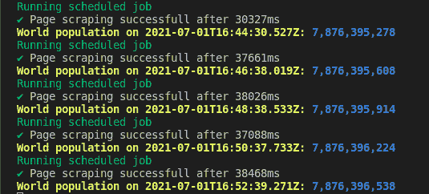

# 如何使用 node-cron 在 Node 中调度作业

> 原文：<https://www.freecodecamp.org/news/schedule-a-job-in-node-with-nodecron/>

在本文中，您将学习如何使用 [node-cron](https://www.freecodecamp.org/news/schedule-a-job-in-node-with-nodecron/(https://www.npmjs.com/package/node-cron)) 在 Node 中调度作业。

Node-cron 是一个方便的 [npm 包](https://www.npmjs.com/package/package),您可以使用它来安排作业在特定的时间或间隔运行。它最适合安排重复性作业，如电子邮件通知、文件下载和数据库备份。

即使您对在 Node 中调度作业不感兴趣，您仍然会发现从本文中获得的关于 cron 语法的知识非常有用。

例如，Github Actions 在安排工作流在特定时间运行时使用 [cron 语法](https://docs.github.com/en/actions/reference/workflow-syntax-for-github-actions#onschedule)。类似地，Google Cloud 等云平台在描述作业调度时需要 [cron 语法](https://cloud.google.com/scheduler/docs/configuring/cron-job-schedules)。

Node-cron 是用纯 JavaScript 为[节点](https://nodejs.dev/)编写的，它基于 [GNU crontab](https://www.gnu.org/software/mcron/manual/html_node/Crontab-file.html) 语法。尽管它是基于 crontab 的，但我们在本文中的重点是学习 node-cron 和 cron 语法。

关于 cron、crontab 以及它们如何在类 Unix 操作系统中使用的更多信息，您可以查看关于该主题的这篇维基百科文章(但是您不必了解这篇文章)。

## 你将从这篇文章中学到什么

在本文结束时，您将能够做到以下几点:

*   解释 [cron](https://en.wikipedia.org/wiki/Cron) 语法
*   使用 node-cron 调度作业

## 先决条件

在继续之前，请确保您已经完成了下面列出的先决条件。

*   您需要在您的机器上安装 JavaScript 运行时环境[节点](https://nodejs.dev/download)。
*   你至少应该对 JavaScript 和 Node 有一个基本的了解。如果你是 Node 和 JavaScript 的完全初学者，遇到卡顿可以在 [freeCodeCamp 论坛](https://forum.freecodecamp.org/)上提问。我们很乐意帮忙。

## 如何使用`node-cron`安排工作

正如我上面已经提到的， [`node-cron`](https://www.npmjs.com/package/node-cron) 是为 Node 编写的，并通过 [npm](https://www.npmjs.com/) 分发。使用命令`npm i node-cron`安装后，必须像任何其他节点包一样*要求*进入项目:

```
const nodeCron = require("node-cron"); 
```

要调度一个作业，您需要调用带有两个参数的`nodeCron.schedule`方法。还有第三个可选参数，您可以将它传递给方法进行附加配置。

下面是`nodeCron.schedule`方法的函数签名。

```
nodeCron.schedule(expression, function, options); 
```

下面的代码片段是如何调用`schedule`方法的例子。

```
const job = nodeCron.schedule("* * * * * *", function jobYouNeedToExecute() {
  // Do whatever you want in here. Send email, Make  database backup or download data.
  console.log(new Date().toLocaleString());
}); 
```

您需要传递给`nodeCron.schedule`的第一个参数是 cron 表达式。您可以使用该表达式来指定作业应该执行的时间。

这个表达式应该是`* * * * * *`格式。您可以用适当的数字(或可能的字符)替换每个`*`字段，以便表达式描述应该执行作业的时间。

如果您传递了`"* * * * * *"`而没有替换任何`*`，就像上面的例子一样，作业每秒钟都会执行一次。关于如何创建 cron 表达式的详细解释，请阅读下面的“如何理解 cron 表达式”小节。

第二个参数是一个函数，它是在第一个参数中的表达式滴答时执行的作业。

你可以在这个函数里做任何你想做的事情。您可以发送电子邮件、备份数据库或下载数据。当当前系统时间与第一个参数中提供的时间相同时，执行该函数。在上面的例子中，我只是打印当前日期。

第三个参数是作业调度的可选配置对象。我没有传递上面例子中的第三个参数，因为它是可选的。

下面是第三个参数的一个例子。

```
{
   scheduled: false,
   timezone: "America/Sao_Paulo"
} 
```

默认`scheduled`为`true`。如果您将它设置为`false`，您将不得不通过调用`job`对象上的`start`方法来调度作业。`job`是调用`schedule`方法返回的对象。

```
job.start(); 
```

我们使用的缺省值`timezone`是针对调度作业的系统的。如果您愿意，您可以通过不同的`timezone`。

## 如何理解 Cron 表达式

cron 表达式是`schedule`的第一个参数，是一个采用`"* * * * * *"`形式的字符串。我们用它来描述作业应该被执行的时间。表达式中的每个`*`都是一个字段，您可以在下图中看到每个`*`所代表的字段。

```
"* * * * * *"
 | | | | | |
 | | | | | |
 | | | | | day of week
 | | | | month
 | | | day of month
 | | hour
 | minute
 second(optional) 
```

从上图可以看出，第一个字段是`second`字段，第二个字段是`minute`字段，第三个是`hour`字段，依此类推。

下表显示了字段及其相应的允许值:

| 田 | 允许值 |
| --- | --- |
| 第二 | 0 - 59 |
| 分钟 | 0 - 59 |
| 小时 | 0 - 23 |
| 一月中的某一天 | 1 - 31 |
| 月 | 1 - 12 或名称 |
| 星期几 | 0 - 7 或姓名，0 和 7 指星期日 |

> 当秒、分、小时和月字段与当前时间匹配时，执行作业；当两个天字段(一个月中的某一天或一周中的某一天)中至少有一个与当前时间匹配时，执行**和**。–[crontab 文档](https://www.gnu.org/software/mcron/manual/html_node/Crontab-file.html)

有不同的方法来填充 cron 表达式中的字段。节点表达式中的每个字段都可以使用单个整数值、值的范围、逗号分隔的多个值、步长值或使用名称来填充(如下面的小节中所述)。

### 如何使用单个整数值填充一个 Chron 表达式

您可以用允许值范围内的单个整数值替换每个星号。

例如，传递`"30 20 * * * *"`将使 node-cron 在每小时第二十分钟的第三十秒运行您的作业。由于没有为 hour 字段指定值，node-cron 将`*`解释为每小时。这同样适用于`day of the month`领域，以此类推。

```
const job = nodeCron.schedule("30 20 * * * *", () => {
  console.log(new Date().toLocaleString());
}); 
```

同样，通过`"30 5 13 * * *"`会在每天下午 1:05:30 运行你的任务。

```
const job = nodeCron.schedule("30 5 13 * * *", () => {
  console.log(new Date().toLocaleString());
}); 
```

### 如何使用一系列值来填充记录表达式

您也可以使用数字范围来填充您的时间表达式。范围是指由`-`字符分隔的两个数字。结束值是范围的一部分。

例如，如果`hour`字段被设置为`2-4`，它指定在第 2、3 和 4 小时执行。

```
const job = nodeCron.schedule("* 2-4 3 * *", () => {
  console.log(new Date().toLocaleString());
}); 
```

在上面的代码片段中，我已经排除了可选的`second`字段。它将在每月的第三天凌晨 2 点到 4 点每分钟执行一次您的作业(因为`day of the month`字段的值为`3`)。

### 如何使用多个值来填充记录表达式

您也可以传递用逗号分隔的多个值或用逗号分隔的一系列值。

例如，传递`2,3,4`作为`minute`字段的值将在第 2、3 和 4 分钟执行您的作业。

```
const job = nodeCron.schedule("2,3,4 * * * *", () => {
  console.log(new Date().toLocaleString());
}); 
```

在上面的代码片段中，我再次排除了可选的`second`字段。它将在每小时的第一、第二和第三分钟执行您的作业。

### 如何使用步长值填充 chrome 表达式

您可以对范围使用步长值。用`/<number>`跟随一个范围会跳过该范围内的数值。

例如，在`hour`字段中使用`0-8/2`将在 0、2、4、6 和 8 小时执行代码。您也可以通过`*`使用步长值。例如`*/3`每三小时执行一次。

```
const job = nodeCron.schedule("*/2 * * * *", () => {
  console.log(new Date().toLocaleString());
}); 
```

在上面的代码片段中，作业将每两分钟执行一次。我再次省略了可选的`second`字段。

### 如何使用名称来填充记录表达式

对于月份和星期几字段，可以使用名称。这些可以是短的或长的名字。例如`January`或`Jan`。

```
const job = nodeCron.schedule("* * * January,September Sunday", () => {
  console.log(new Date().toLocaleString());
}); 
```

我再次省略了可选的`second`字段。该作业将在一月和九月的星期天每分钟运行一次。也可以用`Jan, Sep`之类的简称。

这就是关于 cron 语法的基本知识。在下一节中，您将实现您所学到的来安排一个简单的作业。

> 有一个叫做 [crontab guru](https://crontab.guru/) 的便利工具可以为你解释 crontab 表达式。如果您输入一个表达式，它将验证该表达式，并告诉您作业将在何时执行。如果你对表达没有把握，你可以用它。

## 如何使用 node-cron 调度作业

在本节中，您将应用在前面几节中学到的知识。您将构建一个简单的应用程序，该应用程序从世界人口统计网站获取世界人口数据并将其记录到控制台。

当你导航到 [worldometers 世界人口页面](https://www.worldometers.info/world-population/)时，你会注意到当前世界人口正在快速变化。您将安排一个作业来收集数据并在终端上打印出来。

在真正的应用程序中，你通常会将它保存到数据库中。按照以下步骤构建应用程序。

### 步骤 1 -如何创建目录

在这一步中，您将为您的项目创建一个目录，并导航到该目录。打开终端并运行下面的命令来创建一个名为`learn-node-cron`的目录。目录的名称并不重要。如果您愿意，可以给它一个不同的名称。

```
mkdir learn-node-cron 
```

成功运行上述命令后，您应该会看到创建了`learn-node-cron`文件夹。您可以在您喜欢的文本编辑器中打开该文件夹。
在下一步中，您将初始化项目。

### 步骤 2 -如何初始化项目

在此步骤中，您将通过在终端上运行以下命令来初始化项目。

```
npm init -y 
```

成功运行上述命令后，您应该能够看到在项目目录的根目录下创建的`package.json`文件。

### 步骤 3 -如何安装依赖项

在这一步中，您将通过在终端上运行下面的命令来安装项目依赖项。

```
npm i node-cron puppeteer ora chalk 
```

上面的安装需要一点时间，所以请耐心等待。成功安装上述依赖项后，您应该在`dependencies`字段下的`package.json`文件中看到它们。

是这里最重要的依赖项，因为这正是本文所要讨论的。

我们将使用`puppeteer`从网页中抓取数据。根据[文献记载](https://pptr.dev/) `puppeteer`是:

> 一个节点库，它提供了一个高级 API 来通过 DevTools 协议控制 Chrome 或 Chromium。默认情况下，木偶师无头运行，但可以配置为运行全(无头)铬或铬- [木偶师文档](https://pptr.dev/)

如果上面的陈述对你没有意义，toptal 上有一篇很好的文章[解释了木偶师、无头浏览器，以及为什么它们是必要的。对`puppeteer`不感兴趣还是可以的。这篇文章是关于`node-cron`以及如何使用它来安排工作。](https://www.toptal.com/puppeteer/headless-browser-puppeteer-tutorial)

ora 是一个简单的 npm 包，当我们抓取数据时，我们将使用它在终端上显示消息和一个微调器。这将提供更好的用户体验。

[chalk](https://www.npmjs.com/package/chalk) 是另一个 npm 包，我们将使用它在终端上显示彩色消息。

在下一步中，您将实现 cron 作业。

### 步骤 4 -如何实现 Cron 作业

在这一步中，您将实现一个简单的 cron 作业。通过运行以下命令创建新的 JavaScript 文件:

```
touch app.js 
```

成功运行上述命令将在项目的根目录下创建一个`app.js`文件。将下面的代码复制并粘贴到您刚刚创建的文件中:

```
const nodeCron = require("node-cron");
const puppeteer = require("puppeteer");
const ora = require("ora");
const chalk = require("chalk");

const url = "https://www.worldometers.info/world-population/";

async function scrapeWorldPopulation() {
  // Log a message on the terminal as the scheduled job starts
  // We are using chalk to make the message on the terminal look colorful
  console.log(chalk.green("Running scheduled job"));
  // Launch a loading spinner with an appropriate message on the terminal
  // It provides a good user experience as the scraping process takes a bit of time
  const spinner = ora({
    text: "Launcing puppeteer",
    color: "blue",
    hideCursor: false,
  }).start();

  try {
    // This will help us compute the duration of the job later
    const date = Date.now();
    // Launch puppeteeer
    const browser = await puppeteer.launch();
    // Change the message on the terminal as we launch
    // a new headless browser page
    spinner.text = "Launching headless browser page";
    // Launch a new headless browser page
    const newPage = await browser.newPage();
    // Change the message on the terminal as we navigate
    // to the URL of the page we are scraping
    spinner.text = "Navigating to URL";
    // Navigate to the URL of the page we are scraping. This takes a bit of time
    // You can change the timeout to an appropriate value if you wish otherwise
    // we wait until the page loads
    await newPage.goto(url, { waitUntil: "load", timeout: 0 });

    // Change the message on the terminal as we start scraping the page
    spinner.text = "Scraping page";
    // Start scraping the page
    // If world population is 7,876,395,914 then digitGroups will be
    // ["7", "876", "395", "914"]
    const digitGroups = await newPage.evaluate(() => {
      const digitGroupsArr = [];
      // For selecting span elements containing digit groups
      const selector =
        "#maincounter-wrap .maincounter-number .rts-counter span";
      const digitSpans = document.querySelectorAll(selector);
      // Loop through the digit spans selected above
      digitSpans.forEach((span) => {
        if (!isNaN(parseInt(span.textContent))) {
          digitGroupsArr.push(span.textContent);
        }
      });
      return JSON.stringify(digitGroupsArr);
    });
    // Change the message on the terminal since we are about
    // to close the headless browser
    spinner.text = "Closing headless browser";
    // Close the headless browser
    await browser.close();
    // Print success message with duration it took to scrape the data in ms
    spinner.succeed(`Page scraping successfull after ${Date.now() - date}ms`);
    // Remove the spinner from the terminal
    spinner.clear();
    // Print world population on the terminal if scraping is successful
    console.log(
      chalk.yellow.bold(`World population on ${new Date().toISOString()}:`),
      chalk.blue.bold(JSON.parse(digitGroups).join(","))
    );
  } catch (error) {
    // Print failed on the terminal if scraping is unsuccessful
    spinner.fail({ text: "Scraping failed" });
    // Remove the spinner from the terminal
    spinner.clear();
    // Print the error message on the terminal
    console.log(error);
  }
}
// Schedule a job to run every two minutes
const job = nodeCron.schedule("*/2 * * * *", scrapeWorldPopulation); 
```

在上面的代码片段中，我们*需要*所有我们需要的依赖项在文件的顶部。它们包括`node-cron`、`puppeteer`、`chalk`和`ora`。我们从`https://www.worldometers.info/world-population/`抓取数据，所以我把它赋给了`url`变量。

因为我们的工作是从一个站点抓取数据，所以我将负责执行我们工作的函数命名为`scrapeWorldPopulation`。

我已经尽力给出了不言自明的变量名，并对几乎每一行代码进行了注释。您应该能够跟踪在`scrapeWorldPopulation`函数中发生的事情。

由于这篇文章是关于作业调度的，我就不深究`puppeteer`了。如果您愿意，也可以实现不同的作业。

通过调用底部的`nodeCron.schedule`方法，我将作业调度为每两分钟运行一次。

您可以在终端上运行命令`node app.js`来调度作业。您应该看到作业每两分钟运行一次。这是我运行`node app.js`后在终端上看到的。



## 结论

在本文中，您学习了 crontab 语法以及如何使用`node-cron`在 Node 中实现 cron 作业。

您可以尝试几个项目来学习 cron 语法，例如:

*   安排作业获取您所在国家的最新新冠肺炎疫苗接种覆盖率，并将输出记录到控制台
*   从 Twitter 获取趋势标签(这可能需要一个 API 键)，或者
*   每隔一段时间获取最新的新闻标题等等。

### 参考

*   [节点克隆](https://github.com/merencia/node-cron)
*   [crontab guru](https://crontab.guru/)
*   [木偶师](https://pptr.dev/)