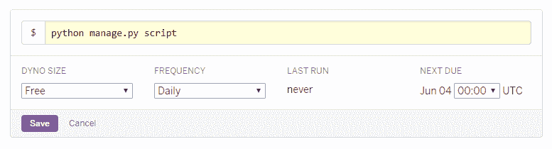

# 如何使用 Heroku Scheduler 在 Django 应用程序中调度作业

> 原文：<https://www.freecodecamp.org/news/scheduling-jobs-in-a-django-application-using-heroku-scheduler-13c971a22979/>

作者:阿尔法尔汉·扎赫迪

# 如何使用 Heroku Scheduler 在 Django 应用程序中调度作业


[https://unsplash.com/@agebarros](https://unsplash.com/@agebarros)

最近，我在 Heroku 上发布了我的第一个 Django 应用程序。

这个应用程序相当简单——它列出了与 [SPOJ](http://www.spoj.com/) 上每个**经典**问题相关的分数。

> [**SPOJ**](http://www.spoj.com/)——Sphere Online Judge——是一个 problemset 存档、在线评判和竞赛托管服务，接受多种语言的解决方案。

你可以在这里找到应用程序 live。

应用程序使用 Python 库`[bs4](https://www.crummy.com/software/BeautifulSoup/bs4/doc/)`和`[requests](http://docs.python-requests.org/en/master/)`来抓取上述网站的内容，获得每个问题所需的详细信息(即问题代码、问题名称、用户和**分数**，并将它们存储在数据库中。

现在，与 [SPOJ](http://spoj.com) 上的问题相关联的分数是动态的。它使用以下公式计算:

80 / (40 +解决了问题的人数)

因此，与 [SPOJ](http://spoj.com) 上的问题相关联的分数随着解决了问题*的人数的变化而变化。*

因此，我的应用程序收集的数据将在一段时间后变得无用。我需要设置一个调度程序来更新我的数据库。

现在，它是一个非常简单的应用程序。所以我想用尽可能少的配置和代码来设置调度程序。

### 自定义 Django 管理命令和 Heroku 调度程序来拯救我们！

让我们理解我们的两位救世主。

#### 1.自定义 Django 管理命令

自定义 Django 管理命令被构造为 Python 类，这些类从`django.core.management.base.BaseCommand`类继承它们的属性和行为。

它们用于为 Django 应用程序添加一个`manage.py`动作。`runserver`或`migrate`就是两个这样的动作。

这种类的一个典型例子是:

```
from django.core.management.base import BaseCommand
```

```
class Command(BaseCommand):    help = "<appropriate help text here>"    def handle(self, *args, **options):        self.stdout.write("Hello, World!")
```

该类必须命名为`Command`，子类必须命名为`BaseCommand`。

应该包含命令的简短描述，该描述将在帮助消息中显示。

`handle(self, *args, **options)`定义命令的实际逻辑。在这种情况下，我们只是将字符串`Hello, World!`写入标准输出。在我的例子中，如果与任何问题相关的**分数**发生变化，`handle(self, *args, **options)`执行抓取网站—[spoj.com](http://spoj.com)并更新数据库的任务。

每当使用以下命令时，`handle(self, *args, **options)`会自动运行:

`python manage.py <name of the python script containing the management cla` ss >

如果脚本的名称是`script.py`，那么命令应该是:

`python manage.py script`

注意，handle 方法声明了三个输入参数:`self`引用类实例，`*args`引用方法本身的参数，`**option`引用作为管理命令的一部分传递的参数。

**这个`script.py`在项目结构中的什么位置？**

(这里，`script.py`是指包含自定义 Django 管理命令的脚本的名称。)

很简单。[官方文件](https://docs.djangoproject.com/en/2.0/howto/custom-management-commands/)解释得很好:

> *只需在应用程序中添加一个`**management/commands**`目录。Django 将为该目录中名称不以下划线开头的每个 Python 模块注册一个`**manage.py**`命令。*

> *例如:*

```
polls/    __init__.py    models.py    management/        __init__.py        commands/            __init__.py            _private.py            closepoll.py    tests.py    views.py
```

> *在本例中，`**closepoll**`命令将可用于在`[**INSTALLED_APPS**](https://docs.djangoproject.com/en/2.0/ref/settings/#std:setting-INSTALLED_APPS)`中包含`**polls**`应用程序的任何项目。*

> *`**_private.py**`模块将不可用作管理命令。*

> *`**closepoll.py**`模块只有一个要求——它必须定义一个扩展`[**BaseCommand**](https://docs.djangoproject.com/en/2.0/howto/custom-management-commands/#django.core.management.BaseCommand)`或其[子类](https://docs.djangoproject.com/en/2.0/howto/custom-management-commands/#ref-basecommand-subclasses)的类`**Command**`。*

> *因此，如果我们在终端中运行以下命令:*

> `*python manage.py closepoll*` *，*

> 运行`closepoll.py`中的`*handle(self, *args, **options)*` *，执行上述函数中包含的任何逻辑/任务。*

我的项目结构如下:

```
spojscore│   .gitignore│   manage.py│   Procfile│   README.md│   requirements.txt│   runtime.txt│├───core│   │   admin.py│   │   apps.py│   │   models.py│   │   tests.py│   │   views.py│   │   __init__.py│   ││   ├───management│   │   │   __init__.py│   │   ││   │   ├───commands│   │         script.py│   │         __init__.py│   │     │   ││   ├───static│   │   └───core│   │       ├───css│   │       │       style.css│   │       ││   │       └───img│   │               favicon.png│   │               logo.png│   ││   ├───templates│       └───core│               core.html│└───spojscore        settings.py        urls.py        wsgi.py        __init__.py
```

在这里，`script.py`包含了自定义管理命令——Python 代码来刮取[spoj.com](http://spoj.com)，收集所有**古典** 问题的细节，并据此更新数据库。

如果你看到，它位于`core\management\commands`里面。

如果你有兴趣，可以在这里找到`script.py` [。](https://github.com/alfarhanzahedi/spojscore/blob/master/core/management/commands/script.py)

我想现在很清楚，我可以通过简单地从终端运行`python manage.py script`来抓取 spoj.com 并获得想要的数据。

因此，为了保持我的数据库更新，我只需要每天至少运行一次上面的命令。

#### 2.Heroku 调度程序

根据 Heroku 的网站:

> [*调度器*](https://elements.heroku.com/addons/scheduler) *是一个免费的[插件](https://elements.heroku.com/addons)，用于在[预定的时间间隔](https://devcenter.heroku.com/articles/scheduled-jobs-custom-clock-processes)在你的应用上运行作业，很像传统服务器环境中的`cron`。*

> *仪表板允许您将作业配置为每 10 分钟、每小时或每天在指定时间运行。当被调用时，这些任务将作为[一次性的 dyno](https://devcenter.heroku.com/articles/one-off-dynos)运行，并在您的日志中显示为一个名为`scheduler.X`的 dyno。*

部署应用程序后，安装 Heroku Scheduler 插件。

要为作业安排频率和时间，打开 Heroku Scheduler 仪表板，在[我的应用](https://dashboard.heroku.com/apps)中找到应用，点击“概述”，然后从已安装的附加组件列表中选择“Heroku Scheduler”。

在调度仪表板上，点击“添加作业…”按钮，输入任务，选择频率、 [dyno size](https://devcenter.heroku.com/articles/dyno-types) 和下次运行时间。

在我的例子中，任务是`python manage.py script`，它将在每天 00:00 UTC(下次运行时间)使用我的空闲 dynos (dyno 大小)执行。



就是这样！

我的数据库将在世界协调时每天 00:00 更新，我不需要安装任何额外的 Python 库，或者编写任何额外的代码。耶！

如果你在任何地方遇到困难，请留言，我会尽力帮助你。

### 一些最后注意事项:

*   Heroku 的官方网站称——*“调度程序任务执行是预期的，但不保证。众所周知，调度程序偶尔(但很少)会错过已调度作业的执行。如果计划的任务是您的应用程序的关键组成部分，**建议使用** [**运行自定义时钟进程**](https://devcenter.heroku.com/articles/scheduled-jobs-custom-clock-processes) ，以获得更高的可靠性、可控性和可见性。”使用 Heroku Scheduler 时应记住这一点。
    我的是一个非常简单的应用程序，它使用 Heroku 调度程序每天只运行一次简单的脚本。所以，我想它会做得很好！*
*   我想，我的应用程序对有竞争力的程序员是有用的。为什么？我已经在这里详细解释过了。
*   你可以在这里找到我的应用程序的源代码。

### 我个人思考的一部分:

我只是又一个自学成才的程序员。

我写代码已经有几年了，一直想写下我的经历、努力、失败和成功。

但是，唉，我不能。

我认为我的努力不够令人兴奋，或者我的经历对任何人都没有帮助。所以我克制自己不去写它们。

说实话，我现在也是这么想的。

那么，我为什么要写这篇文章呢？

嗯，这将是我许多文章中的第一篇。

你会问，变化的原因是什么？

时事通讯。

上周，像往常一样，我收到了 CSS-Tricks 的每周简讯— *“本周网页设计与开发”*。

这里，是同样的摘录:

> 在任何时候都有这么多有用的资源可以帮助我们，这是非常疯狂的:从博客帖子和书籍到只有 8 个视图的 random node.js 会议演讲，其中 7 个现在是我的。所以我认为这个周末加强了我写博客和分享你所知道的东西的信念，在一些开发者的旧博客上留下的随机笔记给了我巨大的帮助。

> 不管是谁，出于类似的原因，我一直在思考社交网络如何将名气置于价值之上。举例来说，如果你在媒体上发表了一些东西，但它只得到一个掌声，那么它会让你觉得，*为什么要麻烦*？如果没人读这东西还有什么意义？但我认为我们必须与这种被名气和社交网络恶名吸引的倾向作斗争，因为我想知道有多少有帮助的博客帖子和视频不是仅仅因为有人认为他们不会从它那里获得 50 万个赞或转发。

> 在这个周末从这么多乐于助人的人那里学到东西后，我的建议是:如果你想写点什么来解释你挣扎的事情，那就写吧！不要担心观点、喜欢和网络拥抱。如果你想弄清楚这件奇怪的事情，那就把它记下来，即使它未经编辑，使用了太多逗号，而且你不喜欢它的语气。

> 那是因为像我这样的人一定会发现你写的东西，这会让他们整个周末的压力比原本要小得多。

就是这样。这几行字激励我写下我的努力和经历。

也许，你也应该这样。