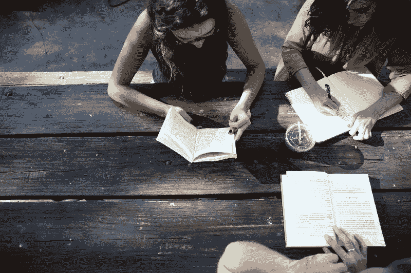
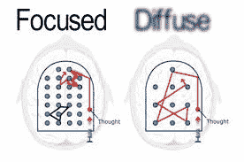
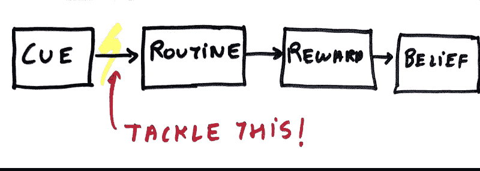
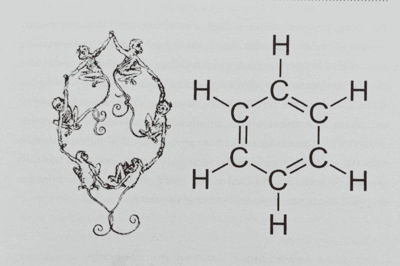
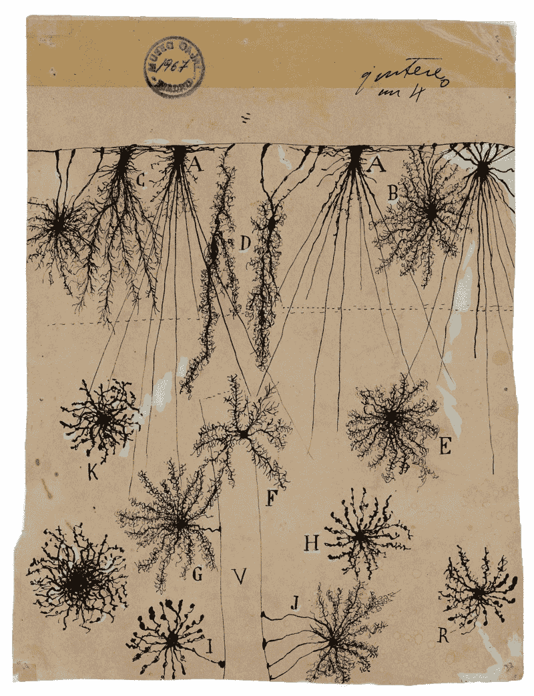

# 当你学习新事物时，要记住科学支持的方法

> 原文：<https://www.freecodecamp.org/news/science-backed-methods-to-keep-in-mind-when-youre-learning-new-things-34c00b35cbf/>

作者:Yash Chavan

# 当你学习新事物时，要记住科学支持的方法

Photo by [Alexis Brown](https://unsplash.com/photos/omeaHbEFlN4?utm_source=unsplash&utm_medium=referral&utm_content=creditCopyText) on [Unsplash](https://unsplash.com/search/photos/learn?utm_source=unsplash&utm_medium=referral&utm_content=creditCopyText)

作为一个好奇的人，我不断地发现自己在阅读和学习新事物。所以我拿起了芭芭拉·奥克利的《数字思维》这本书来加强和提升我的学习过程。这篇博文是我对我认为学习者应该实施的十件最重要的事情的看法。

### 1.刚开始，打破最初的壁垒。

每个任务都有一定的**激活能量** ( **AE** )。说你想练习弹吉他。你必须站起来，掸掉旧吉他上的灰尘，调好音，拿起拨子，开始弹奏。所有这些构成了弹吉他任务的 **AE** 。

某件事的风险越高，你开始做这件事的可能性就越小。采取措施减少你想开始的新习惯的 T2。把调好音的吉他放在你的客厅里，这样你就能随手拿到它。

想每天早上开始锻炼？前一天晚上准备好你的鞋子和重物。想多读点吗？在你的书桌上放一本书。当你想查看手机时，就去拿那本书。一旦你减少了你想要形成的新习惯的 **AE** ，就更容易开始了。

开始才是最重要的，因为大多数人不会开始；)

### 2.练习组块

曾经写过一个考试，你**知道****的答案？你知道组成答案的点点滴滴，但你不能把它们全部组合起来？**

**这是一个不用组块就能有效学习的例子。记忆**块**是你头脑中的一个牢固的连接，它将各种各样的信息联系起来。一大块是当你开始思考基本概念时，直接跟随你的一系列想法。**

#### ****如何分块****

**专注于你想形成一大块的概念，思考它，并确保在做这件事的时候排除所有干扰。接下来，写下这个概念的基本思想。通常归结为对最简单的概念有很强的理解。从这些基础开始构建，最终创建一个大块！**

### **3.学习、练习、回忆——重复**

**仅仅形成组块是不够的。你必须维护它们。你越关心这些大块，它们就越持久。**

**尤其是涉及到数学和科学等学科时，你不能一读就离开。为了很好地吸收材料，你需要自己复习材料和练习问题。当然，所有这些可能会很无聊，但是值得这么麻烦。**

**当你在复习材料时，不要被动地阅读。确保你**回忆起*。*** 通过回忆进行检索的行为增强了对主题的深刻理解。回忆你学过的东西的好地方可能是任何地方，除了你学过的地方。当你从不同的角度回忆时，这有助于你加强对材料的理解。在图书馆学习和在家里回忆是这种技术的一个例子。**

### ****4。放轻松****

**你就快成功了。时钟显示凌晨 2 点。三杯咖啡下肚。你已经花了 4 个小时来解决这个问题。这一个突破有可能让你在任务中获得“A ”,解决你研究中的一个主要障碍，或者让你成为百万富翁。所以你坚持下去，等待“啊哈！”瞬间。**

**现在是早上了。早上 7 点。没有突破，你一夜没睡。现在你昏昏沉沉的，今天剩下的时间都在诅咒自己做的事情有多糟糕。**重大失误！****

**每当你面对一个问题时，这就是你试图解决的一个障碍。暂停。休息一下。睡觉。打扫你的房间。除了解决问题之外，做任何事情。这会让你的大脑进入“扩散模式”——这种模式对你在背景中一直关注的事物起作用。回头再来谈这个问题。**

**

[Source](http://www.instructables.com/id/Learning-How-to-Learn/)** 

**你有没有做过一件你想不明白的事情，然后睡觉“梦到它”？这是你的漫射模式在起作用。所以放轻松，小睡一会儿，你就会对你要解决的问题有一些方向。你永远不知道，它可能会让你在作业中得 A，解决一个主要的研究障碍，或者让你赚一百万美元！**

### **5.了解你的拖延症，并消灭它**

**你会把谁称为拖延者？拖延者是一个有被事情和暂时的快乐分心的习惯的人。布洛普。，叮叮！ )。这些都无助于此时此刻必须完成的任务。**

**你听到那个神奇的词了吗？**习惯**。拖延是一个坏习惯。就像任何其他坏习惯一样，拖延的习惯可以变得更好。**

**习惯由 4 个关键因素组成:**

1.  **提示**
2.  **例行的**
3.  **报酬**
4.  **相信**

**提示可以是你的手机发出嗡嗡的通知。你的**常规**就是伸手去拿手机查看。**奖励**是当你在 Instagram 帖子上看到四个新的赞后，你会得到暂时的多巴胺峰值。信念是分散注意力的习惯让你快乐，所以你永远无法改变这个习惯。习惯对你有力量，因为你相信它们。改变信仰，就能改变习惯！**

**为了不拖延，你能做的第一件事就是**排除干扰**。工作的时候不要把手机放在身边。在你预定的工作时间屏蔽所有娱乐网站。**

****

**减少拖延的另一个关键是**线索-常规**转换行为。积极地注意你对某些分散注意力的暗示的反应。**兵！** 想拼命查那个手机？不要。克制住想要伸出手去的冲动。精神上足够强大，专注于手头的工作。你未来的自己会感谢你。**

### **6.设置任务的结束时间**

**你醒了。检查你的待办事项清单，记下你这一天要做的事情。你准时开始工作(太好了！)但是，在一天结束的时候，有些事情还没有完成。把任务推迟到明天。**

****帕金森第二定律:****

> **工作扩大以填补完成工作的时间。**

**假设你有一个现实的待办事项清单，这就是阻止你完成清单上任务的原因。一旦你开始完成某件事，你的大脑就会开始认为这是值得的。一个奖励，一集，看一眼你朋友给你加标签的迷因。你又回到了拖延的漩涡中。**

**解决这个问题的一个方法是为任务设定一个结束时间。你知道，你的大部分工作都是在截止日期前完成的。为每天的任务设定一个微小的最后期限可以让你的大脑对时钟的滴答声负责。大多数人会为任务设定一个开始时间，然后陷入拖延的怪圈。设定一个结束时间会帮助你按时做事。**

### **7.使用视觉和空间记忆**

**这个是关于记忆和回忆的。要正确记忆概念，你需要做的第一件事就是理解它们。要成功理解某件事，将它形象化是关键。感受一下。**

**想为了工作背物理方程？**W = F * d**T2。不要把它当成是，就字母 **F** 和 **d** 来说。想象一下。想象你推着一辆手推车，你在做什么？你对小车施加力，小车向前移动一段距离。你做的功与你施加的力( **F** )和你移动手推车的距离(位移， **d** )成正比。 **F*d** 。完成了。**

**作为一个孩子，你可能会被要求在背诵诗歌时做一些“动作”。我觉得很奇怪。撇开怪异不谈，这是有原因的。某些地方和行为帮助我们记住事情。我们把事件与行动和地点联系起来。你也可以用动作或事物来记忆方程式！**

**

Associating events, feelings with places; Photo by [Anita Jankovic](https://unsplash.com/photos/m5oFzzrcKwc?utm_source=unsplash&utm_medium=referral&utm_content=creditCopyText) on [Unsplash](https://unsplash.com/?utm_source=unsplash&utm_medium=referral&utm_content=creditCopyText)** 

**我们进化成了视觉和空间物种。我们不得不以打猎和杀戮为生。我们需要空间技能来理解如何射箭，投掷长矛。我们必须在视觉上记住有毒植物的样子。这就是我们如何进化的，所以利用你的原始特质。**

### **8.使用隐喻和故事**

**隐喻给你一张描图纸来描绘你想要画的图案。当然，你可以自己画图案，但是有描图纸是有用的。 ***Boom*** *，*我只是用了一个比喻来说明你为什么要用比喻。为此鼓掌。**

**隐喻会帮助你更容易理解和回忆。你从记忆中提取一些显而易见的东西，看看它与你试图学习的新概念有什么联系。你正在**追踪** 先前存在的神经通路，以创建一个更强大、更相关的新概念视图。**

**

Monkeys and Benzene, notice the tails for double bonds (from “A mind for numbers” by Barbara Oakley, Page 171)** 

**想了解电流如何在电路中流动吗？想象一个水泵。压力就是电压。压力差导致水移动——电压差导致电子移动。泵本身就像电池，它产生压力，也就是电压。水的流动就是水流。**

**当你以这种方式思考概念时，它们会以一种更好的方式铭刻在你的记忆中，而不是以表面价值来看待它们。**

### **9.学习你想要的**

**学习应该永远是自我激励的，否则就不是真正的学习。如果你生活在一个像印度这样的国家，你现在在学校或大学学习的东西很有可能是强加给你的。学校没有理解的是，学习不是靠纯粹的力量和对失败的恐惧而发生的。学习应该以学习者为中心。**

#### ****大学不是学习的唯一途径(在合理范围内)****

**如果你被困在你不喜欢的不重要的课程中，不要专注于它们。开始学习你想要的，因为那才是真正重要的——那是你必须关心的。人们是在自我激励的时候学习的，而不是当有人每周四个小时来到他们面前，告诉他们一些事情的时候。数学、艺术和科学不是观察者的游戏。你得**做**。**

> **“我认为学校最大的错误是试图教孩子们任何东西，并把恐惧作为基本动机。害怕成绩不及格，害怕不能和你的班级在一起，等等。与恐惧相比，兴趣可以产生大规模的学习，就像核爆炸产生鞭炮一样。”斯坦利·库布里克**

**自己开车——即使是汽车也会这样。学你想要的。当你自己学习时，你学得最好。**

### **10.技能的交叉**

**迁移学习(是的，机器学习双关语)是将你在一个领域学到的东西应用到一项新技能的能力。如果你已经知道如何演奏一种乐器，学习一种新的对你来说会很容易。**

**以抽象的方式学习。当你学习某样东西以便将其应用于某个应用时，你就被限制在那个领域。先学习抽象概念。这也是我在跳到机器学习之前先上线性代数课程的原因之一。工程和商业相关的研究自然倾向于更具体的应用方法。这往往会限制你。**

**学会将旧技能运用到新技能中，反之亦然。圣地亚哥·拉蒙·y·卡哈尔是一位西班牙神经学家，他有绘画的爱好。一旦他在实验室观察完细胞，他就会画出它们！这有助于他更好地理解他们。卡哈尔被称为“神经科学之父”。如果他做了，你也应该做。**

**

“Glial cells of the cerebral cortex of a child,” a drawing from 1904; Source: [NY Times](https://www.nytimes.com/2018/01/18/arts/design/brain-neuroscience-santiago-ramon-y-cajal-grey-gallery.html)** 

**一旦你转移了你的学习，与两个概念相关的神经通路变得更强，并提高你对每个概念的理解。**

### **奖金！**

**如果你已经在博客上坚持了这么久，我爱你。这里还有一个提示:**

### **11.睡觉！(这一点非常重要)**

**你明天早上 9 点有一场考试。你决定熬夜学习到凌晨 3 点。你不能错过比你竞争过度的朋友少得两分的机会。所以你煮了咖啡，然后为了考试忙了一晚上。**

**快进两天，结果出来了。尽管你熬了一个通宵，但你的成绩并不比上次好。你会问，哪里出了问题？**

**你彻夜未眠的事实就是问题所在。你所做的是临时抱佛脚，你不明白。没有组块，你的大脑看到的只是对其毫无意义的单词和数字。**

**睡眠不足影响记忆和回忆。你的大脑是一块肌肉。如果你跑马拉松，你的腿需要休息。你的大脑每天都在跑马拉松。它至少需要 7-8 小时的“休息”。尽早为考试做准备，不要留到头天晚上。**

**如果你是那种对你所做的事情充满热情的人，熬夜完成你喜欢的任务是很有诱惑力的。但是你必须睡觉。睡眠帮助你的大脑进入扩散模式，从而对你正在进行的烹饪项目产生创造性的想法。良好的睡眠可以提高你的注意力，帮助你更好地理解一天中学到的东西。**

**快速眼动睡眠可以帮助你改善陈述性记忆——基于复杂事实信息的记忆。因此，良好的睡眠对那些必须处理事实和数字的学生来说尤其有用。**

**所以睡觉吧！这不是浪费时间。它对你的影响比你想象的要大。**

**

[This is a cute baby sleeping](https://unsplash.com/photos/5yUPFjGFJoI). Have a nice day!** 

**感谢阅读！我希望这对你有帮助。如果你喜欢，留下一些掌声吧！你有自己使用的技巧吗？请在下面的评论中留言:)**

**我在媒体上写生活、工作、机器学习和几乎任何我觉得有趣的东西。如果你感兴趣，请跟我来。**

**在 [Instagram](http://www.instagram.com/the_yc_) 和 [LinkedIn](https://www.linkedin.com/in/iamycee/) 上与我联系，进行一对一的聊天。**

**碾压下学期！**