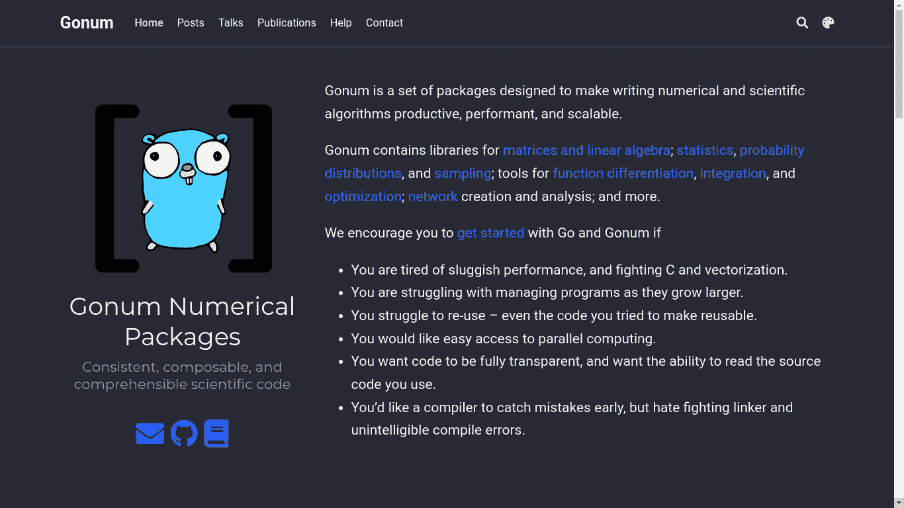
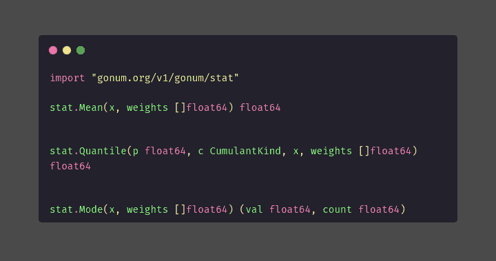

# 使用 Gonum 软件包在 Golang 中进行科学计算

> 原文：<https://www.freecodecamp.org/news/scientific-computing-in-golang-using-gonum/>

在本文中，我将向您介绍 Gonum，这是一个可以用来在 Go 编程语言中执行科学计算的包。

### 以下是我们将在本中级教程中介绍的内容:

*   什么是戈纳姆？
*   为什么使用 Gonum
*   如何安装和设置 Gonum
*   如何使用 Gonum 执行统计操作
*   如何使用 Gonum 执行矩阵运算
*   Gonum 支持的其他科学计算。

### 先决条件:

*   Golang 函数式编程知识。
*   一个安装了 Go 的 Golang IDE(我用的是 Goland 和 Go 1.17.6，但是你可以用其他的)

## 什么是戈纳姆？



[Gonum](https://github.com/gonum/gonum) 是 Go Numerical 的缩写，是由[gonum.org](http://gonum.org)构建和设计的 Golang 软件包，旨在使 Go 编程语言中的科学计算更加容易。

Gonum 包类似于 [Python](http://python.org) 编程语言中的 [Numpy](https://numpy.org/) 。Numpy 目前可以提供比 Gonum 更多的功能，但是 Gonum 的功能一直在改进。

Gonum 包支持各种科学计算的功能，如线性代数、微积分、统计、图形和许多其他功能。

在本文中，我们将介绍 Gonum 的各种功能和用例。

## 为什么使用 Gonum？

*   Golang 提供的速度和并发性。
*   Golang 程序更容易维护。
*   Gonum 包含了比 Go 标准库更多的数学运算。
*   Gonum 针对各个领域的科学计算进行了优化。

## 如何开始使用 Gonum

要开始使用 Gonum，您需要使用以下命令在您的终端上安装来自 [Github](https://github.com/gonum/gonum) 的软件包:

```
go get -u gonum.org/v1/gonum/ 
```

该命令应该会输出一条成功安装的消息。如果没有，请将您的 Go 更新到更新的版本，然后重试。

## 使用 Gonum 的统计操作

Gonum 包为统计计算提供了一个库。这个库包含了很多函数，你可以在这里查看。

在本教程中，我将介绍这个库的基本功能，特别是集中趋势的度量(均值、中值、众数)。

像这样导入`gonum`包中的统计库:

```
import “gonum.org/v1/gonum/stat” 
```



*   **平均值** : `stat.Mean`得出`float64`类型切片的平均值。它接受一个切片和一个[权重](https://en.wikipedia.org/wiki/Weighted_arithmetic_mean)，这个权重可能为零，也可能是一个对应的切片，该切片被加权。

```
func mean() {
   values := []float64{1, 2, 3, 4, 5, 6}
   weights := []float64{1, 1, 1, 1, 1, 1} //has the same effects as nil
   fmt.Println(stat.Mean(values, weights))
} 
```

**输出:3.5**

*   **中位数** : `stat.Quantile`，在 gonums/stat 中没有中位数的显式函数。但是我们可以通过导入`sort`模块传入一个排序的片来使用`stat.Quantile`。

`stat.Quantile`取位，切片，[累计量种类](https://github.com/gonum/gonum/blob/v0.9.3/stat/stat.go#L1039)和重量。位置自变量`p`为 0-1 的浮点数，累积量种类为`stat.Empirical`或`stat.LinInterp`。

在这种情况下，我们使用`stat.Empirical`，它返回指定位置`p`的值。

```
```go
import (
	"gonum.org/v1/gonum/stat"
	"sort"
)

func median() {
	values := []float64{10, 20, 25, 30, 45, 70, 30}
	sort.Float64s(values) //sorts the float
	fmt.Println(stat.Quantile(0.5, stat.Empirical, values, nil))
}
``` 
```

**输出:30**

*   **模式** : `stat.Mode`。就像`stat.Mean`一样，它接受一个值片和一个权重片，并返回出现次数最多的元素以及该元素的出现次数。

```
func mode() {
   values := []float64{10, 20, 25, 30, 45, 70, 30}
   fmt.Println(stat.Mode(values, nil))
} 
```

**输出:30 ^ 2**

## 使用 Gonum 的矩阵运算

Gonum 支持 [`mat`包](https://pkg.go.dev/gonum.org/v1/gonum/mat)中的矩阵运算。

```
import “gonum.org/v1/gonum/mat” 
```

### 如何创建矩阵:

`mat.NewDense`是创建矩阵的方法。它接受矩阵的维数和要传入的数据，数据可以是零(所有实体都等于零的矩阵)。

返回一个指向矩阵对象的指针，该对象可以被取消引用。

零矩阵是本教程中示例的矩阵。

```
func null(){
  matrix := mat.NewDense(3, 3, nil)
  fmt.Println(*matrix)
} 
```

**输出:**

```
{{3 3 [0 0 0 0 0 0 0 0 0] 3} 3 3} 
```

### 如何格式化矩阵输出

打印一个没有格式化的 Gonum 矩阵会返回一个指向这个格式的矩阵的指针`{{3 3 [0 0 0 0 0 0 0 0 0] 3} 3 3}`。

为了输出一个二维表格，我们使用`mat.Formatted`，它接受矩阵对象、一个前缀和一个格式选项，在本例中，我们使用`mat.Squeeze`。

```
func format(matrix mat.Matrix) {
	formatted := mat.Formatted(matrix, mat.Prefix(""), mat.Squeeze())
	fmt.Println(formatted)
} 
```

**输出**:

```
⎡0  0  0⎤
⎢0  0  0⎥
⎣0  0  0⎦ 
```

### 如何设置矩阵值

为了将一个值输入到矩阵中的一个位置，我们在矩阵对象上使用`.Set`。`matrix.Set`接受三个或更多参数，如下所示:

`matrix.Set(rowNumber, columnNumber, element)`。

```
func input(){
	matrix.Set(1, 2, 3.0)
} 
```

**输出**:

```
⎡0  0  0⎤
⎢0  0  3⎥
⎣0  0  0⎦ 
```

### 如何获得矩阵值

使用 matrix 对象上的`.At`来检索矩阵中的值，它分别接受行号和列号。

这里，我们检索我们在上面的例子中设置的元素:

```
func retriever(){
	getElement := matrix.At(1, 2)
	fmt.Println(getElement)
} 
```

**输出:3 个**

### 如何转置矩阵

转置矩阵包括交换矩阵中的行和列，以便将行设置为列，反之亦然。

matrix 对象上的`.T`方法转置矩阵。

```
func transposer(){
	format(null.T())
} 
```

这里，我们转置 set 示例的矩阵输出。

**输出:**

```
⎡0  0  0⎤
⎢0  0  0⎥
⎣0  3  0⎦ 
```

### 矩阵的行列式

您可以使用方法`mat.Det`计算矩阵的行列式，该方法接收矩阵并返回它的行列式。

```
func determinant(){
	determinant := mat.Det(matrix)
	fmt.Println(determinant)
} 
```

**输出** : 0

### 如何向矩阵添加行和列

您可以使用`.SetRow`和`.SetCol`添加新的行或列。这些方法接受一个行号和一部分相似维度的值。

这将更新矩阵的行和列:

```
values := []float64{1, 2, 3}
matrix.SetCol(0, values)
matrix.SetRow(1, values) 
```

**输出:**

```
⎡1  0  0⎤
⎢1  2  3⎥
⎣3  0  0⎦ 
```

## 其他 Gonum 包

Gonum 有更多用于科学计算的软件包:

*   [blas](https://pkg.go.dev/gonum.org/v1/gonum@v0.11.0/blas) →为 BLAS ( **基本线性代数子程序)**线性代数标准提供接口
*   [diff](https://pkg.go.dev/gonum.org/v1/gonum@v0.11.0/diff/fd) →微分学函数
*   [图形](https://pkg.go.dev/gonum.org/v1/gonum@v0.11.0/graph) →图形界面
*   [积分](https://pkg.go.dev/gonum.org/v1/gonum@v0.11.0/integrate) →积分函数
*   [lapack](https://pkg.go.dev/gonum.org/v1/gonum@v0.11.0/lapack) →为 lapack(线性代数包)线性代数标准提供接口
*   [mathext](https://pkg.go.dev/gonum.org/v1/gonum@v0.11.0/mathext) →不包含在 Go 标准库中的特殊数学函数
*   [单位](https://pkg.go.dev/gonum.org/v1/gonum@v0.11.0/unit) →便于使用国际单位制单位的类型和常数

## 包扎

在本文中，您学习了使用 Gonum 包在 Golang 中进行科学计算。

我们讨论了 Gonum 中的统计和矩阵计算，并浏览了 Gonum 包中的其他科学计算模块。

使用 Gonum 包中的其他模块非常简单，类似于我们在这里讨论的那些模块。