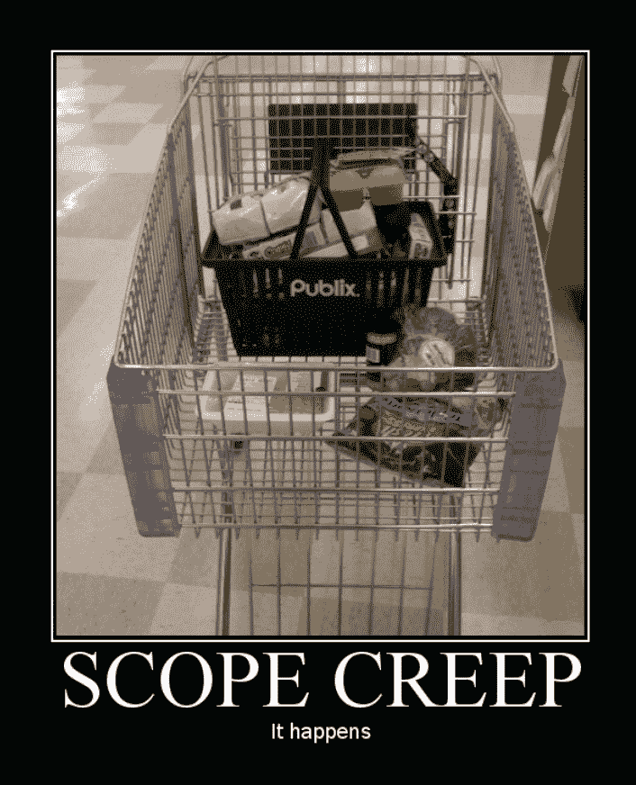
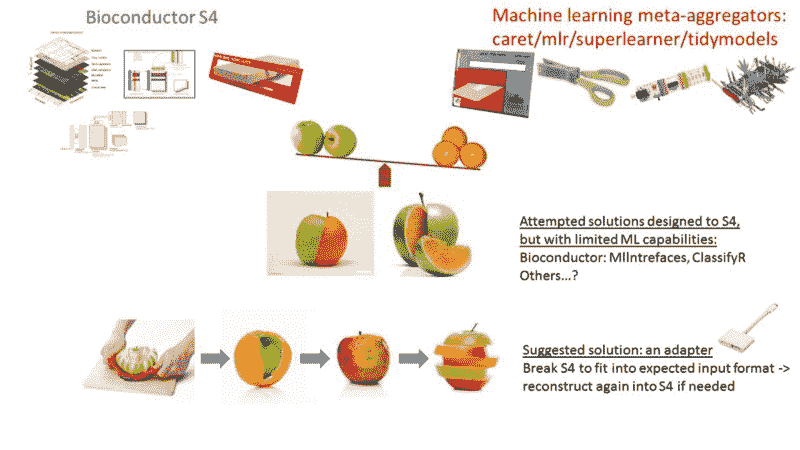
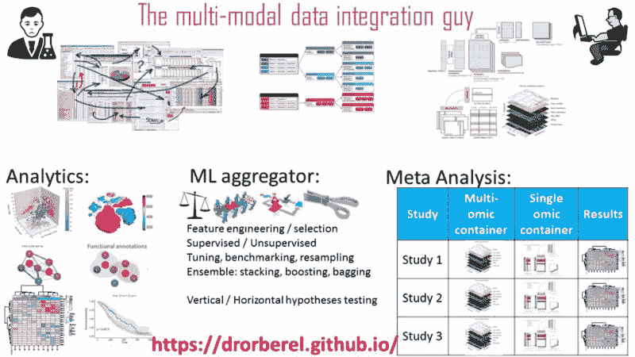

# 如何避免范围蔓延，以及其他软件设计的惨痛教训

> 原文：<https://www.freecodecamp.org/news/scope-creep-and-other-software-design-lessons-learned-the-hard-way-edacf021965b/>

作者:德罗尔·贝雷尔

# 如何避免范围蔓延，以及其他软件设计的惨痛教训

#### 从数据科学的角度来看。

你的办公桌上有一个全新的项目，一些令人兴奋的数据，一个具有挑战性的 Kaggle 比赛，一个你希望给其留下深刻印象的新客户，你充满了动力。起初，问题似乎定义得很好，你甚至对手头的任务感到很舒服。你刚刚完成了一项类似的任务。这个新的应该不会有太大的不同。甚至可能只是一些复制/粘贴，在边缘做一些修改。

但是接下来……客户/合作者/老板只有一个简单的附加要求……通常是这样的:

> 嗯，我想知道结果会是什么样子，如果我们只做一个小的改变，而不是 x，只是做 y，或者…你知道吗，让我们两个都试试，看看它会如何影响结果。

您最初选择的工具/解决方案能处理这样的调整吗？通过几处改动复制/粘贴它可能很容易，但是如果你不得不一次又一次地做呢？你打算坚持你最初的计划多久？

在机器学习的背景下，一些例子是:

**调整** ' *让我们看看不同的模型参数如何影响它'*

**基准测试** ' *让我们看看各种模型是如何影响它的'*

**集合**’*让我们试着把最好的模特组合在一起*

**重采样/交叉验证** ' *我们必须检查过度拟合*

想象一下，在此之上添加一些复杂、混乱、多层、高通量的基因组数据，这些数据可以很容易地达到非常**精细的分辨率水平**(基因表达/突变/序列……)，…然后在彼此之上添加多层不同的**多基因组**数据，…然后在**荟萃分析**水平上对多个队列/研究进行同样的操作…你可能最终会得到一个非常…大…难看…的混乱局面！

听起来熟悉吗？不幸的是，我不止一次遇到这种情况。尽管我很想取悦我的合作者，但在那个时候，我的工具…有限，不足以交付更大范围的解决方案。当时，我可能甚至没有意识到更高层次的范围是相关的。

[https://leankit.com/wp-content/uploads/2013/11/Screen-Shot-2013-11-25-at-4.25.52-PM.png](https://leankit.com/wp-content/uploads/2013/11/Screen-Shot-2013-11-25-at-4.25.52-PM.png)

在项目管理的背景下，已经有很多关于[范围蔓延](https://en.wikipedia.org/wiki/Scope_creep)的文章。但是，一个科学家，一个被训练来关心分析/工具的正确性，而不是整个项目的“管理”的科学家，会对此说些什么呢？

好消息是，我的朋友，从别人的错误中学习永远不会太晚。这里有几个教训，是从艰难的道路上得到的。(别担心，这不是另一篇关于可重复研究的博文)。

#### 第一课:从结尾开始！定义你的范围。需要延长吗？

请确保您了解最高预期分辨率是多少！头脑风暴一下你的项目最疯狂的结果是什么，然后在你的时间框架和预算内达成合理的期望。

对项目范围有一个非常详细、清晰的定义。例如，您的解决方案是只处理一个数据集，还是多个数据集？你将如何验证你的结果？总是会有更多的方法/数据集，但是什么才足够呢？

范围蔓延的棘手挑战是客户并不真正关心或考虑“范围”。他们的目标是得到一个解决方案，解决一个假设或一个业务需求。他们的要求是在范围内还是范围外，完全是你的问题！处理好它！

在**机器学习**的背景下，回到过去，我使用专门的 R 包，只做一个多变量模型。他们做得很好，但是对于开发人员领域来说太具体了，并且在与其他模型进行比较时缺乏更高的分辨率，或者聚合其他模型，或者缺乏重采样实现。直到后来，我才学会利用机器学习元/聚合器包，如 mlr、tidymodels(以前的 caret)或 SuperLearner 来扩展我的范围。[点击这里了解更多信息](https://towardsdatascience.com/meta-machine-learning-packages-in-r-c3e869b53ed6)。

#### 第二课:不要重新发明轮子！有其他专家比你更清楚如何去做！

在这样一个角色中，你被期望是多学科的，每天都有新的工具/方法出现，每个人都可以使用，探索任何新的方法可能会滑入一个非常深的兔子洞。你猜怎么着，没人希望你在这上面浪费他们的时间/金钱。

如何赌对工具？问问你自己，那个领域的专家用什么？他们开发的工具有多成熟？它是要被维护，还是被废弃？他们当然有自己的学习曲线，并且随着时间的推移，他们已经完善了他们的工具来克服你将要发现的常见陷阱。

对我来说，有了基因组数据，它就是**生物导体** **面向对象的 S4** 类。[点击这里](https://medium.com/@drorberel/bioconductor-s4-classes-for-high-throughput-omic-data-fd6c304d569b)了解为什么它是满足我需求的最佳工具。当然，学习起来并不轻松，但是当我看到它是如何在顶级学术和行业组织中实现的时候，我感到很放心。我也知道这不是另一个可能死亡的开源资源。相反，它是一个政府和学术界资助的项目，由该领域最好的专家提供支持，开放、免费，供我们所有人使用。

#### 第三课:发现差距？要有创意，但要保持简单！

但是如果分析管道中的某些东西仍然没有到位呢？缺失的一环，无处可寻，可以更好地满足您的特定需求，弥补差距？

在这里，你可能需要完成一些脏活，不要再依赖别人给你提供解决方案。另一个潜在的滑溜溜的兔子洞？也许…如果你不够小心的话！

如何避免？很简单:**保持简单！**

这里有一个非常简单的例子。假设你要解决一个无人监督的问题。肯定有不止一种方法。选哪个？是最简单的一个，假设“层次聚类”，只要开始就够好了？实施它，看看它如何与您的其他分析组件(数据、可伸缩性、可再现性)一起工作，然后，在事情按您的计划顺利完成后，将这种简化放松为更复杂的方法。要非常小心，循序渐进。

接下来是更多的例子。

#### 第四课:不要害怕重构！

厌倦了修补和调试其他人，甚至是你的老板，在更好的工具出现之前编写的内聚性差、设计差的代码吗？你问自己，GRRRRR，这是一个如此丑陋的解决方法，为什么不简单地使用专门为此任务设计的新方法呢？(参见第 2 课)。

是的，一切从头开始是有风险的，有时你可能没有足够的资源来做这件事，但也许是时候进行一次现实检查了。

但是如果重构解决方案会给我们带来与我们的合作者所期望的不同的结果呢？好吧，如果确实有过去的错误，最好现在就面对它，承认它，以免造成更大的伤害。但也要记住第三课:如果你坚持简单的核心解决方案，在更广泛的包装解决方案下重构它们应该有助于产生类似的结果。

#### 第五课:转到第一课。

### **案例分析:**

这里有两个案例研究，来自我自己处理多基因组数据的经验。(可以很容易地扩展到其他类型的数据，但这可能是以后文章的主题)。

案例研究#1: Bioc2mlr:一个将 Bioconductor 的 S4 经济类转换为 mlr 的任务和 CPOs 的实用函数。

[https://drorberel.github.io/Bioc2mlr/](https://drorberel.github.io/Bioc2mlr/)

我喜欢使用 [Bioconductor 数据容器存储基因组数据](https://medium.com/@drorberel/bioconductor-s4-classes-for-high-throughput-omic-data-fd6c304d569b)，但我也喜欢使用[机器学习元聚合工具包](https://towardsdatascience.com/meta-machine-learning-packages-in-r-c3e869b53ed6)进行更高层次的分析。唯一的问题是它们不一定相互兼容。

S4 面向对象有多个维度(插槽)，在复杂的约束条件下被捆绑在一起，是为了满足某种目的而有意设计的。但是机器学习方法是为简化的、扁平的、二维的、类似矩阵的输入结构而设计的:特征/变量的列，主题/观察的行。

我需要某种方法来打破 S4 约束的纽带，把它拉平。但不幸的是，据我所知，我找不到这样做的方法。我应该做些什么？

记得第三课:我应该把时间花在这项任务上吗？嗯……是的，为什么不呢？我对这两种方法都感到很舒服，已经体验过了其中的细节和不足，而且我明确地意识到这两种方法的巨大价值，无论是单独使用还是联合使用。事实上，创建这个适配器包 Bioc2mlr 并不难，如果您查看代码本身，就会看到相对简单的步骤。

**案例 1 的结论**:当你有几个好的工具，但是它们不兼容时，创建一个简单的新适配器来链接它们。

[https://drorberel.github.io/Bioc2mlr/](https://drorberel.github.io/Bioc2mlr/)

**案例研究#2:荟萃分析**

> 但这对我来说还不够……(见第五课)。

我的范围扩展要求我提供一个更高层次分析的解决方案。对多个研究/队列进行元分析，每个都有一个多组数据立方体，每个都有一个下游的机器学习分析管道，实施重采样，以及所有这些，跨所有研究，并在规模上。Phewww！

> 相当大的挑战！我应该如何实施上述课程？

第一课:我从最后开始。我的“观察单位”row，整齐地说，不是主题，也不是基因，也不仅仅是组学之一。它是整个研究/队列(即一个完整的数据立方体)被压缩到 r 中的一个对象中。一点问题都没有。根据需要为更多群组添加任意多的行。

第二课:不必发明新工具。我们领域的专家已经帮我们搞清楚了。他们这样做的时候可能没有想到这个实现，但是如果我能做到，你也能。试一试吧。

第三课:我找到了一个简单的解决方案。我应该为这种多群组、多组数据发明/扩展一个新的 S4 面向对象类吗？当然不是。一定有简单的解决方法。我的简单解决方案是:一个整洁的/嵌套的数据结构，每个单元都有非原子对象。[点击此处了解更多信息](https://medium.com/@drorberel/meta-analysis-of-multiple-multi-omic-oy-vey-a45a9533e68d)。

第四课:重构？好吧。也许我现在还没有到那一步，因为到目前为止我的(目前的)视野可以处理我所有最疯狂的梦想。但是，如果您向我展示一种更好的方法，也许是 data.table one(我知道)，或者甚至是 python(但愿不会如此)，我会毫不犹豫地尝试一下，即使这超出了我的舒适区。

第五课:元-元分析？(不是错别字)。谁知道呢。也许有一天。

**案例二**结论:整理好一切！甚至非原子物体。

[https://drorberel.github.io/aboutme](https://drorberel.github.io/aboutme)

#### 最后一条建议:征求专家的意见，至少在你成为专家之前。

要是我以前知道那件事就好了。“那本可以节省我很多时间和精力……”

对专家来说，你当前的挑战就是昨天的解决方案。当我们还在幼儿园的时候，他们就已经知道了。他们的整个职业生涯都在这上面。给他们发一封电子邮件，问一个非常明确的问题，不要依赖概念证明示例或案例研究来证明您的挑战。我的经验是，如果你尊重他们的时间和权威，他们会很乐意帮助你。

### **遗言**

当你发现你对哪种类型的工具/解决方案充满热情时，就让它发生吧！不要用为什么现在不是创建新工具的好时机的借口来欺骗自己。去做吧！

不要放弃。专注。决定你想要达到的目标。不要害怕扩展你的范围，而是用简单的解决方案去做！重构。这值得你花时间。也许不会马上，但在未来的日子里。要有创意！

最后但同样重要的是，不要害羞。跟大家说说吧。与您的社区分享。用你的解决方案让宇宙变得更美好。你甚至可以额外赚一美元。谁知道呢？

附言

这篇文章献给所有我以前焦虑的合作者/客户/老板。感谢你的耐心，我希望我以前就知道这些。你在那里帮助和支持我艰难地学习这些课程，不管是好是坏。让我补偿你吧。给我发一封电子邮件，我会用几行代码重做我以前的工作，反映我目前的工作范围。

点击此处查看更多相关话题:[https://drorberel.github.io/](https://drorberel.github.io/)

### 顾问:目前接受新项目！

有用的参考:

[**Clean Coder 博客**](https://blog.cleancoder.com/)
[*论能力减弱理性讨论*blog.cleancoder.com](https://blog.cleancoder.com/)[**项目管理中的范围蠕变:定义、原因&解决方案**](https://www.workamajig.com/blog/scope-creep)
[*当一个项目延伸到远远超出其最初的设想时，就被称为“范围蠕变”。项目管理中的范围蔓延…*www.workamajig.com](https://www.workamajig.com/blog/scope-creep)