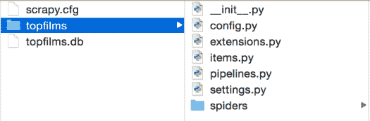
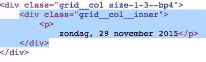
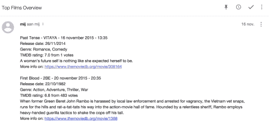

# 从网上搜集收视率最高的电视电影的完整指南

> 原文：<https://www.freecodecamp.org/news/scrape-the-web-for-top-rated-movies-on-tv/>

在这篇文章中，我将展示如何用 [******Scrapy 框架******](http://scrapy.org/) 在互联网上刮出顶级电影。这个 web scraper 的 ******目标****** 是在[电影数据库](https://www.themoviedb.org/)中找到用户评分高的电影。这些影片的列表将存储在一个 ******SQLite 数据库****** 和 ******电子邮件****** 。这样你就知道你再也不会错过电视上的大片了。

# 寻找一个好的网页来抓取

我从在线电视指南开始，寻找比利时电视频道上的电影。但是您可以轻松地修改我的代码，将其用于任何其他网站。为了让您更轻松地抓取电影，请确定您想要抓取的网站:

*   具有 HTML 标签的 ******可理解类或 id******
*   采用 ******与****** 方式一致的班级和 id
*   拥有 ******结构良好的网址******
*   在一个页面上包含所有相关的 ******电视频道******
*   有一个 ******单独的页面，每个工作日有******
*   ******仅列出电影****** ，没有其他节目类型，如直播节目、新闻、报告文学等。除非你能轻易地将电影与其他节目类型区分开来。

有了发现的结果我们会刮出 [******的电影数据库******](https://www.themoviedb.org/)【TMDB】的电影评分等一些信息。

# 决定存储什么信息

我将收集以下关于电影的信息:

*   电影名称
*   电视频道
*   电影开始的时间
*   这部电影在电视上播出的日期
*   类型
*   情节
*   出厂日期
*   链接到 TMDB 的详细页面
*   imdb 评级

你可以用所有演员、导演、有趣的电影事实等等来补充这个列表——所有你想知道更多的信息。

在 Scrapy 中这些信息会被保存在一个 ******项****** 中。

# 创建 Scrapy 项目

我假设你已经安装了 Scrapy。如果没有，可以遵循优秀的 [Scrapy 安装指南](http://doc.scrapy.org/en/latest/intro/install.html)。

安装 Scrapy 后，打开命令行并转到您想要存储 Scrapy 项目的目录。然后运行:

```
scrapy startproject topfilms
```

这将为 top films 项目创建一个文件夹结构，如下所示。现在可以忽略 topfilms.db 文件。这是我们将在下一篇关于管道的博客文章中创建的 SQLite 数据库。



# 定义废料项目

我们将使用文件******. py**。**** 创建你的 Scrapy 项目时默认创建 Items.py。

一个`scrapy.Item`是一个容器，将在网页抓取过程中被填充。它将保存我们想要从网页中提取的所有字段。该项的内容可以像******Python dict******一样被访问。

打开 items.py 并添加一个包含以下字段的`Scrapy.Item class`:

```
import scrapy
class TVGuideItem(scrapy.Item):
    title = scrapy.Field()
    channel = scrapy.Field()
    start_ts = scrapy.Field()
    film_date_long = scrapy.Field()
    film_date_short = scrapy.Field()
    genre = scrapy.Field()
    plot = scrapy.Field()
    rating = scrapy.Field()
    tmdb_link = scrapy.Field()
    release_date = scrapy.Field()
    nb_votes = scrapy.Field()
```

# 用管道处理项目

在开始一个新的 Scrapy 项目后，您将拥有一个名为 ****pipelines.py**** 的文件。打开该文件，复制粘贴如下所示的代码。之后，我将一步一步地向您展示代码的每一部分是做什么的。

```
import sqlite3 as lite
con = None  # db connection
class StoreInDBPipeline(object):
    def __init__(self):
        self.setupDBCon()
        self.dropTopFilmsTable()
        self.createTopFilmsTable()
def process_item(self, item, spider):
        self.storeInDb(item)
        return item
def storeInDb(self, item):
        self.cur.execute("INSERT INTO topfilms(\
        title, \
        channel, \
        start_ts, \
        film_date_long, \
        film_date_short, \
        rating, \
        genre, \
        plot, \
        tmdb_link, \
        release_date, \
        nb_votes \
        ) \
        VALUES( ?, ?, ?, ?, ?, ?, ?, ?, ?, ?, ? )",
        (
        item['title'],
        item['channel'],
        item['start_ts'],
        item['film_date_long'],
        item['film_date_short'],
        float(item['rating']),
        item['genre'],
        item['plot'],
        item['tmdb_link'],
        item['release_date'],
        item['nb_votes']
        ))
        self.con.commit()
def setupDBCon(self):
        self.con = lite.connect('topfilms.db')
        self.cur = self.con.cursor()
def __del__(self):
        self.closeDB()
def createTopFilmsTable(self):
        self.cur.execute("CREATE TABLE IF NOT EXISTS topfilms(id INTEGER PRIMARY KEY AUTOINCREMENT NOT NULL, \
        title TEXT, \
        channel TEXT, \
        start_ts TEXT, \
        film_date_long TEXT, \
        film_date_short TEXT, \
        rating TEXT, \
        genre TEXT, \
        plot TEXT, \
        tmdb_link TEXT, \
        release_date TEXT, \
        nb_votes \
        )")
def dropTopFilmsTable(self):
        self.cur.execute("DROP TABLE IF EXISTS topfilms")

    def closeDB(self):
        self.con.close()
```

首先，我们从导入 [SQLite 包](https://docs.python.org/2/library/sqlite3.html)开始，并给它起别名`lite`。我们还初始化了一个用于数据库连接的变量`con`。

## 创建一个类来存储数据库中的项

接下来，您创建一个具有逻辑名称的 [******类******](https://docs.python.org/2/tutorial/classes.html) 。在设置文件中启用管道后(稍后将详细介绍)，这个类将被调用。

```
class StoreInDBPipeline(object):
```

## 定义构造函数方法

构造函数方法是名为`__init__`的方法。这个方法在创建`StoreInDBPipeline`类的实例时自动运行。

```
def __init__(self):
    self.setupDBCon()
    self.dropTopFilmsTable()
    self.createTopFilmsTable()
```

在构造函数方法中，我们启动了在构造函数方法下面定义的另外三个方法。

## SetupDBCon 方法

使用方法`setupDBCon`，我们创建了`topfilms`数据库(如果它还不存在的话),并用`connect`函数连接到它。

```
def setupDBCon(self):
    self.con = lite.connect('topfilms.db')
	self.cur = self.con.cursor()
```

这里我们将 alias lite 用于 SQLite 包。其次，我们用`cursor`函数创建一个光标对象。使用这个游标对象，我们可以在数据库中执行 SQL 语句。

## DropTopFilmsTable 方法

构造函数中调用的第二个方法是`dropTopFilmsTable`。顾名思义，它删除 SQLite 数据库中的表。

每次运行 web scraper 时，数据库都会被完全删除。如果你也想这样做，那就看你自己了。如果你想对电影数据进行一些查询或分析，你可以保存每次运行的抓取结果。

我只想看接下来几天的顶级电影，仅此而已。因此，我决定在每次运行时删除数据库。

```
def dropTopFilmsTable(self):
    self.cur.execute("DROP TABLE IF EXISTS topfilms")
```

使用光标对象`cur`我们执行`DROP`语句。

## CreateTopFilmsTable 方法

放下 top films 表后，我们需要创建它。这是通过构造函数方法中的最后一个方法调用来完成的。

```
def createTopFilmsTable(self):
    self.cur.execute("CREATE TABLE IF NOT EXISTS topfilms(id INTEGER PRIMARY KEY AUTOINCREMENT NOT NULL, \
    title TEXT, \
    channel TEXT, \
    start_ts TEXT, \
    film_date_long TEXT, \
    film_date_short TEXT, \
    rating TEXT, \
    genre TEXT, \
    plot TEXT, \
    tmdb_link TEXT, \
    release_date TEXT, \
    nb_votes \
    )")
```

我们再次使用光标对象`cur`来执行`CREATE TABLE`语句。添加到桌面电影中的字段与我们之前创建的 Scrapy 项目中的字段相同。为了简单起见，我在 SQLite 表中使用了与 Item 中完全相同的名称。只有`id`字段是额外的。

******旁注**** :查看 SQLite 数据库的一个很好的应用是 Firefox 中的 [SQLite 管理器插件。你可以在 Youtube](https://addons.mozilla.org/nl/firefox/addon/sqlite-manager/) 上观看这个 [SQLite 管理器教程来学习如何使用这个插件。](https://youtu.be/y-yA7YT-7gw)**

## 流程项目方法

此方法必须在 Pipeline 类中实现，并且必须返回 dict、Item 或 DropItem 异常。在我们的网络刮刀，我们将返回项目。

```
def process_item(self, item, spider):
    self.storeInDb(item)
	return item
```

与解释的其他方法相比，它有两个额外的参数。被刮的`item`和刮物品的`spider`。从这个方法中，我们启动`storeInDb`方法，然后返回项目。

## StoreInDb 方法

这个方法执行一个`INSERT`语句将抓取的条目插入 SQLite 数据库。

```
def storeInDb(self, item):
    self.cur.execute("INSERT INTO topfilms(\
    title, \
    channel, \
    start_ts, \
    film_date_long, \
    film_date_short, \
    rating, \
    genre, \
    plot, \
    tmdb_link, \
    release_date, \
    nb_votes \
    ) \
    VALUES( ?, ?, ?, ?, ?, ?, ?, ?, ?, ?, ? )",
                     (
                         item['title'],
                         item['channel'],
                         item['start_ts'],
                         item['film_date_long'],
                         item['film_date_short'],
                         float(item['rating']),
                         item['genre'],
                         item['plot'],
                         item['tmdb_link'],
                         item['release_date'],
                         item['nb_votes']
                     ))
    self.con.commit()
```

表字段的值来自 item，这是此方法的一个参数。这些值被简单地称为一个字典值(记住一个条目只不过是一个字典？).

## 每个构造函数都有一个...破坏者

与构造函数方法相对应的是名为`__del__`的析构函数方法。在 pipelines 类的析构函数方法中，我们关闭了与数据库的连接。

```
def __del__(self):
    self.closeDB()
```

## 闭式方法

```
def closeDB(self):
    self.con.close()
```

在最后一个方法中，我们用`close`函数关闭数据库连接。所以现在我们已经写了一个全功能的管道。还剩下最后一步来启用管道。

## 在 settings.py 中启用管道

打开******settings . py******文件，添加以下代码:

```
ITEM_PIPELINES = {
    'topfilms.pipelines.StoreInDBPipeline':1
}
```

******整数值****** 表示流水线运行的顺序。因为我们只有一个管道，所以我们给它赋值 1。

# 在剪贴簿中创建蜘蛛

现在我们就来看看刺儿头的核心 ******蜘蛛****** 。这是你的刮网器将完成的地方。我将一步一步地向您展示如何创建一个。

## 导入必要的包

首先，我们将导入必要的包和模块。我们使用`CrawlSpider`模块跟踪在线电视指南中的链接。

`Rule`和`LinkExtractor`用来决定我们要关注哪些链接。

`config`模块包含一些在蜘蛛中使用的常量，如`DOM_1, DOM_2`和`START_URL`。配置模块位于当前目录的上一个目录。这就是为什么你在配置模块前看到两个点。

最后，我们导入`TVGuideItem`。该 TVGuideItem 将用于包含抓取过程中的信息。

```
import scrapy
from scrapy.spiders import CrawlSpider, Rule
from scrapy.linkextractors import LinkExtractor
from fuzzywuzzy import fuzz
from ..config import *
from topfilms.items import TVGuideItem
```

## 告诉蜘蛛去哪里

其次，我们创建了 CrawlSpider 类的子类。这是通过插入 CrawlSpider 作为`TVGuideSpider`类的参数来实现的。

我们给蜘蛛一个`name`，提供`allowed_domains`(例如 themoviedb.org)和`start_urls`。在我的例子中，start_urls 是电视指南的网页，所以您应该通过自己的首选网站来更改它。

通过`rules`和`deny` 参数，我们告诉爬行器在起始 URL 上跟随(不跟随)哪些 URL。不跟随的 URL 是用正则表达式指定的。


我对昨天放映的电影不感兴趣，不要让蜘蛛跟踪以“*”结尾的网址。*

*好吧，但是蜘蛛应该跟踪哪些 URL 呢？为此，我使用了`restrict_xpaths`参数。它说跟随所有带有`class=”button button–beta”`的 URL。这些事实上是下周电影的网址。*

*最后，通过`callback`参数，我们让蜘蛛知道当它跟随一个 URL 时该做什么。它将执行功能`parse_by_day`。我将在下一部分解释这一点。*

```
*`class TVGuideSpider(CrawlSpider):
    name = "tvguide"
    allowed_domains = [DOM_1, DOM_2]
    start_urls = [START_URL]
# Extract the links from the navigation per day
    # We will not crawl the films for yesterday
    rules = (
        Rule(LinkExtractor(allow=(), deny=(r'\/gisteren'), restrict_xpaths=('//a[@class="button button--beta"]',)), callback="parse_by_day", follow= True),
    )`*
```

## *解析跟踪的 URL*

*TVGuideScraper 的一部分功能`parse_by_day`每天从网页上抓取每个频道所有电影的概览。`response`参数来自运行网络抓取程序时启动的`Request`。*

*在被抓取的网页上，你需要找到用来显示我们感兴趣的信息的 HTML 元素。两个很好的工具是 Chrome 开发者工具和火狐浏览器的火虫插件。*

*我们想要存储的一个东西是我们正在抓取的电影的`date`。这个日期可以在带`class="grid__col__inner"`的 div 中的段落(p)中找到。显然，这是您应该为正在抓取的页面修改的内容。*

**

*使用响应对象的`xpath method`,我们提取段落中的文本。我在关于如何使用 xpath 函数的教程中学到了很多。*

*通过使用`extract_first`，我们确保不会将这个日期存储为一个列表。否则，在 SQLite 数据库中存储日期时，这会给我们带来问题。*

*之后，我对 film_date_long 执行了一些数据清理，并创建了格式为 YYYYMMDD 的`film_date_short`。我创建了这种 YYYYMMDD 格式，以便稍后按时间顺序对电影进行排序。*

*接下来，刮电视频道。如果是在`ALLOWED_CHANNELS`(在 config 模块中定义)的列表中，我们继续刮标题和开始时间。该信息存储在项目中，由`TVGuideItem()`发起。*

*在这之后，我们想继续刮电影数据库。我们将使用 URL[****【https://www.themoviedb.org/search?query=】****](https://www.themoviedb.org/search?query=)来显示被抓取的电影的搜索结果。对于这个 URL，我们要添加电影标题(代码中的`url_part`)。我们只是重复使用在电视指南网页上的链接中找到的 URL 部分。*

*有了这个 URL，我们创建了一个新的请求，并继续 TMDB。使用`request.meta['item'] = item`我们将已经抓取的数据添加到请求中。这样我们可以继续填充我们当前的 TVGuideItem。*

*`Yield request`实际发起请求。*

```
*`def parse_by_day(self, response):
    film_date_long = response.xpath('//div[@class="grid__col__inner"]/p/text()').extract_first()
    film_date_long = film_date_long.rsplit(',',1)[-1].strip()  # Remove day name and white spaces
    # Create a film date with a short format like YYYYMMDD to sort the results chronologically
    film_day_parts = film_date_long.split()
    months_list = ['januari', 'februari', 'maart',
                  'april', 'mei', 'juni', 'juli',
                  'augustus', 'september', 'oktober',
                  'november', 'december' ]
    year = str(film_day_parts[2])
    month = str(months_list.index(film_day_parts[1]) + 1).zfill(2)
    day = str(film_day_parts[0]).zfill(2)
    film_date_short = year + month + day
    for col_inner in response.xpath('//div[@class="grid__col__inner"]'):
        chnl = col_inner.xpath('.//div[@class="tv-guide__channel"]/h6/a/text()').extract_first()
        if chnl in ALLOWED_CHANNELS:
            for program in col_inner.xpath('.//div[@class="program"]'):
                item = TVGuideItem()
                item['channel'] = chnl
                item['title'] = program.xpath('.//div[@class="title"]/a/text()').extract_first()
                item['start_ts'] = program.xpath('.//div[@class="time"]/text()').extract_first()
                item['film_date_long'] = film_date_long
                item['film_date_short'] = film_date_short
                detail_link = program.xpath('.//div[@class="title"]/a/@href').extract_first()
                url_part = detail_link.rsplit('/',1)[-1]
                # Extract information from the Movie Database www.themoviedb.org
                request = scrapy.Request("https://www.themoviedb.org/search?query="+url_part,callback=self.parse_tmdb)
                request.meta['item'] = item  # Pass the item with the request to the detail page
    yield request`*
```

## *抓取电影数据库中的附加信息*

*正如您在函数`parse_by_day`中创建的请求中看到的，我们使用了回调函数`parse_tmdb`。这个函数在请求抓取 TMDB 网站时使用。*

*第一步，我们获取由`parse_by_day`函数传递的商品信息。*

*带有 TMDB 搜索结果的页面可能会列出同一个电影名称的多个搜索结果(查询中传递了 url_part)。我们还检查是否有带有`if tmddb_titles`的结果。*

**

*我们使用 [fuzzywuzzy](https://pypi.python.org/pypi/fuzzywuzzy) 包对电影片名进行模糊匹配。为了使用 fuzzywuzzy 包，我们需要将`import`语句与前面的导入语句一起添加。*

```
*`from fuzzywuzzy import fuzz`*
```

*如果我们找到 90%匹配，我们使用搜索结果来做剩下的搜集工作。我们不再看其他搜索结果。为此，我们使用了`break`语句。*

*接下来，我们从搜索结果页面中收集`genre`、`rating`和`release_date`，其方式类似于我们之前使用 xpath 函数的方式。为了获得发布日期的 YYYYMMDD 格式，我们用`split`和`join`函数执行一些数据处理。*

*我们想再次对 TMDB 的详细信息页面发起一个新的请求。这个请求将调用`parse_tmdb_detail`函数来提取电影情节和 TMDB 的票数。这将在下一节中解释。*

```
*`def parse_tmdb(self, response):
    item = response.meta['item']  # Use the passed item

    tmdb_titles = response.xpath('//a[@class="title result"]/text()').extract()
    if tmdb_titles:  # Check if there are results on TMDB
        for tmdb_title in tmdb_titles:
            match_ratio = fuzz.ratio(item['title'], tmdb_title)
            if match_ratio > 90:
                item['genre'] = response.xpath('.//span[@class="genres"]/text()').extract_first()
                item['rating'] = response.xpath('//span[@class="vote_average"]/text()').extract_first()
                release_date = response.xpath('.//span[@class="release_date"]/text()').extract_first()
                release_date_parts = release_date.split('/')
                item['release_date'] = "/".join(
                    [release_date_parts[1].strip(), release_date_parts[0].strip(), release_date_parts[2].strip()])
                tmdb_link = "https://www.themoviedb.org" + response.xpath(
                    '//a[@class="title result"]/@href').extract_first()
                item['tmdb_link'] = tmdb_link
                # Extract more info from the detail page
                request = scrapy.Request(tmdb_link, callback=self.parse_tmdb_detail)
                request.meta['item'] = item  # Pass the item with the request to the detail page
    yield request
    break  # We only consider the first match
    else:
        return`*
```

## *从详细信息页面抓取电影情节*

*我们要讨论的最后一个函数是一个短函数。像以前一样，我们获取 parse_tmdb 函数传递的项目，并抓取`plot`和`number of votes`的详细信息页面。*

**

*在这个阶段，我们已经完成了电影的信息搜集工作。换句话说，这部电影的项目已经满员了。Scrapy 然后将使用管道中编写的代码来处理这些数据，并将其放入数据库。*

```
*`def parse_tmdb_detail(self, response):
    item = response.meta['item']  # Use the passed item
    item['nb_votes'] = response.xpath('//span[@itemprop="ratingCount"]/text()').extract_first()
    item['plot'] = response.xpath('.//p[@id="overview"]/text()').extract_first()
    yield item`*
```

# *在 Scrapy 中使用扩展*

*在关于管道的部分，我们已经看到了如何将抓取结果存储在 SQLite 数据库中。现在我将向您展示如何通过电子邮件 ******发送刮擦结果。****** 这样你就可以在邮箱里看到下周收视率最高的电影。*

## *导入必要的包*

*我们将使用文件 ******扩展名. py****** 。当您创建 Scrapy 项目时，这个文件会自动创建在根目录中。我们首先导入我们将在本文件后面使用的包。*

```
*`import logging
from scrapy import signals
from scrapy.exceptions import NotConfigured
import smtplib
import sqlite3 as lite
from config import *`*
```

*并不真正需要`logging`包。但是这个包对于调试你的程序或者只是把一些信息写到日志中是很有用的。
`signals`模块将帮助我们知道蜘蛛何时被打开和关闭。我们将在蜘蛛完成工作后发送带有电影的电子邮件。*

*我们从`scrapy.exceptions`模块导入方法`NotConfigured`。当******settings . py******文件中没有配置扩展名时，会引发此问题。具体来说，参数`MYEXT_ENABLED`必须设置为`True`。我们将在后面的代码中看到这一点。*

*导入`smtplib`包以便能够发送电子邮件。我使用我的 Gmail 地址发送电子邮件，但是你可以修改 config.py 中的代码来使用另一个电子邮件服务。*

*最后，我们导入`sqlite3`包来从数据库中提取收视率最高的电影，并导入`config`来获取我们的常量。*

## *在扩展中创建 sendmail 类*

*首先，我们定义了`logger`对象。有了这个对象，我们可以在特定事件时将消息写入日志。然后我们用构造器方法创建`SendEmail`类。在构造函数中，我们将`FROMADDR`和`TOADDR`赋给类的相应属性。这些常量设置在******config . py******文件中。这两个属性我都用了我的 Gmail 地址。*

```
*`logger = logging.getLogger(__name__)
class SendEmail(object):
    def __init__(self):
        self.fromaddr = FROMADDR
        self.toaddr  = TOADDR`*
```

## *实例化扩展对象*

*`SendEmail`对象的第一个方法是`from_crawler`。我们做的第一个检查是在 settings.py 文件中是否启用了`MYEXT_ENABLED`。如果不是这样，我们就抛出一个`NotConfigured`异常。发生这种情况时，扩展中的其余代码不会被执行。*

*在******settings . py******文件中我们需要添加以下代码来启用这个扩展。*

```
*`MYEXT_ENABLED = True
EXTENSIONS = {
    'topfilms.extensions.SendEmail': 500,
    'scrapy.telnet.TelnetConsole': None
}`*
```

*所以我们将布尔标志`MYEXT_ENABLED`设置为`True`。然后我们将自己的扩展`SendEmail`添加到`EXTENSIONS`字典中。整数值 500 指定了扩展必须执行的顺序。我还不得不禁用了`TelnetConsole`。否则发送电子邮件不起作用。通过放置`None`而不是整数顺序值来禁用该扩展。*

*接下来，我们用`cls()`函数实例化扩展对象。我们将一些`signals`连接到这个扩展对象。我们对`spider_opened`和`spider_closed`信号感兴趣。最后我们返回`ext`对象。*

```
*`@classmethod
def from_crawler(cls, crawler):
    # first check if the extension should be enabled and raise
    # NotConfigured otherwise
    if not crawler.settings.getbool('MYEXT_ENABLED'):
        raise NotConfigured
    # instantiate the extension object
    ext = cls()
    # connect the extension object to signals
    crawler.signals.connect(ext.spider_opened, signal=signals.spider_opened)
    crawler.signals.connect(ext.spider_closed, signal=signals.spider_closed)
    # return the extension object
    return ext`*
```

## *定义 spider_opened 事件中的操作*

*当蜘蛛被打开时，我们只是想把它写到日志中。因此，我们使用在代码顶部创建的`logger`对象。使用`info`方法，我们向日志中写入一条消息。`Spider.name`替换为我们在 TVGuideSpider.py 文件中定义的名称。*

```
*`def spider_opened(self, spider):
    logger.info("opened spider %s", spider.name)`*
```

## *在 spider_closed 事件后发送电子邮件*

*在`SendEmail`类的最后一个方法中，我们发送包含顶级电影概述的电子邮件。*

*我们再次向日志发送通知，告知蜘蛛已经关闭。其次，我们创建到 SQLite 数据库的连接，该数据库包含******ALLOWED _ CHANNELS 的未来一周的所有电影。****** 我们选择带有`rating >= 6.5`的影片。您可以根据需要将评级更改为更高或更低的阈值。然后，生成的电影按照格式为 YYYYMMDD 的`film_date_short`和开始时间`start_ts`进行分类。*

*我们获取游标`cur`中的所有行，并检查是否有一些使用`len`函数的结果。例如，当您将阈值等级设置得太高时，可能会没有结果。*

*我们浏览每一部电影。我们从`row`中提取所有有趣的信息。对于一些数据，我们用`encode('ascii','ignore')`进行编码。这是为了忽略一些特殊字符，如é、à、è等。否则，我们会在发送电子邮件时出错。*

*当收集了关于电影的所有数据后，我们编写了一个字符串变量`topfilm`。每个`topfilm`然后连接到变量`topfilms_overview`，这将是我们发送的电子邮件的信息。如果我们的查询结果中没有电影，我们会在短消息中提到这一点。*

*最后，由于有了`smtplib`包，我们发送了带有 Gmail 地址的邮件。*

```
*`def spider_closed(self, spider):
    logger.info("closed spider %s", spider.name)
    # Getting films with a rating above a threshold
    topfilms_overview = ""
    con = lite.connect('topfilms.db')
    cur = con.execute(
        "SELECT title, channel, start_ts, film_date_long, plot, genre, release_date, rating, tmdb_link, nb_votes "
        "FROM topfilms "
        "WHERE rating >= 6.5 "
        "ORDER BY film_date_short, start_ts")

    data = cur.fetchall()
    if len(data) > 0:  # Check if we have records in the query result
        for row in data:
            title = row[0].encode('ascii', 'ignore')
            channel = row[1]
            start_ts = row[2]
            film_date_long = row[3]
            plot = row[4].encode('ascii', 'ignore')
            genre = row[5]
            release_date = row[6].rstrip()
            rating = row[7]
            tmdb_link = row[8]
            nb_votes = row[9]
            topfilm = ' - '.join([title, channel, film_date_long, start_ts])
            topfilm = topfilm + "\r\n" + "Release date: " + release_date
            topfilm = topfilm + "\r\n" + "Genre: " + str(genre)
            topfilm = topfilm + "\r\n" + "TMDB rating: " + rating + " from " + nb_votes + " votes"
            topfilm = topfilm + "\r\n" + plot
            topfilm = topfilm + "\r\n" + "More info on: " + tmdb_link
            topfilms_overview = "\r\n\r\n".join([topfilms_overview, topfilm])
    con.close()
    if len(topfilms_overview) > 0:
        message = topfilms_overview
    else:
        message = "There are no top rated films for the coming week."
    msg = "\r\n".join([
        "From: " + self.fromaddr,
        "To: " + self.toaddr,
        "Subject: Top Films Overview",
        message
    ])
    username = UNAME
    password = PW
    server = smtplib.SMTP(GMAIL)
    server.ehlo()
    server.starttls()
    server.login(username, password)
    server.sendmail(self.fromaddr, self.toaddr, msg)
    server.quit()`*
```

## *通过分机发送电子邮件的结果*

*这段代码的最终结果是在你的邮箱里有一个顶级电影的概览。太好了！现在，您不必再在在线电视指南上查找这些内容了。*

**

# *规避知识产权禁令的技巧*

*当你在短时间内发出许多请求时，你就有被服务器禁止的风险。在这最后一部分，我将向你展示一些避免 IP 封禁的技巧。*

## *推迟你的请求*

*避免 IP 禁止的一个简单方法是在每个请求 之间 ******暂停。在 Scrapy 中，只需在******settings . py******文件中设置一个参数即可。您可能已经注意到，settings.py 文件中有很多参数被注释掉了。*******

搜索参数`DOWNLOAD_DELAY`并取消注释。我将 ******的暂停长度设置为 2 秒****** 。根据您必须发出的请求数量，您可以更改这一点。但我会把它设置为至少 1 秒。

```
DOWNLOAD_DELAY=2
```

## 避免 IP 封禁的更高级方法

默认情况下，每次您发出请求时，您都使用 ******同一个用户代理****** 来完成。多亏了包`fake_useragent`,我们可以很容易地为每个请求改变用户代理。

这段代码的所有功劳归于 [Alecxe](https://github.com/alecxe/scrapy-fake-useragent) ，他编写了一个很好的 Python 脚本来使用 fake_useragent 包。

首先，我们在 web scraper 项目的根目录下创建一个文件夹******scrapy _ fake _ user agent******。在这个文件夹中，我们添加了两个文件:

*   ******__init__。py****** 是一个空文件
*   ******中间件. py******

要使用这个[中间件](http://doc.scrapy.org/en/latest/topics/spider-middleware.html)我们需要在******settings . py******文件中将其启用。这是通过代码完成的:

```
DOWNLOADER_MIDDLEWARES = {
    'scrapy.downloadermiddleware.useragent.UserAgentMiddleware': None,
    'scrapy_fake_useragent.middleware.RandomUserAgentMiddleware': 400,
}
```

首先，我们通过指定 **【无】** 而不是一个整数值来禁用 Scrapy 的默认`UserAgentMiddleware`。然后我们启用自己的中间件`RandomUserAgentMiddleware`。直观上，中间件是在请求 期间执行 ******的一段代码。******

在文件******middleware . py******中我们添加了代码 ******随机化用户代理*******为每个请求服务。确保您安装了 fake_useragent 包。我们从[fake _ user agent 包](https://pypi.python.org/pypi/fake-useragent)中导入`UserAgent`模块。这包含了 ******不同用户代理****** 的列表。在 RandomUserAgentMiddleware 类的构造函数中，我们实例化了 UserAgent 对象。在方法******process _ request******中，我们从请求头的`ua`对象中设置一个随机的用户代理。*

```
*`from fake_useragent import UserAgent
class RandomUserAgentMiddleware(object):
    def __init__(self):
        super(RandomUserAgentMiddleware, self).__init__()
        self.ua = UserAgent()
    def process_request(self, request, spider):
        request.headers.setdefault('User-Agent', self.ua.random)`*
```

# *结论*

*就是这样！我希望你现在对如何在你的网页抓取项目中使用 Scrapy 有一个清晰的认识。*