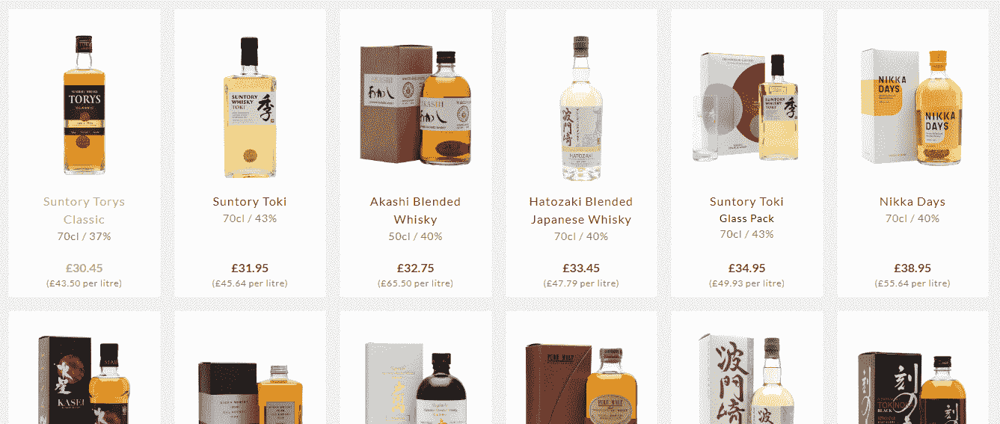
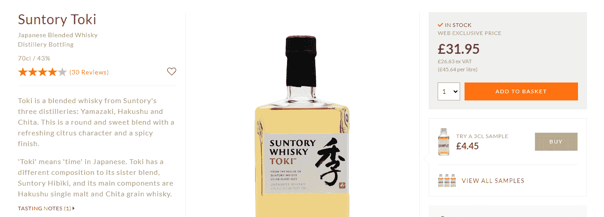
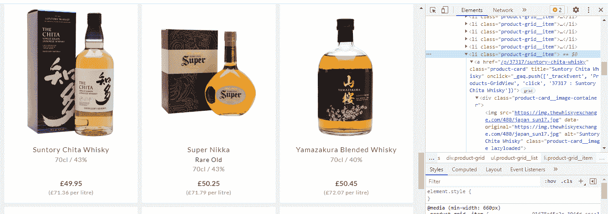
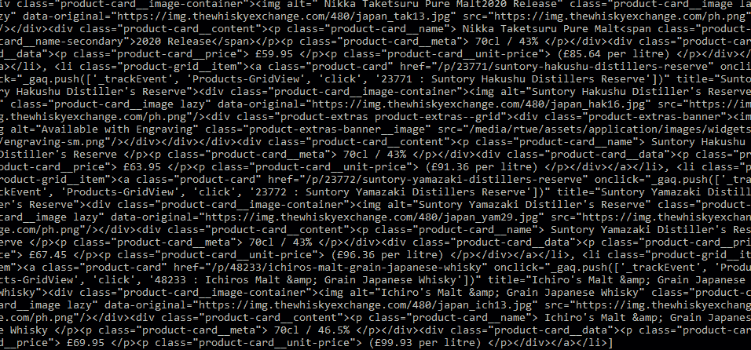
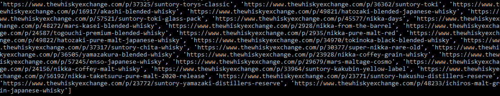
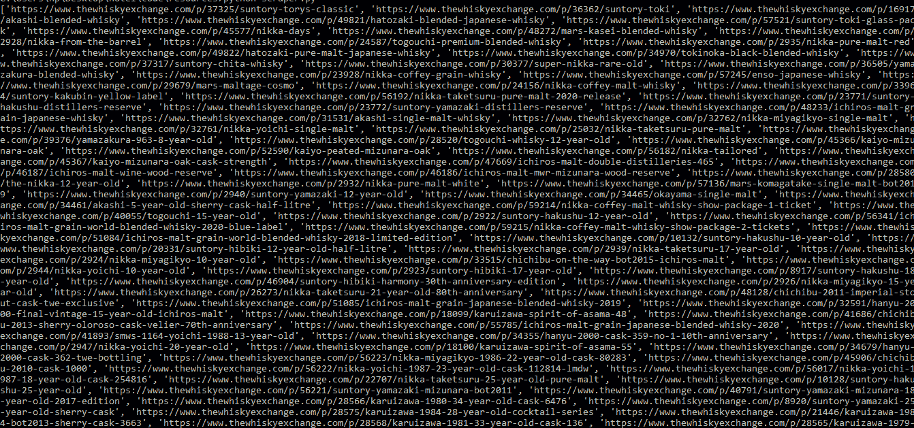
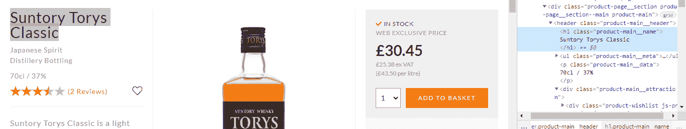
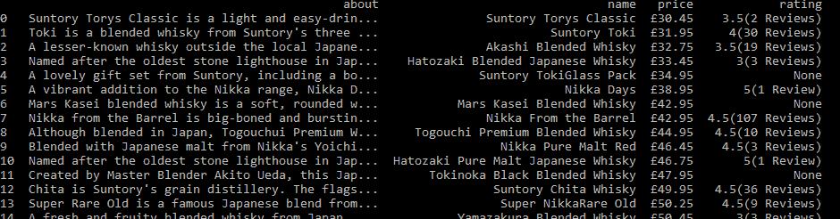

# Python 中的网络抓取——如何使用漂亮的汤和熊猫抓取电子商务网站

> 原文：<https://www.freecodecamp.org/news/scraping-ecommerce-website-with-python/>

在这篇文章中，我们将抓取一个电子商务网站。我们将进入每个单独的产品页面，并从中检索我们的信息。这是我们要刮的[网站](https://www.thewhiskyexchange.com/c/35/japanese-whisky)——这是一家销售威士忌的网店。

在浏览任何网站之前，一定要记得查看`robots.txt`文件。你必须记住，你可以不必要地关闭一个网站，并损害他们的服务。所以，请不要用抓取请求淹没他们的服务器。



我去了网站的一个分区，看起来有很多选择。如果你想知道每个产品的用户评分，那么你必须打开每个产品页面来获得评分(你不能在主页上找到它们)。



因此，我们将从所有五个页面中获取每个产品的所有链接的列表。然后，我们将分别进入每个产品，收集我们需要的数据。

但是有些没有评级。相反，在这些情况下，我们将进入每个产品并获取关于文本的**。我们走吧！**

# 如何设置抓取项目

我们的设置非常简单。只需创建一个文件夹，并安装美丽的汤，熊猫，并要求。要创建文件夹并安装库，请输入下面给出的命令。我假设您已经安装了 Python 3.x。

```
mkdir scraper 
pip install beautifulsoup4 
pip install requests
pip install pandas
```

现在，在该文件夹中创建一个文件，并随意命名。我用的名字是`scraper.py`。我们将导入请求、熊猫和 bs4。

```
import requests
from bs4 import BeautifulSoup
import pandas as pd
```

现在，我们将设置主页的基本 URL，因为当我们为每个单独的产品构建 URL 时，我们将需要它。

此外，我们将在每个 HTTP 请求上发送一个用户代理，因为如果您使用**请求**发出 GET 请求，那么默认情况下用户代理是 **Python** ，它可能会被阻塞。

因此，为了覆盖它，我们将声明一个变量来存储我们的用户代理。

```
baseurl = "https://www.thewhiskyexchange.com"
headers = {'User-Agent': 'Mozilla/5.0 (Windows NT 10.0; Win64; x64) AppleWebKit/537.36 (KHTML, like Gecko) Chrome/89.0.4389.82 Safari/537.36'}
```

现在我们需要研究这个页面，这样我们就可以知道链接在哪里，以及我们如何获得它们。你必须使用 inspect (Command+Option+C)来打开 Chrome 开发工具。



我们将编写一个脚本来遍历其中的每一个，并为我们创建一个 URL。为此，我们需要首先进行一个 HTTP 调用。然后，我们将使用 BeautifulSoup 提取 **li** 元素。

```
k = requests.get('https://www.thewhiskyexchange.com/c/35/japanese-whisky').text
soup=BeautifulSoup(k,'html.parser')
productlist = soup.find_all("li",{"class":"product-grid__item"})
print(productlist)
```

为了检查我们是否在正确的轨道上，我们打印了完整的列表。



Output

接下来，获取该页面上项目的 HTML。现在，在每一个列表中，都有一个到单个产品页面的链接。我们将编写一个脚本来从**产品列表**中抓取所有这些链接。

```
productlinks = []
for product in productlist:
        link = product.find("a",{"class":"product-card"}).get('href')                 productlinks.append(baseurl + link)
```

这里我们首先声明了一个名为 **productlinks 的空列表。**然后我们使用了一个 **for 循环**到达每个 **productlist** 元素来提取链接。我们用过**。get()** 函数获取 **href 属性**的值。提取链接后，我们存储列表 **productlinks 中的每个链接。**因为我们必须创建一个合法的 URL，所以我们在链接中添加了 baseurl。



Output

正如我们之前讨论的，我们必须覆盖网站的所有五个页面。为此，我们将在进行 HTTP 调用之前引入一个 for 循环。因为有 5 页，我们将从 1 到 6 循环运行。此外，请确保更改目标 URL。

```
productlinks = []
for x in range(1,6):  
 k = requests.get('https://www.thewhiskyexchange.com/c/35/japanese-whisky?pg={}&psize=24&sort=pasc'.format(x)).text  
 soup=BeautifulSoup(k,'html.parser')  
 productlist = soup.find_all("li",{"class":"product-grid__item"})

    for product in productlist:
        link = product.find("a",{"class":"product-card"}).get('href')
        productlinks.append(baseurl + link)
```

这将为我们提供网站上所有可用的链接。现在确认一下，你可以打印出 **productlinks** 的长度。我们应该总共得到 97 个链接。



Output

现在，我们可以遍历每个链接，从每个页面提取产品信息，然后将其存储在另一个列表或字典中。

接下来，我们将分析信息在产品页面上显示的模式。我们将提取名称、价格、评级和关于文本。



**名称**在 **h1 标签**下，**关于**文本在 **div 标签下，价格**在 **p 标签**下，**评级**在**跨度标签**下。现在，让我们提取它们。

```
data=[]
for link in productlinks:
    f = requests.get(link,headers=headers).text
    hun=BeautifulSoup(f,'html.parser')

    try:
        price=hun.find("p",{"class":"product-action__price"}).text.replace('\n',"")
    except:
        price = None

    try:
        about=hun.find("div",{"class":"product-main__description"}).text.replace('\n',"")
    except:
        about=None

    try:
        rating = hun.find("div",{"class":"review-overview"}).text.replace('\n',"")
    except:
        rating=None

    try:
        name=hun.find("h1",{"class":"product-main__name"}).text.replace('\n',"")
    except:
        name=None

    whisky = {"name":name,"price":price,"rating":rating,"about":about}

    data.append(whisky)
```

在这里，事情非常简单。我们已经启动了一个 for 循环来迭代 **productlinks 的每个链接。**我们将对每个**链接**进行 HTTP GET 调用，然后提取关于文本的**价格、名称、评级**和**。**

我们使用 **try** 和 **except** 来避免任何元素找不到时的错误。使用**替换**功能删除所有的换行符或不必要的字符串。

我们已经创建了一个名为**威士忌**的字典，我们将在其中存储所有提取的信息。在最后，我们将字典存储在列表**数据**中。

现在，在打印数据之前，我们将使数据更加直观。这里我们将使用熊猫。我喜欢用熊猫！

```
df = pd.DataFrame(data)

print(df)
```



Output

## 这是刮刀的完整代码

```
import requests
from bs4 import BeautifulSoup
import pandas as pd

baseurl = "https://www.thewhiskyexchange.com"

headers = {'User-Agent': 'Mozilla/5.0 (Windows NT 10.0; Win64; x64) AppleWebKit/537.36 (KHTML, like Gecko) Chrome/89.0.4389.82 Safari/537.36'}
productlinks = []
t={}
data=[]
c=0
for x in range(1,6):
    k = requests.get('https://www.thewhiskyexchange.com/c/35/japanese-whisky?pg={}&psize=24&sort=pasc'.format(x)).text
    soup=BeautifulSoup(k,'html.parser')
    productlist = soup.find_all("li",{"class":"product-grid__item"})

    for product in productlist:
        link = product.find("a",{"class":"product-card"}).get('href')
        productlinks.append(baseurl + link)

for link in productlinks:
    f = requests.get(link,headers=headers).text
    hun=BeautifulSoup(f,'html.parser')

    try:
        price=hun.find("p",{"class":"product-action__price"}).text.replace('\n',"")
    except:
        price = None

    try:
        about=hun.find("div",{"class":"product-main__description"}).text.replace('\n',"")
    except:
        about=None

    try:
        rating = hun.find("div",{"class":"review-overview"}).text.replace('\n',"")
    except:
        rating=None

    try:
        name=hun.find("h1",{"class":"product-main__name"}).text.replace('\n',"")
    except:
        name=None

    whisky = {"name":name,"price":price,"rating":rating,"about":about}

    data.append(whisky)
    c=c+1
    print("completed",c)

df = pd.DataFrame(data)

print(df) 
```

## 结论

最后，我们设法从网站的每一页上搜集了所有的信息。同样，你也可以从这个网站上抓取其他文本。作为一项练习，你可以尝试抓取这个[网站](https://books.toscrape.com/)。如果你对我有任何问题，请在我的[推特账号](https://twitter.com/scrapingdog)上给我发信息。