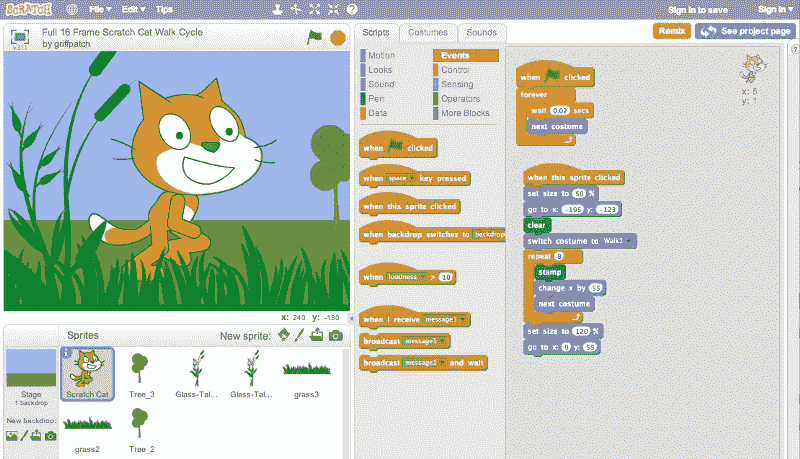
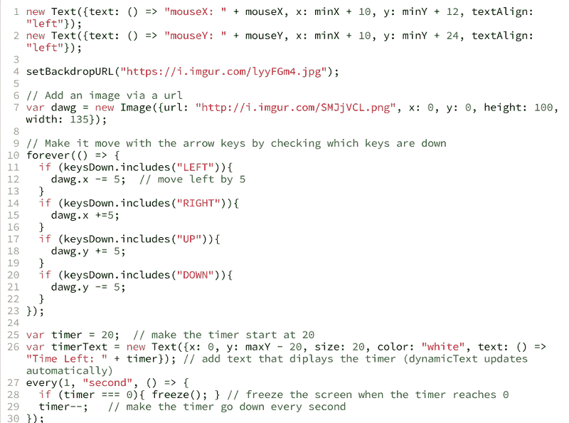

# Scratch 有一个营销问题

> 原文：<https://www.freecodecamp.org/news/scratch-has-a-marketing-problem-f84626bd18ef/>

史蒂夫·克劳斯

# Scratch 有一个营销问题

一开始，我避开了 MIT 的 Scratch 编程语言。

好像很幼稚。当你加载 [Scratch 主页](http://scratch.mit.edu)时，迎接你的是似乎适合学龄前儿童的友好卡通。编程语言本身甚至不是一种真正的 T2 语言。你不用打字，而是将预制好的积木拖放到位。这更像乐高，而不是真正的工程。

每个 12 岁以上的学生似乎都同意我的诊断。“我二年级的时候就这样做过。这不是真正的编码。”所以我教学生 Python、Java、HTML、CSS 和 JavaScript——你可以输入的真正的编程语言，而不是愚蠢的程序块。

然而，有一个问题。

很难教“真正的编码”真的很难。对于一些学生来说，这似乎是不可能的。

在我的眼前，那些对“真正的编码”感到兴奋的学生开始给自己贴上“不擅长编码”的标签，就像学生们已经学会给自己贴上“不擅长数学”的标签一样。我觉得教学生编写他们还没准备好的语言是弊大于利。

#### 给划痕第二次看

所以我回到绘图板，为我的学生寻找合适的编程语言。我在网上搜索关于如何教孩子编程的书籍和技巧，到处都是刮刮乐。所以我给了 Scratch 一个机会。

事实证明，打字被高估了。编程不像英语。没有一百万个不同的单词、短语和句子结构。只有几十个，所以为它们创建块节省了时间，更重要的是，防止了新程序员面临的 70%的错误。在基于文本的编码中，如果你忘记了分号，你的程序甚至可能无法运行，但是 Scratch 甚至不会让你犯这样的错误。基于块的编程使初学编程的程序员能够将全部精力放在程序的设计和逻辑上，而不是语义上。

更棒的是，Scratch 被设计用来创作视频游戏和故事。学生们喜欢制作视频游戏，就像他们喜欢玩游戏一样。这意味着你不必用家庭作业、成绩和测试的胡萝卜加大棒的方法来激励学生使用 Scratch。制作一些可以立即与朋友和家人分享的东西是一种内在的激励，所以学生们继续在家里做一些临时项目，只是为了好玩。

在这个启示之后，我很兴奋地与世界分享 Scratch，“嗨，大家好！寻找最好的第一编程语言的工作已经结束了。我们找到了！”

#### 刮擦似乎太容易了

结果是，我参加聚会迟到了。每个人都知道 Scratch。更糟糕的是，他们主动避开它，因为它“幼稚”

“不！你不明白，”我恳求学生。“这实际上很有挑战性。在你为 JavaScript 做好准备之前，有很多东西需要学习。”但是没人想听。

上个月，这让我班上的一个 12 岁男孩哭了。

山姆把自己描述成一个真正的书呆子，自豪地告诉全班他记住了 150 多位圆周率，并且去过许多科技和科学营地。当我建议他从头开始时，他耸耸肩。

“这对我来说可能太容易了。我从三年级开始就没做过了。”

“试一试吧，”我说。"如果太简单，我们会把你转移到 JavaScript . "

十分钟后，萨姆哭了。当我和他一起走出教室时，我问出了什么事。

“我很不擅长这个，”萨姆摇摇头。“我做不到。”

“为什么觉得自己做不到？”我问:“才过了几分钟。”

"抓痒应该很容易，但我连第一步都做不到."山姆重重地叹了口气。“我真的以为我擅长这个。”

“我知道这看起来很容易，”我说。“但是抓挠其实真的很难。你可以用它做非常复杂的事情。”

“但是，但是，但是……”萨姆抽泣着，看起来很受伤，“但是为什么他们要让这看起来很容易呢？他们弄得好像是给婴儿看的！”

#### Scratch 有一个营销问题

无论他们看哪里，学生们得到的印象是 Scratch 是为小孩子设计的，而且很容易。虽然这对年轻学生来说很有吸引力，但对年纪大的孩子来说却有不良的心理影响。

年纪较大的学生不想使用 Scratch，因为从中得不到任何好处，反而会损失很多。如果他们擅长，恭喜他们擅长儿童语言。如果他们不擅长，他们就没有希望。他们一定蠢得可怜。

即使是 Code.org，一个在推动 CS 教育方面做了惊人工作的优秀组织，也在他们的口号“code . org:任何人都可以学习”上犯了同样的错误他们可能还会说，“Code.org:你只有白痴才会不明白。”

#### 学生们暗地里渴望挑战

当一个学生说:“我做不到。这太难了，”很难不反射性地回答，“不，不是的。听着，这很简单。你可以做到的。”

在我们成年人的大脑中，这似乎是学生想听到的合乎逻辑的事情。容易总比难好，对吧？

不对！学生渴望努力。他们在任何能找到它的地方寻找它，体育比赛、电子游戏、国际象棋和辩论。艰难的事情是伟大的，因为:

1.  如果你完成了，你就证明了自己。你做了一些超出你能力的事情，一些同龄人做不到。完成一项困难的任务会让你情绪高涨。
2.  然而，如果你在一项艰难的任务中失败了，那就没有任何意义。毕竟，这并不容易。很多人做不到。也许如果你多练习一些，过一会儿回来，你可以再试一次。

那么，当一个孩子来找我们，抱怨某个问题太难时，我们该怎么办呢？我们完全同意他们的观点。“是的，这个问题确实很难。这次你可能完成不了。很多同学做不到。但如果你继续努力，我想你会成功的。”

情况并不总是这样，但学生们通常会兴奋地迎接挑战。

Scratch 的营销解决方案是反直觉的，但并非不可能:告诉孩子们 Scratch 很难。这意味着去掉所有明亮的原色和幼稚的卡通。用更硬、更标准的成人色和照片代替。不要用圆形的石块，要用硬边的。

基本上是让 Scratch 看起来更像孩子们想象中的成人代码。

然而，如果编码似乎是不可能的，它可能会使一些学生完全放弃它。Scratch 的部分吸引力在于它的易用性。这可能意味着我们应该将 Scratch 分成两个产品:为 12 岁以下的真正初学者保留相同的产品，并创建一个类似但似乎更严肃和真实的新产品。

#### WoofJS

我现在使用 [WoofJS](http://woofjs.com) ，一个我们在[编码空间](http://thecodingspace.com)创建的 JavaScript 框架，来处理这个程序。它非常类似于 Scratch，但是来自 JavaScript，一种“真正的”编码语言。通过这种方式，那些认为他们已经“完成了 Scratch”或者“太老了而不能 Scratch”的学生可以在新衣服下学习类似的概念。Woof 作为 Scratch 和 JavaScript 之间的桥梁，是学生们渴望跨越的。

当我问我们一个 11 岁的学生，为什么她更喜欢 Woof 而不是 Scratch 时，她说，“它更具挑战性。”

"哦，那是因为你必须学习 JavaScript 语法吗？"我问。

“不，”她想了一会儿。“我真的不知道为什么会很难。但这似乎更难，这很酷。”