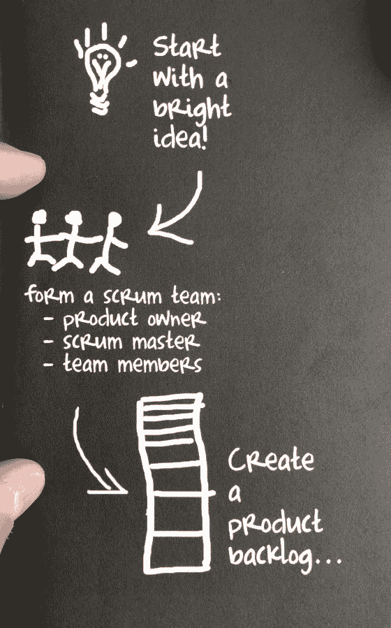
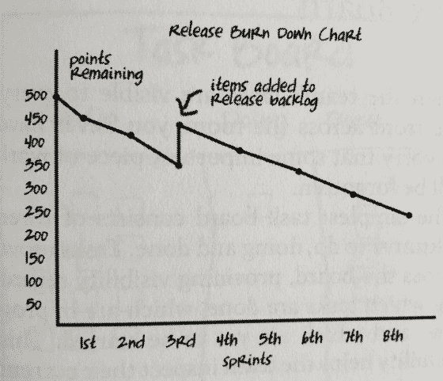
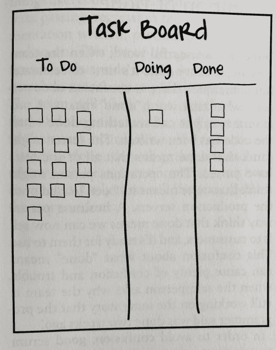
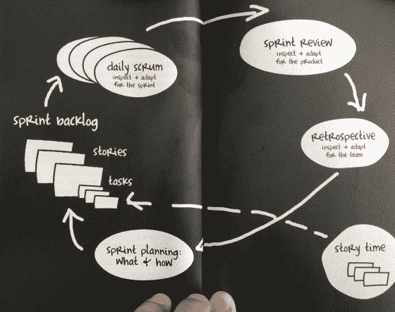

# Scrum，对于创业公司(或者任何项目)

> 原文：<https://www.freecodecamp.org/news/scrum-for-startups-or-for-any-project-for-that-matter-93ad0db17a84/>

Scrum 是一个轻量级框架，旨在帮助小型的、紧密结合的团队开发复杂的产品。

当然，Scrum 不仅仅适用于软件项目，因为你可以用它来构建一个更好的捕鼠器或者任何其他东西。我看到它被用在一个组织的每一个部分，甚至法律和财务部门。

典型地，一个 Scrum 团队大约有 7 个人，加上或减去 2 个人。所以，你最多有 9 个人，而较小的团队大约有 5 个成员。当然，这对于早期的创业公司来说并不适用，因为他们的创始团队可能只有两三个人。见鬼，可能只有你。

有 3 个角色:

1.  产品所有者
2.  Scrum 大师
3.  队员

产品所有者代表企业，处理产品和企业投入的时间、资源和精力之间的关系。采购订单确保实现最大投资回报率。

从战术上来说，他们帮助团队理解什么是更高的优先级，什么是较低的优先级，什么是更有价值的工作和不太有价值的工作。他们的角色是帮助转移资源、时间和注意力。有时，但不总是，他们可能会优先处理待办事项，但他们是唯一可以要求团队工作并可以改变待办事项顺序的人。

最后，他们帮助团队理解需求，以便最大化时间和资源来产生更高的效率和效果(从而提高 ROI)。他们通过创建一般看起来像这样的**用户故事**来做到这一点:

> *作为一个<类型的用户>，我想<做点什么>，这样<一些 val* ue 就被创建>。

产品所有者:

*   持有并维护产品愿景
*   代表企业的利益
*   代表客户
*   拥有积压订单
*   订单和产品积压的优先级
*   为待定项创建验收标准
*   能够协助并回答团队的问题

Scrum Master 扮演教练的角色，帮助指导团队更好地自我组织、表现和决策。团队专注于打造最好的产品，而 SM 专注于打造高绩效团队。

好的 SMs 是一个教练，一个冠军，一个守护者，一个促进者，当然，还有一个 Scrum 机制专家。他们同样拥护产品、团队和团队中的个人。

请注意，他们不是任何人的老板，而是团队中一个角色非常独特的同事。简而言之，他们:

*   常驻 Scrum 专家和顾问
*   该队的教练
*   消除阻碍和障碍，帮助团队继续前进
*   这促进了 backlog 和 Scrum 的其他部分

一个团队成员在 Scrum 系统中拥有最大的权力，因为他们是致力于构建一流产品的自组织团体的一部分。他们有权决定如何完成工作，应该使用什么工具，应该部署什么技术，以及这些决策的相关成本。

普遍的看法是，做这项工作的人也是如何最好地完成这项工作的最佳权威。

一个功能齐全的 Scrum 团队应该拥有构建产品所需的所有相关技能，这意味着大多数团队成员，如果不是全部的话，都是自己领域的专家。但是这并不意味着他们孤立他们的努力，因为统一的目标是向企业和客户交付一个工作产品。这意味着团队成员将经常在其他领域工作，这些领域可能超出了他们的专业范围，以完成工作。

高绩效团队总是分担责任。

团队成员:

*   负责完成用户故事，以逐步增加产品的价值
*   自我组织以完成所有的工作
*   负责并创建工作评估
*   拥有“如何工作”的决策权
*   避免单一的、专家式的思考，而是将团队的总体表现放在他们自己之上

Scrum 工件本质上是 Scrum 实践者用来制造优秀产品、增加可见性和沟通效率的工具。

**产品待办事项清单**是产品所有计划的和期望的可交付成果的主列表。这可以(也应该)包括特性、bug、文档、Q/A 等等，本质上包括所有对产品整体而言有意义和重要的东西。

backlog 中的一些调用项只是“backlog items ”,而其他团队可能称之为用户故事。这是优先的，团队可以决定他们想要使用的具体术语。

待定项或用户故事的列表按照从最重要到最不重要的顺序排列。顶部的项目也很具体，很容易理解，可以快速有效地执行。这意味着它们通常也是小任务。列表中更靠后的项目更加模糊，定义更少，范围和规模更大。

待办事项中的每一项通常都应该包含以下内容:

*   这个故事将使哪些用户受益(它是为谁而写的)
*   所需功能的简要描述(需要构建什么)
*   这个故事有价值的原因(为什么我们应该这样做)
*   对故事实现所需工作量的估计
*   验收标准将帮助团队知道它何时被正确实现

**Sprint Backlog**是团队在 Sprint 中的待办事项列表。与产品 Backlog 不同，它有一个有限的生命周期:一致同意的 sprint 的长度。它包括团队承诺在 sprint 中交付的所有故事以及相关的任务。故事是可交付的，可以被认为是价值单元。

**Burn Charts** 帮助团队理解时间和范围的关系。点在 y 轴上，而冲刺在 x 轴上。随着时间的推移，人们可以看到整个产品中还剩下多少点，以及团队完成这些点和冲刺的相对速度和节奏。燃尽图显示还剩下什么要做，而燃尽图显示团队在一段时间内已经完成了多少工作。

当更多的项目被添加到 backlog 中时，你可以看到点的数量通过一条向上的垂直线增加，当事情被删除时，它是一条向下的垂直线。

任务板直观地展示了团队的所有任务，这样每个人都知道谁在做什么。更简单的任务板有三列:

*   去做
*   做
*   完成的

随着工作的进行和进展，任务只是从左向右移动。任务板是团队动态和运作机制的一个可见的提醒:我们都在一起，我们作为一个团队沉浮。它允许团队检查工作，然后根据需要进行调整。其他利益相关者也可以看到进展并提供价值。

团队如何定义“完成”也很重要，因为不同的团队会有所不同。此外，如果没有明确定义，那么它将在不同的团队成员和利益相关者之间产生混淆，因为他们将对“完成”的真正含义有自己的解释。

例如，当软件开发人员写完代码时，他们可能认为“完成了”，而当任务准备好卖给客户时，业务人员可能认为任务“完成了”。显然，这是对“完成”的两种截然不同的解释！

有效的 Scrum 团队定义了“完成”的含义，然后将它应用到他们的任务板和用户故事中。这就是通常所说的“完成的定义”,在本质上可能是单一的，也可能是多个元素的组合。将定义打印出来并放在任务板上是一种常用的策略，也是为了提醒团队它的真正含义。

冲刺周期由几个会议组成，通常称为“仪式”:

*   冲刺规划
*   每日混战
*   故事时间
*   冲刺回顾
*   回顾的

冲刺周期(或者“冲刺”或者“迭代”)是你如何完成工作的:一段固定的时间，在这段时间里，你在更大的产品的小部分上工作。每次冲刺后的目标都是一样的:一个可演示的软件作品。

团队完成冲刺的效率越高，产品的构建速度就越快，企业实现高投资回报的速度也就越快。在每次冲刺后，团队将决定产品是否可以发货(即是否可以卖给客户)。

一般来说，冲刺周期越短，他们获得反馈的速度就越快，这有助于提高后续冲刺的效率。团队或更大的企业都不能轻视这种累积效应。

对于团队来说，持续 2 周的 sprint 周期是很常见的，尽管在早期阶段的风险投资中，周期时间可能只有 1 周。当 Scrum 第一次被引入时，周期大约是 4 周或 1 个月。

对于为期一周的冲刺，你通常会有以下时间分解:

*   周一:冲刺规划(1-2 小时)
*   星期二:每日站立(15 分钟)
*   周三:每日站立(15 分钟)，故事时间(1 小时)
*   周四:每日站立(15 分钟)
*   星期五:每日站立(15 分钟)，冲刺回顾(30 分钟)，回顾(1-2 小时)

对于 sprint 规划，团队的目标是承诺一组 Sprint 的可交付成果，并确定交付商定的用户故事或待办事项所需的任务。在团队中，产品负责人提出要优先考虑的建议故事，团队讨论他们的立场和优先级，有时会激烈地讨论。

值得注意的是 PO 和 TM 之间的角色、责任和权力的划分:产品负责人决定哪些故事将被考虑到 sprint 中，而做工作的团队成员是决定他们可以合理承担多少工作的人。

在会议的第二部分，团队决定如何完成工作，将达成一致的故事分解成任务。随着任务的定义，backlog 中产生的故事可能会改变，更多的信息变得明显和可用。对于一个团队来说，在开始时过多地承诺用户故事的数量，然后随着更多细节的出现，不得不删除一些，这种情况并不少见。

这个计划会议的结果是 Sprint Backlog，它由前面提到的用户故事和产生的相关任务组成。如果团队需要或者有空间，产品负责人可以给出更多的用户故事，但是要小心不要给团队过多的承诺。

每日 Scrum，或每日站立，是大多数团队在一天开始时召开一个快速会议，分享以下内容:

*   自从上一次每日混战以来，已经完成了哪些任务
*   在下一次每日混乱之前要完成什么任务
*   什么阻碍了团队的发展

团队的每个成员都参与其中，会议应该有针对性、具体且简短。关键是让每个人都了解全球的进展，并在问题变得更大之前发现它们。这使得团队能够主动检查和适应近乎实时的变化。提出问题是目标，但在日常的争论中创造解决方案不是。

**故事时间**发生在周中或 Sprint 中期，讨论团队如何改进产品 backlog 中的故事，这些故事是未来 Sprint 的用户故事。这些不是当前 sprint 中的用户故事。

产品负责人定义并细化了 backlog 中用户故事的接受标准，还为还没有评估的故事指出了价值。这基本上是团队猜测完成这个故事需要做多少工作的机会。

并不是所有的 Scrum 团队都有官方的故事时间，许多团队每天都随意这样做。这取决于团队的规模和他们内部的决策文化。

冲刺回顾是一个公开声明，表明当前的冲刺或周期已经完成，是时候展示已经完成的工作了。企业的利益相关者也经常被邀请来回顾进展。

通常情况下，并不是所有的用户故事都是完整的，所以在演示之前，观众应该清楚地知道这些细节。审查后，利益相关方无疑会有反馈和建议，PO 的工作主要是收集这些信息以供以后审查。

评审期间不应该做任何决定，因为那些已经在 Sprint 规划中完成了。

**回顾会**是团队聚会的最后一次会议，这样他们可以检查、调整和优化他们作为一个团队不断提高的绩效。不像 Sprint 回顾，除了 Scrum 团队之外，还包括外部的利益相关者，这个会议只是团队本身的。

对话应该围绕他们在 sprint 中学到了什么，以及如何将学到的知识有效地应用到下一个 sprint 中，以便更有效地完成工作。而且，与更大的“事后检查”不同，这里的想法是只关注少数更大的战略变化，而不是创建一个所有进展顺利或进展不顺利的事情的主列表。

检查和适应所有的东西！短距离冲刺或循环的目标是让持续改进发生得更快，并且任何重要的学习都不会被遗忘。Scrum 过程是专门为捕捉这些新的重要的知识而设计的，然后将它们立即应用到系统中进行改进。

最后，值得注意的是，敏捷宣言的价值观和原则并不是 Scrum 框架的直接组成部分，但却被明确地用于指导整个 Scrum 过程。这里值得回顾一下它们[。](http://agilemanifesto.org/)

**随机背景故事:**我实际上是为一家更老的初创公司写的，那是在 6 年前！它在我的草稿里放了那么久。

我终于找到时间浏览并出版了它。我认为这确实在很小程度上证明了这种类型的框架或系统在多个项目中的效用——它是相对永恒的！希望对你也有用！

关于我:我目前在 [YEN](http://yen.io) 领导产品和工程，这是一个元加密货币交易和社交平台，我们仍然在自由地应用这些想法。