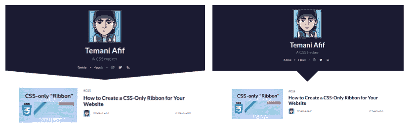
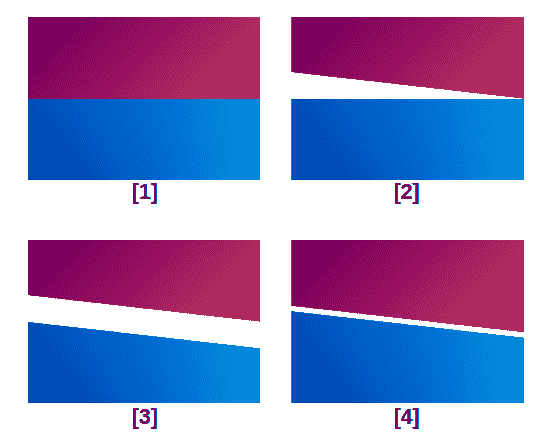
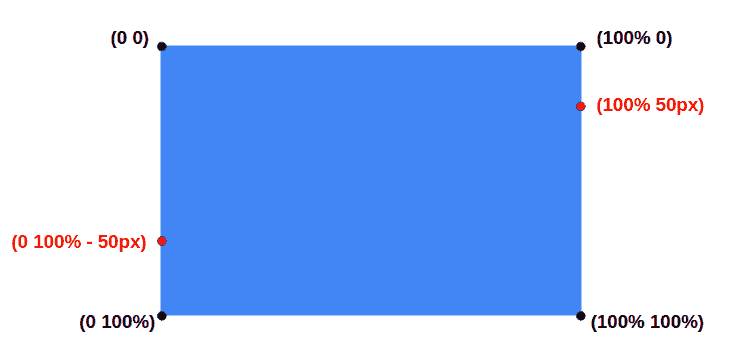
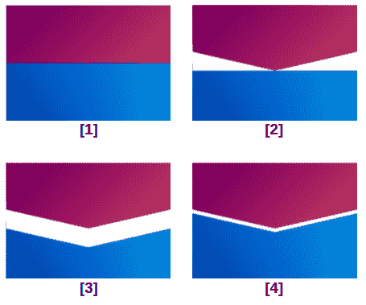
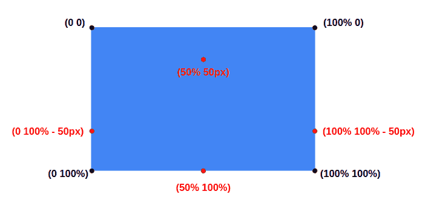
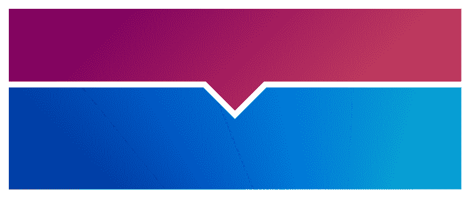
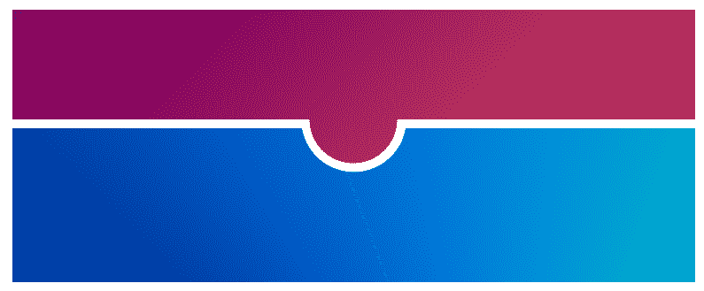
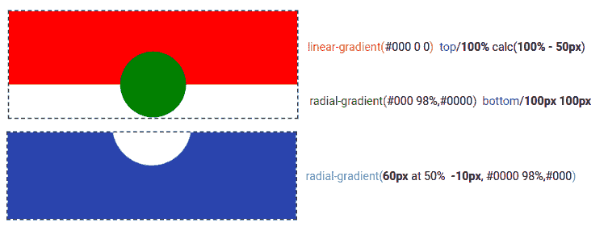

# 如何使用 CSS 创建分节符

> 原文：<https://www.freecodecamp.org/news/section-divider-using-css/>

在你的网站上有一个别致的分区总是很酷。如果我们能让它们反应灵敏、易于调整，那就更好了。这就是你将在这篇文章中学到的东西。

我们将探索仅使用 CSS 和一些易于操作的优化代码制作的不同节分隔符。

下面是一个实际使用的分隔线示例:



Overview of 2 sections Dividers applied to the FreeCodeCamp header

在我们深入技术部分之前，我已经为分段器创建了一个在线生成器。你所要做的就是选择你的配置，然后立刻得到 CSS 代码。

好吧，我可以听到有人说:“为什么是无聊的教程？我只要需要就用发电机！”

当然，你可以这样做——但是知道在引擎盖下发生了什么总是好的，这样你就可以理解你正在使用的代码，这样你就可以手动调整它。

然后，在理解了我做的那些之后，你就可以创建你自己的个性化隔断了！

因此，让我们深入了解一下它是如何做到的。

## 如何为你的网站创建一个倾斜的分隔线


Illustration of a slanted divider

在上图中，我们有两个元素被一个倾斜的间隙分开。为了达到这种效果，我们将从每张纸上切下一部分。为了更好地理解，我们来看一个逐步说明。



A step-by-step illustration to create a slanted divider

最初，我们将两个元素放置在彼此之上。我们首先使用下面的`clip-path`切割顶部元件的底部(步骤(2))。

```
clip-path: polygon(0 0,100% 0,100% 100%,0 calc(100% - 50px));
```

我们有一个四点的路径，在这里我们把左下方的路径做得稍微高一点，以产生剪切的效果。你可以注意到使用了`calc(100% - 50px)`而不是`100%`。

我们对步骤(3)中的第二个元素进行同样的操作，使用:

```
clip-path: polygon(0 0,100% 50px,100% 100%,0 100%);
```

这一次，我们将右上角降低相同数量的像素(`50px`而不是`0`)。如果你不熟悉`clip-path`，这里有一张图可以更好地看出要点。



Illustration of the clip-path points

这些点不过是 2D 空间中的 x，y 坐标，范围为`[0 100%]`。你可以很容易地确定四个角，从那里我们可以找到任何其他的点。

最后，我们给第二个元素加上一个负的`margin-top`来减少空间，得到一个等于`10px`的间隙。最终代码将是:

```
.top {
  clip-path: polygon(0 0,100% 0,100% 100%,0 calc(100% - 50px));
}
.bottom {
  clip-path: polygon(0 0,100% 50px,100% 100%,0 100%);
  margin-top: -40px;
}
```

这是你将从我制作的在线生成器中得到的代码。我们可以通过引入 CSS 变量来改进它:

```
:root {
  --size: 50px; /* size of the cut */
  --gap: 10px;  /* the gap */
}
.top {
  clip-path: polygon(0 0,100% 0,100% 100%,0 calc(100% - var(--size)));
}
.bottom {
  clip-path: polygon(0 0,100% var(--size),100% 100%,0 100%);
  margin-top: calc(var(--gap) - var(--size));
}
```

正如我在介绍中所说的，我们有一些简单的代码，很容易调整，可以生成一个响应性的节分隔符。

## 如何为你的网站创建一个全角箭头分隔线


Illustration of the full-width arrow divider

这个与之前的分割器非常相似。我们将简单地处理更多的`clip-path`点。



A step-by-step illustration to create a full width arrow divider

我想你现在大概已经有想法了。我们遵循相同的步骤，并以下面的代码结束:

```
.top {
  clip-path: polygon(0 0,100% 0,100% calc(100% - 50px),50% 100%,0 calc(100% - 50px));
}
.bottom {
  clip-path: polygon(0 0,50% 50px,100% 0,100% 100%,0 100%);
  margin-top: -40px;
}
```

下面是另一幅插图，旨在帮助您理解我们在这款分隔线中使用的新观点。



Illustration of the clip-path points

乍一看，这可能看起来很难，但实际上非常容易。

我们通过链接元素的 2D 空间中的不同点来创建形状。诀窍是创建 2 个“拼图形状”(我刚刚创造了这个术语)，以创建一个分区分隔符的幻觉。经过一些练习，你可以按照同样的逻辑很容易地创建你的分频器。

在我们进入下一个之前，这里是使用 CSS 变量的代码:

```
:root {
  --size: 50px; /* size of the cut */
  --gap: 10px;  /* the gap */
}
.top {
  clip-path: polygon(0 0,100% 0,100% calc(100% - var(--size)),50% 100%,0 calc(100% - var(--size)));
}
.bottom {
  clip-path: polygon(0 0,50% var(--size),100% 0,100% 100%,0 100%);
  margin-top: calc(var(--gap) - var(--size));
}
```

您已经可以在我们的分频器代码中看到一个模式，因为我们使用了相同的技术。两个`clip-path`，一个负`margin-top`，两个 CSS 变量。就这么简单！

## 如何为你的网站创建箭头分隔线



Illustration of the arrow divider

这个分割线比前面的要稍微复杂一点，因为我将添加另一个变量，即箭头的角度。技术保持不变，但我们将有更多的数学来计算点的坐标。

对于这一个，我的[在线生成器](https://css-generators.com/section-divider/)将会非常有用(特别是如果你对数学公式不熟悉的话),这样你就可以很容易地得到最终的值。

出于好奇，这里是通用代码:

```
:root {
  --size: 50px;   /* size of the cut */
  --gap: 10px;    /* the gap */
  --angle: 90deg; /* angle of the arrow */
}
.top {
  clip-path: polygon(0 0,100% 0,100% calc(100% - var(--size)),calc(50% + tan(var(--angle)/2)*var(--size)) calc(100% - var(--size)),50% 100%,calc(50% - tan(var(--angle)/2)*var(--size)) calc(100% - var(--size)),0 calc(100% - var(--size)));
}
.bottom {
  clip-path: polygon(0 0,calc(50% - tan((180deg - var(--angle))/4)*var(--gap) - tan(var(--angle)/2)*var(--size)) 0,50% calc(var(--size) + (1/sin(var(--angle)/2) - 1)*var(--gap)),calc(50% + tan((180deg - var(--angle))/4)*var(--gap) + tan(var(--angle)/2)*var(--size)) 0,100% 0,100% 100%,0 100%);
  margin-top: calc(var(--gap) - var(--size));
}
```

我能听到你看到这个会尖叫，但是如果你没有完全理解也不要担心。我仍然在使用`clip-path`创建不同的形状，但是这次的计算有点复杂。

上面是有效的 CSS 代码，但是在我写这篇文章的时候，还不支持三角函数，所以它不能在任何浏览器中运行。您可以手动计算这些值，或者使用[在线生成器](https://css-generators.com/section-divider/)来获得`clip-path`值。

到目前为止，我们已经使用相同的技术制作了 3 种不同的分隔器。每次我们通过玩`clip-path`值来考虑一个新的形状。您可以使用相同的技术创建任何分割线，并且组合是无限的。唯一的限制是你的想象力。

熟悉`clip-path`是很好的锻炼。我推荐的是用笔和纸画出你心目中的形状。你识别出你形状的不同点。然后你把它们转换成`clip-path`值。

你可以找到很多可以帮助你的在线工具。我最喜欢的是:[https://bennettfeely.com/clippy/](https://bennettfeely.com/clippy/)

## 如何为你的网站创建一个圆形分隔线



Illustration of the rounded divider

对于这个分频器，我们将使用`mask`而不是`clip-path`。`clip-path`和`mask`的区别在于`mask`依靠图像来剪切/隐藏部分元素。当谈到图像时，我们也谈到渐变。

这里有一个例子来理解我们需要什么样的渐变:



Illustration of the gradients used with the mask property

对于第一个元素，我们需要两个渐变:一个`linear-gradient()`在顶部创建一个矩形，在底部留下一个空间，一个`radial-gradient()`在底部创建一个圆形。这两者结合起来将会给出第一个元素的最终形状。

第二个元素只需要一个`radial-gradient()`在顶部创建一个洞来完成拼图。

我们的代码是:

```
.top {
  mask: 
    linear-gradient(#000 0 0) top/100% calc(100% - 50px) no-repeat,
    radial-gradient(farthest-side,#000 98%,#0000) bottom/100px 100px no-repeat;
}
.bottom {
  mask: radial-gradient(60px at 50% -10px,#0000 98%,#000);
  margin-top: -40px;
}
```

对于 CSS 变量，它将是:

```
:root {
  --size: 50px; /* size of the cut */
  --gap: 10px;  /* the gap */
}
.top {
  mask: 
    linear-gradient(#000 0 0) top/100% calc(100% - var(--size)) no-repeat,
    radial-gradient(farthest-side,#000 98%,#0000) bottom/calc(2*var(--size)) calc(2*var(--size)) no-repeat;
}
.bottom {
  mask: radial-gradient(calc(var(--gap) + var(--size)) at 50% calc(-1*var(--gap)),#0000 98%,#000);
  margin-top: calc(var(--gap) - var(--size));
}
```

即使使用 mask 方法，代码模式仍然与使用 clip-path 的模式相同。

## 包扎

现在，除了有一个[酷的在线分割线生成器](https://css-generators.com/section-divider/)，你也知道创建它们背后的秘密。

你可能已经注意到在生成器中，每个分割线都有两个方向，但是我只解释了每个分割线的一个方向。我这样做是为了让你试着理解我们需要更新什么值才能得到相反的方向。你能做到——这并不难，你会从中学到很多。

我将在未来发布更多的发电机，所以请收藏此链接:[https://css-generators.com/](https://css-generators.com/)并在 Twitter 上关注我[不要错过它们。](https://twitter.com/ChallengesCss)

感谢您的阅读！

想支持我？你可以[请我喝咖啡](https://www.buymeacoffee.com/afif)或者[成为顾客](https://www.patreon.com/temani)。