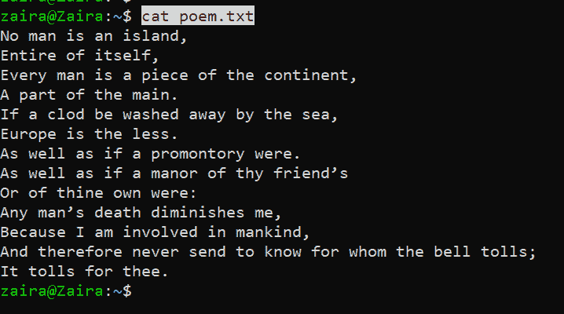
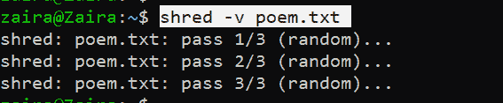
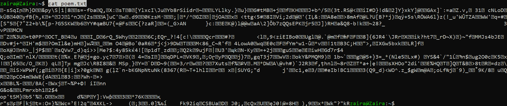
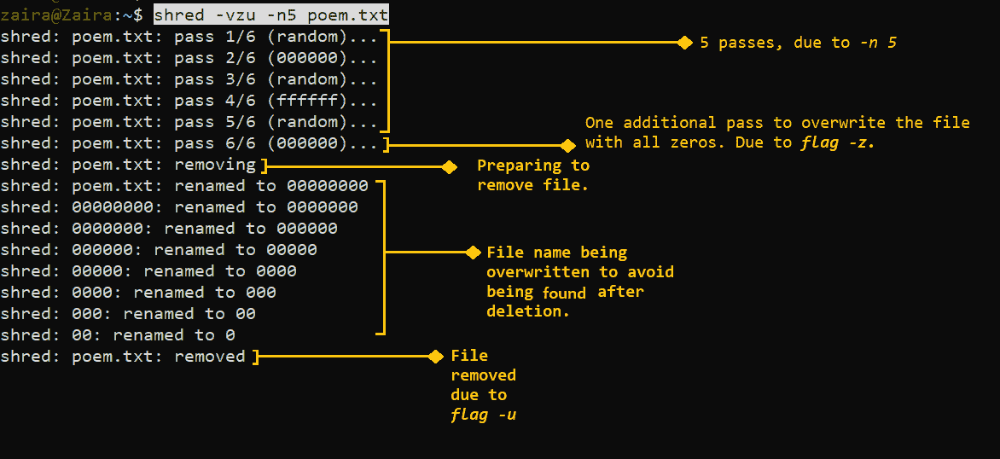

# 如何使用 Linux shred 命令安全地擦除磁盘和文件

> 原文：<https://www.freecodecamp.org/news/securely-erasing-a-disk-and-file-using-linux-command-shred/>

删除文件和格式化磁盘是用户的常见任务。Linux 提供了许多从命令行删除文件和文件夹的工具。

删除文件和文件夹最常用的命令分别是`rm`和`rmdir`。你可以在这里详细阅读`rm`命令[。](https://www.freecodecamp.org/news/remove-directory-in-linux-how-to-delete-a-folder-from-the-command-line/)

在这篇博文中，我们将学习一个叫做`shred`的新命令，它帮助我们以一种安全的方式清除磁盘和文件。

## Linux `shred`命令是什么？

shred 命令有助于多次就地覆盖数据。这使得第三方软件和硬件探测更难恢复数据。这就是为什么它通常被用来安全地删除数据。

### Linux shred 命令的语法:

```
shred [OPTION] filename
```

**shredding a 'file'**

```
shred -vfz [/file/system/path]
```

**shredding a 'disk'**

根据`man`页面，您可以使用`shred`的一些【选项】有:

*   `-n`，-迭代次数=N
    代替默认的(3)次，覆盖数据 N 次。
*   `-z`，- zero
    用零添加最终覆盖以隐藏粉碎。
*   `-f`，- force
    必要时强制权限允许写入。
*   `-v`，- verbose
    详细显示进度。
*   `-u`，-删除
    覆盖后截断并删除文件。

在上面的示例中，将路径替换为您的磁盘路径。

### `shred`和`rm`有什么不同？

简单地使用`rm`删除指向文件系统的指针。实际数据可能还在那里。所以数据恢复是有可能的。

但是当您使用`shred`命令时，文件会被覆盖指定的次数，实际内容是不可恢复的。我们会在后面的例子中看到。

另一个区别是执行速度。通常情况下，`rm`比`shred`快。这是因为`shred`在删除文件之前会覆盖几次。根据迭代次数和文件/磁盘大小，`shred`可能需要更长时间。而`rm`只是删除指向文件系统的指针。

### `shred`命令是如何工作的？

默认情况下,`shred`命令使文件经过三道程序。这三次传递确保文件被覆盖三次。使用`-n`标志也可以改变默认通过值。

## 何时使用`shred`命令

您可以使用 shred 命令删除敏感数据，这也确保了安全性。系统管理员、数字取证团队或信息安全专家可以使用它来实施安全标准。

## `shred`的例子

⚠️在您的系统上运行任何示例之前，请确保您的文件和文件系统已正确备份。请小心，因为内容是不可恢复的。

### 如何用`shred`覆盖和删除文件

我们有一个样本文件`poem.txt`，其内容共享如下:



Contents of sample file `poem.txt`

让我们使用默认的三次传递来覆盖它的内容:

```
shred -v poem.txt
```

Here, `-v` stands for verbose and shows detailed output.



Here, we can see that file has gone through 3 overwrites

让我们看看粉碎文件的内容:

```
cat poem.txt 
```



Here, we can see that contents have been changed to an unreadable format.

现在我们可以使用`rm poem.txt`安全地删除文件了。

然而，我们可以更有效地使用 shred 命令，我们可以在单个命令中覆盖、隐藏粉碎和删除文件。让我们修改并运行下面的命令:

```
shred -vzu -n5 poem.txt
```

在哪里，

*   `-v`代表 verbose，给出详细的输出。
*   `-z`用零替换最后一遍以隐藏粉碎。
*   `-u`粉碎后删除文件。我们不需要使用带有这个标志的`rm`来删除文件。
*   `-n`改变走刀次数。我们把它设置为 5。

### 输出:

在下面的输出中，该文件被覆盖了 5 次。在最后一遍中，文件被全零覆盖。在文件删除步骤中，文件名也会发生变化，因此无法被发现。



Removing and hiding file in a single command

### 如何用`shred`擦除磁盘或分区

假设您正在出售您的磁盘，或者您需要擦除您的便携式驱动器。您可以使用下面的命令使用`shred`来擦除您的驱动器:

```
sudo shred -vfz /dev/sde
```

Replace /dev/sde with your mount point

在哪里，

*   `-v`给出详细的输出。
*   `-f`如果缺少，强制写入权限。
*   `-z`在最后一遍中写入零。

您也可以在 RAID 分区上使用`shred`。

```
shred -vfz -n 10 /dev/md1
```

## 什么时候撕碎没有效果？️ ️

在某些情况下`shred`无效。根据[手册页](https://linux.die.net/man/1/shred)，下面是一些案例:

*   日志结构或日志文件系统，如 AIX 和 Solaris 提供的文件系统(以及 JFS、ReiserFS、XFS、Ext3 等)
*   写入冗余数据的文件系统，例如基于 RAID 的文件系统。
*   制作快照的文件系统。例子包括:网络设备的 NFS 服务器。
*   支持临时位置缓存的文件系统，如 NFS 版本 3 客户端。
*   压缩文件系统。

## 包扎

`shred`命令确保文件中的数据不可恢复。尽管有一些例外，`shred`仍然是比`rm`更好更安全的选择。

我希望这篇教程对你有所帮助。

在 [Twitter](https://twitter.com/hira_zaira) 上分享您的想法！

你可以在这里阅读我的其他帖子[。](https://www.freecodecamp.org/news/author/zaira/)