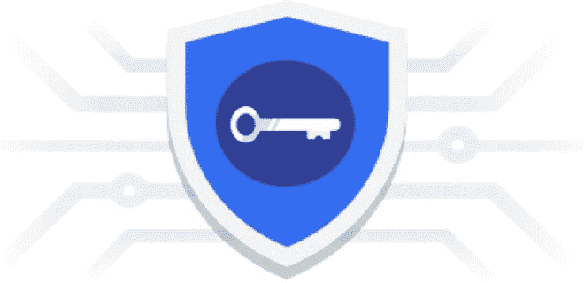
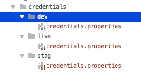
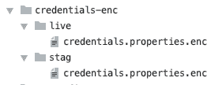
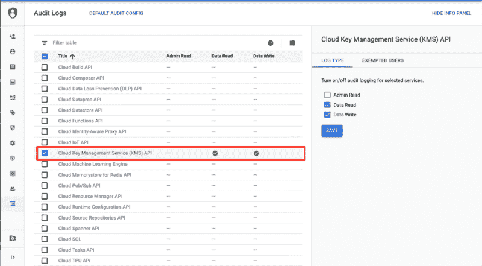
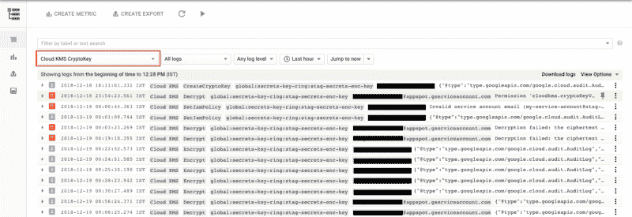

# 如何使用谷歌云 KMS 保护和管理机密

> 原文：<https://www.freecodecamp.org/news/securing-managing-secrets-using-google-cloud-kms-3fe08c69f499/>

作者:拉梅什·林加帕

# 如何使用谷歌云 KMS 保护和管理机密



Secrets + Google KMS + Git

让我们直接开始吧。我们都知道在我们的代码中存储应用程序的秘密不是一个好主意。那我们为什么还把它存在那里呢？我们举个例子。

我们可以将这些秘密存储在一个文件中，并将其添加到 **gitignore** 中，这样它就不会被添加到版本控制中。但是有几个障碍:

*   我们如何管理这些秘密？
*   删除本地副本会发生什么？
*   我们如何与其他开发者分享？
*   我们如何在变更期间管理这些机密的版本，以及谁更改了什么的审计日志？

很多问题！所以我们最终将它存储在代码中，因为处理起来太复杂了。

对于大型应用程序或需要更高安全级别的应用程序，我们可以使用生产级秘密管理服务，如 [Hashicorp Vault](https://www.vaultproject.io/) 。

在本文中，我们将研究一种处理秘密的体面方法，同时仍然实现更好的安全性。我们将使用**谷歌 KMS + Git + IAM+自动化来实现这一目标。**

这个想法并不新鲜。这是我们将要做的:

*   我们将使用谷歌 KMS 在版本控制中存储明文的加密版本
*   我们将使用 KMS IAM 通过授予加密/解密角色来允许适当的用户管理每个环境的机密
*   我们将用加密的秘密文件部署应用程序
*   我们将允许服务器为每个环境解密机密
*   在运行时，我们将加载加密文件，使用 KMS API 解密并使用它。

> [***云 KMS***](https://cloud.google.com/kms) *是一个**云托管的密钥管理服务**，让你管理你的云服务的加密密钥。您可以生成、使用、轮换和销毁加密密钥。云 KMS 与云 IAM 和云审计日志记录相集成，因此您可以管理单个密钥的权限，并监控这些权限的使用情况。*

因此，云 KMS 将加密和解密我们的秘密，所以我们不必存储密钥。只有授权的**用户**或**服务账户**可以执行加密或解密操作。

我们开始吧！

### 第一步:准备秘密

对于我们的用例，我们将有每个环境的应用程序秘密，`prod` `stag`和`dev`。为此，我们在根项目文件夹下创建一个名为`credentials`的新文件夹，然后为每个环境创建一个文件夹。



credentials per each environment

通过在`.gitignore`文件中添加以下行，确保该文件夹不受版本控制的跟踪:

```
/credentials/
```

这里我使用的是一个**属性**文件，但它也可以是 JSON、YAML 等任何文件。现在，您可以在这些文件中添加任何敏感信息。我添加了以下内容:

```
# dev credentialsoauth_client_id=1234oauth_client_secret=abcdapi_key=api_123# ...
```

好吧，我们的秘密已经准备好隐藏了。

### 步骤 2:创建 KMS 密钥

为了使用该服务，我们需要为每个环境创建加密密钥。对我们来说，每个环境都将是一个不同的谷歌云项目(推荐)。这种方式更好，因为它提供了隔离和访问控制(稍后将详细介绍)。

因此，继续使用此链接为每个环境创建一个密钥 [**创建对称密钥(推荐)**](https://cloud.google.com/kms/docs/creating-keys#kms-create-keyring-console) 。它有一步一步的指示(不同的方式)来创建这些密钥。我们使用如下命令行创建这些密钥:

```
// create key-ring (think of this as grouping)gcloud kms keyrings create [KEYRING_NAME] \--location [LOCATION] \--project live-project-id
```

```
// create the encryption keygcloud kms keys create [KEY_NAME] \--location [LOCATION] \--keyring [KEYRING_NAME] \--purpose encryption \--project live-project-id
```

在这里，我使用生产项目 id 创建一个生产密钥。通过替换 *stag 和其他环境* **的**项目 ID** ，为每个环境重复该过程。**

**注**:每个键需要四条信息:`location``keyring``cryptokey``project`。这些信息并不敏感，因此您可以将它们存储在代码或构建脚本中

### 步骤 3:分配使用这些密钥的权限

KMS IAM 系统的美妙之处就在于:为了使用每个密钥，我们需要明确地授予个人用户或服务帐户访问权限。这使得它非常强大，因为现在我们可以定义谁可以管理秘密，谁可以查看这些秘密，等等。

查看[使用 IAM 和云 KMS](https://cloud.google.com/kms/docs/iam) 了解更多信息。这样，我们可以实现以下目标:

#### **生产环境:**

除了少数可以更改秘密的人之外，任何人都不能看到秘密。为此，我们可以授予他们以下角色:

```
cloudkms.cryptoKeyEncrypterDecrypter
```

这样，即使加密的凭证存储在版本控制中，其他开发人员也不能使用它们。请注意，即使是这些开发人员也可以进行实时部署，而不需要知道其中的秘密(稍后将详细介绍)。

#### **暂存环境:**

每个开发人员都可以看到秘密并在开发中使用它们，但只有少数人可以对秘密进行更改。为此，我们可以授予他们以下角色:

```
// for read onlycloudkms.cryptoKeyDecrypter
```

```
// for managingcloudkms.cryptoKeyEncrypterDecrypter
```

同样，您可以根据需要为不同的环境授予关键角色。具体命令请参考文档中的[授予权限](https://cloud.google.com/kms/docs/iam#granting_permissions_to_use_keys)。

### 第四步:加密秘密

我们已经完成了准备工作，现在是时候隐藏一些秘密了。假设您拥有*加密器*角色，那么您可以使用以下命令来加密文件:

```
gcloud kms encrypt --location global \  --keyring secrets-key-ring --key quickstart \  --plaintext-file credentials/stag/credentials.properties \  --ciphertext-file credentials-encrypted/stag/credentials.properties.encrypted
```

因为它是一个 shell gcloud 命令，所以您可以轻松地将其与任何构建系统集成，以加密 **credentials** 文件夹下的所有文件。例如，我用 **gradle** 来做这个:

基本上，有两个助手功能:

*   **kmsencryptscrets**取 **src 文件夹**对其中的每个文件进行加密，并用**写入**目标文件夹**。enc** (加密)扩展名，以及
*   kmsDecryptSecrets 执行相反的过程。

因此，每次我们修改秘密时，您都可以通过一个简单的任务调用 encrypt helper 方法:

现在，加密的文件夹将如下所示:



encrypted credential files

该文件夹可以添加到版本控制中，因此每次授权用户更改密码时，都会生成一个新的加密文件，并在版本控制中记录历史。

类似地，反向流程有一个[解密任务](https://gist.github.com/ramesh-dev/3ba47732591c4b9e1bae7b99ed2b67a9)。

### 步骤 4:在部署中使用加密的机密

既然我们已经完成了加密秘密并在版本控制中正确管理它们，让我们看看如何在运行时使用它，也就是说当应用程序实际运行在试运行或生产中时。我们可以通过两种方式做到这一点:

#### **1。部署时解密和传递:**

因此，在部署期间，授权用户可以简单地解密这些加密的秘密，并将其添加到部署中(例如:构建目录)，从而使其在运行时可供代码使用。我们不打算深入讨论这个问题。

> 当**部署者**需要非常严格或者使用 CD 管道实现流程自动化时，这种方法很好。

#### **2。在部署期间传递加密的机密并在运行时解密:**

这里我们不打算在部署期间解密和发送原始机密。相反，我们只是传递加密的秘密。在运行期间，我们将解密这些秘密并使用它们。

**注意:**这在谷歌云平台中效果最好。否则，您需要生成一个服务帐户，以便可以对外部提供者使用这种方法。

这种方法更加安全，因为我们不依赖于任何中间用户操作或管道，而是只依赖于可以在运行时解密内容的授权服务器。

例如，我们可以允许临时服务器(服务帐户)能够解密临时机密，但不能解密生产机密。

> 使用这种方法，即使是任何无权解密生产机密的开发人员也可以执行生产部署，一切仍然正常。

### 步骤 5:在运行时使用秘密

我们将使用第二种方法(传递加密的秘密)。

对于演示，假设我们将部署到 **AppEngine** ，因为它已经生成了一个默认的服务帐户。我们将授予它解密如下秘密的权限:

```
gcloud kms keys add-iam-policy-binding secrets-enc-key \ --project kms-demo \--location global \--keyring secrets-key-ring \--member serviceAccount:kms-demo@appspot.gserviceaccount.com \--project kms-demo \--role roles/cloudkms.cryptoKeyDecrypter
```

因此，当服务器启动时，我们可以简单地加载加密文件，并使用 [KMS 客户端库](https://cloud.google.com/kms/docs/reference/libraries)来解密其内容。

### 第六步: [KMS 审计日志](https://cloud.google.com/kms/docs/logging)

最后，您可以通过启用 KMS 审核日志记录(默认情况下不启用)来查看每个键上操作的审核日志。因此，我们现在可以跟踪所有执行的操作，以便将来审计。

您可以使用 gcloud 启用审计日志，但是我们已经看够了命令行方式。或者，我们可以使用云控制台 UI 来启用此配置。从左侧菜单中选择**IAM&admin->Audit Lo**GS。

点击**云密钥管理服务**，启用**数据读取**和**数据写入**，点击保存。



Google IAM Audit Log Console

就是这样！现在，如果执行任何加密、解密或任何其他类型的操作，都会生成一个审计日志，您可以在 ***云 KMS 加密密钥下的日志记录部分查看这些日志。***



Audit Logs for IAM operations

如您所见，它有各种操作的审计日志，包括无效权限或请求等故障。它显示了哪个用户使用哪个键执行了什么操作(或者是否是在服务帐户下完成的)。这是一个非常好的解决方案。有关更多信息，请阅读[通过云 KMS 使用云审计日志记录](https://cloud.google.com/kms/docs/logging)。

### 结论

通过这种方法，我们可以安全地存储、管理和使用应用程序机密或任何敏感信息，还可以使用版本控制来跟踪更改。本文中讨论的技术可以用于任何语言，它可以完全或部分用于其他平台，如 iOS、Android、外部服务器等。

有关 kms 命令列表，请参考 [KMS 命令](https://gist.github.com/ramesh-dev/5042ef29946f570c906a082ec67cb5dc)。另外，查看示例应用程序以获得完整的代码:

[**Ramesh-dev/gae-Dynamic-config-Demo**](https://github.com/ramesh-dev/gae-dynamic-config-demo/tree/kms_demo)
[*app engine 动态配置演示。通过创建…*github.com](https://github.com/ramesh-dev/gae-dynamic-config-demo/tree/kms_demo)，为 Ramesh-dev/gae-dynamic-config-demo 开发做出贡献

以下是一些参考链接:

*   [谷歌云 KMS](https://cloud.google.com/kms/)
*   [在 KMS 创建对称密钥](https://cloud.google.com/kms/docs/creating-keys#kms-create-keyring-console)
*   [谷歌云 KMS 快速入门](https://cloud.google.com/kms/docs/quickstart)
*   [通过云 KMS 使用 IAM](https://cloud.google.com/kms/docs/iam)
*   [使用 Gradle Part 2 的动态 AppEngine 配置](https://medium.com/swlh/dynamic-appengine-configurations-using-gradle-part-2-49a30eb87672)