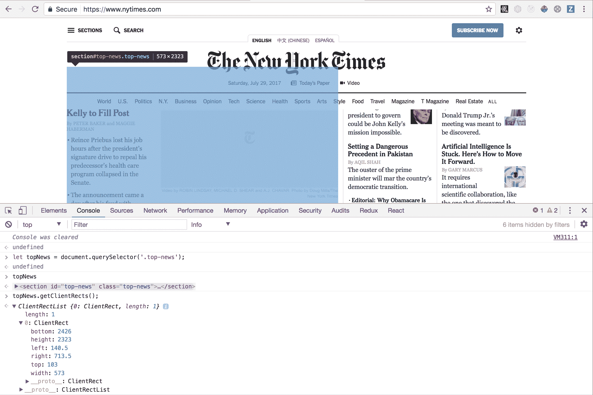
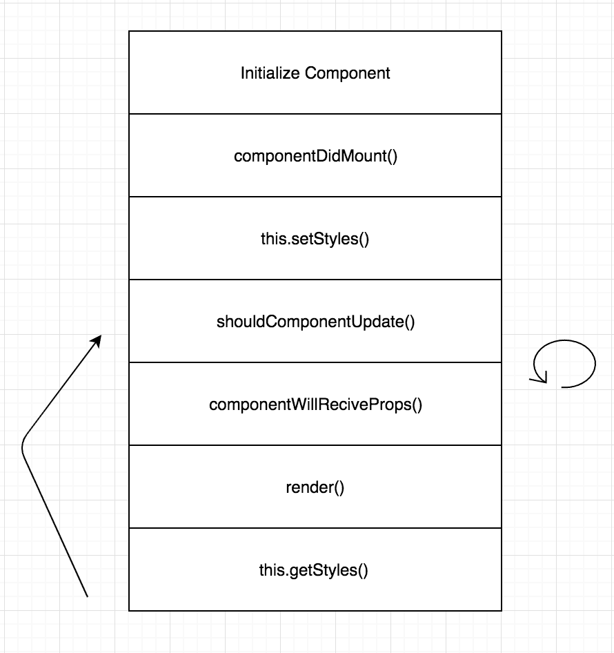

# 自定位反应元件

> 原文：<https://www.freecodecamp.org/news/self-positioning-react-components-2/>

尽管 React 有办法打开舱门并直接操纵 DOM，但这样做的理由很少。除非我们有非常好的理由，否则我们不应该直接操作 DOM。当我们需要时，我们应该使用`ref`属性。只有在万不得已的情况下，我们才应该直接操作 DOM 以及在渲染过程中改变状态。

### 问题是

栅格在 1024 像素处从固定栅格捕捉到流体栅格。我们希望我们的教程提示离它们的父元素有 20px 的距离，但是没有办法只用 css 做到这一点。如果尖端正确定位在固定网格中，当网格捕捉到流体视图时，尖端将关闭。

[https://www.youtube.com/embed/9VkbXWANxvQ?feature=oembed](https://www.youtube.com/embed/9VkbXWANxvQ?feature=oembed)

教程元数据直接应用于具有最高 css 特异性的组件的内联样式中。这意味着媒体查询不能解决这个问题，因为媒体查询会被具有更高特异性的 css 覆盖。

### 解决方案

解决方案需要一组元数据和一个知道它在哪里的组件，这样它就可以动态地改变它的定位。这是最终组件样式变化的视频。

[https://www.youtube.com/embed/BFkJ4KjBWPo?feature=oembed](https://www.youtube.com/embed/BFkJ4KjBWPo?feature=oembed)

并且组件随着视口大小的调整而移动。

[https://www.youtube.com/embed/OwGAaxtAmaQ?feature=oembed](https://www.youtube.com/embed/OwGAaxtAmaQ?feature=oembed)

### Element.getClientRects()

首先，我们需要知道父元素在页面上的位置，然后才能对它做任何事情。`.getClientRects()` [方法](https://developer.mozilla.org/en-US/docs/Web/API/Element/getBoundingClientRect)就是这么做的。如果您在 DOM 上查询一个元素并调用`.getClientRects()`，它将返回一个值对象，其中包含该元素相对于浏览器视窗的位置、高度和宽度。在你那边试试吧。



querying an element on NYTimes.com

### 使用有状态组件存储定位

我们需要组件随时知道它在哪里。考虑到这个需求，我们需要一个能够保持自身状态的`class`组件，而不是一个无状态的功能组件。这是因为用户可以缩小或扩大他们的视口超过或小于 1024 像素的阈值，这将改变我们的网格到流体或固定位置。组件需要知道视窗的大小，这样它就可以在屏幕大小改变时保持动态生成的位置。

### Getters 和 Setters

该组件围绕动态定位有两个核心功能。根据父元素在屏幕上的位置动态设置样式，并让这些设置的样式呈现提示的位置。我们将这些函数方法命名为`getStyles`和`setStyles`。

```
/**
 * Method for tutorial tip to dynamically set position based on state.
 *
 * @return {object} with tutorialTip dynamic position style values
 */
, getStyles: function () {
  var self = this
    , styles = {
      top      : self.state.top    || 'auto'
      , bottom   : self.state.bottom || 'auto'
      // (We'll talk about this positioning later)     
      , left     : self.state.left   || -9999
      , right    : self.state.right  || 'auto'
    }
    ;
  // Hide tutorial tip during transitions to prevent flickering. (We'll talk about this later)
  if (!this.state.display) {
    styles.display = 'none';
  }

  return styles;
}
view raw
```

```
/**
 * Queries the DOM and dynamically generates values to update state. These values are passed to getStyles
 * to update positioning.
 *
 * @return {void} function mutates state.
 */
  , setStyles: function () {
    var {step} = this.props
      , meta = tutorialMeta[step]
      // (We'll talk about this later)
      , el = document.querySelector('.step' + step)
      // Get queried DOM element's values (top, right, left, width, etc.)
      , bounds = el && el.getBoundingClientRect()
      ;

    if (bounds) {
      switch (meta.position) {
        case 'right':
          this.setState({
            top: Math.floor(bounds.top - meta.offsetTop)
            , left: Math.floor((bounds.right) + meta.offsetLeft)
            , display: true
          });
          break;
        case 'left':
          this.setState({
            top: Math.floor(bounds.top - meta.offsetTop)
            , left: Math.floor((bounds.left) + meta.offsetLeft)
            , display: true
          });
          break;
        case 'bottom':
          this.setState({
            top: Math.floor(bounds.top - meta.offsetTop)
            , left: Math.floor((bounds.right - bounds.width) + meta.offsetLeft)
            , display: true
          });
          break;
        case 'bottom-left':
          this.setState({
            top: Math.floor(bounds.top - meta.offsetTop)
            , left: Math.floor((bounds.right - bounds.width) + meta.offsetLeft)
            , display: true
          });
          break;
        default:
          break;
      }
    }
  }
```

在这个特定的用例中，我们为每个教程提示加载`tutorialMeta` JSON 数据，并相应地为每个提示定位类型加载`setState`。 ****注:**** 这不是对一个自我定位组件本身的要求。只是教程的信息。例如说明文本和偏移定位，因此提示距离其父元素 20px 并居中。

现在，是时候利用这一功能并将其与 React 的生命周期方法挂钩了，这样组件就知道何时更新自己的定位。

### 连接 React 的生命周期方法

让我们把 getters 和 setters 连接起来，这样我们的组件就知道什么时候触发它们，更新它的属性和状态。

初始化和销毁:

```
componentDidMount: function () {
  window.addEventListener('resize', this.setStyles);
  this.setStyles();
}
, componentWillUnmount: function () {
  window.removeEventListener('resize', this.setStyles);
}
```

关于组件加载，我们需要`setStyles`，因为我们目前没有任何样式可以获取！记住，组件将调用`.getClientRect()`，它将动态设置定位值。此外，我们不希望每次调整视口大小时都查询 DOM。

```
 , shouldComponentUpdate: function (nextProps, nextState) {
    //  We use use lodash at work for convenice methods like isEqual
    return !_.isEqual(nextProps, this.props) || !_.isEqual(nextState, this.state);
  }

  , componentWillReceiveProps: function (nextProps) {
    if (nextProps.step !== this.props.step) {
      // Step has changed, hide the tutorial box
      this.replaceState({
        display: false
      });
    }
  }
```

我们检查我们的道具或状态是否改变了。如果 React 的[文档](https://facebook.github.io/react/docs/react-component.html#shouldcomponentupdate)更改了任何状态，那么`shouldComponentUpdate`的默认设置是返回 true。因为我们也从容器组件中获取数据作为道具，所以我们也需要检查道具更新。 ****注意:**** 像`nextStep`和`currentStep`一样，整个教程都有全局调度和数据，这不是每个用例的要求，只是我们正在解决的那个用例。

接下来的`componentWillRecieveProps`在一个被挂载的组件收到新道具之前被触发( [docs](https://facebook.github.io/react/docs/react-component.html#componentwillreceiveprops) )。使用`replaceState`而不是`setState`清除状态并将组件设置为不显示。这也是一个非常具体和深思熟虑的用例，闪烁问题。

### 有一个闪烁问题

可怕的闪烁！这是如此微妙，但它使我们的团队抽搐。在初始加载时有一个闪光，当转换教程提示时，它会在应该出现的地方前一个渲染步骤出现。

****闪光灯闪烁:**** 那就是`-9999`位置进来的地方。如果没有给我们的组件定位，只需确保它完全离开页面。

****悬挂闪烁:**** 每次我们得到新的道具时，组件会将我们的显示设置为假，并在过渡期间将组件从 DOM 中完全移除。如果你在`componentWillRecieveProps`、`setStyles`和`getStyles`中查找，你会看到如何移除和添加组件的参考，其中`display`设置为假或真。

### 朗读者

这个函数将获取我们动态生成的样式，它在样式`props`中被调用。 ****注意:**** `_.getClassNameFromObject`是我们自己的自定义函数，它将创建一个字符串，我们可以将它添加到组件类样式中。我们不打算深究这个函数，因为它超出了本文的范围。但是，如果你感兴趣，请在帖子底部留下评论，我会尽力回答你的问题。

```
, render: function () {
    let {step} = this.props;
    var props = this.props
      , meta = tutorialMeta[step]
      , parentClass = _.getClassNameFromObject({
        'tutorial-wrap': true
      })
      , childClass = _.getClassNameFromObject({
        'tutorial-tip': true
        , 'top'     : _.isEqual(_.get(meta, 'position'), 'top')
        , 'right'   : _.isEqual(_.get(meta, 'position'), 'right')
        , 'bottom'  : _.isEqual(_.get(meta, 'position'), 'bottom')
        , 'left'    : _.isEqual(_.get(meta, 'position'), 'left')
        , 'bottom-left':  _.isEqual(_.get(meta, 'position'), 'bottom-left')
      })
      , text = props.error ? meta.error : meta.text
      , btnCls = _.getClassNameFromObject({
        'btn btn-special btn--short next': meta.nextButton
        , 'hidden': !meta.nextButton
      })
      ;

    if (!props.visible) return null;

    return (
      <div className={parentClass}>
        <div className={childClass} style={this.getStyles()}>
          <div>
            <div className="step-info">
              <span><span className="step"><i className="fa fa-question-circle" aria-hidden="true"></i>
              &nbsp; Step {props.step + 1}</span> of {tutorialMeta.length}</span>
            </div>
            <div className="step-text">
              <span dangerouslySetInnerHTML={{__html: text}}></span>
            </div>
            <div className="end-tutorial">
              <a className="clickable" onClick={props.onTutorialFinish}>End tutorial</a>
                <button className={btnCls} onClick={props.onTutorialNext}>Next</button>
            </div>
          </div>
        </div>
      </div>
    );
  }
```

这是我们的组件生命周期、getters、setters 和 render 方法的图表。



### 整个组件

```
var React  = require('react')
  , _      = require('lodash')
  , tutorialMeta = require('./tutorialMeta.json').tutorial
  ;

/**
 * Tutorial Component
 * @class TutorialTip
 * @param {props} object that holds global data to render component.
 * @param {element} element to put tutorial tip around.
 *
 * @return {element} with tutorialTip
 */

module.exports = React.createClass({
  getInitialState: function () {
    return {display: true};
  }
  , componentDidMount: function () {
    window.addEventListener('resize', this.setStyles);
    this.setStyles();
  }
  , componentWillUnmount: function () {
    window.removeEventListener('resize', this.setStyles);
  }
  , shouldComponentUpdate: function (nextProps, nextState) {
    return !_.isEqual(nextProps, this.props) || !_.isEqual(nextState, this.state);
  }

  , componentWillReceiveProps: function (nextProps) {
    if (nextProps.step !== this.props.step) {
      // Step has changed, hide the tutorial box
      this.replaceState({
        display: false
      });
    }
  }
/**
 * Method for tutorial tip to dynamically set position based on state.
 *
 * @return {object} with tutorialTip dynamic position style values
 */
  , getStyles: function () {
    var self = this
      , styles = {
        top      : self.state.top    || 'auto'
        , bottom   : self.state.bottom || 'auto'
        , left     : self.state.left   || -9999
        , right    : self.state.right  || 'auto'
      }
      ;
    // Hide tutorial tip during transitions to prevent flickering.
    if (!this.state.display) {
      styles.display = 'none';
    }

    return styles;
  }
  , componentDidUpdate: function () {
    this.setStyles();
  }
/**
 * Queries the DOM and dynamically generates values to update state. These values are passed to getStyles
 * to update positioning.
 *
 * @return {void} function mutates state.
 */
  , setStyles: function () {
    var {step} = this.props
      , meta = tutorialMeta[step]
      , el = document.querySelector('.step' + step)
      // Get queried DOM element's values (top, right, left, width, etc.)
      , bounds = el && el.getBoundingClientRect()
      ;

    if (bounds) {
      switch (meta.position) {
        case 'right':
          this.setState({
            top: Math.floor(bounds.top - meta.offsetTop)
            , left: Math.floor((bounds.right) + meta.offsetLeft)
            , display: true
          });
          break;
        case 'left':
          this.setState({
            top: Math.floor(bounds.top - meta.offsetTop)
            , left: Math.floor((bounds.left) + meta.offsetLeft)
            , display: true
          });
          break;
        case 'bottom':
          this.setState({
            top: Math.floor(bounds.top - meta.offsetTop)
            , left: Math.floor((bounds.right - bounds.width) + meta.offsetLeft)
            , display: true
          });
          break;
        case 'bottom-left':
          this.setState({
            top: Math.floor(bounds.top - meta.offsetTop)
            , left: Math.floor((bounds.right - bounds.width) + meta.offsetLeft)
            , display: true
          });
          break;
        default:
          break;
      }
    }
  }
  , render: function () {
    let {step} = this.props;
    var props = this.props
      , meta = tutorialMeta[step]
      , parentClass = _.getClassNameFromObject({
        'tutorial-wrap': true
      })
      , childClass = _.getClassNameFromObject({
        'tutorial-tip': true
        , 'top'     : _.isEqual(_.get(meta, 'position'), 'top')
        , 'right'   : _.isEqual(_.get(meta, 'position'), 'right')
        , 'bottom'  : _.isEqual(_.get(meta, 'position'), 'bottom')
        , 'left'    : _.isEqual(_.get(meta, 'position'), 'left')
        , 'bottom-left':  _.isEqual(_.get(meta, 'position'), 'bottom-left')
      })
      , text = props.error ? meta.error : meta.text
      , btnCls = _.getClassNameFromObject({
        'btn btn-special btn--short next': meta.nextButton
        , 'hidden': !meta.nextButton
      })
      ;

    if (!props.visible) return null;

    return (
      <div className={parentClass}>
        <div className={childClass} style={this.getStyles()}>
          <div>
            <div className="step-info">
              <span><span className="step"><i className="fa fa-question-circle" aria-hidden="true"></i>
              &nbsp; Step {props.step + 1}</span> of {tutorialMeta.length}</span>
            </div>
            <div className="step-text">
              <span dangerouslySetInnerHTML={{__html: text}}></span>
            </div>
            <div className="end-tutorial">
              <a className="clickable" onClick={props.onTutorialFinish}>End tutorial</a>
                <button className={btnCls} onClick={props.onTutorialNext}>Next</button>
            </div>
          </div>
        </div>
      </div>
    );
  }
});
```

### 等等，还有更多！

我们还提出了一个有趣的解决方案，以避免在整个应用程序中添加组件。如果您需要像教程一样向应用程序添加一系列组件，这将非常有用。

在`setStyles`中，我们查询特定步骤的 DOM，而不是多次包含组件。容器组件呈现组件一次，然后在每次步骤改变时，我们寻找不同的步骤类来呈现教程组件。

### 这是所有的乡亲

希望这能帮助那些在 React 应用程序中需要这种动态定位功能的人。

非常感谢[德克斯特](https://medium.com/@rundexter)工程部门，特别是[丹尼尔·伊尔科维奇](https://medium.com/@ilkovich)和[胡大维](https://medium.com/@octopi)让我分享这段代码，以及他们在我们[网站](http://rundexter.com/)上构建用户教程功能时提供的所有帮助和支持。