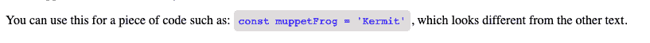
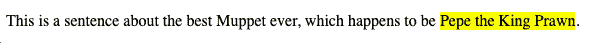

# 语义 HTML 指南——使用 div 的 10 种选择

> 原文：<https://www.freecodecamp.org/news/semantic-html-alternatives-to-using-divs/>

如果你的典型 HTML 布局是这样的，请举手:

```
<body>
  <div class="header" id="site-header">
    <div class="site-nav">
      <ul>
        <li><a href="/">Home</a></li>
        <li><a href="/">About</a></li>
        <li><a href="/">Contact</a></li>
      </ul>
    </div>
  </div>
  <div class="content-wrap">
    <div class="intro">
      This is the introduction to the site, which is full of divs.
    </div>
  </div>
  <div class="container"></div>
</body> 
```

我们很多人默认使用`<div>`元素，因为这是构建 HTML 布局最快的方式。把标记去掉可能很有诱惑力，这样我们就可以专注于有趣的东西，比如 CSS 或 JavaScript。

虽然使用`<div>`元素在文档中构建一个完整的布局可能是最容易实现的，但它可能会带来一些问题。

## 仅使用`div`的问题

使用`<div>`元素本身不是问题。它是有用途的，没有理由不用它。

但是在 HTML 中专门使用 DIV 可能会给你和任何参与你的项目的人带来问题。

### 可读性问题

如果你曾经看过别人的代码，或者甚至是你自己写了几个月后的代码，如果它只包含了`<div>`元素，那就很难浏览了。

破译布局可能会花费比必要时间长得多的时间，这对您的生产力来说就像是氪石。仅仅是试图找出特定代码块的结束标签`</div>`在哪里就可能是乏味的。

### 无障碍问题

坚持所有的考虑不仅仅是关于颜色、对比度和标题。世界卫生组织估计，全球有 2.85 亿人视力受损:3900 万人失明，2.46 亿人视力低下。

这也是为什么编写尽可能易于访问的 HTML 很重要的另一个原因，这意味着编写语义代码。

屏幕阅读器需要上下文才能准确地朗读网页。对于屏幕阅读器来说，`<div>`和`<span>`这样的元素毫无意义。像`<form>`和`<button>`这样的语义 div 更容易解析。

### 一致性问题

如果你知道和团队一起工作时会发生什么，你会更有效率。你的代码中也会有更少的错误。

为语义 HTML 的使用设定一个标准是有意义的，因为任何人拿起项目都会更容易理解布局。

此外，当您开始为 HTML 文档应用或调整 CSS 时，您会发现在布局中使用语义 HTML 时，查找特定元素会更快、更容易。

### 搜索引擎优化问题

当使用语义标记时，搜索引擎会将其内容视为影响页面搜索排名的重要关键词。 [(MDN 网络文档)](https://developer.mozilla.org/en-US/docs/Glossary/Semantics)

什么是语义 HTML？

我发现的语义 HTML 最清晰的定义是:

> 语义元素清楚地向浏览器和开发人员描述了它的含义。

使用语义 HTML 就像指出天空中的一个物体和说“看，一个物体！”或者“看，一架飞机！”

正如描述现实世界的对象使日常交流更容易一样，语义 HTML 使阅读代码更容易。

事实上，使用语义 HTML 被认为是 HTML5 标准的一部分:

> 强烈建议作者将 [div](https://html.spec.whatwg.org/multipage/grouping-content.html#the-div-element) 元素视为万不得已的元素，因为没有其他元素是合适的。使用更合适的元素而不是`div`元素可以让读者更容易访问，让作者更容易维护。

例如，哪个更容易扫描:

```
<div class="quote" id="twain-quote">
  "Get your facts first, then you can distort them as you please." – Mark Twain
</div> 
```

或者

```
<blockquote>
  "Get your facts first, then you can distort them as you please." – Mark Twain
</blockquote> 
```

在第二个例子中，您可以看到`<blockquote>`元素，它可以立即理解为需要以引用格式显示的文本。

使用替代方案可能需要更多的思考，但是语义 HTML 的额外规划最终是值得的。

## HTML 中`div`的替代品

让我们来谈谈一些更常见的选择。您可能以前见过这些元素，但是在这里我们将详细介绍它们的用途以及如何使用它们。

### 元素

```
<nav>
  <ul>
    <li><a href="/">Home</a></li>
    <li><a href="/">About</a></li>
    <li><a href="/">Contact</a></li>
  </ul>
</nav> 
```

nav 元素就像它听起来的那样。您可以使用这个元素来勾勒出一组导航链接。

如前所述，这也允许屏幕阅读器决定最初是否显示这种类型的内容。`nav`元素最适合用于文档中的主要导航链接块。

### 

<main>元素</main>

```
<main>
  <h1>The Godfather of All Content</h1>
  <h2>The Wedding</h2>
  <p>
    Why did you go to the police? Why didn't you come to me first? Vito, how do
    you like my little angel? Isn't she beautiful? Only don't tell me you're
    innocent. Because it insults my intelligence and makes me very angry. I see
    you took the name of the town. What was your father's name? The hotel, the
    casino. The Corleone Family wants to buy you out.
  </p>
</main> 
```

与`<nav>`类似，main 元素就像它听起来那样被使用(语义再次起作用)。该元素包装了指定页面或文档主要内容的代码块。主元素将位于开始和结束标签之间。

### 元素

```
<section>
  <h1>The Best Sandwich Ever</h1>
  <p>
    The best sandwich is a mutton, lettuce and tomato, where the mutton is nice
    and lean. It's so perky, I love that.
  </p>
</section> 
```

`<section>`元素是使用`div`替代来分隔内容的一个很好的例子。

在上面的例子中，我们将引言和开头分成两部分。在我们的 CSS 文档中查找和样式化这些部分将比搜寻一个`<div>`类要快得多。

### 元素

```
<header>
  
</header> 
```

`<header>`元素不同于`<head>`元素，因为您可以在整个文档中多次使用它。

例如，您可以使用一组`<header>`元素来放置一个徽标，使用另一组元素来描述特定内容的标题，比如一篇文章(稍后将详细介绍)。

### 元素

```
<footer>
  <p>© 2021 All rights reserved. Don't steal.</p>
  <p>Contact: <a href="mailto:jiffy@jiffysites.com">Email Jiffy!</a></p>
</footer> 
```

就像使用`<header>`元素一样，您可以在 HTML 文档的任何地方使用`<footer>`元素。

`<footer>`通常用于版权或作者信息。您也可以在`<section>`元素中使用页脚元素作为结束。

### `div`的不常见替代品

还有一些元素你可能以前没见过或者只是很少见过。但是它们确实会派上用场，学习它们将有助于提高代码的可读性。

```
<p>
  My favorite TV show of all time is The Muppet Show. It's sweet, funny and
  brilliant.
</p>
<aside>
  <h3>The Muppet Show</h3>
  <p>The Muppet Show was created by Jim Henson and aired from 1976 – 1981.</p>
</aside> 
```

在电影或戏剧中，旁白被认为是一种戏剧手段，在这种手段中，角色向观众说话，与主要对话分开。

这正是我们在 HTML 中使用

### `元素`

```
<p>
  You can use this for a piece of code such as:
  <code class="gray-code">const muppetFrog = 'Kermit'</code>, which looks
  different from the other text.
</p> 
```

在我们想要区分一段代码和普通文本的情况下，`<code>`元素非常方便。在浏览器中呈现的结果文本可能如下所示，带有一点 CSS 样式:



### 元素

```
<article class="all-muppets">
  <h1>Muppets</h1>
  <article class="kermit">
    <p>Kermit is the Muppet leader.</p>
  </article>
  <article class="fozzy">
    <p>Fozzy is a stand-up bear.</p>
  </article>
  <article class="piggy">
    <p>Don't mess with Miss Piggy.</p>
  </article>
</article> 
```

`<article>`元素是用来区分布局中不同类型内容的另一个元素。

一个`<article>`应该是独立于主要内容的独立内容。使用该元素还可以更容易地使用 CSS 样式，使文章内容明显不同于页面上的其他内容。

### 

> element

`<blockquote>`元素是另一个简单的元素，正如它听起来的那样:从其他文本中分离出一段引文，如前所述。

### 元素

```
<p>
  This is a sentence about the best Muppet ever, which happens to be
  <mark>Pepe the King Prawn</mark>.
</p> 
```

元素不仅是突出显示文本块的完美方式，当你在文档中遇到它时也很容易理解。看起来是这样的:



试着在你自己的代码中使用这些`div`选项，看看它会使你的代码更容易阅读。

## 包扎

这些只是十种选择的例子。我们可以在 HTML 中使用很多其他的语义元素。

您不会在一个文档中使用它们，也不必担心要记住 100 多个元素。MDN 有一个方便的参考页面，您可以在需要时参考它: [HTML 元素参考](https://developer.mozilla.org/en-US/docs/Web/HTML/Element)。

编写语义 HTML 是一个尽早养成的好习惯。这对可读性、SEO 都有好处，别忘了数百万视力受损的人会欣赏你精心编写的代码。