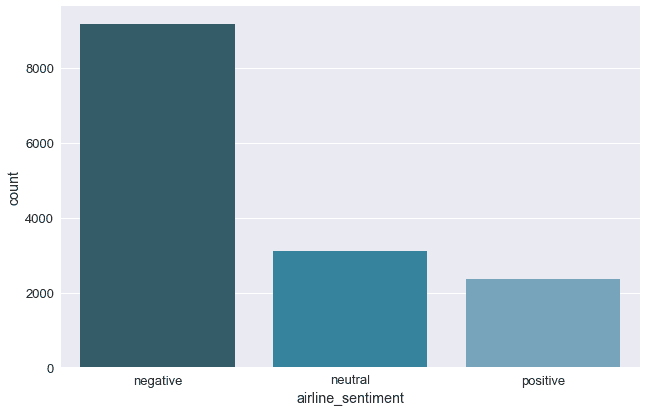
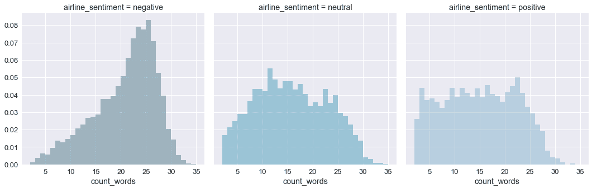
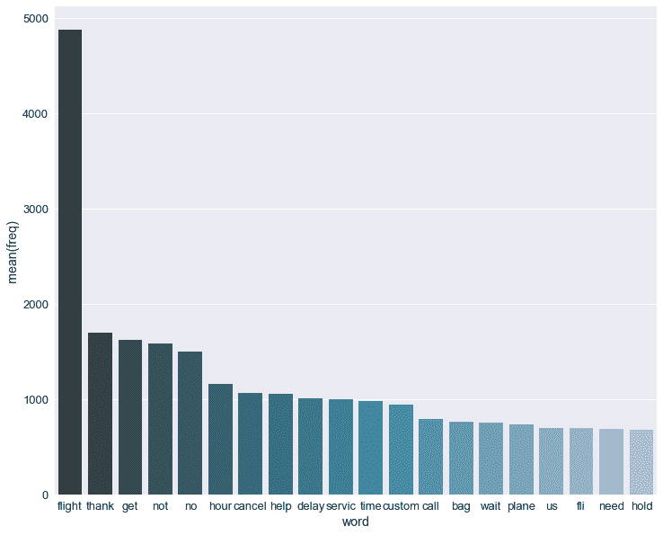

# 基于文本挖掘的情感分析

> 原文：<https://www.freecodecamp.org/news/sentiment-analysis-with-text-mining/>

在本教程中，我将探索一些用于情感分析的文本挖掘技术。我们将看看如何准备文本数据。之后，我们将尝试两种不同的分类器来推断推文的情感。我们将使用网格搜索来调整两个分类器的超参数。最后，我们在一组指标上评估性能，如精确度、召回率和 F1 分数。

在这个项目中，我们将使用 Kaggle 上的 [Twitter 美国航空公司情绪数据集。它包含 tweet 的文本和一个具有三个可能情感值的变量。让我们从导入包和配置一些设置开始。](https://www.kaggle.com/crowdflower/twitter-airline-sentiment)

```
import numpy as np 
import pandas as pd 
pd.set_option('display.max_colwidth', -1)
from time import time
import re
import string
import os
import emoji
from pprint import pprint
import collections
import matplotlib.pyplot as plt
import seaborn as sns
sns.set(style="darkgrid")
sns.set(font_scale=1.3)
from sklearn.base import BaseEstimator, TransformerMixin
from sklearn.feature_extraction.text import CountVectorizer
from sklearn.feature_extraction.text import TfidfVectorizer
from sklearn.model_selection import GridSearchCV
from sklearn.model_selection import train_test_split
from sklearn.pipeline import Pipeline, FeatureUnion
from sklearn.metrics import classification_report
from sklearn.naive_bayes import MultinomialNB
from sklearn.linear_model import LogisticRegression
from sklearn.externals import joblib
import gensim
from nltk.corpus import stopwords
from nltk.stem import PorterStemmer
from nltk.tokenize import word_tokenize
import warnings
warnings.filterwarnings('ignore')
np.random.seed(37)
```

## 加载数据

我们读取了从 Kaggle 数据集下载的逗号分隔文件。我们打乱了数据帧，以防类被排序。对原始指数的`permutation`应用`reindex`方法有利于此。在这本笔记本中，我们将使用`text`变量和`airline_sentiment`变量。

```
df = pd.read_csv('../input/Tweets.csv')
df = df.reindex(np.random.permutation(df.index))
df = df[['text', 'airline_sentiment']]
```

## 探索性数据分析

### 目标变量

我们将预测三个类别标签:负面、中性或正面。

正如我们在下面的图表中看到的，分类标签是不平衡的。这是我们在模型训练阶段应该记住的事情。有了 seaborn 包的`factorplot`，我们可以可视化目标变量的分布。

```
sns.factorplot(x="airline_sentiment", data=df, kind="count", size=6, aspect=1.5, palette="PuBuGn_d")
plt.show();
```



Imbalanced distribution of the target class labels

### 输入变量

为了分析`text` 变量，我们创建了一个类`TextCounts`。在这个类中，我们计算文本变量的一些基本统计数据。

*   `count_words`:推文字数
*   其他 Twitter 账户的推荐以@开头
*   `count_hashtags`:标签字数，以#开头
*   一些大写单词有时被用来“叫喊”和表达(负面)情绪
*   `count_excl_quest_marks`:问号或感叹号的个数
*   `count_urls`:tweet 中的链接数量，以 http(s)开头
*   表情符号的数量，这可能是情绪的一个好迹象

```
class TextCounts(BaseEstimator, TransformerMixin):

    def count_regex(self, pattern, tweet):
        return len(re.findall(pattern, tweet))

    def fit(self, X, y=None, **fit_params):
        # fit method is used when specific operations need to be done on the train data, but not on the test data
        return self

    def transform(self, X, **transform_params):
        count_words = X.apply(lambda x: self.count_regex(r'\w+', x)) 
        count_mentions = X.apply(lambda x: self.count_regex(r'@\w+', x))
        count_hashtags = X.apply(lambda x: self.count_regex(r'#\w+', x))
        count_capital_words = X.apply(lambda x: self.count_regex(r'\b[A-Z]{2,}\b', x))
        count_excl_quest_marks = X.apply(lambda x: self.count_regex(r'!|\?', x))
        count_urls = X.apply(lambda x: self.count_regex(r'http.?://[^\s]+[\s]?', x))
        # We will replace the emoji symbols with a description, which makes using a regex for counting easier
        # Moreover, it will result in having more words in the tweet
        count_emojis = X.apply(lambda x: emoji.demojize(x)).apply(lambda x: self.count_regex(r':[a-z_&]+:', x))

        df = pd.DataFrame({'count_words': count_words
                           , 'count_mentions': count_mentions
                           , 'count_hashtags': count_hashtags
                           , 'count_capital_words': count_capital_words
                           , 'count_excl_quest_marks': count_excl_quest_marks
                           , 'count_urls': count_urls
                           , 'count_emojis': count_emojis
                          })

        return df
tc = TextCounts()
df_eda = tc.fit_transform(df.text)
df_eda['airline_sentiment'] = df.airline_sentiment
```

查看 TextStats 变量与 class 变量的关系可能会很有趣。因此我们编写了一个函数`show_dist`,它为每个目标类提供了描述性的统计数据和图表。

```
def show_dist(df, col):
    print('Descriptive stats for {}'.format(col))
    print('-'*(len(col)+22))
    print(df.groupby('airline_sentiment')[col].describe())
    bins = np.arange(df[col].min(), df[col].max() + 1)
    g = sns.FacetGrid(df, col='airline_sentiment', size=5, hue='airline_sentiment', palette="PuBuGn_d")
    g = g.map(sns.distplot, col, kde=False, norm_hist=True, bins=bins)
    plt.show()
```

下面你可以找到每个目标类别的 tweet 字数分布。为简洁起见，我们将仅限于这个变量。所有 TextCounts 变量的图表都在 Github 上的[笔记本中。](https://github.com/bertcarremans/TwitterUSAirlineSentiment)



*   推文中使用的字数相当低。最大的字数是 36 个，甚至有只有 2 个字的推文。所以在数据清理过程中，我们必须小心，不要删除太多的单词。但是文字处理会更快。负面推文比中性或正面推文包含更多单词。
*   所有推文至少有一次提及。这是基于 Twitter 数据中的提及提取推文的结果。就情感而言，提及次数似乎没有什么不同。
*   大多数推文不包含哈希标签。所以这个变量在模型训练期间不会被保留。同样，对于情感，散列标签的数量没有差别。
*   大多数推文不包含大写单词，我们看不到情绪分布的差异。
*   积极的推文似乎使用了更多的感叹或问号。
*   大多数推文不包含网址。
*   大多数推文不使用表情符号。

## 文本清理

在我们开始使用 tweets 的文本之前，我们需要清理它。我们将在`CleanText` ****课上做这个。**** 使用这个类我们将执行以下操作:

*   删除提及，因为我们也想推广到其他航空公司的推文。
*   删除散列标签符号(#)，但不要删除实际的标签，因为这可能包含信息
*   将所有单词设为小写
*   删除所有标点符号，包括问号和感叹号
*   删除网址，因为它们不包含有用的信息。我们没有注意到情感类别之间使用的 URL 数量的差异
*   确保将表情符号转换成一个单词。
*   删除数字
*   删除停用词
*   应用`PorterStemmer`保留单词的词干

```
class CleanText(BaseEstimator, TransformerMixin):
    def remove_mentions(self, input_text):
        return re.sub(r'@\w+', '', input_text)

    def remove_urls(self, input_text):
        return re.sub(r'http.?://[^\s]+[\s]?', '', input_text)

    def emoji_oneword(self, input_text):
        # By compressing the underscore, the emoji is kept as one word
        return input_text.replace('_','')

    def remove_punctuation(self, input_text):
        # Make translation table
        punct = string.punctuation
        trantab = str.maketrans(punct, len(punct)*' ')  # Every punctuation symbol will be replaced by a space
        return input_text.translate(trantab)
    def remove_digits(self, input_text):
        return re.sub('\d+', '', input_text)

    def to_lower(self, input_text):
        return input_text.lower()

    def remove_stopwords(self, input_text):
        stopwords_list = stopwords.words('english')
        # Some words which might indicate a certain sentiment are kept via a whitelist
        whitelist = ["n't", "not", "no"]
        words = input_text.split() 
        clean_words = [word for word in words if (word not in stopwords_list or word in whitelist) and len(word) > 1] 
        return " ".join(clean_words) 

    def stemming(self, input_text):
        porter = PorterStemmer()
        words = input_text.split() 
        stemmed_words = [porter.stem(word) for word in words]
        return " ".join(stemmed_words)

    def fit(self, X, y=None, **fit_params):
        return self

    def transform(self, X, **transform_params):
        clean_X = X.apply(self.remove_mentions).apply(self.remove_urls).apply(self.emoji_oneword).apply(self.remove_punctuation).apply(self.remove_digits).apply(self.to_lower).apply(self.remove_stopwords).apply(self.stemming)
        return clean_X
```

为了展示清理后的文本变量的外观，这里有一个示例。

```
ct = CleanText()
sr_clean = ct.fit_transform(df.text)
sr_clean.sample(5)
```

*文本清理的一个副作用是一些行的文本中没有任何单词。对于`CountVectorizer`和`TfIdfVectorizer`来说，这不成问题。然而，对于`Word2Vec`算法来说，这会导致一个错误。有不同的策略来处理这些缺失的价值观。*

*   *删除整行，但在生产环境中这是不可取的。*
*   *用类似*[no_text]*的占位符文本估算缺失值*
*   *当应用 Word2Vec 时:使用所有向量的平均值*

*这里我们将使用占位符文本进行估算。*

```
*`empty_clean = sr_clean == ''
print('{} records have no words left after text cleaning'.format(sr_clean[empty_clean].count()))
sr_clean.loc[empty_clean] = '[no_text]'`*
```

*现在，我们已经清理了推文的文本，我们可以看看最常用的词是什么。下面我们将展示前 20 个单词。出现频率最高的词是“逃”。*

```
*`cv = CountVectorizer()
bow = cv.fit_transform(sr_clean)
word_freq = dict(zip(cv.get_feature_names(), np.asarray(bow.sum(axis=0)).ravel()))
word_counter = collections.Counter(word_freq)
word_counter_df = pd.DataFrame(word_counter.most_common(20), columns = ['word', 'freq'])
fig, ax = plt.subplots(figsize=(12, 10))
sns.barplot(x="word", y="freq", data=word_counter_df, palette="PuBuGn_d", ax=ax)
plt.show();`*
```

**

## *创建测试数据*

*为了检查模型的性能，我们需要一套测试设备。对训练数据的评估是不正确的。您不应该在用于训练模型的相同数据上进行测试。*

*首先，我们将`TextCounts`变量与`CleanText`变量结合起来。最初，我在`GridSearchCV`中错误地执行了 TextCounts 和 CleanText。这花费了太长时间，因为每次运行 GridSearch 都要应用这些函数。只运行一次就足够了。*

```
*`df_model = df_eda
df_model['clean_text'] = sr_clean
df_model.columns.tolist()`*
```

*所以`df_model`现在包含了几个变量。但是我们的矢量器(见下文)将只需要`clean_text`变量。`TextCounts`变量可以这样添加。为了选择列，我编写了下面的类`ColumnExtractor`。*

```
*`class ColumnExtractor(TransformerMixin, BaseEstimator):
    def __init__(self, cols):
        self.cols = cols
    def transform(self, X, **transform_params):
        return X[self.cols]
    def fit(self, X, y=None, **fit_params):
        return self
X_train, X_test, y_train, y_test = train_test_split(df_model.drop('airline_sentiment', axis=1), df_model.airline_sentiment, test_size=0.1, random_state=37)`*
```

## *超参数调整和交叉验证*

*正如我们将在下面看到的，矢量器和分类器都有可配置的参数。为了选择最佳参数，我们需要在单独的验证集上进行测试。培训期间没有使用该验证集。然而，仅使用一个验证集可能不会产生可靠的验证结果。由于偶然的机会，您可能在验证集上有一个好的模型性能。如果您以其他方式分割数据，您可能会得到其他结果。为了得到更准确的估计，我们进行交叉验证。*

*通过交叉验证，我们可以多次将数据分成训练集和验证集。然后在不同的折叠上对评估度量进行平均。幸运的是，GridSearchCV 应用了现成的交叉验证。*

*为了找到矢量器和分类器的最佳参数，我们创建了一个`Pipeline`。*

## *评估指标*

*默认情况下，GridSearchCV 使用默认计分器来计算`best_score_`。对于`MultiNomialNb`和`LogisticRegression`来说，这个默认的评分标准是准确性。*

*在我们的函数`grid_vect`中，我们额外生成了测试数据的`classification_report`。这为每个目标类提供了一些有趣的度量。这在这里可能更合适。这些指标是精确度、召回率和 F1 分数**T3。***

*   *精度 ****:**** 在我们预测为某类的所有行中，我们正确预测了多少？*
*   *回想一下 ****:**** 某类的所有行，我们正确预测了多少？*
*   *F1 得分 ****:**** 调和平均值的精度和召回率。*

*利用[混淆矩阵](https://en.wikipedia.org/wiki/Confusion_matrix)的元素，我们可以计算精确度和召回率。*

```
*`# Based on http://scikit-learn.org/stable/auto_examples/model_selection/grid_search_text_feature_extraction.html
def grid_vect(clf, parameters_clf, X_train, X_test, parameters_text=None, vect=None, is_w2v=False):

    textcountscols = ['count_capital_words','count_emojis','count_excl_quest_marks','count_hashtags'
                      ,'count_mentions','count_urls','count_words']

    if is_w2v:
        w2vcols = []
        for i in range(SIZE):
            w2vcols.append(i)
        features = FeatureUnion([('textcounts', ColumnExtractor(cols=textcountscols))
                                 , ('w2v', ColumnExtractor(cols=w2vcols))]
                                , n_jobs=-1)
    else:
        features = FeatureUnion([('textcounts', ColumnExtractor(cols=textcountscols))
                                 , ('pipe', Pipeline([('cleantext', ColumnExtractor(cols='clean_text')), ('vect', vect)]))]
                                , n_jobs=-1)

    pipeline = Pipeline([
        ('features', features)
        , ('clf', clf)
    ])

    # Join the parameters dictionaries together
    parameters = dict()
    if parameters_text:
        parameters.update(parameters_text)
    parameters.update(parameters_clf)
    # Make sure you have scikit-learn version 0.19 or higher to use multiple scoring metrics
    grid_search = GridSearchCV(pipeline, parameters, n_jobs=-1, verbose=1, cv=5)

    print("Performing grid search...")
    print("pipeline:", [name for name, _ in pipeline.steps])
    print("parameters:")
    pprint(parameters)
    t0 = time()
    grid_search.fit(X_train, y_train)
    print("done in %0.3fs" % (time() - t0))
    print()
    print("Best CV score: %0.3f" % grid_search.best_score_)
    print("Best parameters set:")
    best_parameters = grid_search.best_estimator_.get_params()
    for param_name in sorted(parameters.keys()):
        print("\t%s: %r" % (param_name, best_parameters[param_name]))

    print("Test score with best_estimator_: %0.3f" % grid_search.best_estimator_.score(X_test, y_test))
    print("\n")
    print("Classification Report Test Data")
    print(classification_report(y_test, grid_search.best_estimator_.predict(X_test)))

    return grid_search`*
```

## *GridSearchCV 的参数网格*

*在网格搜索中，我们将研究分类器的性能。用于测试性能的一组参数如下所示。*

```
*`# Parameter grid settings for the vectorizers (Count and TFIDF)
parameters_vect = {
    'features__pipe__vect__max_df': (0.25, 0.5, 0.75),
    'features__pipe__vect__ngram_range': ((1, 1), (1, 2)),
    'features__pipe__vect__min_df': (1,2)
}

# Parameter grid settings for MultinomialNB
parameters_mnb = {
    'clf__alpha': (0.25, 0.5, 0.75)
}

# Parameter grid settings for LogisticRegression
parameters_logreg = {
    'clf__C': (0.25, 0.5, 1.0),
    'clf__penalty': ('l1', 'l2')
}`*
```

## *分类器*

*这里我们就比较一下 a `MultinomialNB`和`LogisticRegression`的性能。*

```
*`mnb = MultinomialNB()
logreg = LogisticRegression()`*
```

### *数理器*

*为了在分类器中使用单词，我们需要将单词转换成数字。Sklearn 的`CountVectorizer`获取所有推文中的所有单词，分配一个 ID，并统计每个推文中该单词的出现频率。然后，我们使用这个单词包作为分类器的输入。这一袋单词是一个稀疏的数据集。这意味着每条记录都将有许多零，代表没有在 tweet 中出现的单词。*

```
*`countvect = CountVectorizer()
# MultinomialNB
best_mnb_countvect = grid_vect(mnb, parameters_mnb, X_train, X_test, parameters_text=parameters_vect, vect=countvect)
joblib.dump(best_mnb_countvect, '../output/best_mnb_countvect.pkl')
# LogisticRegression
best_logreg_countvect = grid_vect(logreg, parameters_logreg, X_train, X_test, parameters_text=parameters_vect, vect=countvect)
joblib.dump(best_logreg_countvect, '../output/best_logreg_countvect.pkl')`*
```

### *TF-IDF 矢量器*

*CountVectorizer 的一个问题是可能会有频繁出现的单词。这些词可能没有歧视性信息。因此它们可以被移除。 [TF-IDF(词频—逆文档频率)](https://en.wikipedia.org/wiki/Tf%E2%80%93idf)可以用来对这些频繁出现的词进行降权。*

```
*`tfidfvect = TfidfVectorizer()
# MultinomialNB
best_mnb_tfidf = grid_vect(mnb, parameters_mnb, X_train, X_test, parameters_text=parameters_vect, vect=tfidfvect)
joblib.dump(best_mnb_tfidf, '../output/best_mnb_tfidf.pkl')
# LogisticRegression
best_logreg_tfidf = grid_vect(logreg, parameters_mnb, X_train, X_test, parameters_text=parameters_vect, vect=tfidfvect)
joblib.dump(best_logreg_tfidf, '../output/best_logreg_tfidf.pkl')`*
```

### *Word2Vec*

*将单词转换成数值的另一种方法是使用`Word2Vec`。Word2Vec 将每个单词映射到多维空间中。它通过考虑一个词在推文中出现的上下文来做到这一点。结果，相似的单词在多维空间中也彼此接近。*

*Word2Vec 算法是 [gensim](https://radimrehurek.com/gensim/models/word2vec.html) 包的一部分。*

*Word2Vec 算法使用单词列表作为输入。为此，我们使用了`nltk`包的`word_tokenize`方法。*

```
*`SIZE = 50
X_train['clean_text_wordlist'] = X_train.clean_text.apply(lambda x : word_tokenize(x))
X_test['clean_text_wordlist'] = X_test.clean_text.apply(lambda x : word_tokenize(x))
model = gensim.models.Word2Vec(X_train.clean_text_wordlist
, min_count=1
, size=SIZE
, window=5
, workers=4)
model.most_similar('plane', topn=3)`*
```

*Word2Vec 模型提供了所有 tweets 中的词汇。对于每个单词，你也有它的向量值。向量值的数量等于所选的大小。这些是每个单词在多维空间中映射的维度。出现次数少于`min_count`的单词不会保留在词汇表中。*

*min_count 参数的一个副作用是一些 tweets 可能没有向量值。当 tweet 中的单词在少于 min_count 条 tweet 中出现时，就会出现这种情况。由于 tweets 的语料库很小，在我们的案例中有发生这种情况的风险。因此，我们将 min_count 值设置为 1。*

*推文可以有不同数量的向量，这取决于它包含的字数。为了使用这个输出进行建模，我们将计算每条 tweet 的所有向量的平均值。因此，我们将拥有相同数量(即大小)的输入变量。*

*我们用函数`compute_avg_w2v_vector`来做这件事。在这个函数中，我们还检查 tweet 中的单词是否出现在 Word2Vec 模型的词汇表中。如果不是，则返回一个用 0.0 填充的列表。否则是单词向量的平均值。*

```
*`def compute_avg_w2v_vector(w2v_dict, tweet):
    list_of_word_vectors = [w2v_dict[w] for w in tweet if w in w2v_dict.vocab.keys()]

    if len(list_of_word_vectors) == 0:
        result = [0.0]*SIZE
    else:
        result = np.sum(list_of_word_vectors, axis=0) / len(list_of_word_vectors)

    return result
X_train_w2v = X_train['clean_text_wordlist'].apply(lambda x: compute_avg_w2v_vector(model.wv, x))
X_test_w2v = X_test['clean_text_wordlist'].apply(lambda x: compute_avg_w2v_vector(model.wv, x))`*
```

*这给了我们一个向量维数等于`SIZE`的序列。现在我们将分割这个向量并创建一个数据帧，每个向量值在单独的列中。这样，我们可以将 Word2Vec 变量连接到其他 TextCounts 变量。我们需要重用索引`X_train`和`X_test`。否则，这将在以后的连接中产生问题(重复)。*

```
*`X_train_w2v = pd.DataFrame(X_train_w2v.values.tolist(), index= X_train.index)
X_test_w2v = pd.DataFrame(X_test_w2v.values.tolist(), index= X_test.index)
# Concatenate with the TextCounts variables
X_train_w2v = pd.concat([X_train_w2v, X_train.drop(['clean_text', 'clean_text_wordlist'], axis=1)], axis=1)
X_test_w2v = pd.concat([X_test_w2v, X_test.drop(['clean_text', 'clean_text_wordlist'], axis=1)], axis=1)`*
```

*我们只考虑逻辑回归，因为我们在 Word2Vec 向量中有负值。多项式 lNB 假设变量具有[多项式分布](https://en.wikipedia.org/wiki/Multinomial_distribution)。因此它们不能包含负值。*

```
*`best_logreg_w2v = grid_vect(logreg, parameters_logreg, X_train_w2v, X_test_w2v, is_w2v=True)
joblib.dump(best_logreg_w2v, '../output/best_logreg_w2v.pkl')`*
```

## *结论*

*   *当使用计数矢量器的特性时，这两种分类器都能获得最佳结果*
*   *逻辑回归优于多项式朴素贝叶斯分类器*
*   *测试集上的最佳性能来自带有 CountVectorizer 特性的 LogisticRegression。*

### *最佳参数*

*   *c 值为 1*
*   *L2 正则化*
*   *max_df: 0.5 或最大文档频率 50%。*
*   *min_df: 1 或者这些词需要出现在至少两条推文中*
*   *ngram_range: (1，2)，两个单词都作为二元语法使用*

### *评估指标*

*   *测试准确率为 81.3%。这优于预测所有观察的多数类(这里是负面情绪)的基线性能。基线会给出 63%的准确度。*
*   *这三个类别的精度都相当高。例如，在我们预测为负面的所有案例中，80%是负面的。*
*   *中性类的召回率很低。在我们测试数据的所有中性案例中，我们只预测 48%是中性的。*

## *对新推文应用最佳模型*

*为了好玩，我们将使用最佳模型，并将其应用于一些包含 *@VirginAmerica* 的新推文。我手动选择了 3 条负面和 3 条正面的推文。*

*多亏了 GridSearchCV，我们现在知道了什么是最好的超参数。因此，现在我们可以在所有训练数据上训练最佳模型，包括我们之前分离的测试数据。*

```
*`textcountscols = ['count_capital_words','count_emojis','count_excl_quest_marks','count_hashtags'
,'count_mentions','count_urls','count_words']
features = FeatureUnion([('textcounts', ColumnExtractor(cols=textcountscols))
, ('pipe', Pipeline([('cleantext', ColumnExtractor(cols='clean_text'))
, ('vect', CountVectorizer(max_df=0.5, min_df=1, ngram_range=(1,2)))]))]
, n_jobs=-1)
pipeline = Pipeline([
('features', features)
, ('clf', LogisticRegression(C=1.0, penalty='l2'))
])
best_model = pipeline.fit(df_model.drop('airline_sentiment', axis=1), df_model.airline_sentiment)
# Applying on new positive tweets
new_positive_tweets = pd.Series(["Thank you @VirginAmerica for you amazing customer support team on Tuesday 11/28 at @EWRairport and returning my lost bag in less than 24h! #efficiencyiskey #virginamerica"
,"Love flying with you guys ask these years. Sad that this will be the last trip ? @VirginAmerica #LuxuryTravel"
,"Wow @VirginAmerica main cabin select is the way to fly!! This plane is nice and clean & I have tons of legroom! Wahoo! NYC bound! ✈️"])
df_counts_pos = tc.transform(new_positive_tweets)
df_clean_pos = ct.transform(new_positive_tweets)
df_model_pos = df_counts_pos
df_model_pos['clean_text'] = df_clean_pos
best_model.predict(df_model_pos).tolist()
# Applying on new negative tweets
new_negative_tweets = pd.Series(["@VirginAmerica shocked my initially with the service, but then went on to shock me further with no response to what my complaint was. #unacceptable @Delta @richardbranson"
,"@VirginAmerica this morning I was forced to repack a suitcase w a medical device because it was barely overweight - wasn't even given an option to pay extra. My spouses suitcase then burst at the seam with the added device and had to be taped shut. Awful experience so far!"
,"Board airplane home. Computer issue. Get off plane, traverse airport to gate on opp side. Get on new plane hour later. Plane too heavy. 8 volunteers get off plane. Ohhh the adventure of travel ✈️ @VirginAmerica"])
df_counts_neg = tc.transform(new_negative_tweets)
df_clean_neg = ct.transform(new_negative_tweets)
df_model_neg = df_counts_neg
df_model_neg['clean_text'] = df_clean_neg
best_model.predict(df_model_neg).tolist()`*
```

*该模型对所有推文进行了正确分类。应该使用更大的测试集来评估模型的性能。但是在这个小数据集上，它做了我们想要做的事情。我希望你喜欢读这个故事。如果你有，请随意分享。*