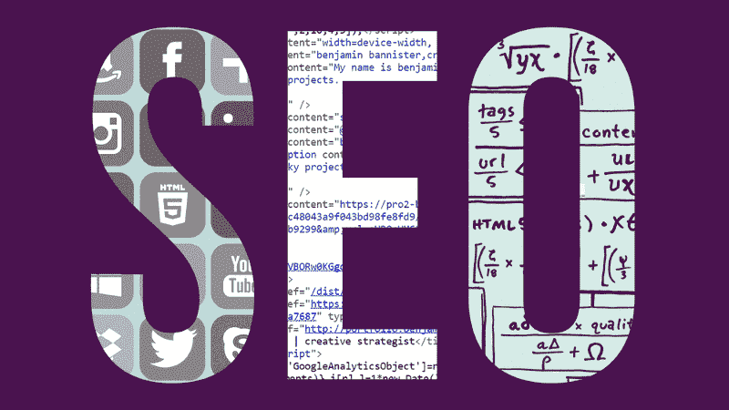
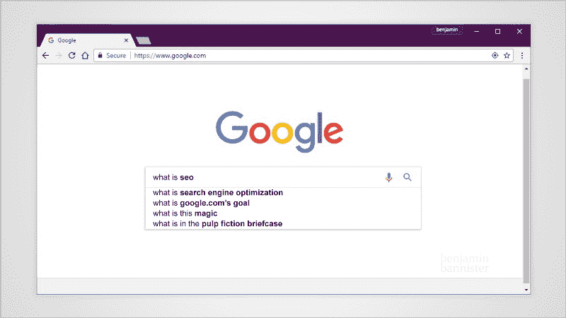
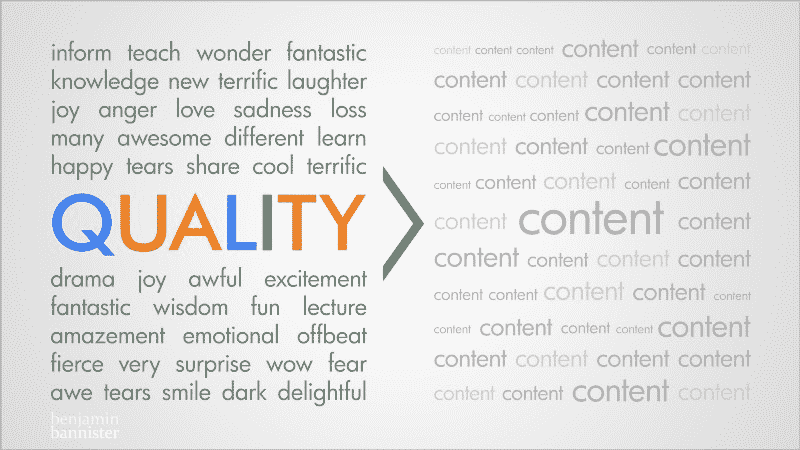
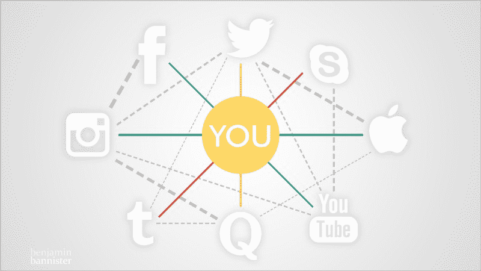
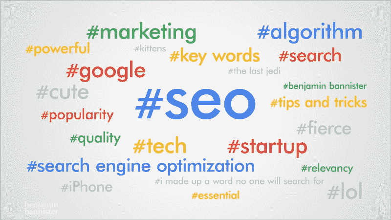
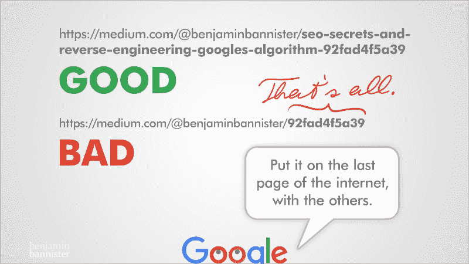
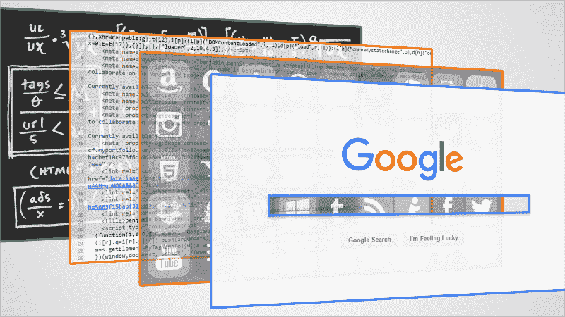

# 搜索引擎优化的秘密:逆向工程谷歌的算法

> 原文：<https://www.freecodecamp.org/news/seo-secrets-reverse-engineering-googles-algorithm-92fad4f5a39/>

本杰明·班尼斯特

# 搜索引擎优化的秘密:逆向工程谷歌的算法

**SEO. Three letters to know if you want your content found.** Image: [benjamin bannister](http://www.benjaminbannister.com/)

我从为互联网创造内容中学到了什么？有一点非常清楚:如果你想让人们发现你的作品，你需要搜索引擎优化(SEO)。

以这篇文章为例，如果你搜索“[逆向工程谷歌](https://www.google.com/search?q=reverse+engineer+Google&oq=reverse+engineer+Google&aqs=chrome..69i57j69i60l3&sourceid=chrome&ie=UTF-8)、“ [seo 秘笈](https://www.google.com/search?q=seo+secrets&oq=seo+secrets&aqs=chrome..69i57j69i60l3&sourceid=chrome&ie=UTF-8)、“[逆向工程 seo](https://www.google.com/search?q=reverse+engineering+seo&oq=reverse+engineering+seo&aqs=chrome..69i57j69i60l3&sourceid=chrome&ie=UTF-8) ”，这篇文章会出现在每一个搜索词的第一页。说说 meta。

SEO 不是魔术，而是知道该做什么。

无论你是 SEO 新手还是经验丰富的从业者，我都鼓励你*完整地*阅读这篇文章，了解如何让你的内容排在搜索结果的前面。这意味着作为一个坚实的基础搜索引擎优化。有许多要点需要讨论和处理，我将用简单的英语提取信息。

加入我，让我们深入研究谷歌搜索引擎程序员的思维，逆向工程他们是如何分析、判断和排列内容的。我们将通过直觉和逻辑的结合来做到这一点，而不一定是经验分析。

> "直觉是一种非常强大的东西，在我看来，它比智力更强大."— [史蒂夫·乔布斯](http://www.nytimes.com/2011/10/30/opinion/sunday/steve-jobss-genius.html)

试图利用这些信息欺骗谷歌的算法只会适得其反，因为作为一名工程师，我会这么做(*斯莱特林减去 30 分！*)。

**What *is* SEO?** Image: [benjamin bannister](http://www.benjaminbannister.com/)

先说一个本质问题:**SEO 是什么？**

> “SEO(搜索引擎优化)是影响网站/网页在网络搜索引擎的免费结果中的可见性的过程。”— [维基百科](https://en.wikipedia.org/wiki/Search_engine_optimization)

翻译:SEO 是所有你必须做的事情，让你的网站在搜索结果中排名靠前，而不需要付费。

下一个问题:**Google . com 的目标是什么？**

> 谷歌的首要任务是确保搜索查询结果的准确性和相关性。

> 用户对搜索结果越满意，他们就越有可能继续回来，并保持对谷歌**的忠诚。**

想到 Google(必应，百度，Yandex 等。)作为图书管理员。他们在世界各地的图书馆(互联网)对许多书籍(网站)进行分类(索引)。他们的工作就是找到你要找的确切的(相关的)书。他们在这方面非常擅长，这也是谷歌在搜索领域排名第一的原因。

为了达到这一点，谷歌创建了一个复杂的算法(现在被称为**‘算法’**)，用绝密变量来判断网站，并根据它们的内容进行排名。

你是否曾经搜索过某样东西并找到了你想要的，然后开始了另一次搜索，在你可以输入三个字母之前，谷歌已经预测了你计划搜索的下一个东西？这就是算法的高明之处。它甚至可以根据你之前搜索的上下文来预测你想要什么！

伟大的搜索引擎优化遵循谷歌确定的指南*是让你的内容排名靠前的最佳实践。除非你在谷歌工作，否则没有人真正知道这些变量是什么。但是有一些线索可以推断它们可能是什么。*

*

**Quality content is worth more than quantity.** Image: [benjamin bannister](http://www.benjaminbannister.com/)* 

### *一、质量为王*

*你可能听说过，“内容为王。”如果你想一想，你可以制作你想要的所有内容，但它不会自动地使它变好。不，这里真正的词是*质量*。[质量为王](https://webmasters.googleblog.com/2011/05/more-guidance-on-building-high-quality.html)。这个概念应该是清晰的，根深蒂固的，应该是创作内容时的第一要务。*

> *“质量为王”是什么意思？*

***优质内容需要对你的观众有*价值*。**价值可以是很多东西。您的内容是否具有以下任何功能:*

*   *告知/教授观众(*知识**
*   *让观众笑/哭(*情感**
*   *展示新的/不同的东西(*发现**

*如果你的内容没有做这些事情中的一个或多个，那么你为什么还要尝试呢？从创造能提供价值和持久价值的东西开始。不是什么“使命宣言”页面，也不是什么“关于我们”页面。实际。质量。内容。你几乎可以 100%准确地跟踪这一页上的每一点，但是如果质量不行，那么祝你好运。*

> *如果你忘记了高质量的内容是重中之重，那么你可以忘记有一个搜索引擎优化战略。*

> *历史教训:在过去，互联网上充斥着“内容农场”这些网站获取高质量的内容，并把它们聚集在自己的充满广告的网站上，目的是获得流量、赚钱和登顶搜索排名(现在仍然如此)。*

> *质量仍然排在第一位，现在唯一的区别是算法偏向于最初的*创作者*，他们的作品理所应当地显示在第一位。***

**谷歌喜欢提供有价值的搜索结果。无论是教程视频、有趣的文章，还是令人惊叹的照片系列，都有可能创造出有益于你的品牌底线的高质量的东西，并且，有益于你的观众。双赢。**

### **IIa。谁在分享？**

**优质内容带来人气，进而带来分享(也称链接或反向链接)。 ***谁**有多少*人链接/分享你的内容，都是 SEO 变量:****

*   **专家:在他们的领域里可信且知识渊博的人**
*   **名人:好莱坞/音乐/体育名人(有偿或无偿)**
*   **有影响力的人:拥有大量追随者的人**
*   ***社交媒体:*大众在线**
*   **你的朋友、家人和你认识的人**

**让人们分享你的内容是你无法控制的事情。你可以也应该要求(或付钱)上面的人链接/分享，但是对算法来说最好的事情是让它被有机地分享。这意味着**通过口碑**成长。要做到这一点，你需要从高质量的内容开始。(营销预算有助于宣传。)**

> **如果谷歌看到很多人分享你的内容，它认为这是潜在的质量。**

### **联合调查局。分享者与你的内容相关吗？**

**分享的第二部分是:你的帖子被相关网站分享了吗？你关于“设计的未来”的视频被设计师和创意人分享了吗？你的文章是关于“癌症的一种可能的治疗方法”，被医生和医疗行业的既定机构分享吗？**

> **如果谷歌看到相关网站正在分享你的内容，它认为这可能是相关的。**

> **你有一个美食鉴赏家朋友和一个大学教授朋友。他们都推荐同一家新餐馆。你可能会听取两者的意见，但谁的意见会更有影响力呢？谁更相关？**

> **历史教训:旧的搜索引擎优化建议你连接网站，并与其他网站进行交易。诚然，一个大的合法网站链接到你可以提高你的排名，但是，它不会帮助你的相关性得分，如果链接的内容与分享它的网站无关。**

**抱歉，如果你的网站是关于小猫的，而你分享了某人制作烤西兰花的链接，反之亦然，作为谷歌，我会认为你们两个只是相互勾结，我会因为不相关从你们两个身上扣除一分。**

**显然，人和品牌共享所有类型的内容。那些有真实身份的人——他们了解自己，知道分享与他们所代表的相符的东西。如果你分享，保持它的相关性。**

**

**Crosslink your brand across platforms, but don’t link to empty content.** Image: [benjamin bannister](http://www.benjaminbannister.com/)** 

### **三。交联你的品牌**

**在你的品牌中显示相关性*的一个简单方法是通过交联。**如果你在几个网络上都有账户，并且想让谷歌知道他们都和你有关系，那就把他们连在一起。*****

> **例如:如果我有一个同名的 YouTube、Twitter 和 Behance 账户，即 BravoEcho，确保你的主网站 BravoEcho.com 有你的 YouTube、Twitter 和 Behance 账户的链接。对这些独立的网络进行同样的操作。**

> **这让谷歌知道 YouTube 上的 BravoEcho 与 Twitter 和 Behance 上的 BravoEcho 是一样的。让谷歌容易知道你是同一个实体。**

**我在这里只有一个警告:**如果你有空的内容**不要交叉链接。也就是说:如果你把你的脸书页面链接到你的 Twitter 页面，但是你的 Twitter 个人资料没有任何推文，那就是糟糕的 UX(用户体验)。如果你链接他们，确保你的平台有内容。**

**交联简单且易于实施。去做吧。**

**

**Choose accurate keywords in your content.** Image: [benjamin bannister](http://www.benjaminbannister.com/)** 

### **伊娃。关键词是女王**

**关键词，或搜索术语，是谷歌用来索引你的网站。虽然关键词不再像以前那样举足轻重，但它们仍然是必要的。**

**你在页面上选择的单词和关键词很重要。每一个。单身。词。**仅仅为了填充而用搜索词填充你的页面，对 Google** 没有影响也没有帮助(而且你会因为欺骗而被扣分，你知道我完全赞成扣分！).**

> **历史教训:"[关键词填充](https://support.google.com/webmasters/answer/66358?hl=en&ref_topic=6001971)"曾经是这样一件事，关键词在整个页面上令人作呕地反复出现，欺骗搜索引擎，让它认为因为一个网站有很多特定的词，所以这个网站一定是关于这些关键词的。不再是了。**

**一组重要的关键词是**你内容的标题。**标题必须实现多个目标:**

*   **简洁而*准确***
*   **有趣到足以点击**
*   **将单词兼作*搜索词***

**得到这三连胜并不容易。不要让这一点阻碍你获得一个好的标题，但一定要考虑到这一点。在你的标题中使用人们可能会搜索的关键词。**

> **例 1:我为这篇文章起了个艰难的名字。我本可以有一些简单而有效的东西，比如“人人都应该知道的 SEO 秘密”，或者“9 个强大而重要的 SEO 技巧”，但是 zzzZZZZZ，打盹。**

> **我可以选择一个“安全的”(clickbait)标题，就像其他 SEO 网站一样。但不，我想要不同的东西，不是逆势而为，而是最准确地代表内容的东西。(老实说，现在很难不用 clickbaity 来给事物命名！)**

**至于长度，对于标题的长短没有严格的规定。**你的内容标题要有需要的长度**(但不要做的太长)。**

> ***例 2:长技术职称需要长技术职称的我不能扣分。短标题如果描述内容准确我是不会扣分的。***

### **IVb。写一个准确的元描述**

**除了标题中的关键字，html 代码中还有[**meta*description***](https://support.google.com/webmasters/answer/79812?hl=en)标签。这些不同于 meta *标签。Google 和大多数搜索引擎都不使用 meta 标签进行索引(但是他们在某些上下文中使用它)。***

> **历史教训:就像关键字填充一样，网站过去常常用无数种相同的元标签来填充它们的代码，例如:“iPhone”、“最佳 iPhone”、“T1”iPhone X 等等。他们这样做了，即使内容与 iPhones 没有任何关系，目标是谷歌会认为:**

> **“哦，这个网站一定是关于 iPhones 的，因为它在标签和内容中提到了很多。”抱歉，没有。谷歌有聪明的程序员能立即看穿这一点。他们不使用元标签。**

**写出一个准确优化的元描述。这个描述标签可以让谷歌准确的索引你的页面。它不总是被使用，但是它是一个因素。请勿在此误导(*请勿！*)。如果你试图误导，它会在搜索排名中对你不利。因为为什么？因为我会这么做。**

**

**Always use custom URLs with keywords.** Image: [benjamin bannister](http://www.benjaminbannister.com/)** 

### **静脉注射。在自定义 URL 中使用关键字**

**这篇文章的网址是:
https://medium.com/@benjaminbannister/**SEO-秘笈-逆向工程-谷歌-算法-92fad4f5a39****

**以上是一个非常好的网址。它在标题中使用主要的关键词来加强主题和一致性。我将这个短语的重复限制在标题和自定义 URL 中。URL 越短，看起来就越不像是关键词填充，被某些网站自动截断的可能性就越小。**

**如果我的链接是:
https://medium.com/@benjaminbannister/**92 fad 4 F5 a39**，我会有问题**

**你看出区别了吗？第一个链接清楚地描述了内容，第二个是一些随机生成的链接。**

> **谷歌不会理解你的网址中有什么莫名其妙的数字和字母。让他们明白。**

> **提示:在命名网页链接和文件时，在单词之间使用破折号(-)。它帮助谷歌分离单词。即:website.com/your-cool-product.html.**

**总结一下关键词/元标签/网址:准确、有趣、可搜索。**

### **IVd。在命名图像时使用关键词**

**我喜欢尽可能地包含图片。你的图片的准确和相关的命名加强了你的内容，也成为谷歌图片搜索的索引。**

**每当我创建图形和保存图像时，我都确保文件名做多件事:**

*   **识别照片**
*   **具有一致的命名方案**
*   **有关键字**

**就像给你的内容命名标题一样，照片中有两件事很重要:文件的名称，以及你给它的标题(或者它周围的文字)。**

> ***例子:如果我在夏威夷拍了一张钻石头的照片，我大概会命名为“钻石头-夏威夷-本杰明-班尼斯特. jpg”，我也可以在里面加上“火山-凝灰岩-锥”的字样，但这也算关键词填充。我可以把它作为标题添加进去。***

> **如果我创作一个图形，我个人会附上我的名字。然而，如果文件名太长，我就把它去掉。**

**同样，相关性是关键。文件名和标题/周围的文字准确地代表图片是很重要的。**

> **注意:如果你发布到其他网站，他们可能会自动重命名你的图片。不要让那打扰你。保持命名文件的一致性。**

### **动词 （verb 的缩写）内容的深度和简洁很重要**

**你可以写一篇 300 字的文章，加入一些其他流行内容的链接，并最终登上排行榜榜首的日子已经一去不复返了。谷歌认为这是“单薄的内容”。“当你遇到他们时，你可能会意识到他们，因为他们让你想要更多。现在，更多的分数被给予有内容的内容。**

> **我想要一块厚的、多汁的、三分熟的肉来咀嚼，脂肪很少。那是个比喻。**

**这并不意味着每件事都必须是史诗般的长度。谷歌想要的是能给人们想要的东西的页面，而不是过长或降低用户体验的页面。**

> **例 1:如果有人在寻找一个技术术语的定义，不要花三段时间去寻找，直到你给它下了定义。定义这个词。你可以添加相关的单词和上下文示例，但是用户首先看到的应该是单词的定义。**

> **例 2:如果有人在研究“如何种植植物”，我希望第一页的文章都很简洁，有足够的深度来给出你想要的答案。**

**如果你写文章，读一遍又一遍，学会删除不必要的单词和句子。如果你做视频，删掉那些 ums 和 uhs，*直奔主题*。不要用不必要的填充物浪费人的时间；没人有时间做这个。每个创作者都喜欢自己的作品，但他们应该知道何时编辑自己。**

****人们不想要残羹剩饭或肥肉，给他们一份美味的瘦牛排或一口大小丰富的甜点，**无论哪种最能满足你的要求。**

### **不及物动词 UX(用户体验)是一个因素**

**一个设计良好、直观且易于使用的网站会因为制作得当而得到加分。如果你有混乱的导航，链接导致页面破损/丢失，导航需要更多的点击，那么这意味着你没有维护它或者雇佣一个合适的网站架构师。**

**UX 本身就是一个非常深入的话题。简单来说，拥有一个拥有伟大 UX 的网站就像拥有一把符合人体工程学的椅子。确保你的椅子使用起来舒适自然。 *我不该去想怎么用你的椅子*。**

**计算机上的优秀 UX 应该是类似的:看起来很好，使用起来很直观。如果你不能跳入一个新的系统，并像那样解决问题(打响指)，那么设计师没有把 UX 做好。**

### **七。限制广告和广告位置**

**好 UX 的另一部分是不被页面上的广告淹没。是的，企业和网站需要赚钱，他们通过广告来赚钱。这是必要的邪恶。**

**然而，当你把你的广告放在你的内容之间时，会造成两种情况:让观众误以为广告是内容的一部分；这让他们非常恼火(品牌忠诚度开始消失)。**

> ***注意:人们可以讨论放置看起来像好的设计美学内容的广告。在某种程度上，这很好。但是当你把广告夹在书面内容之间，让它看起来像是它的一部分，或者有一个巨大的图形广告横幅与实际内容无法区分时，你是在试图欺骗。谷歌怎么知道区别？谷歌知道。***

**然后，你的网站上有太多的广告，问题就变成了:“这是一页内容，还是一页广告？”**在给观众提供好内容的同时，还能赚到足够的钱来经营你的生意，这两者之间有一条微妙的界限。****

**最后，我们有广告与内容的比率。一段内容五个广告？(GTFO，负 15 分。)一个广告换一个段落？你很好。考虑编码广告，使其对内容数量做出*响应*(自动调整)。控制你的广告比率。**

**并且绝对不要在一个页面上自动播放视频广告(*减 10 分，拉文克劳*)。仅此而已。**

### **八。第一个公布的获胜**

**谷歌已经变得聪明起来，那些复制和粘贴流行内容(通常未经许可)到他们自己的网站上，希望获得流量和广告收入(如果你这样做，在生活中减去一百分)。当然，你会得到你的 AdSense 的钱，但你不会在结果中排名更高。**

**如果你创建的东西获得了 100 万的浏览量，而其他人分享了它并获得了 2000 万的浏览量(因为他们是一个更大的平台)，你的仍然会排名第一，因为:**

> **谷歌知道是谁先发布的*。***

**谢天谢地有时间戳。**最先发帖的人被认为是原始来源，**并且将依次排名更高。任何拥有相同内容的人都被认为是复制或分享了它，不管他们的数量是多少。“第一”可能不会立即生效，但随着时间的推移和收集到的数据越来越多，该算法将会修正方向。**

> ***举例:我写了“[为什么排版很重要——尤其是在奥斯卡](https://medium.freecodecamp.com/why-typography-matters-especially-at-the-oscars-f7b00e202f22)”这篇文章获得了数百万的浏览量，并在 [Vox](http://www.vox.com/first-person/2017/3/1/14777110/typography-oscars-2017) 、 [Good](https://www.good.is/articles/oscars-mistake-typography) 等大型平台上重新发布，甚至被[竹井乔治](https://www.facebook.com/georgehtakei/posts/1910923148937129)分享，但当你搜索“[排版奥斯卡](https://www.google.com/search?q=typography+oscars&ie=utf-8&oe=utf-8)”时，我最初的媒体文章排名第一(首先！)***

**如果你打算在几个平台上发布相同的内容，确保你发布到你希望你的观众去的主要网站，然后发布到其他网站。不用太担心有人抄袭你的内容，算法会整理出合适的层次。(此外，如果人们没有窃取你的内容，那么窃取就不够好。)**

> ***例:你有一个迪士尼人物的照片系列作为(插入名词)，并按顺序发布在 Behance、Tumblr 和 DeviantArt 上。随着时间的推移，这可能是谷歌对它们进行排序的顺序。***

### **九。持续制作内容**

****不断创造。**不必是每天，但足以给你的受众带来你和你的品牌的稳定流量。**谷歌想要新鲜的内容。**把这想象成超市把新牛奶放在旧牛奶后面。让人们知道你持续生产牛奶，而且很新鲜。**

> **例如:如果你写了“2016 年最佳笔记本电脑”你猜怎么着？“2017 年最佳笔记本电脑”将排在你的前面。**

**对我来说，我试图每月至少创作 1-2 次丰富、优质的内容。对你来说，这可能是一个不同的数字。**

**作为一个正在恢复的完美主义者，我强烈建议你只上传你的作品。它不必完美，在大多数平台上(除了视频)，你可以借鉴乔治·卢卡斯的，并不断编辑和完善(像我一样)。**

**如果你总是更新你的博客或网站，提供经过深入研究的内容，你应该期待排名的提高。零星发布的网站在排名定位上也会有同样的不规则性。**

**产生源源不断的新鲜内容。一旦你有了固定的时间表，就更容易保持。**

**

**Analyzing the layers of Google’s Algorithm.** Image: [benjamin bannister](http://www.benjaminbannister.com/)** 

### **总之…**

**强大的 SEO 的主要变量归结为:**

****内容的质量和深度**
**+**
**来自相关网站的链接/分享**
**+**
**人气**
**+**
**内容中的精准关键词、meta 标签、URL**
**+**
**原创来源**
**+**
**广告****

> **谷歌寻求提供高质量的内容来回答用户的询问。由许多可信网站链接和提供的内容增强了它在这个问题上的权威性。在正确的地方恰当地使用关键词的内容会让它在搜索引擎上被索引。**

**谷歌没有时间给那些在封面上说一件事(代码)，但最终却是另一件事(不相关)的书(网站)。不要误导谷歌。 ( [这里列出了你*不该*做的事情](https://support.google.com/webmasters/topic/6001971?hl=en&ref_topic=6001981)。)你不想在他们的黑名单上，这基本上意味着你不存在。**

**以上几点是搜索引擎优化最重要的变量。有些你能控制，有些你不能。如果你在所有方面都取得了成功，你就不必担心你的内容是否会出现在列表的顶部，它应该会自己有机地出现在那里(同样，营销预算也会有所帮助)。**

**无论谷歌调整或改进算法多少次，从[熊猫](https://googleblog.blogspot.com/2011/02/finding-more-high-quality-sites-in.html)到[企鹅](https://webmasters.googleblog.com/2016/09/penguin-is-now-part-of-our-core.html)到北极熊，这些逻辑和直观的核心 SEO 技巧应该永远不会过时。**

**要了解更多关于 SEO 的知识，请查看以下三个谷歌官方链接:**

**[https://www . Google . com/webmasters/docs/search-engine-optimization-starter-guide . pdf](https://www.google.com/webmasters/docs/search-engine-optimization-starter-guide.pdf)**

**[**谷歌搜索如何工作|搜索算法**](https://www.google.com/search/howsearchworks/algorithms/)
[*从分析你的搜索词到考虑你的位置等因素，看看谷歌搜索算法……*www.google.com](https://www.google.com/search/howsearchworks/algorithms/)[**官方谷歌站长中心博客**](https://webmasters.googleblog.com/)
[*搜索引擎(和 SEO)博客用提示和公告将你的网站或应用程序与谷歌搜索者连接起来……*webmasters.googleblog.com](https://webmasters.googleblog.com/)**

**你怎么想呢?你同意还是不同意？当谈到 SEO 时，我是否错过了什么应该是必不可少的东西？在评论中加入你的声音。**

> **请为这篇文章鼓掌、发微博、分享来表达你的支持，并关注我来发现新事物。**

**

[**benjaminbannister.com**](http://www.benjaminbannister.com/)** 

****本杰明·班尼斯特:****

*   **[iPhone X 的未来:从现实到荒谬](https://medium.com/@benjaminbannister/the-future-of-the-iphone-x-from-the-realistic-to-the-absurd-f33bee3288ea)**
*   **苹果 MacPad Pro 会是什么样子？**
*   **[为什么排版很重要——尤其是在奥斯卡颁奖典礼上](https://medium.freecodecamp.com/why-typography-matters-especially-at-the-oscars-f7b00e202f22)**