# 首尔自行车:我如何重新设计首尔市的公共自行车系统

> 原文：<https://www.freecodecamp.org/news/seoul-bike-case-study-6ac4172f7188/>

马丁·托特夫

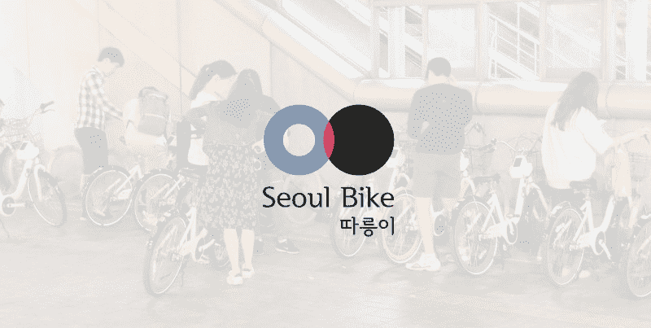

# 首尔自行车:我如何重新设计首尔市的公共自行车系统

#### 对当前应用程序的失望促使我创建了我的第一个 UX 案例研究。

作为 UX 设计的初学者，一个学习新事物的好方法是通过实践。这个案例研究是开启我旅程的绝佳机会。带着这个目标，我联系了一位在该领域有丰富工作经验的大学毕业生，请求他的帮助和指导。

一个星期天，我们在首尔某处的一家咖啡馆相遇，然后开始工作。我带着我的旧三星笔记本电脑(最终换成了 Macbook)和一个小笔记本参加了我们的第一次会面。

我画了几个星期的草图，试图理解这个应用程序和服务是如何设计的。我发现问题源于服务本身，其他问题源于应用程序设计。但是我们不要偏离这篇文章的主题。

### 什么是“首尔自行车”？

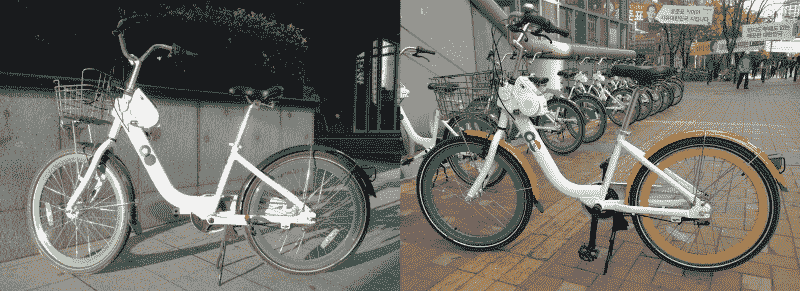

1st generation(left) and a 2nd generation Seoul Bike(right), a [gift from the Dutch embassy to Seoul City](https://www.dutchcycling.nl/news/140-dutch-prime-minister-donates-bikes-to-seoul).

首尔自行车是一种无人驾驶的自行车租赁系统。如题所示，这是一个覆盖首尔的非常便宜的公共自行车系统。该系统的覆盖范围和在不同于租车地点归还自行车的能力，是其相对于竞争对手的最大优势。首尔自行车目前正在经历一个非常快速增长的用户群。

有 3 代自行车看起来非常相似，很难区分。它们通常是由大公司捐赠的，但是关于捐赠人和捐赠数量的信息已经有一段时间没有更新了。三星去年捐赠了 3000 辆自行车，安装了 300 个自行车架。一些自行车是由 Naver、Kakao、友利银行甚至荷兰大使馆捐赠的。

这辆自行车相当简单。它有 3 个齿轮和一个专门为这些自行车制造的伸缩座椅——出于某种原因，自行车座椅盗窃仍然是一件事。有一个触摸屏用户界面，带有一个按钮和一个扬声器。还有一个锁定机制，用于将自行车锁定在首尔自行车架上，或者当你不得不离开一段时间时，将其临时锁定在杆子上。在骑行过程中，你可以检查你骑了多长时间，跑了多远，燃烧了多少卡路里。

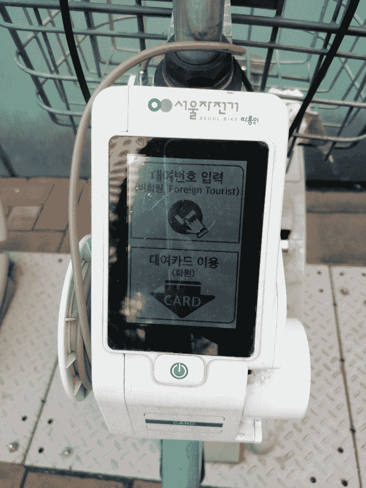

On-bicycle touch screen interface.

该服务使用在一定时间后过期的多次使用的“*票”*。这些“*”*票分为短期票和长期票。短期票是单日票，价格为*1000 韩元，购买后 24 小时内*到期。长期票包括 *7 天(3000 韩元)*、 *30 天(5000 韩元)*、 *180 天(15000 韩元)*和一张 *365 天(30000 韩元)*。

为了防止自行车囤积，允许用户租用的默认时间量是 1 小时(普通票)或 2 小时(高级票)。如果你超过 1 小时(或 2 小时，如果是高级票),每小时罚款 1000 韩元。在归还自行车时，使用者必须在再次租赁前先支付罚款。这种囤积预防方案相当有效。

正如我提到的，一张票有多种用途——所以用户可以随时将自行车归还给行李架，然后再次租用。因此，自行车囤积仍然是可能的，只要附近有一个货架，你有心情上下。

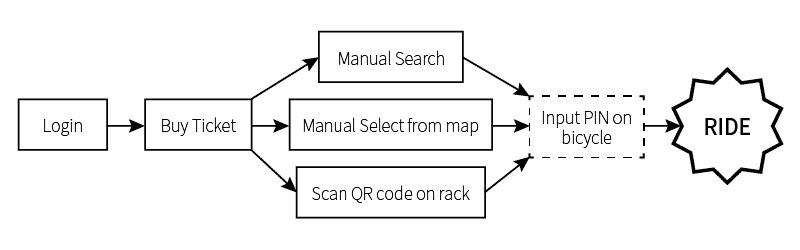

Solid Line: in-app; Dashed Line: on-bicycle interface.

租赁过程只能通过一个移动应用程序来完成，直到最近，这个应用程序还只适用于安卓系统。这里出现了一些问题——应用程序过于复杂，整个用户流程中断，充满了错位的资产。例如，为什么主屏幕上有一个后退按钮？回到哪里？为什么应用程序缺少重要的通知和信息？

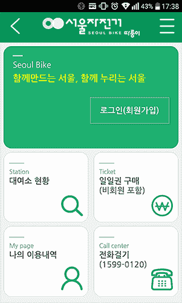

The first screen you see when you open the app.

让我们从主页开始。当你第一次启动应用程序时，欢迎你的页面非常简单。你有一个*登录按钮*，一个*站点按钮*，它会带你到标有自行车架位置和可用自行车数量的地图上。无法从该页面进行租赁。然后还有一个*购票按钮*和一个*我的页面按钮*包含你的乘车信息。还有一个*呼叫中心按钮*，当你需要帮助时使用。

你可能已经注意到了屏幕左上方的*后退按钮*。一个让你无路可走的按钮。右侧的*汉堡菜单按钮*迫使菜单从屏幕左侧弹出。为什么？

### 注册

当前的设计要求用户登录并继续服务。它可以选择记住你的用户名和密码。但是在关闭应用程序时，用户被注销，创建了这个强制的*登录页面*tap——这可能会很麻烦，尤其是如果你赶时间的话。登录屏幕应该是一个手机应用程序的一次性体验。毕竟，手机是一种很少无人看管的个人设备。

该应用程序本身不存储信用卡信息和其他必须通过强制自动注销来保护的敏感数据。通过重新设计的体验，这种敏感数据将受到密码提示的保护。这将为不受欢迎的第三方提供额外的保护。

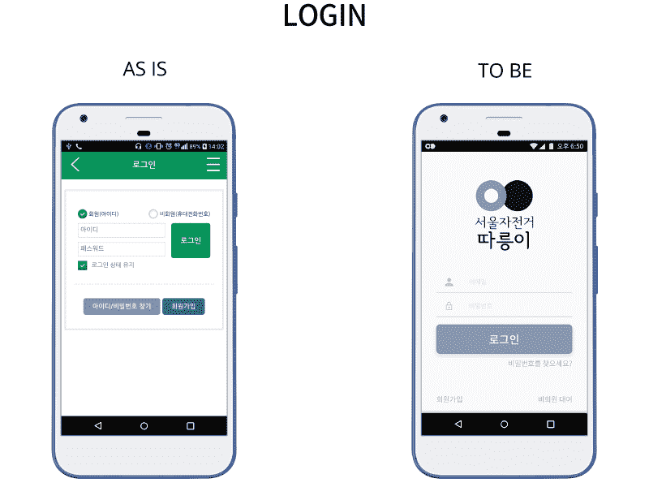

Once logged in on a device, the profile is stored in the device (e.g. Facebook, Daum, Twitter etc.)

### 主要的

**首尔自行车**是一项提供交通工具租赁的服务。因此，用户首先应该看到的是一张地图，上面标明了他可以租赁的地点。只需看一眼屏幕，用户就可以看到当前选择的机架和附近的其他机架。可用的和不可用的应该很容易区分。像 [***【索卡】***](https://www.socar.kr/) 和 [***绿色汽车***](http://www.greencar.co.kr/) 这样的租车应用向用户展示一张你附近位置的地图。

我在使用该服务一整年后注意到的一个主要问题是，许多用户倾向于租用离他们太远的自行车。这使得货架上的人无法使用该服务。目前，如果你租了一辆自行车，但没有在 5 分钟内从行李架上解锁，租金将自动取消。对于休闲骑行来说，等待 5 分钟不是什么大问题(在当前快节奏的生活方式中，没有人喜欢等待)。但是对于那些早上开始上班的人来说，等待 5 分钟并不是一个选择。

为了防止这种情况发生，我设计了利用移动设备位置跟踪的服务。这将查看用户是否在他打算租用的机架的 100 米范围内。现代移动设备中的普通 GPS 精度约为 50 米，在我看来，100 米是 GPS 的安全距离。100 米的距离意味着用户可以看到机架，如果没有东西挡道，只需要几秒钟就可以接近它。

GPS 数据可以用来分析用户如何骑自行车，什么时候是高峰时间，以及在什么时间需要管理哪些区域，从而改善服务。目前没有这样的数据，也没有对其进行分析，一些自行车是早晨通勤一部分的地区也没有得到适当的管理。

这些数据对市政府本身来说可能是一个很好的信息来源。对于一个人口过剩和交通问题日益严重的城市来说，这可能是必不可少的。一个负担得起和可靠的自行车网络可以缓解其他公共交通方式，这是首尔市需要集中精力的事情。

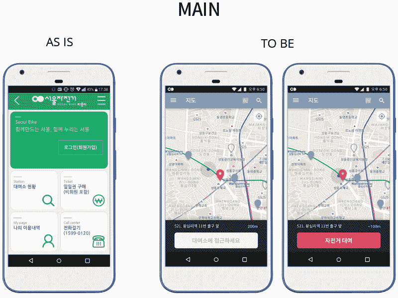

The main screen contains other rent option wit just a click of a button.

app 里有目前使用的手动选项，比如手动搜索和二维码扫描。在 GPS 出错或用户位置不可用的情况下，它们非常有用。用户可以随时通过货架的唯一编号或名称来搜索货架，或者扫描贴在货架上的二维码来使用这项服务。这些模式只需在顶栏上点击一下即可切换。搜索屏幕还包含用户个性化设置的您最喜爱的位置。

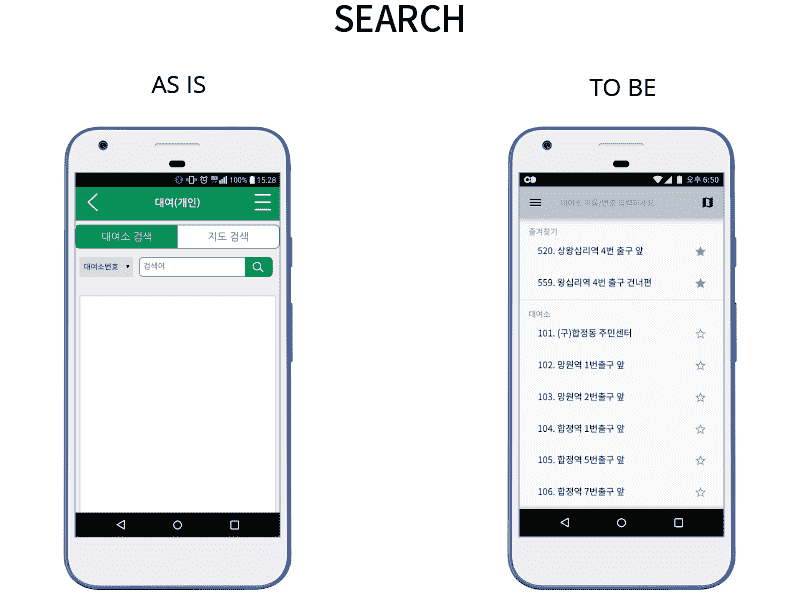

### 通知

通常当我很匆忙的时候，我会时不时地得到一个非常不想要的惊喜。自行车上的扬声器发出“你没有票，先买一张再试一次”的信息。有时当我最需要自行车的时候，我家附近的自行车架上却没有。我不喜欢惊喜，但还是很惊喜。

为了防止此类事件，应该通过非侵入式推送通知来显示一些重要信息。例如，当前最喜欢的货架上的自行车数量，当前骑行的剩余时间，以及即将到期的车票。用户需要选择特定的时间范围，以使功能发挥作用。这是为了减少服务器上来自持续更新请求和移动数据使用的负载。

让我们想象一个叫佐伊的人。佐伊住的地方没有直达她每天去的地铁站的公共汽车。步行距离约为 14 分钟，但骑首尔自行车，她可以在 5 分钟内到达。随着自行车越来越受欢迎，她经常被迫匆忙行走，因为货架上没有自行车。

通过此功能，她可以将最近的自行车架添加到收藏夹中。接下来，她从应用程序设置中打开*架状态的*通知*。*从 08:00 到 08:20，她获得了那里有多少辆自行车的最新信息。这将有助于她提前计划，如果她需要步行到地铁站，早一点离开。

### 汉堡菜单

“汉堡”菜单就像应用程序的地图，它可以轻松地将一个人从 A 点带到 B 点。通过将特征分组，用户可以容易地记住它们在屏幕上的位置。作为应用程序的中心十字路口，它可以用来通知用户重要的信息。

目前的应用程序最令人不安的一个方面是很难找到你目前的机票还剩多少时间。这是应该显示在代理位置的东西，将用户从应用程序的 A 点带到 B 点。在我的设计中，这个位置是旁边的“汉堡”菜单。它包括当前票证状态的实时信息，不需要用户进入特殊页面即可查看。

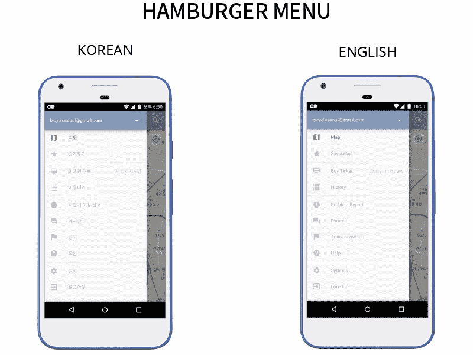

English language support for foreign visitors and expats who do not speak Korean.

### 支付

该应用程序的另一个令人沮丧的方面是机票支付阶段。韩国，尤其是政府运营的在线服务，对安全性非常着迷。他们中的大多数人使用一种充满愤怒的支付方式。有 Active X，手机认证(有时是几次)和一大堆其他步骤，只是为了花 5000 韩元买个东西。

因为付款阶段让我无语而放弃网购东西的次数我都数不清了。支付过程应该既安全又快捷，因此“购票”页面需要一个新的模型。[***Kakao Pay***或](http://www.kakao.com/kakaopay/)[***Naver Pay***](http://www.kakao.com/kakaopay/)都是出色的支付服务，让支付变得简单快捷，而这款 app 正需要这样的服务。

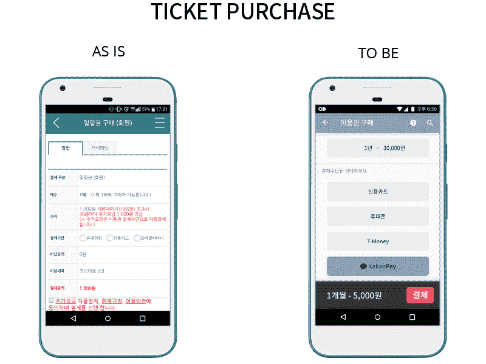

Less complication was the main target when designing this page.

有了[***Kakao Pay***或](http://www.kakao.com/kakaopay/)[***Naver Pay***](http://www.kakao.com/kakaopay/)的协作，整个支付过程可以大大简化。这将成为一种更愉快的体验，而不是一种让用户远离服务的可怕体验，有时甚至不允许外国人付费。老实说，情况确实有所好转，但仍有局限性。

### 问题报告

维护一个不断扩大的自行车库需要大量的劳动力，这可能超出了地方政府的预算。有问题的自行车可以通过用户报告来解决，而不是大量的劳动力。

目前，该应用程序只有一个呼叫中心，你可以在那里寻求帮助或报告你的自行车或任何其他自行车的问题。由于这项服务的规模和建设方式，没有办法追踪自行车何时抛锚。如果一辆自行车在我使用时坏了，我可以把它放回架子上，让它一直坏着。下一个用户可以报告它，但是没有必要麻烦地去报告它。首尔自行车需要设计一个基于奖励的系统。

不幸的是，我找不到任何使用统计数据。但这项服务的用户群不断增长，我在日常通勤中注意到了更多有问题的自行车。

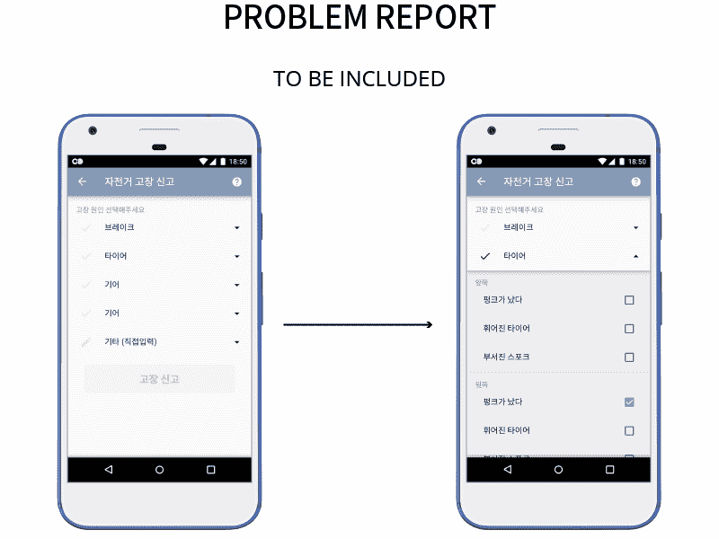

最常见问题的分类简化了页面。这不仅对最终用户来说很容易，对工程师来说也更容易记录和区分任务的优先级。在每个主要类别下，都有更详细的选项，如爆胎、车轮弯曲或钉子等。如果问题不属于这些类别，或者如果您想向工程师解释一些额外的事情，在“其他”选项卡下有一个消息选项。

### P.S .为什么从绿色变成蓝色和红色？

I will Seoul You!

首尔市去年进行了一次极具争议的品牌重塑。但市政府提供的服务和品牌之间缺乏统一。我明白了为什么应用程序和标志的当前颜色是绿色——自行车=环保，环保=绿色。我认为，当某种东西被贴上环保的标签时，我们应该停止过度使用绿色。

首尔在重塑自身品牌方面投入了大量资金，他们的服务品牌需要保持一致。所以我选择了使用“**I****首尔****U**中使用的两种颜色的衍生色。稍微调整一下城市品牌的蓝色和红色，就可以创造出很好的对比——白色和黑色以及几乎所有的灰色。因此，即使对于色盲的人来说，创建颜色层次也变得更加容易。

可用性是我的主要关注点，这两种颜色最适合这种设计，同时还保持了与首尔品牌的一致性。

The logo that set the Korean design community on fire.

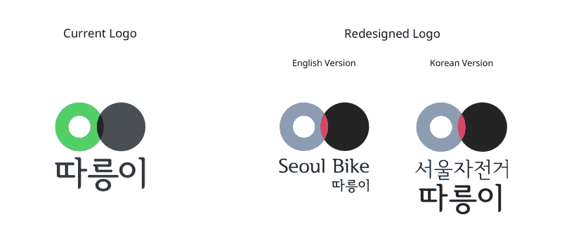

Brand consistency is something that should be enforced throughout all Seoul City services.

### 免费 UI 套件

在业余时间做了这个项目后，我受到两个人的启发，将这个文件作为 UI 工具包发布。其他人现在可以将这些资源用于他们自己的设计。我的一个大学朋友是我的灵感来源之一，他花了 2 年时间创造了一个韩文字体(釜山 Bada/부산바다체)并免费发布了它。

另一个灵感是 [*开彩*](https://yeun.github.io/open-color/) 的创作者和她在 [*设计台播客*](http://itun.es/kr/i6TOib.c) (郎:韩语)上的采访。她对开放源码项目的观点真的很鼓舞人心。

此外，几周前，Bohemian Coding 的团队发布了 Sketch v47 和*库*函数——将符号带到了一个全新的水平。因此，通过与世界分享我的草图文件，我希望我可以用我制作的一些资产来帮助别人。

这个项目是为 Android 设备设计的，因此所有的资产都受到谷歌材料设计的启发。但以后打算用 iOS cantered 设计更新文件(不能保证一定会做到！).我放在一起的符号和按钮是免费使用的。因此，请随意将它们包含在您的草图库中！

### 点击下载免费的 UI 套件[。](https://martintotev.github.io/uikit.html)

要预览文件中的一些符号，请点击[此处](https://www.dropbox.com/sh/ttw5sz8nkr4cwol/AADZWctUBhCCRQ84S8VowrkAa?dl=0)。

这个 UI 套件对于个人和商业用途都是免费的。如果你在工作中使用这个工具包，请提出来。

**UI 设计本身是有版权的，所以请不要在 Dribble 或 Behance 上上传并声称是自己的。那真的不酷。就像真的不酷…**

### 干杯，继续创作！

你可以通过 [martintotev.github.io](http://martintotev.github.io) 找到我，在 twitter 上关注我 [@martintotevUX](https://twitter.com/martintotev89) 或者在 martintotev.github.io 给我发邮件

特别感谢*朴尚贤*成为我的导师，引导我进入 UX 设计。