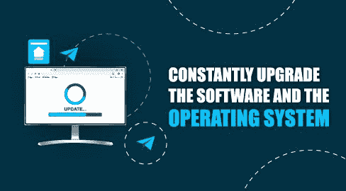
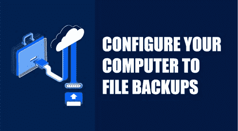
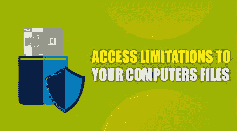
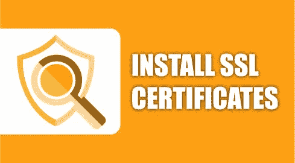
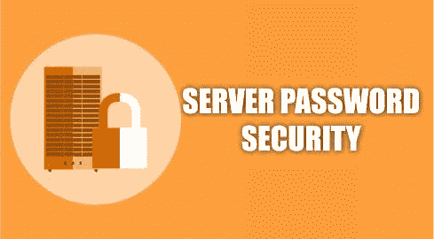
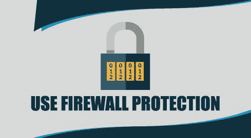

# 服务器安全提示–使用这些最佳实践来保护您的服务器

> 原文：<https://www.freecodecamp.org/news/server-security-tips/>

服务器在组织中扮演着至关重要的角色。它们的主要功能是提供数据和计算服务。

由于服务器的重要作用，它们保存着机密的组织数据和信息。现在的信息就像黄金，黑客就是淘金者。

不安全的服务器容易遭受各种安全威胁和数据泄露。

安全漏洞会导致关键数据的丢失或能力和控制的丧失，从而危及整个组织。

如果您不保护您的服务器，那么您将踏上一条危险的道路。

您可能不知道如何正确保护您的服务器。本文将解释一些可以用来保护服务器的服务器安全提示。

## **服务器安全最佳实践**

### 1.不断升级软件和操作系统

Constantly Upgrade the Software and the Operating System

在服务器安全方面，及时更新所有软件和操作系统相关的安全补丁至关重要。服务器系统和软件技术如此复杂，以至于它们携带的一些安全漏洞很容易被忽视。

因此，安全漏洞通常存在于旧的和新更新的软件版本中。此外，黑客总是试图开发新的和创新的方法来获得未经授权进入系统。

幸运的是，供应商和网络安全专家一直在努力确保他们的软件和操作系统尽可能安全。一旦他们发现一个安全漏洞，他们通常会迅速修复漏洞。

一旦完成，他们将发布一个更安全和升级版本的操作系统或软件。为了服务器的安全，一旦供应商测试并在市场上发布了更新，您应该立即安装更新。

尽管大多数供应商迅速采取措施解决安全漏洞，但在发现安全漏洞的时间、修复安全漏洞的时间和安装新更新的时间之间总是存在差距。

这种差距可以让黑客占上风，因为他们可以很容易地破坏你的服务器之前，你进行更新。

为了尽可能缩小这一差距，就服务器的安全性而言，请始终保持警惕，留意任何新的发展。您还应该注意您可以采取的即时措施，以确保您不受易受攻击软件的影响。

例如，卸载软件可能是必须要做的事情。最后，你应该在新的更新发布后马上安装它。安装安全的操作系统和软件版本有助于减少您的漏洞。

### 2.将您的计算机配置为文件备份

Configure Your Computer to File Backups

你应该总是保持一个文件备份，并有一个恢复策略。你永远不知道黑客什么时候会成功攻破你的服务器。

当这样的违规发生时，备份文件可能是你的救星。

定期备份数据可让您恢复数据泄露发生前服务器上的所有信息资源。

因此，为了您的数据，您应该确保您[定期进行数据备份](https://www.freecodecamp.org/news/it-security-and-data-backups/)。

制定备份计划时，请确保对以下内容进行全面分析:

*   备份计划的成本，
*   它的效率和速度，
*   数据泄露后恢复数据所需的工作，
*   备份过程的速度，以及
*   存储数据所需的磁盘空间量。

您还应该仔细考虑存储备份文件的位置。

您可以选择将文件保存在本地或云上，这是一种更安全的方法。

### 3.设置对计算机文件的访问限制

Access Limitations to Your Computers files

大多数操作系统会给用户指定访问权限的选项。为了您的服务器的安全，我建议您尽可能地严格限制。

用户可以指定对目录、网络、文件和其他服务器元素的访问权限。访问控制可以减少有意和无意的服务器安全漏洞。

例如，限制读取权限可以帮助您保护机密和私人信息。同样，限制谁可以修改文件和数据将有助于保持文件的完整性。

并非所有员工都应该被授予访问组织中所有资源的权限。应用最小特权原则是保护服务器的一个很好的方法。

那些与服务器资源没有业务关系或不需要服务器资源来满足其工作需求的人不应该访问这些资源。一些最严重的数据泄露事件是由组织内有权访问关键数据和信息的人组织和实施的。

威瑞森的一份 2019 年内部威胁报告将粗心和恶意的工人列为内部网络安全威胁的首要行为者。因此，限制访问有助于保护您的服务器免受内部攻击。

### 4.安装 SSL 证书

Install SSL Certificates

安全套接字层证书是保护互联网上两个系统之间通信的安全协议。

安全套接字层是服务器安全性的一个关键要素。您需要确保您的服务器和客户端浏览器或其他服务器之间的任何通信或数据传输都是加密的。

SSL 证书对传输中的数据进行加扰，以确保敏感和机密信息(如健康信息、信用卡信息和财务记录)的安全。成功访问数据的黑客无法破译其含义。

只有拥有正确的密钥来解密信息的预定接收人才会理解其含义。

除了对您的服务器和其他方之间的通信进行加密之外，SSL 证书在用户身份验证中也起着关键作用。

SSL 证书可以向特定的所有者认证不同的系统。因此，证书有助于建立你的权威。为了加强安全性，您应该获取并安装一个 SSL 证书。

### 5.使用虚拟专用网络(专用网络)

Use Virtual Private Networks (Private Networking)

专用网络基于互联网协议地址空间。VPN 被认为是私有的，因为没有被寻址的互联网协议分组通过公共网络传输。

VPN 将允许您在位于不同位置的不同计算机设备之间建立连接。它让您能够以安全的方式在服务器上执行操作。

您可以在同一帐户上与其他服务器交换信息，而不会受到外界的影响。为了确保你的服务器安全，你应该设置一个[虚拟专用网](https://www.freecodecamp.org/news/what-does-a-vpn-do-and-how-does-it-work-a-guide-to-virtual-private-networks/)。

### 6.服务器密码安全性

Server Password Security

当涉及到服务器安全时，请确保使用密码最佳实践。第一步是制定所有使用服务器的成员都应该遵守的明确的密码策略和规则。

您应该强制执行密码的最小字符长度，设置密码复杂性准则，为不活动启用会话超时，并使用多因素身份验证策略。

有一个明确的密码过期策略也很有用。密码应该只允许持续几周或几个月。最好鼓励所有用户[实施安全密码](https://www.freecodecamp.org/news/actually-secure-passwords/)存储，以避免密码落入不安全的人手中。

### 7.使用防火墙保护

Use Firewall Protection

防火墙是确保您的服务器安全的必备工具。它们过滤传入和传出的流量，只允许特定的服务，并锁定不安全的服务。

防火墙有几种不同的分类。第一组处理互联网上任何人匿名访问的公共服务。第二个是一组选定的授权帐户可以访问的私人服务。最后是不需要向外界公开的内部服务。

您应该根据哪一组适合这种情况来限制对这些服务的访问。您应该将您的服务器配置为拒绝所有访问，除了那些对您的服务器强制的访问。

## 总结

在阅读了本文并实现了我解释的服务器安全措施之后，您应该对服务器的安全性更有信心了。

作为最佳实践，您应该在首次设置服务器时实施这些安全措施。如果你实施了一个以上的措施，也会有所帮助。一般来说，安全措施越多，服务器就越安全。