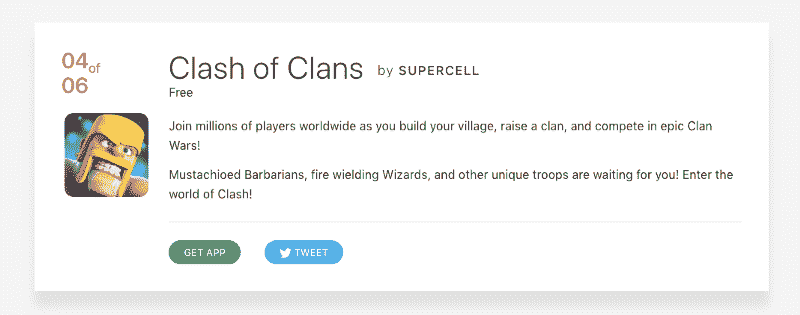
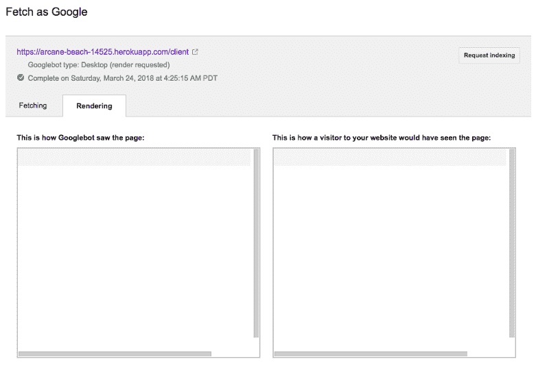
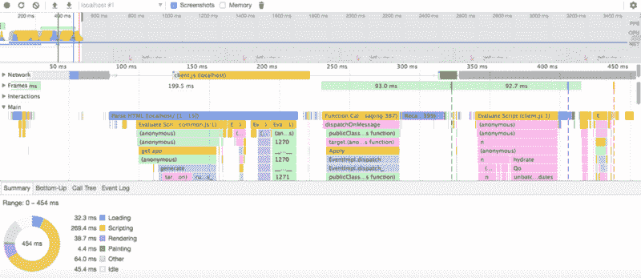
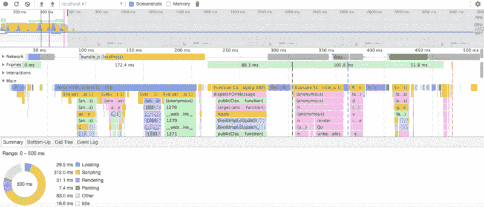

# 如何通过三个简单的步骤在 React 应用中实现服务器端渲染

> 原文：<https://www.freecodecamp.org/news/server-side-rendering-your-react-app-in-three-simple-steps-7a82b95db82e/>



作者 Rohit Kumar

这是我们将在本教程中构建的:一个像这样的漂亮的反应卡。


在本教程中，当用户或爬虫点击页面 URL 时，我们将使用服务器端呈现来传递 HTML 响应。我们将在客户端处理后面的请求。

我们为什么需要它？

让我引导你找到答案。

## 客户端渲染和服务器端渲染有什么区别？

在**客户端渲染中，**你的浏览器下载一个最小的 HTML 页面。它呈现 JavaScript 并向其中填充内容。

**服务器端渲染，**则在服务器端渲染 React 组件。输出是 HTML 内容。

你可以把这两者结合起来，创建一个同构的 app。

## 渲染的缺点会在服务器上产生反应

*   如果您的应用程序很小，SSR 可以提高性能。但是如果它太重，也会降低性能。
*   它增加了响应时间(如果服务器繁忙，情况会更糟)。
*   它增加了响应大小，这意味着页面需要更长的加载时间。
*   它增加了应用程序的复杂性。

## 什么时候应该使用服务器端渲染？

尽管 SSR 有这些后果，但在某些情况下，您可以也应该使用它。

### 1.搜索引擎优化

每个网站都想出现在搜索中。如果我错了，请纠正我。

不幸的是，搜索引擎爬虫还不理解/呈现 JavaScript。

这意味着他们看到的是一个空白页，不管你的网站有多有用。

许多人说谷歌的爬虫[现在呈现 JavaScript](https://www.searchenginejournal.com/googles-search-crawlers-natively-render-javascript-based-pages/226313/) 。

为了测试这一点，我在 Heroku 上部署了这个应用程序。以下是我在谷歌搜索控制台上看到的内容:



Google’s crawler does not render React

一张白纸。

这是我探索服务器端渲染的最大原因。尤其是当它是一个[基础页面](https://yoast.com/what-is-cornerstone-content/)时，比如登陆页面、博客等等。

要验证 Google 是否渲染了您的网站，请访问:

搜索控制台仪表板>抓取>获取为谷歌。为主页输入页面 URL 或留空。

选择“获取并渲染”。完成后，单击查看结果。

### 2.提高性能

在 SSR 中，应用程序的性能取决于服务器的资源和用户的网络速度。这使得它对于内容丰富的网站非常有用。

*比如*，说你有一部中等价位的手机，网速很慢。你试图访问一个下载了 4MB 数据的网站，然后你就可以看到任何东西了。

你能在 2-4 秒内看到屏幕上的任何东西吗？

你会再次访问那个网站吗？

我不认为你会。

另一个重大改进是在[第一次用户交互时间](https://developers.google.com/web/tools/lighthouse/audits/time-to-interactive)。这是从用户点击 URL 到他们看到内容的时间差。

下面是对比。我在开发 Mac 上测试了它。

#### 在服务器上渲染反应



SSR performance report (Chrome)

第一次交互时间 300ms。水合物在 400 毫秒后完成。负载事件大约在 500 毫秒后退出。你可以通过上面的图片看到这一点。

#### 客户端浏览器上呈现的反应



Client side performance report (Chrome)

第一次交互时间 400ms。加载事件在 470 毫秒时退出。

结果不言自明。这么小的应用程序，第一次用户交互时间相差 100 毫秒。

### 它是如何工作的？— (4 个简单的步骤)

*   在每次请求时创建一个新的 Redux 存储。
*   选择性地分派一些动作。
*   从商店中获取状态并执行 SSR。
*   将上一步中获得的状态与响应一起发送。

我们将使用响应中传递的状态在客户端创建初始状态。

在开始之前，[从 Github](https://github.com/Rohitkrops/ssr) 克隆/下载完整的示例，并用作参考。

### 通过设置我们的应用开始

首先，打开你最喜欢的编辑器和 shell。为应用程序创建一个新文件夹。我们开始吧。

```
npm init --yes
```

详细填写。创建`package.json`后，将下面的依赖项和脚本复制到其中。

通过运行以下命令安装所有依赖项:

```
npm install
```

您需要配置 Babel 和 webpack，我们的构建脚本才能工作。

Babel 将 ESM 和 react 转换成节点和浏览器可理解的代码。

创建一个新文件`.babelrc`并将下面的一行放入其中。

```
{
  "presets": ["@babel/env", "@babel/react"]
} 
```

webpack 将我们的应用程序及其依赖项捆绑到一个文件中。用下面的代码创建另一个文件`webpack.config.js` :

```
const path = require('path');module.exports = {
    entry: {
        client: './src/client.js',
        bundle: './src/bundle.js'
    },
    output: {
        path: path.resolve(__dirname, 'assets'),
        filename: "[name].js"
    },
    module: {
        rules: [
            { test: /\.js$/, exclude: /node_modules/, loader: "babel-loader" }
        ]
    }
}
```

构建过程输出的两个文件:

1.  `assets/bundle.js` —纯客户端 app。
2.  `assets/client.js`—SSR 的客户端伴侣。

`src/` 文件夹包含源代码。通天塔编译后的文件进入`views/`。`views`如果目录不存在，将自动创建。

### 为什么我们需要编译源文件？

原因是 ESM & CommonJS 之间的语法[差异。在编写 React 和 Redux 时，我们在所有文件中大量使用导入和导出。](http://jsmodules.io/cjs.html)

不幸的是，它们在 Node 中不起作用。巴贝尔来营救了。下面的脚本告诉 Babel 编译`src`目录中的所有文件，并将结果放入`views.`

```
"babel": "babel src -d views",
```

现在，节点可以运行它们。

### 复制预编码和静态文件

如果您已经克隆了存储库，请从中复制。否则 d [从 Dropbox](https://www.dropbox.com/s/2iijlivmlye6pqp/ssr-static.zip?dl=0) 下载 ssr-static.zip 文件。提取它，并将这三个文件夹保存在您的应用程序目录中。这是它们包含的内容。

1.  反应`App`和组件驻留在`src/components`中。
2.  还原`src/redux/`中的文件。
3.  `assets/ & media/`:包含`style.css`和图像等静态文件。

### 服务器端

在`src/`文件夹中创建两个名为`server.js`和`template.js`的新文件。

### 1.src/server.js

魔法在这里发生。这是你一直在寻找的代码。

```
import React from 'react';
import { renderToString } from 'react-dom/server';
import { Provider } from 'react-redux';
import configureStore from './redux/configureStore';
import App from './components/app';

module.exports = function render(initialState) {
  // Model the initial state  
  const store = configureStore(initialState);
  let content = renderToString(<Provider store={store} ><App /></Provider>);
  const preloadedState = store.getState();
  return {
    content,
    preloadedState
  };
};
```

我们不需要渲染我们的应用程序，而是需要将其包装成一个函数并导出。该函数接受应用程序的初始状态。

它是这样工作的。

1.  将`initialState`传递给`configureStore()`。`configureStore()`返回一个新的商店实例。将它保存在`store`变量中。
2.  调用`renderToString()`方法，提供我们的应用程序作为输入。它在服务器上呈现我们的应用程序，并返回生成的 HTML。现在，变量`content`存储 HTML。
3.  通过在`store`上调用`getState()`从 Redux Store 中获取状态。保持它在一个变量`preloadedState`。
4.  返回`content`和`preloadedState`。我们将把这些传递给我们的模板，以获得最终的 HTML 页面。

#### `2\. src/template.js`

`template.js`导出一个函数。它以`title`、`state`和`content`为输入。它将它们注入模板并返回最终的 HTML 文档。

为了传递状态，模板在一个`<scri` pt >标签内将`state`附加到`window.__STATE__`。

现在可以通过访问`window.__STATE__`在客户端读取`state`。

我们还将 SSR companion `assets/client.js`客户端应用程序包含在另一个脚本标签中。

如果您请求纯客户端版本，它只将`assets/bundle.js`放在脚本标签中。

### 客户端

客户端非常简单。

### 1.src/bundle.js

这就是如何编写 React 和 Redux `Provider`包装的方法。它是我们的纯客户端应用。这里没有诡计。

```
import React from 'react';
import { render } from 'react-dom';
import { Provider } from 'react-redux';
import configureStore from './redux/configureStore';
import App from './components/app';

const store = configureStore();
render(
  <Provider store={store} > <App /> </Provider>,
  document.querySelector('#app')
);
```

### 2.src/client.js

看着眼熟？是的，没有什么特别的，除了`window.__STATE__.`我们需要做的就是从`window.__STATE__`中获取初始状态，并把它作为初始状态传递给我们的`configureStore()`函数。

让我们来看看我们的新客户文件:

```
import React from 'react';
import { hydrate } from 'react-dom';
import { Provider } from 'react-redux';
import configureStore from './redux/configureStore';
import App from './components/app';

const state = window.__STATE__;
delete window.__STATE__;
const store = configureStore(state);
hydrate(
  <Provider store={store} > <App /> </Provider>,
  document.querySelector('#app')
);
```

让我们回顾一下变化:

1.  将`render()`替换为`hydrate()`。`[hydrate()](https://reactjs.org/docs/react-dom.html#hydrate)`与`render()`相同，但用于水合`[ReactDOMServer](https://reactjs.org/docs/react-dom-server.html)`渲染的元素。它确保服务器和客户端上的内容是相同的。
2.  从全局窗口对象`window.__STATE__`中读取状态。将其存储在一个变量中，并删除`window.__STATE__`。
3.  创建一个以`state`为初始状态的新商店。

这里都搞定了。

## 把所有的放在一起

### 索引. js

这是我们应用程序的入口点。它处理请求和模板。

它还声明了一个`initialState`变量。我已经用`assets/data.json` 文件中的数据模拟了它。我们将把它传递给我们的`ssr()`函数。

*注意:当从`src/`外的文件引用`src/`内的文件时，使用普通的`require()`，用`views/`代替`src/`。你知道原因(巴别塔编译)。*

按指定路线发送

1.  `/`:默认服务器渲染主页。
2.  `/client`:纯客户端渲染示例。
3.  `/exit`:服务器停止按钮。仅在开发中可用。

#### 构建和运行

是时候构建和运行我们的应用程序了。我们只用一行代码就可以做到。

```
npm run build && npm run start
```

现在，应用程序运行在 [http://localhost:3000](http://localhost:3000/) 。

### 准备好成为 React Pro 了吗？

我将从下周一开始一个新的系列，让你的反应技能马上燃烧起来。


subscription link below ?

### 感谢您阅读本文。

如果你喜欢并且觉得有用，就在[Twitter](http://twitter.com/rohitkrops)&[Webflow](http://bit.ly/2zVj1fX)上关注我吧。