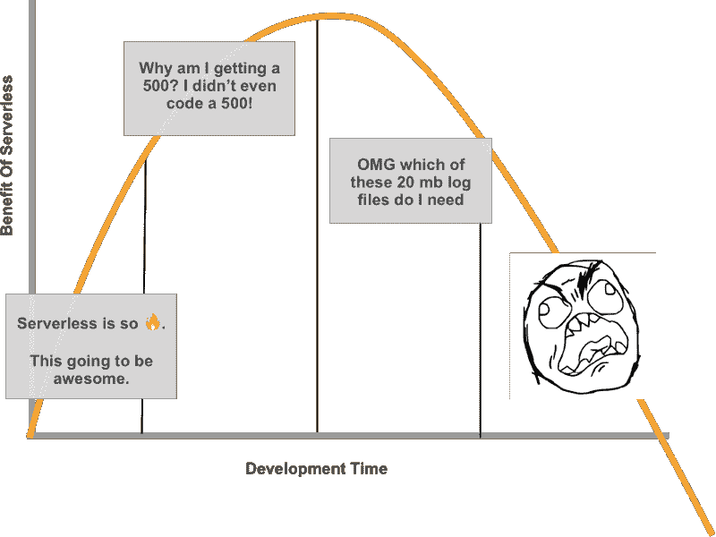
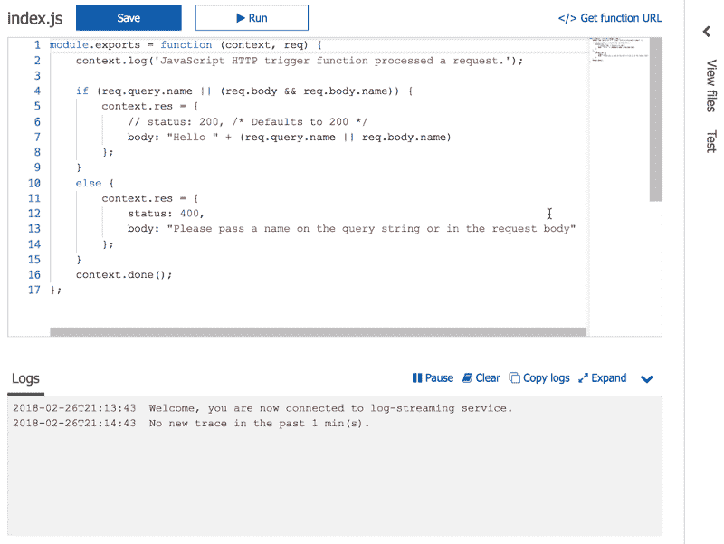
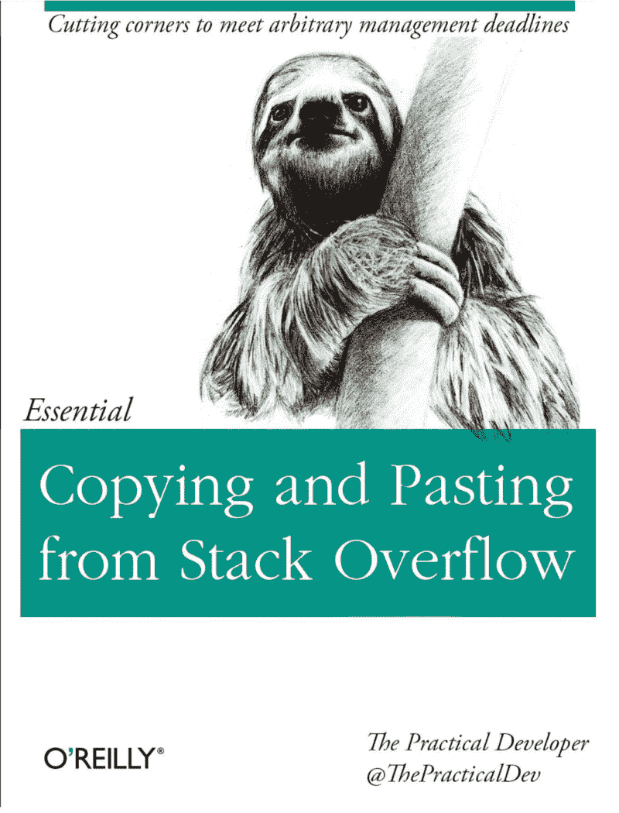
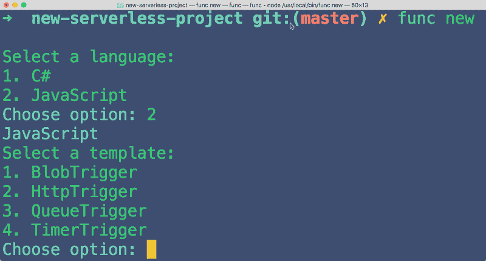
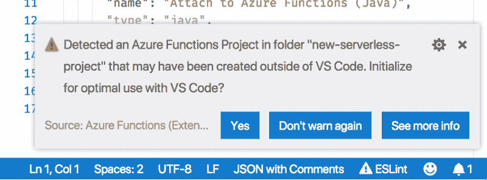
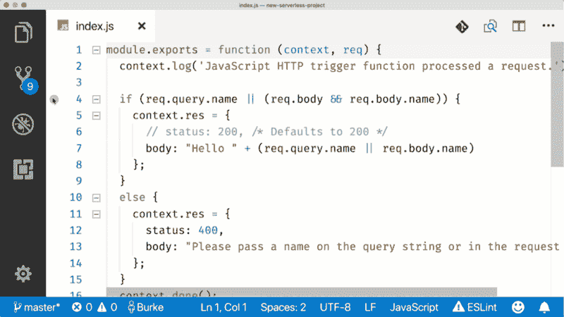
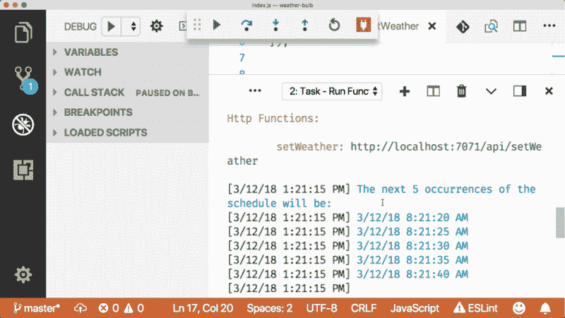
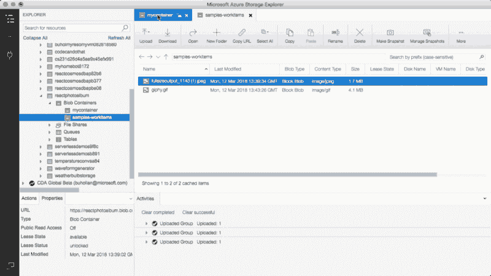

# 无服务器不一定是一个令人恼火的黑匣子

> 原文：<https://www.freecodecamp.org/news/serverless-doesnt-have-to-be-an-infuriating-black-box-b23cca2b2ba2/>

> “在科学、计算和工程中，**黑盒**是一种设备、系统或物体，可以根据其输入和输出(或[传递特性](https://en.wikipedia.org/wiki/Transfer_function))、**来查看，而无需了解其内部工作原理。**它的实现是“不透明”(黑色)。几乎任何东西都可以被称为黑匣子:一个[晶体管](https://en.wikipedia.org/wiki/Transistor)，一个[算法](https://en.wikipedia.org/wiki/Algorithm)，或者[人脑](https://en.wikipedia.org/wiki/Human_brain)。

> ——被我无耻地从维基百科上剽窃

几周前，我看了一部关于创伤性脑损伤的 HBO 纪录片(因为我已经老了，老年人都这样——我们看纪录片)。

在影片中，他们跟随四个从身体受伤引起的昏迷中醒来的人。所有的病人都处于不同的康复阶段。他们行动、说话甚至听觉能力有限。任何你需要你的大脑去做的事情都可能有用，也可能没用。这就是为什么当医生问这些病人中的一个，在他们出事之前是否有任何变化时，我感到震惊，他们说“**没有。**

他们不能走路，不能抬头——这两件事他们几个月前还能做，但他们的大脑无法处理任何变化。

这就是黑匣子的定义——数据进去了，但出来的不是我们所期望的。我们对此无能为力，因为你不能“调试”大脑。如果可以的话，我会在这里放一个断点，并找出为什么“啤酒和鸡翅”行每晚都执行。

debugger;

这就是为什么花了六个月的时间才弄清楚为什么同一个病人听不见。**六个月**。他们所能做的就是尝试不同的事情，直到某件事可行或不可行，他们可以缩小范围。

都是试错。对于大脑受伤的人来说，大部分恢复过程都是这样的:一遍又一遍地尝试不同的输入，直到有东西起作用。遗憾的是，这正是目前无服务器开发的进度。

#### 无服务器的悲伤

无服务器的现状很像人类的大脑。这是一项很酷的技术，但它的内部结构对开发者来说是模糊的，我们只能对实际发生的事情进行有根据的猜测。

这是一种非常困难的构建应用程序的方式，几乎难以抵消无服务器提供的任何成本优势。

> “我的无服务器功能每月仅花费我 1 美元！我花了 6 个月才建成，但你看它多便宜！”

我制作了这个非常科学和有用的图表来形象化无服务器在开发过程中的成本/收益。

出现这种情况的部分原因是，无服务器的全部意义在于抽象出运行时——它是抽象堆栈的下一步。当你抽象的时候，你会失去一些控制。

但是我们喜欢抽象。

JavaScript 是一种抽象，最终作为机器码执行。这意味着我们失去了对内存管理等事情的控制，但哈哈哈哈哈没人在乎，因为，JavaScript。

在无服务器的情况下，将抽象移到云中的某个地方是很好的，但是我们需要在开发时访问该抽象。大多数无服务器提供商提供在线编辑器作为开发的主要界面。这很酷，但是你不能在在线编辑器中构建服务器应用程序，因为你不能访问服务器。这就是谚语中的盒子。

让我换个说法:我们喜欢抽象，直到我们不喜欢为止。

#### 当我们不喜欢抽象概念时

让我们从基本的无服务器体验开始。

如果你想用 Azure Functions 之类的东西创建一个新的无服务器项目，你会陷入在线编辑器的体验。

这很方便。没有什么比直接开始写代码更好的了。或者如果你是我，“从堆栈溢出复制粘贴。”

你甚至可以在线测试这个功能。总的来说，这是一个很好的第一次经历。

然而，这有严重的局限性。如果我们想安装一个节点包呢？不知道是哪一个，大概是`left-pad`。你是怎么做到的？我们不能在文件之间快速切换。我们不能 lint 代码，我们肯定不能添加任何断点。

现在，任何认真对待无服务器的人(或者只是为了这个问题而构建任何东西)都不会把在线编辑器的体验看得太重。要建立任何重要的东西，我们需要在当地发展。

#### 本地无服务器开发

大多数无服务器提供商提供某种本地开发体验。这通常是通过给用户提供一个模拟器来实现的。这不是最终的运行时，这意味着你必须对你不知道的事情做一些假设。

例如，您可以使用一个简单的节点 web 服务器在本地开发一个无服务器的功能，但是这很可能不是您的代码在生产中被调用的方式。这意味着输入，甚至可能是函数的整个上下文都可能…部署时会有所不同。

Azure Functions 对此的处理略有不同。他们给你的不是本地开发的仿真器，而是运行时。没错，你得到了整个盒子。

### 使用 Azure 函数进行本地开发

当你安装 Azure 功能核心工具时，你安装的是 Azure 使用的相同的运行时。因为您获得了整个运行时，所以您可以在本地构建任何类型的函数。不仅仅是 HTTP 触发器。

请注意，您也可以使用 Blob 和 Queue 触发器。如果你把一个文件放到 Azure Blob 存储中，你的本地函数就会被触发。如果你把一个消息放到 Azure 消息队列中，你的本地函数就会触发。这很好，因为否则，你怎么测试博客或队列触发器呢？你不会的。你只会向云中的玛丽欢呼并祈祷。

万福玛利亚的唯一作品[亚伦罗杰斯](https://www.youtube.com/watch?v=r0vVqStvh_8)。这是连续两个足球参考，我很抱歉。你值得更好的。

如果使用 VS 代码，拥有完整的运行时也使得本地调试变得容易。微软制造这两种东西有点帮助。

#### 用 VS 代码调试无服务器函数

你可以为 VS 代码安装 [Azure Functions 扩展](https://cda.ms/hx)，它会自动启用本地函数调试。

这为 Azure 函数在 VS 代码中添加了一个新面板。你可以在这里看到所有不同的功能项目。

更重要的是，它添加了一个内置的启动配置，用于调试。如果你要在 VS 代码中打开一个 Azure Functions 项目，扩展会识别出来，并提示你设置这个项目以便与扩展一起使用。

这将调整您的项目，以便运行和调试该函数，在槽中放置一个断点，并点击调试面板中的绿色按钮。

在计时器触发器的情况下，您将获得 Azure Functions 使用的计时器，以及下一个预定的运行时间。

我已经提到了 blob 和队列触发器，但以防万一你像我一样“图片或它没有发生”…

#### 黑匣子是给脑外科医生用的

其实没有叫“脑外科医生”的工作。叫做神经外科医生，截止到 2015 年，[平均工资为每年 609639 美元](https://www.google.com/search?q=neurosurgeon+average+salary&stick=H4sIAAAAAAAAAOPgE-LQz9U3MM0wNdFSy0620s8uiM8p189ITcwpyYhPTixKTS2ySixLLUpMT40vTsxJLKoEAMCJ6NM0AAAA&sa=X&ved=0ahUKEwiL35So9-bZAhUO7lMKHXZLBIgQ6BMIngIoADAd&biw=1280&bih=1343)。是啊。说真的。

好吧，我不是脑外科医生，我敢肯定没有足够的钱整天摆弄黑匣子。无服务器有一个光明的未来，但只有当它提供同样的生产力，因为它的成本价值。如果你对这个等式有任何疑问，请参考本文中的图表。