# 如何利用无服务器架构提升性能

> 原文：<https://www.freecodecamp.org/news/serverless-image-preprocessing-using-aws-lambda-42d58e1183f5/>

作者:多梅尼科·安吉莱塔

# 如何利用无服务器架构提升性能


Photo by [Jesse Darland](https://unsplash.com/photos/cAQfkfLSA80?utm_source=unsplash&utm_medium=referral&utm_content=creditCopyText) on [Unsplash](https://unsplash.com/search/photos/perform?utm_source=unsplash&utm_medium=referral&utm_content=creditCopyText)

在这篇文章中，我将描述我如何将图像预处理这样的繁重任务从我的应用服务器转移到 AWS 上负责存储、处理和提供图像的完全无服务器架构。

#### 问题是

图像预处理是许多 web 应用程序需要的任务。每次应用程序允许用户上传图像时，很可能需要在将图像提供给前端应用程序之前对其进行预处理。

在这篇文章中，我将描述一个基于 AWS 的无服务器架构，这是非常可扩展和经济高效的。

但是让我们从头开始。在我最近的一个项目中，一个 marketplace web 应用程序，用户必须上传他们想要销售的产品的图像，原始图像首先被裁剪到正确的图像比例(4:3)。然后转换成前端应用不同位置使用的三种不同格式:800x600px、400x300px 和 200x150px。

作为一名 Ruby on Rails 开发人员，我的第一个方法是使用 RubyGem——特别是[回形针](https://github.com/thoughtbot/paperclip)或[蜻蜓](https://github.com/markevans/dragonfly)，它们都利用 [ImageMagick](https://www.imagemagick.org/script/index.php) 进行图像处理。

尽管这种实现非常简单(因为它主要只是配置)，但也可能出现不同的缺点:

1.  图像在应用服务器上处理。这可能会增加总体响应时间，因为 CPU 上的工作负载更大
2.  应用服务器的计算能力有限，这是预先设置的，不太适合处理突发请求。如果需要同时处理许多图像，服务器容量可能会在很长一段时间内耗尽。另一方面，增加计算能力会导致更高的成本。
3.  图像按顺序处理。同样，如果需要同时处理许多图像，速度可能会非常慢。
4.  如果没有正确配置，这些 gem 将处理过的图像保存在磁盘上，这可能会很快使您的服务器空间不足。

一般来说，根据应用程序的图像处理量，这种解决方案是不可伸缩的。

#### 解决方案

仔细看看图像预处理任务，您会注意到可能没有必要直接在应用服务器上运行它。特别是，如果您的图像变换总是相同的，并且不依赖于图像本身以外的其他信息，情况就更是如此。对我来说就是这样，我总是生成不同大小的图像，同时优化图像质量/重量。

一旦您意识到这个任务可以很容易地从应用程序逻辑的其余部分中分离出来，那么考虑一个无服务器的解决方案就很简单了，这个解决方案只是将原始图像作为输入并生成所有需要的转换。

事实证明，AWS Lambda 非常适合解决这类问题。一方面，它可以每秒处理数千个请求，另一方面，您只需为自己消耗的计算时间付费。当您的代码不运行时，不收取任何费用。

AWS S3 以非常低的价格提供无限的存储，而 AWS SNS 为微服务、分布式系统和无服务器应用程序提供了一种简单的发布/订阅消息的方式。最后，AWS Cloudfront 被用作存储在 S3 上的图像的内容交付网络。

这四种 AWS 服务的结合以非常低的成本产生了非常强大的图像处理解决方案。

### 高层建筑

从原始图像生成不同图像版本的过程始于在 AWS S3 上上传原始图像。这通过 AWS SNS 触发了 AWS Lambda 功能的执行，该功能负责生成新的图像版本并将其再次上传到 AWS S3 上。以下是更详细的序列:

1.  图像被上传到 AWS S3 存储桶中的特定文件夹
2.  每次有新图像上传到这个文件夹，S3 都会在 AWS SNS 主题上发布一条消息，其中包含所创建对象的 S3 密钥
3.  在同一个 SNS 主题上配置为消费者的 AWS Lambda 读取新消息，并使用 S3 对象键获取新图像
4.  AWS Lambda 处理新图像，应用必要的转换，并将处理后的图像上传到 S3
5.  经过处理的图像现在通过 AWS Cloudfront CDN 提供给最终用户，以优化下载速度。

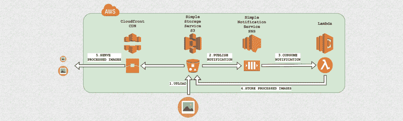

这种架构是非常可伸缩的，因为每个上传的图像将触发一个新的 Lambda 代码执行来处理该请求，因此可以有数千个图像被同样多的代码执行并行处理。

应用服务器上不使用磁盘空间或计算能力，因为所有东西都存储在 S3 上，由 Lambda 处理。

最后，在 S3 前面配置一个 CDN 是非常容易的，并且允许你从世界的任何地方有高的下载速度。

### 循序渐进的教程

这个解决方案的实现相对容易，因为除了执行图像预处理的 Lambda 代码之外，它主要是配置。本文的其余部分将详细描述如何设置 AWS 架构，并将提供由 AWS Lambda 执行的代码来调整上传图像的大小，以便有一个完整的工作示例。

要亲自试用，您需要一个 AWS 帐户。如果你没有，你可以免费创建一个，并利用 AWS 免费层[这里](https://aws.amazon.com/free/)。

#### 步骤 1:在 AWS SNS 上创建一个主题

首先，我们需要配置一个新的 SNS(简单通知服务)主题，AWS 将在每次新图像上传到 S3 时发布一条消息。该消息包含 S3 对象键，Lambda 函数稍后使用该键来获取上传的图像并对其进行处理。

从 AWS 控制台访问 [SNS 页面](https://console.aws.amazon.com/sns/v2/home)，点击“创建主题”，并输入主题名称，例如“图像预处理”

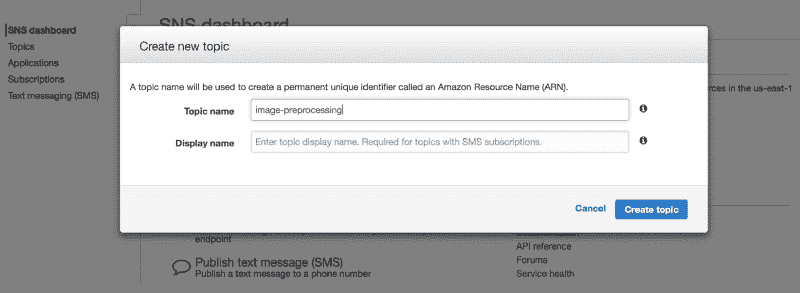

接下来，我们需要更改主题策略，以允许我们的 S3 存储桶在上面发布消息。

在主题页面中，单击 Actions -> Edit Topic Policy，选择 Advanced view，将以下 JSON 块(带有您自己的资源 arns 和 SourceArn)添加到语句数组中，并更新策略:

```
{      "Sid": "ALLOW_S3_BUCKET_AS_PUBLISHER",      "Effect": "Allow",      "Principal": {        "AWS": "*"      },      "Action": [        "SNS:Publish",      ],      "Resource": "arn:aws:sns:us-east-1:AWS-OWNER-ID:image-preprocessing",      "Condition": {          "StringLike": {              "aws:SourceArn": "arn:aws:s3:*:*:YOUR-BUCKET-NAME"          }      }}
```

你可以在这里找到一个完整政策 JSON 的例子。

#### 步骤 2:创建 AWS S3 文件夹结构

现在我们需要准备 S3 上的文件夹结构，它将包含原始图像和处理过的图像。在这个例子中，我们将生成两个调整大小的图像版本，800x600 和 400x300。

从您的 AWS 控制台，打开 [S3 页面](https://s3.console.aws.amazon.com/s3/home)并创建一个新的 bucket。我将把我的称为“图像预处理示例”然后，在 bucket 中，我们需要创建一个名为“originals”的文件夹，一个名为“800x600”，另一个名为“400x300”


#### 步骤 3:配置 AWS S3 事件

每次一张新图片上传到 originals 文件夹时，我们希望 S3 在我们的“图片预处理”SNS 主题上发布一条消息，以便可以处理该图片。

为此，从 AWS 控制台打开您的 S3 桶，单击属性->事件->添加通知，并填写以下字段:

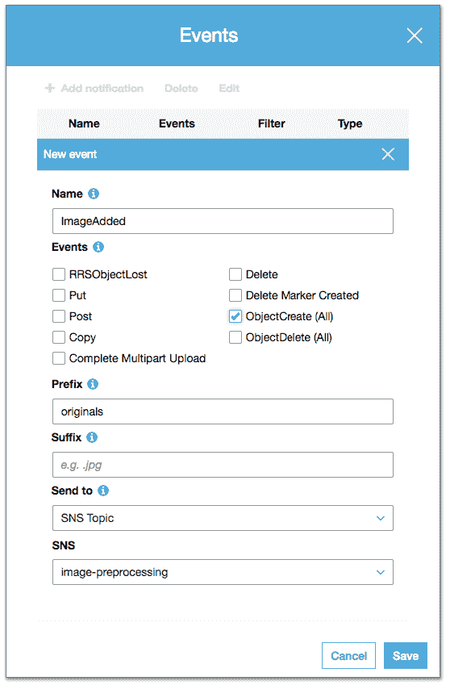

在这里，我们告诉 S3 每次在 originals 文件夹(前缀)中创建一个新对象(ObjectCreate)时生成一个事件，并在我们的 SNS 主题“图像预处理”上发布这个事件

#### 步骤 4:配置 IAM 角色以允许 Lambda 访问 S3 文件夹

我们想创建一个 Lambda 函数，它从 S3 获取图像对象，处理它们，并将处理后的版本再次上传到 S3。为此，我们首先需要设置一个 IAM 角色，它将允许我们的 Lambda 函数访问所需的 S3 文件夹。

从 [AWS 控制台 IAM 页面](https://console.aws.amazon.com/iam/home):

1.点击[创建策略](https://console.aws.amazon.com/iam/home?region=us-east-1#/policies$new?step=edit)
2。点击 JSON 并输入(替换您的-BUCKET-NAME)

```
{      "Version": "2012-10-17",      "Statement": [          {              "Sid": "Stmt1495470082000",              "Effect": "Allow",              "Action": [                  "s3:*"              ],              "Resource": [                  "arn:aws:s3:::YOUR-BUCKET-NAME/*"              ]          }      ]}
```

那里的资源是我们在 S3 的水桶。单击 review，输入策略名称，例如 AllowAccessOnYourBucketName，然后创建策略。

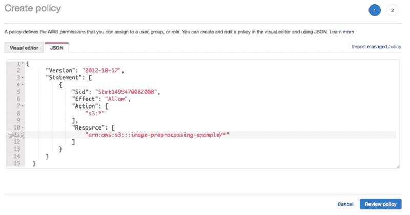

3.点击角色->创建角色
4。选择 Aws 服务- > Lambda(谁将使用该策略)
5。选择先前创建的策略(allowaccessonyourbucket name)
6。最后，点击 review，输入一个名字(LambdaS3YourBucketName)，然后点击 create role

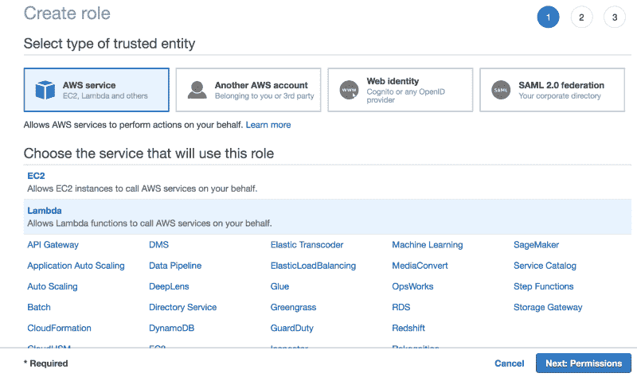

Create Lambda Role

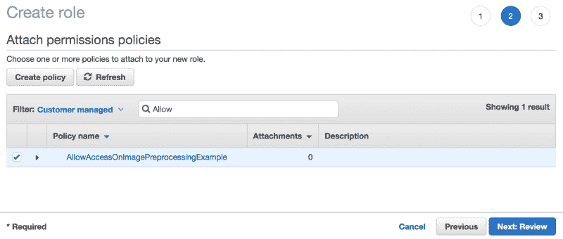

Attach Policy to Lambda Role

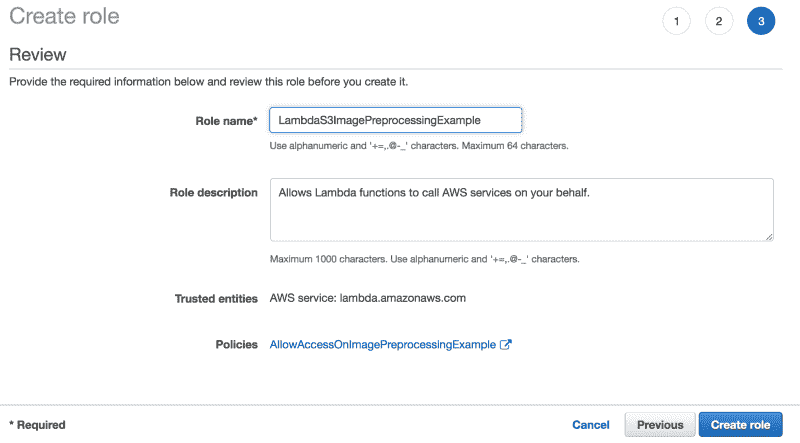

Save Role

#### 步骤 5:创建 AWS Lambda 函数

现在，我们必须设置我们的 Lambda 函数来消费来自“图像预处理”SNS 主题的消息，并生成我们调整大小的图像版本。

让我们从创建一个新的 Lambda 函数开始。

从您的 AWS 控制台，访问 [Lambda 页面](https://console.aws.amazon.com/sns/v2/home)，点击“创建函数”，键入您的函数名，例如 ImageResize，选择您的运行时，在本例中为 Node.js 6.10，以及之前创建的 IAM 角色。

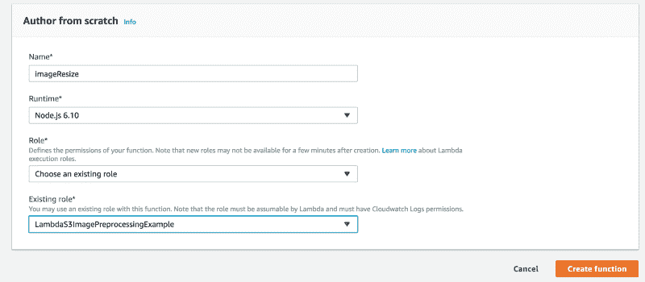

接下来，我们需要将 SNS 添加到函数触发器中，这样 Lambda 函数将在每次有新消息发布到“图像预处理”主题时被调用。

为此，点击触发器列表中的“SNS”，从 SNS 主题列表中选择“图像预处理”，然后点击“添加”

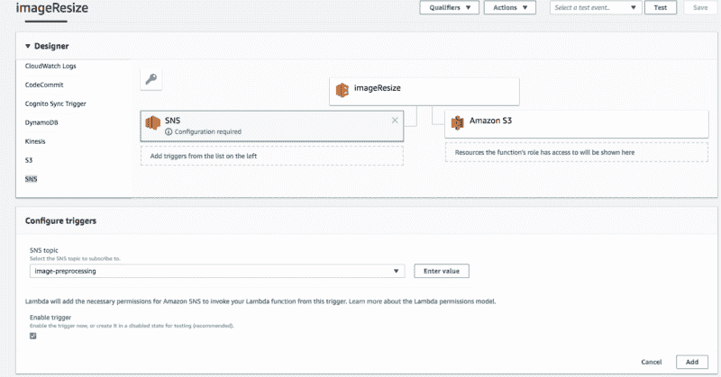

最后，我们必须上传将处理 S3 ObjectCreated 事件的代码。这意味着从 S3 原件文件夹中获取上传的图像，处理它，并在调整大小的图像文件夹中再次上传。

你可以在这里下载代码[。唯一需要上传到 Lambda 函数的文件是](https://github.com/domangi/image-preprocessing-lambda)[1.1 版. zip](https://github.com/domangi/image-preprocessing-lambda/blob/master/version1.1.zip) ，其中包含 index.js 和 node_modules 文件夹。

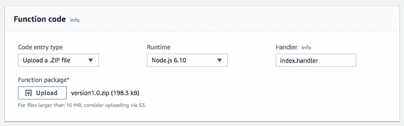

为了给 Lambda 函数足够的时间和内存来处理图像，我们可以将内存增加到 256 MB，超时增加到 10 秒。所需资源取决于图像大小和变换复杂度。


代码本身非常简单，目的只是演示 AWS 集成。

首先，定义一个处理函数(exports.handler)。该函数由外部触发器调用，在这种情况下，SNS 上发布的消息包含上传图像的 S3 对象密钥。

它首先解析事件消息 JSON，提取 S3 桶名、上传图像的 S3 对象键以及文件名，文件名是键的最后一部分。

一旦有了桶和对象键，就可以使用 *s3.getObject* 获取上传的图像，然后传递给 resize 函数。*大小*变量保存我们想要生成的图像大小，它也对应于转换后的图像将被上传到的 S3 文件夹的名称。

```
var async = require('async');var AWS = require('aws-sdk');var gm = require('gm').subClass({ imageMagick: true });var s3 = new AWS.S3();
```

```
var SIZES = ["800x600", "400x300"];
```

```
exports.handler = function(event, context) {    var message, srcKey, dstKey, srcBucket, dstBucket, filename;    message = JSON.parse(event.Records[0].Sns.Message).Records[0];
```

```
srcBucket = message.s3.bucket.name;    dstBucket = srcBucket;    srcKey    =  message.s3.object.key.replace(/\+/g, " ");     filename = srcKey.split("/")[1];    dstKey = "";     ...    ...    // Download the image from S3    s3.getObject({            Bucket: srcBucket,            Key: srcKey    }, function(err, response){        if (err){            var err_message = 'Cannot download image: ' + srcKey;            return console.error(err_message);        }        var contentType = response.ContentType;
```

```
 // Pass in our image to ImageMagick        var original = gm(response.Body);
```

```
 // Obtain the size of the image        original.size(function(err, size){            if(err){                return console.error(err);            }
```

```
 // For each SIZES, call the resize function            async.each(SIZES, function (width_height,  callback) {                var filename = srcKey.split("/")[1];                var thumbDstKey = width_height +"/" + filename;                resize(size, width_height, imageType, original,                          srcKey, dstBucket, thumbDstKey, contentType,                        callback);            },            function (err) {                if (err) {                    var err_message = 'Cannot resize ' + srcKey;                    console.error(err_message);                }                context.done();            });        });    });
```

```
}
```

resize 函数使用“gm”库在原始图像上应用一些转换，特别是它调整图像的大小，如果需要的话进行裁剪，并将质量降低到 80%。然后，它使用“ *s3.putObject* ”将修改后的图像上传到 S3，指定“ *ACL: public-read* ”以公开新图像。

```
var resize = function(size, width_height, imageType,                       original, srcKey, dstBucket, dstKey,                       contentType, done) {
```

```
 async.waterfall([        function transform(next) {            var width_height_values = width_height.split("x");            var width  = width_height_values[0];            var height = width_height_values[1];
```

```
 // Transform the image buffer in memory            original.interlace("Plane")                .quality(80)                .resize(width, height, '^')                .gravity('Center')                .crop(width, height)                .toBuffer(imageType, function(err, buffer) {                if (err) {                    next(err);                } else {                    next(null, buffer);                }            });        },        function upload(data, next) {            console.log("Uploading data to " + dstKey);            s3.putObject({                    Bucket: dstBucket,                    Key: dstKey,                    Body: data,                    ContentType: contentType,                    ACL: 'public-read'                },                next);            }        ], function (err) {            if (err) {                console.error(err);            }            done(err);        }    );};
```

#### 第六步:测试

现在，我们可以通过将图像上传到 originals 文件夹来测试一切是否正常。如果一切都实现正确，那么我们应该在 800x600 文件夹和 400x300 文件夹中找到上传图像的调整版本。

在下面的视频中，你可以看到三个窗口:左边是原件文件夹，中间是 800x600 文件夹，右边是 400x300 文件夹。将文件上传到原始文件夹后，其他两个窗口会刷新以检查图像是否已创建。

瞧，他们来了。)

#### (可选)步骤 6:添加 Cloudfront CDN

现在，图像已经生成并上传到 S3，我们可以添加 Cloudfront CDN 来将图像交付给我们的最终用户，从而提高下载速度。

1.  打开 [Cloudfront 页面](https://console.aws.amazon.com/cloudfront/home)
2.  点击“创建分销”
3.  当询问交付方式时，选择“网络分发”
4.  选择您的 S3 桶作为“原始域名”,然后点击“创建分销”

创建分发网络的过程不会立即开始，因此您必须等到您的 CDN 的状态从 Prog 中的*变为*已部署。**

一旦部署，你可以使用域名，而不是你的 S3 桶网址。例如，如果你的 Cloudfront 域名是“*1234-cloudfront-id.cloudfront.net*”，那么你可以通过“【https://1234-cloudfront-id.cloudfront.net】T2/400 x300/文件名”和“【https://1234-cloudfront-id.cloudfront.net】T4/800 x600/文件名”来访问你调整后的图像文件夹

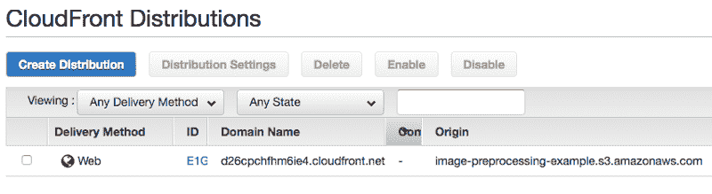

Cloudfront 有许多其他应该设置的选项，但是这些超出了本文的范围。关于设置你的 CDN 的更详细的指南，请看一下亚马逊的入门指南。

就是这样！我希望你喜欢这篇文章。请在下面留下评论，让我知道你的想法！