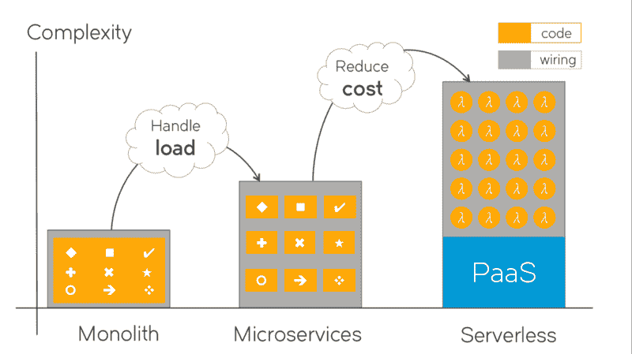
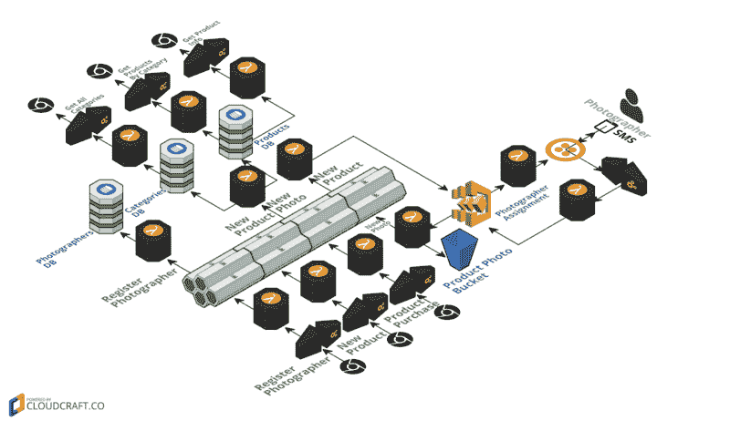

# 无服务器更便宜，而不是更简单

> 原文：<https://www.freecodecamp.org/news/serverless-is-cheaper-not-simpler-a10c4fc30e49/>

作者:德米特里·齐明

# **无服务器更便宜，而不是更简单**

上周的 [(Emit)](http://www.emitconference.com) 会议有一系列精彩的演讲，引人入胜的小组讨论，以及大量的时间与无服务器社区的优秀人员会面和交换意见。

**成本**被一致认为是采用无服务器的关键驱动因素。按需执行和内置弹性可优化利用率，同时保持更高的正常运行时间和可靠性。按使用付费计费使成本可以直接量化。[储蓄](https://techbeacon.com/economics-serverless-computing-real-world-test)可以[疯狂](https://aws.amazon.com/solutions/case-studies/bustle/)。Gartner 分析师 Anne Thomas 在小组讨论中分享了她的企业客户被无服务器的“成本”优势所吸引。

但是在一个封闭的系统中没有免费的午餐:为了获得利益，必须牺牲一些东西。在技术领域，最常见的支付利益的货币是“复杂性”。

当微服务取代整体服务以在大负载下可靠地获得规模优势时，[这不是免费的午餐](http://highscalability.com/blog/2014/4/8/microservices-not-a-free-lunch.html)。处理最终一致性、处理异步性、延迟和容错、管理 API 和消息模式、负载平衡、运行滚动升级——我们为收益付出了大量额外的[复杂性。](https://martinfowler.com/articles/microservice-trade-offs.html)

复杂性存在于哪里，我们如何管理它？

From monolith to microservices to serverless, complexity increases to gain benefits.

看一下图片。橙色块代表代码。随着我们转向微服务到无服务器，单个代码块变得更小更简单，而总的复杂性却在增加。这种额外的复杂性很大程度上是“连接”:配置、部署脚本、devops 工具工件——模板、配方、行动手册、docker 文件……所有用于将解决方案铲车到云并保存在那里的东西。橙色代码块之间的灰色部分。这让我想起了一个古老的俄罗斯笑话:

> 空气是由什么组成的？嗯，它是由分子构成的！
> ——分子之间又是什么？
> -嗯，当然是空气！

这段代码之间的连线:最好是代码！这就是 DevOps 的“基础设施即代码”的全部含义。devo PS——再给一个定义——是一个框架和工具，用来驯服微服务引入的额外布线复杂性。

当无服务器取代微服务时，它也不会是免费的午餐。我们通过引入更多的复杂性来付出代价，现在是为了节省大量成本。

无服务器系统的某些部分变得更加简单。无需处理虚拟机、网络、存储和操作系统，大大减轻了调配、配置、监控和修复基础架构的巨大运营负担。函数提供了一个简单的编程模型，主要关注业务逻辑。执行环境是严格的，受控的，并处于“连续的 x 光”下。 [@AzureFunctions](https://twitter.com/AzureFunctions) 的项目经理 Chris Anderson ，强调指出函数执行中的问题变得容易多了。

但是守恒定律仍然适用，当功能被简化时，释放的复杂性转移到了别处。复杂性去了哪里，我们如何管理它？

部分复杂性委托给云 PaaS 服务(我可以称之为 JPaaS 吗？[3]) .AWS API Gateway，S3，Kinesis，SNS，DynamoDB，StepFunctions，或者它们的 Azure 和 GCP 兄弟——可以与任何无服务器解决方案一起使用。它们随时可用，完全可管理，功能丰富，“无限”可扩展，并按使用付费。为了获得他们的利益，我们很乐意交易控制权——另一种常见的技术货币 *—* ,以摆脱基础设施和样板问题。注意从微服务的[“智能端点和哑管道”](https://martinfowler.com/articles/microservices.html#SmartEndpointsAndDumbPipes)回到“哑端点和智能管道”甚至工作流；花一分钟来思考这个钟摆摆动。

有时候，放弃控制权会适得其反，原本简单的事情会出乎意料地变得复杂。通过 CloudFormation 模板在 AWS API Gateway 中设置二进制头会使您错过在微服务代码中处理它的清晰性。使用功能丰富的 JPaaS 服务需要深厚的专业知识，与常规编程和 CS 不同，这种专业知识不会在平台之间转换:了解 DymanoDB 对学习 BigTable 没有什么帮助。

然而，对 JPaaS 的授权是一个净积极因素，涵盖了相当一部分复杂性。但不是全部。复杂性的另一部分还是在于“连线”。

功能越来越小，但需要理解的关系和管理的依赖关系却多了一个数量级。功能更简单，但是它们不再包含逻辑流。端到端解决方案的逻辑和流程由事件驱动。它不再存在于任何编码工件中，变得很难推理。

如今这种复杂性是如何处理的？不太好。需要超级建筑师来控制它。流程和工具还没有跟上。无服务器框架像雨后春笋般发展起来，但大部分都被 FaaS 卡住了——略有变化，这是一个已经解决的问题。即使是最先进的“无服务器”框架，以及认识到无服务器不仅仅是 FaaS，并为其他服务提供插件和本机资源支持的框架——即使是“无服务器”也不能涵盖无服务器解决方案的端到端布线复杂性。以规范的 [HelloRetail](https://read.acloud.guru/serverless-event-sourcing-at-nordstrom-ea69bd8fb7cc) 无服务器[项目代码](https://github.com/Nordstrom/hello-retail)为例，检查遗漏了多少复杂性。该框架没有涵盖“项目”、服务对 JPaaS 的依赖性以及彼此之间的依赖性、部署顺序、事件类型和模式等等。它们部分是脚本化的，部分是文档化的，但是主要存在于“超级架构师”的头脑中，或者作为部落知识(在软件中，也称为“麻烦知识”)。

DevOps 呢？不应该有帮助吗？答案是否定的，或者至少不完全是。首先，DevOps 用户显然不会像他们在 kubernetes 周围那样聚集在无服务器周围。为什么这样也许我们的创造者角色 DevOps 朋友没有足够的基础设施旋钮和杠杆来修补？或者，原因可能更基本:DevOps 是对另一个问题领域(微服务)的回应，并不完全适用于无服务器，因为许多微服务假设不再成立。仅仅去掉“ssh 到 box”就让一半的 DevOps 工具退役了。即使是为编纂云基础设施而构建的 Terraform，在无服务器社区中也不像在微服务 DevOps 中那样受欢迎。

因此，今天的无服务器缺乏成熟的运营框架、模式和工具来降低 it 的复杂性。它需要一个超级架构师来发明端到端的解决方案并驯服复杂性。这些超级架构师正在开辟道路，展示成功，并帮助模式出现。但是，正如来自 Gartner 的 Anne 在(Emit)会议小组上指出的，在框架和工具跟上之前，不会广泛采用无服务器。

和以前很多次一样，挑战是机遇。DevOps 降低了微服务的复杂性，使云应用成为可能。某种东西正在驯服无服务器的复杂性，让云应用变得“经济实惠”。不管是什么，都是大事。当谈到美元时，经济力量完美地发挥作用。无服务器的成本节约优势是如此明显和显著，所有主要云供应商对无服务器的推动是如此强大，以至于用不了多久，复杂性就会被驯服，无服务器将在其应用的所有领域成为主流。

感谢阅读。请在这里和 Twitter 上分享你对无服务器未来的评论和想法。如果你喜欢读这篇文章，并希望我写更多类似的文章，只需点击“鼓掌”按钮。

PS。您可能对 [Hackernews 关于这篇文章](https://news.ycombinator.com/item?id=15326553)的讨论和评论感兴趣。